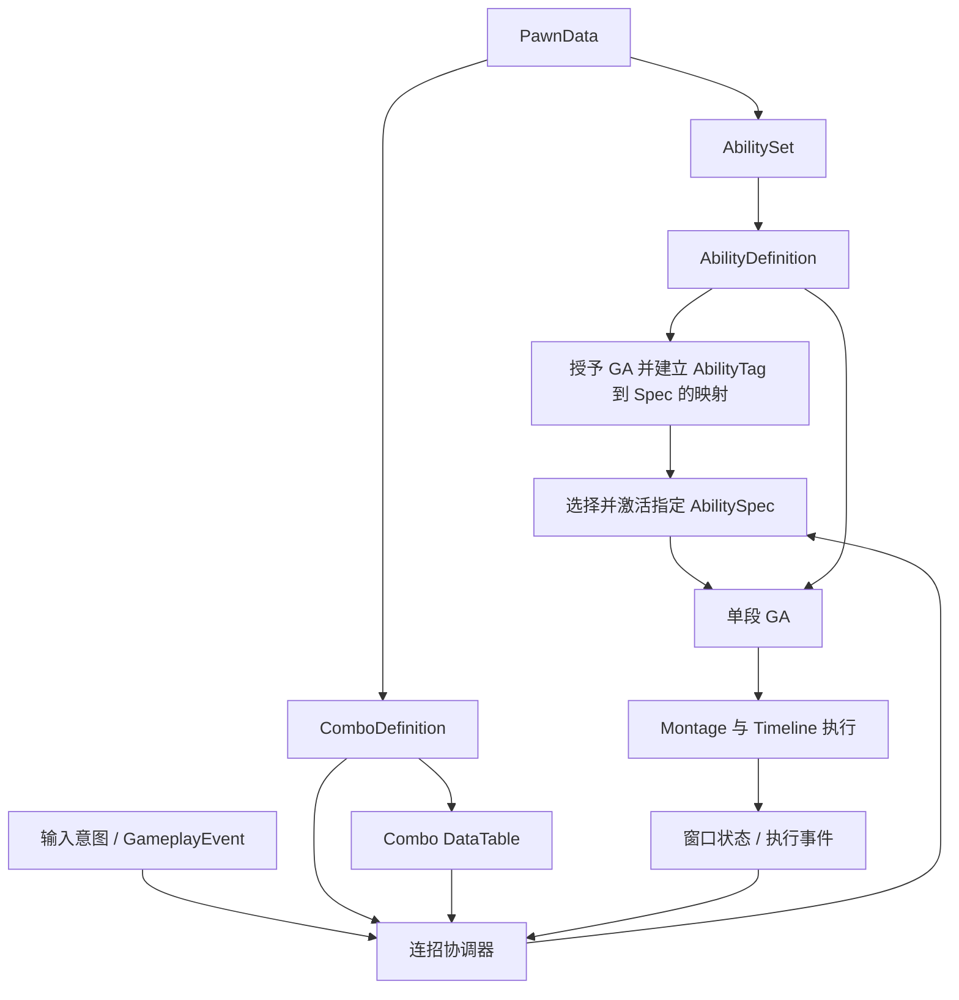

# 单段技能 Definition 与连招跳转表设计

> 状态：设计文档，已补充用户确认的第一版决策（见第 13 节）；本次仅授权更新文档，尚未进入实现。
> 范围：现有 Hodgepodge GAS、Montage、AbilityTimeline 与后续技能编辑器。
> 兼容目标：UE 5.5.4，沿用单一 Hodgepodge Runtime 模块与现有 Experience / PawnData / AbilitySet 链路。
> 本文提出的数据类型、协调组件和行为规则尚未实现。已有五段普攻的测试结果不能证明本文方案通过验证。

## 1. 目标与决策状态

### 1.1 用户提出的目标

1. 一个 GA 执行一段动作，对应一个 Montage 和一条 Timeline。创建 `GA_Attack_1`、`GA_Attack_2` 等独立能力蓝图。
2. 用 AbilityDefinition 数据资产集中配置 AbilityTag、AbilityClass 和 ExecutionConfig。
3. ExecutionConfig 包含 Montage 播放倍率、开始/停止混合时间与模式、Montage 引用和 Timeline Task 配置。
4. Timeline 总时长自动关联 Montage，不再手动维护两份长度。
5. 用 DataTable 配置连招节点和跳转。行名采用 `Combo.Entry`、`Combo.Light.01`、`Combo.Light.02` 等。
6. 节点包含 ComboTag、AbilityTag、GrantedTags、Transitions；跳转包含输入意图、事件、目标节点、窗口与状态条件、优先级。
7. 数据模型可供后续技能编辑器直接使用。本阶段不增加命中、伤害或武器碰撞。

### 1.2 第一版已确认决策

- Definition 单向引用 AbilityClass；AbilitySet 配置 Definition，授予上下文把 Definition 提供给 GA。
- 单条边的输入触发与事件触发互斥，同一节点允许同时拥有两类边；开窗时重新评估未过期的缓存输入。组合触发列入后续扩展。
- 输入缓存时长可配置，默认 0.3 秒，容量 1，新输入替换旧输入。
- 按当前 GA / Timeline 执行实例验证窗口归属；节点标签采用拥有端预测、服务器权威维护并收敛的方向，避免重复计数。
- 第一版 Montage 仅支持单次、连续、正向播放。
- 自然结束 BlendOut 与主动停止 BlendOut 分开配置。
- 跨 GA 切换失败安全回 Entry，清理标签和输入；有效接段优先于移动取消。
- PawnData 引用 ComboDefinition，AbilitySet 授予 AbilityDefinitions。第一版服务器按收到请求时的窗口判断；带时间容差的判定留待后续阶段。

这些是用户对方案的选择，不代表实现或测试已经完成。协调器的具体挂接位置没有在本轮回复中单独确认，仍保留 ASC 所有者侧的建议；底层类型名称和技术接入细节也不视为已经定稿。

## 2. 当前实现与迁移原因

当前 `UHodgeGameplayAbility_BasicAttack` 在一个 GA 实例中持有 `AttackSteps` 数组，内部推进五段 Montage / Timeline。它适合验证基本连击，但段数、输入等待、窗口消费和换段全部集中在一个执行类里，不利于独立技能消耗、分支连招和编辑器配置。

现有基础可以复用：

- PlayerState 持有 ASC，PawnData 通过 AbilitySet 在服务器授予能力。
- AbilitySet 创建 AbilitySpec，支持 SourceObject，并把 InputTag 写入 DynamicSpecSourceTags。
- ASC 按精确 InputTag 查找所有匹配的 Spec，按激活策略尝试激活或向活跃能力转发输入。
- PlayTimeline 处理 Window / Point，维护窗口 loose tag、GE 句柄和清理账本。
- Timeline Point 通过 ASC 派发 GameplayEvent，载荷 OptionalObject 标识所属 Task。
- 当前 Timeline 使用独立世界时间推进；当前普攻仅校验 Montage 与 Timeline 长度一致，并以相同倍率启动。

因此，不能只把现有五段数组拆成五个蓝图就完成迁移：输入路由、跨 GA 切换、时钟、授予配置和网络状态也需要一起调整。

当前实现参考：

- [普通攻击 GA](../../Source/Hodgepodge/Private/AbilitySystem/Abilities/HodgeGameplayAbility_BasicAttack.cpp)
- [ASC 输入与激活](../../Source/Hodgepodge/Private/AbilitySystem/HodgeAbilitySystemComponent.cpp)
- [AbilitySet 授予](../../Source/Hodgepodge/Private/Data/HodgeAbilitySet.cpp)
- [Timeline Task](../../Source/Hodgepodge/Private/AbilitySystem/Abilities/HodgeAbilityTask_PlayTimeline.cpp)
- [Timeline 数据](../../Source/Hodgepodge/Public/Data/HodgeAbilityTimeline.h)
- [旧普攻验证记录](../Validation/basic-attack-2026-09-24.md)

## 3. 总体职责

AbilityDefinition 描述一次技能执行需要什么资源、如何播放；单段 GA 执行该配置，承担 Commit、任务生命周期和结束；Timeline 决定事件与窗口；连招表决定动作之间的连接；协调器决定何时选择并提交连接。

执行配置不记录运行时段数，DataTable 不负责播放动画，Timeline 不直接选择目标 GA。这样同一技能能够被不同连招节点复用，而不复制执行配置。

## 4. AbilityDefinition

拟议类型名为 `UHodgeAbilityDefinition`，使用数据资产管理。名称仅为设计建议。

### 4.1 字段

- `AbilityTag : FGameplayTag`：技能身份，用于从连招节点解析到 Definition 与已授予 Spec。不是 InputTag，也不表示激活期间自动授予 ASC 的状态标签。
- `AbilityClass : TSubclassOf<UHodgeGameplayAbility>`：执行能力类型。
- `ExecutionConfig : FHodgeAbilityExecutionConfig`：该技能的播放与 Timeline 配置。

ExecutionConfig 建议包含：

- `Montage : UAnimMontage`：当前动作播放的 Montage。原提议的 ComboMontage 若指当前动画，建议简化为 Montage；下一段关系不放在此字段。
- `PlayRate : float`：有限且大于零的播放倍率。
- `StartSection / StartPosition`：后续扩展项，第一版不开放 Section 起播或任意偏移，从 Montage 起点连续播放。
- `BlendInSettings`：开始混合配置。
- `NaturalBlendOutSettings`：自然结束混合配置。
- `StopBlendOutSettings`：主动停止混合配置，供移动取消、外部打断和接段切换使用。
- `TimelineTaskConfig`：Timeline 引用、时钟来源、起点对齐和中断策略。

混合配置建议使用结构体，而不是不断增加平铺字段。至少区分混合时间、混合曲线类型、可选自定义曲线，以及 Standard / Inertialization 等混合方式。曲线和混合方式不是同一个概念，不能都含糊地命名为 BlendMode。

已确认自然结束和主动停止分别配置，不能让一份停止设置隐式覆盖两条路径。第一版按前述建议以 Standard 为默认混合方式，并将混合曲线独立表达；具体时间数值在资产配置时确定。若后续支持 Inertialization，需同时验证 AnimGraph 支持。

### 4.2 单一配置来源

已确认引用方向：

`PawnData / AbilitySet → Definition → AbilityClass → AbilitySpec 的执行实例`

GA 从授予上下文读取 Definition，不再另持一个可以指向其他 Definition 的必填字段。这样避免 `Definition → GA Class → Definition` 双向关联产生配置不一致。

当前 SourceObject 是可利用的接入点，但不是无条件占用的空字段：它也可能表示武器、装备或授予来源。实施时需选择直接关联 Definition，或使用同时保留 Definition 与原来源的授予上下文，并核实 GC、加载、复制和移除生命周期。

每个连招上下文内，AbilityTag 必须能够唯一解析到目标 Spec。不能仅根据 AbilityClass 激活，否则同类能力被不同装备或不同 Definition 多次授予时会产生歧义。

五个 GA 蓝图可以共用一个单段执行基类；不要复制五份播放、取消和清理逻辑。消耗、冷却、激活条件仍由 GAS 执行，不被连招表替代。

## 5. Montage 与 Timeline 的时间关联

### 5.1 自动长度与运行时同步是两件事

只在编辑时把 Montage 长度拷贝到 Timeline.Duration，可以减少配置错误，但无法处理动画暂停、变速、跳 Section 或网络位置校正。

建议支持两种时间来源：

- `Independent`：继续用独立时钟，供没有动画的技能或明确独立运行的逻辑使用。
- `MontagePosition`：由本次技能拥有的 Montage 播放实例位置驱动逻辑事件。

动画关联模式的有效 Duration 从选定播放范围派生，编辑器以只读方式显示；不在激活时修改共享 Timeline 资产。若同一 Timeline 可用于不同 Montage，应把派生长度放在执行上下文，避免资产级长度相互覆盖。

事件 StartTime / EndTime 推荐使用动画源时间。动画实际倍率改变事件到达的现实时间，调度器不能再重复乘一次播放倍率。还需统一处理 Montage 自身 RateScale 和运行时倍率变化。

### 5.2 必须定义的边界

- 暂停：跟随模式停止推进逻辑时间。
- 正常前进：处理经过的事件区间，保留 WindowEnd、WindowBegin、Point 的确定顺序。
- 起点偏移：初始化当时应存在的窗口，不默认重放此前所有 Point 副作用。
- 向前跳转：明确哪些 Point 补发、哪些跳过，以及跳过窗口是否执行进入/退出。
- 回退、循环与网络校正：不能把位置回退自动当成允许再次造成副作用的重播。
- 提前停止：清理该次执行拥有的窗口与 GE，并以明确结束原因通知上层。
- 自然结束：明确逻辑完成与动画 blend-out 阶段的关系，不因开始淡出就无条件提前结束能力。

第一版已确认仅支持单次、正向、连续播放，从 Montage 起点开始，允许提前停止。Section 起播、主动跳转、循环和主动回退不在第一版范围，必须显式限制或校验；上面的偏移和不连续播放条目是后续扩展需要处理的边界。网络位置校正仍需处理，不能因限制主动跳转而允许重复触发事件。

现有 PlayTimeline 的账本和事件排序可保留，但时钟来源和不连续播放语义需要扩展；不能仅替换 Tick 中读取时间的函数。

### 5.3 UE 5.5 播放接口约束

本机 AnimInstance 提供 `Montage_PlayWithBlendIn`、`Montage_PlayWithBlendSettings`、`Montage_StopWithBlendOut` 和 `Montage_StopWithBlendSettings`。标准 ASC::PlayMontage 没有暴露完整的混合配置参数。

因此需评估扩展项目 ASC / 播放 Task 的 GAS 播放链路，保留动画能力归属、预测和 Montage 复制。不能直接改用 AnimInstance 播放后就宣称完成 GAS 联机支持，也不应临时修改共享 Montage 资产上的混合属性。拥有端、服务器、模拟代理的混合表现都需要验证。

## 6. Combo DataTable

### 6.1 节点行

拟议 `FHodgeComboRow : FTableRowBase`：

- `ComboTag : FGameplayTag`
- `AbilityTag : FGameplayTag`
- `GrantedTags : FGameplayTagContainer`
- `Transitions : TArray<FHodgeComboTransition>`

RowName 使用 `Combo.Entry`、`Combo.Light.01` 等。RowName 是 FName，不会自动注册 GameplayTag。建议保留 ComboTag 作为运行时身份，并由编辑器校验或同步 RowName 与 ComboTag，禁止二者不一致。

ComboTag 是图节点身份，AbilityTag 是执行技能身份；允许不同 ComboTag 指向同一 AbilityTag，以便复用技能但配置不同后续路径。

`Combo.Entry` 建议作为不执行 GA 的入口，AbilityTag 允许为空。执行节点则必须配置有效 AbilityTag。第一版可约定只有指定入口是虚拟节点，避免任意空 AbilityTag 被静默当作合法节点。

### 6.2 GrantedTags 与 ParentTags

GrantedTags 直接使用 FGameplayTagContainer。容器中的 GameplayTags 是显式标签，ParentTags 是引擎维护的父级缓存，不是第二份手工配置列表。

例如显式配置 `Status.Combo.Light` 后，父级层次匹配由容器处理，无需重复填写 `Status.Combo` 和 `Status`。

推荐生命周期：节点成功进入时授予，离开、取消、能力移除或 Pawn 更换时撤销。每次只撤销自己授予的计数，不清空其他系统拥有的同名标签。

节点标签与 Timeline 窗口标签需要独立账本。节点标签描述当前连招状态；窗口标签描述该动作此时允许做什么。不能在节点 GrantedTags 中永久授予本应只在后半段开放的取消窗口。

入口默认不配置 GrantedTags。节点标签是否在下一 GA 的 CanActivate 检查前生效需要明确：推荐进入成功后才授予，因此不能依赖目标节点尚未授予的标签来满足该技能的激活前置条件。

### 6.3 跳转边

拟议 `FHodgeComboTransition`：

- `TriggerInputIntentTag : FGameplayTag`：输入意图触发。原提议的 Triger 建议在正式命名前修正为 Trigger。
- `TriggerEventTag : FGameplayTag`：GameplayEvent 触发。
- `TargetComboTag : FGameplayTag`：目标节点身份。
- `RequiredWindowTags : FGameplayTagContainer`：窗口前置条件。
- `RequiredSourceTags : FGameplayTagContainer`：源角色状态前置条件。
- `BlockedSourceTags : FGameplayTagContainer`：禁止跳转的源角色状态。
- `TransitionPriority : int32`：候选边之间的优先级。

### 6.4 第一版触发规则与后续扩展

第一版已确认一条边只能选择一个触发来源：输入意图或 GameplayEvent。两个字段都填或都空均报配置错误。互斥仅作用于同一条边；一个节点可以同时配置输入边和事件边。

输入先到而窗口未开时，协调器缓存输入；窗口状态变化时重新评估缓存输入边，不需要将开窗事件和输入同时填入一条边。

后续可能需要 B 方案：允许组合触发，例如“收到命中确认事件，并且存在有效的轻攻击缓存”才派生下一段。用户要求保留此扩展方向，但第一版不实现。扩展时应增加明确的触发模式，定义输入和事件的先后、有效期、关联执行及消费规则，不以两个非空字段隐式表达 AND 或 OR。

事件必须带执行身份并过滤来源：只接受当前会话、当前节点执行对应的事件。旧 GA 延迟到来的 Timeline.End 不能重置已进入下一段的连招。

### 6.5 条件与确定性选择

- RequiredWindowTags 使用全部满足语义，并核实属于当前执行的有效窗口；不能被其他并行技能的同名窗口误放行。
- RequiredSourceTags 读取源角色 ASC 当前 Owned Tags，全部满足才通过。
- BlockedSourceTags 任意命中即拒绝。
- 空的 Required 容器不施加额外条件；空的 Blocked 容器不阻止跳转。
- 身份、目标节点和触发输入/事件默认精确匹配；状态条件默认支持父子标签匹配。是否开放额外查询模式留待扩展。
- TransitionPriority 数值越大越优先；同优先级按持久化数组顺序选择，并对明显歧义给出校验警告。

SourceTags 不等于 AbilitySpec.DynamicSpecSourceTags；项目目前在后者存放输入绑定，不代表角色当前状态。

已确认按当前执行实例隔离窗口：协调器只认可当前 GA / Timeline 执行身份对应的有效窗口，通过该执行的窗口视图或等价的带身份查询获取状态。ASC 聚合标签保留供外部查询，但不能单独作为当前动作的窗口授权。仅靠限定窗口生产者数量或标签命名约定不替代实例归属检查。

## 7. ComboDefinition 与运行时状态

建议增加 `UHodgeComboDefinition`，统一配置：

- 连招 DataTable 引用和 EntryComboTag。
- 输入缓存有效期、缓存容量及替换规则。
- 自然结束、移动取消和外部打断的回退策略。
- 目标技能激活失败时的输入消费与回退策略。
- 本连招需要的 AbilityDefinitions，或可验证的外部技能集合引用。

这些公共规则不必重复填在每条 Transition 中；后续确有特殊边时再增加覆盖项。

运行时协调器维护当前 ComboTag、当前 AbilitySpecHandle、执行序号、输入缓存及标签授予账本。运行时状态不写回 DataTable 或 Definition。

输入缓存应包含意图身份、序号和过期时间。已确认：有效期可配置，默认 0.3 秒；容量为 1；新输入替换旧输入并按新输入时间计算有效期。一次成功跳转只能消费一次输入，进入第一段的点击不能继续用于接第二段。

这与旧测试版“整段内记住提前点击”的手感不同。例如第一段在 1.9 秒开窗，0.2 秒时缓存的点击按默认时长会在 0.5 秒过期，不能用于 1.9 秒的接段。窗口变化只能重评估尚未过期的输入。

配套消费规则沿用评估建议：窗口或状态条件未满足时，在有效期内保留并允许重评估；成功跳转立即消费；真正尝试目标激活后失败则消费，防止逐帧重试；过期、全局输入阻塞、连招取消和 Pawn 更换时清空。缓存三项参数是用户明确选择，以上消费细则是配套设计规则；第 13 节单独标明这一确认边界。

建议第一版每次评估最多提交一个跳转，并防止标签变化、事件回调和 AbilityEnded 的同步重入造成重复执行。

## 8. 与现有 GAS 的接入

### 8.1 输入路由

当前 ASC 会尝试激活所有匹配 InputTag 的 Spec。因此不能给五个单段 GA 全部直接配置 `InputTag.Ability.Melee` 后期待自动顺序播放。

建议将连招输入交给协调器，转换为语义意图，例如 `InputIntent.Attack.Light`；协调器只激活目标 Spec。其他不属于连招的普通能力继续沿用原有输入路径。

现有 WaitInputPress 绑定当前 Spec 的复制输入事件，不能自然承担跨多个 GA 的持久缓存。实现需明确连招输入路由及其网络传递方式，避免在每个单段 GA 重建一套输入状态。

### 8.2 授予与生命周期

继续沿用 Experience → PawnData → AbilitySet → PlayerState ASC 的服务器授予链路，按 Definition 建立 AbilityTag 到 Spec 的映射。配置职责已确认：PawnData 引用 ComboDefinition，决定角色的连招规则；AbilitySet 配置并授予 AbilityDefinitions，决定角色拥有的技能。连招引用的 AbilityTag 必须能在当前授予上下文中唯一解析，具体反射字段名称留到实现时确定。

协调器建议挂在 ASC 所有者侧，即 PlayerState 侧，结合 PawnExtension 初始化状态绑定当前 Pawn。本轮用户确认了配置入口和网络阶段，没有单独选择协调器位置，因此该位置仍是建议。无论最终放在哪里，都必须处理 ASC 重复初始化、解绑、Pawn 更换、死亡、技能撤销及 GameFeature 卸载，不能让 PlayerState 持久 ASC 携带上一 Pawn 的连招状态。

### 8.3 跨 GA 切换

推荐逻辑步骤：

1. 根据当前节点、触发来源、窗口及源标签构建候选边。
2. 按确定顺序解析目标节点、Definition 和已授予 Spec，并做可激活性检查。
3. 进入防重入的切换流程，处理旧 GA 的激活组、阻塞状态与动画所有权。
4. 尝试目标激活；只有成功后才提交目标节点并消费输入。
5. 清理旧执行的任务、窗口、委托和节点标签；按已定义顺序完成新节点标签授予。
6. 失败按统一策略收尾，不留下“节点已变但 GA 未运行”的状态。

以上是逻辑约束，不是可直接照抄的原子事务代码。旧 GA 结束、新 GA Commit、标签变化都可能同步触发回调；执行顺序需要原型验证。

CanActivateAbility 只是预检查，不保证后续 Commit 成功。配套规则是预检查不通过且旧 GA 尚未结束时继续当前动作；已开始切换、旧 GA 已结束而目标激活或 Commit 失败时，按用户确认的规则安全回到 Entry，清理本次执行拥有的标签、任务与缓存输入，不假设能无损恢复旧动作或自动回滚全部资源变化。

接段与移动取消同时成立时，已确认接段优先。这里的“接段”必须有未过期输入且通过当前窗口、状态和目标预检查；不满足条件的缓存不能阻止合法移动取消。若进入实际切换后失败，执行上述 Entry 收尾，不保留悬空节点。外部强制打断不因接段优先而被忽略。

必须保证旧 GA 的迟到回调不会停止新 GA 的 Montage。所有停止、清理和结束事件应检查执行身份及动画归属。

## 9. 五段轻攻击配置示例

以下是设计示例，不是已经创建的资产或注册完成的标签。实际窗口时间由各段 Timeline 决定。

- `Combo.Entry`：AbilityTag 为空；轻攻击输入跳转 `Combo.Light.01`，无窗口要求。
- `Combo.Light.01`：执行 `Ability.Attack.Light.01`；轻攻击输入且接段窗口开放，跳转 `Combo.Light.02`。
- `Combo.Light.02`：执行 `Ability.Attack.Light.02`；相同条件跳转 `Combo.Light.03`。
- `Combo.Light.03`：执行 `Ability.Attack.Light.03`；相同条件跳转 `Combo.Light.04`。
- `Combo.Light.04`：执行 `Ability.Attack.Light.04`；相同条件跳转 `Combo.Light.05`。
- `Combo.Light.05`：执行 `Ability.Attack.Light.05`；没有轻攻击后续边，完成后按默认规则返回 Entry。

每个 AbilityTag 对应一个 Definition，分别引用 `GA_Attack_1` 至 `GA_Attack_5`、用户指定的五个 Montage 和各自 Timeline。

接段窗口可沿用 `Status.Attack.Cancel.NextAttack`，移动取消窗口可沿用 `Status.Attack.Cancel.Move`。这些窗口由 Timeline 授予，不放进节点 GrantedTags。

若只需“移动取消并回到空闲”，可继续由取消流程处理，不必强行建一条移动 GA 边；需要移动派生攻击时才用跳转边表达目标技能。

自然结束默认回 Entry，与特殊 TriggerEventTag 边的处理顺序需要统一；建议先评估显式合法事件边，没有成功跳转再执行默认结束规则。

## 10. 预测与网络边界

客户端可以预测输入和跳转，服务器必须验证当前节点、触发、窗口、源状态及目标技能条件。不能仅接受客户端提交的 TargetComboTag 作为授权。

需要设计输入序号、执行序号、预测确认和拒绝后的收敛方式，保证同一输入不重复切换、同一事件不重复消费。

第一版已选择网络方案 A：对于客户端发起的窗口受限跳转请求，服务器按收到并处理请求时，当前权威执行实例的窗口及状态判断，不回溯客户端历史输入时间、不增加网络宽限窗口。本地输入缓存 0.3 秒不等于服务器额外宽限 0.3 秒。服务器迟收到且窗口已关闭时应拒绝，并纠正客户端预测；不能把请求悄悄带到另一执行或未来窗口。

后续正式玩法考虑方案 B：在受限时间容差内结合输入时间和服务器必要历史核验，改善高延迟接段体验。该阶段需要时间关联、历史范围、请求去重和拒绝收敛设计，不在第一版实现及通过标准中。

节点 GrantedTags 按用户接受的建议采用拥有端预测、服务器权威维护、确认或拒绝后收敛。实现必须明确预测标签与权威标签的拥有和撤销关系，不能把本地 loose tag 与复制状态无规则重复叠加计数。Timeline 窗口按各端当前执行实例维护；模拟代理按表现需求接收状态，不默认复制全部内部窗口。具体复制载体与 GAS 接入代码仍需设计和验证，不能仅添加两端标签就认为已完成预测。

必须验证拥有端、服务器和观察者的 Montage，以及自然结束、移动取消、外部打断、目标激活失败后的状态。旧实现的单人和 Listen Server 测试只提供迁移基线，不能替代新架构测试。

## 11. 配置校验与编辑器方向

保存和执行前至少校验：

- Definition 的 AbilityTag、AbilityClass、Montage、Timeline 有效，执行参数有限且合法。
- RowName 与 ComboTag 一致，节点身份唯一，入口存在。
- 执行节点能解析到唯一的 Definition；目标节点存在。
- 每条边仅选择一种触发来源，所需窗口标签可由对应执行配置提供。
- Required / Blocked 条件不存在明显自相矛盾，优先级歧义可诊断。
- Timeline 事件处于有效播放范围；不支持的循环、跳转或起点组合被显式拒绝。
- 不存在无输入、无时间推进的自动跳转死循环；允许有意配置的有输入循环。

DataTable 的一行可以显示成编辑器中的一个节点，Transitions 显示为连线；选中节点后编辑对应 AbilityDefinition。Timeline 视图以 Montage 为预览时间轴，显示窗口和事件。

图形布局等编辑器元数据应与玩法语义分开，避免节点坐标改变影响运行时选择。不要再维护一份与 DataTable 平行、需要手工同步的连招图数据。

## 12. 实施顺序与验收计划

建议分阶段推进，本文不授权立即执行：

1. 按第 13 节已确认决策收敛剩余技术细节，定义资产校验规则。
2. 引入 AbilityDefinition 和授予映射，先完成一个单段 GA。
3. 验证 GAS Montage 播放扩展与 Timeline 动画时钟，保留独立时钟兼容能力。
4. 引入 ComboDefinition / DataTable / 协调器，先验证 Entry → 第一段 → 第二段。
5. 加入 0.3 秒单槽输入缓存、移动取消、失败处理及网络方案 A 的预测收敛，再配置五段。
6. 通过完整验证后迁移默认 PawnData 的实际授予，保留旧配置备份。
7. 最后实现技能编辑器，复用上述数据和校验，不重新发明运行模型。

未来验收覆盖：Editor / Game 常规构建；单段蓝图编译和资产持久化；单击、五段连击、缓存过期、同优先级选择、标签阻塞、移动取消、目标激活失败、窗口清理、重入防护；双人 Listen Server 的拥有端与观察者；延迟与丢包；重生 / Pawn 切换 / 能力移除。打包验证另外安排。

第一版验收必须明确验证：单条边输入与事件互斥而同一节点可同时拥有两类边；缓存过期与新输入替换；并行技能同名窗口不能误放行；接段与移动同时成立时接段优先；切换失败回 Entry 并清理；自然结束与主动停止分别使用各自 BlendOut；不支持的主动 Section 跳转、循环及回退被拒绝。

网络阶段验收分开记录：

- 第一版 A：无模拟延迟的正常连击，以及延迟 / 丢包条件下的合法接受、迟到拒绝、重复请求处理和预测纠正。客户端请求因到达服务器时窗口已关闭而被拒绝是预期限制，但标签、动画和节点必须收敛；不要求具备历史时间补偿能力。
- 后续 B：另行设计并验收时间容差边界、历史核验和高延迟接段体验，不能使用第一版 A 的通过结果宣称 B 已实现。
- 组合触发、Section / 循环等后续扩展也不计入第一版通过标准；不能将未实现功能写成已验证。

实现难度判断：数据资产和单段 GA 拆分为中等改动；动画时钟、完整混合参数的 GAS 复制、跨 GA 预测切换是主要风险，不能按纯 DataTable 配置任务估算。

## 13. 用户决策记录与剩余技术事项

本节替代原“实现前待确认”清单。以下确认仅用于设计文档，不是实施授权。

1. **Definition 关系：已确认 A。** Definition 引用 AbilityClass；AbilitySet 配置 Definition，授予时经上下文提供给 GA；GA 读取并执行。保留原装备 / 授予来源，不做双向重复配置。
2. **触发方式：第一版已确认 A。** 同一条边输入与事件互斥，同一节点可以同时配置输入边和事件边；窗口变化重新评估有效缓存。**后续可能需要 B：组合触发**，例如命中确认加缓存输入，第一版不实现。
3. **输入缓存：已确认。** 时长可配置，默认 0.3 秒；容量 1；新输入替换旧输入。第 7 节列出的过期、条件未满足、成功及失败消费规则沿用评估建议，用户本轮未逐条单独选择消费细则；如需改变手感，应先修改这些规则而不是由实现隐式决定。
4. **标签与窗口：按建议采用。** 拥有端预测、服务器权威维护并收敛，避免重复标签计数；窗口必须属于当前 GA / Timeline 执行实例，ASC 聚合标签仅作外部查询，不能独立证明当前动作获准跳转。
5. **Montage 范围：已确认 A。** 第一版单次、连续、正向播放；不开放主动 Section 起播 / 跳转、循环或回退。后续支持时间未定，不影响第一版范围。
6. **混合配置：已确认自然结束与主动停止分别配置 BlendOut。** 按评估建议将曲线与混合方式分开表达，第一版默认 Standard；混合时间的具体数值由资产配置确定，不在本文虚设统一数值。
7. **失败与竞争：已确认切换失败安全回 Entry，清理标签和输入；已确认 A，即有效接段优先于移动取消。** 预检查未通过且旧 GA 尚未结束时继续当前动作，是配套流程规则，不能与实际切换失败混为一谈。
8. **入口与网络阶段：已确认。** PawnData 引用 ComboDefinition，AbilitySet 负责授予 AbilityDefinitions；**第一版使用网络 A**，按服务器收到请求时的权威窗口判断。后续 B 的有限时间容差核验单独实施和验收。协调器挂在 PlayerState / ASC 所有者侧仍为建议，本轮未单独确认此位置。

剩余事项主要是技术落地：授予上下文如何兼容现有 SourceObject；协调器具体挂接与解绑；标签预测 / 权威状态的复制载体；Montage 实例身份及位置校正；跨 GA 切换的回调顺序；配置字段命名与校验实现。它们不得改变以上已确认玩法规则，且不能据此把全部设计选择重新标记成待确认。

## 14. 本次文档交付边界

本文已整合用户目标、两次评估及本轮确认决策；本次仅更新此设计文档。未修改 C++、蓝图、DataTable、Definition、GameplayTag 注册、PawnData 或任何运行配置。

文档检查包括工作区状态、引用路径和差异检查；未执行 C++ 构建、蓝图编译、PIE、联机或打包测试。旧工作区已有的资产改动保持原样。
