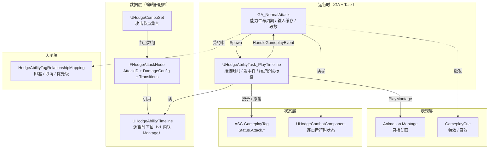
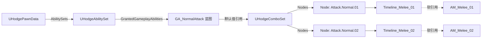
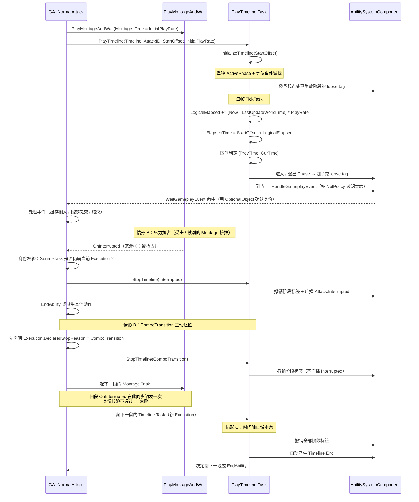

# AbilityTimeline 设计方案：逻辑时间轴与表现分离

> **文档状态：设计草案（未实现）**。撰写日期 2026-09-16。
> 本文描述的是**目标设计**，不是已完成功能。文中出现的 `UHodgeAbilityTimeline`、
> `UHodgeAbilityTask_PlayTimeline`、`UHodgeComboSet` 等类型**当前在源码中不存在**。
> 本次未编译、未运行编辑器、未修改任何 C++ 或资产。

**相关文档**

- [GAS、AbilitySet 与技能生命周期](../KnowledgeBase/07-gas.md)
- [属性、伤害、战斗与死亡](../KnowledgeBase/08-combat-health.md)
- [当前状态、断点与接通顺序](../KnowledgeBase/12-integration-backlog.md)
- [数据资产与 AssetManager](../KnowledgeBase/05-data-assets.md)
- [相机、移动与动画](../KnowledgeBase/09-camera-animation.md)
- [AI 开发与验证流程](../AI_DEVELOPMENT.md)
- [项目开发约定](../../AGENTS.md)

---

## 0. 本文定位与阅读方式

### 0.1 状态标记约定

沿用知识库的四类标记，本文其余部分不再重复说明：

| 标记 | 含义 |
|---|---|
| **源码已实现** | 本文件中引用的 Hodgepodge 现有 C++ / 配置，确实存在于当前工作区 |
| **未接通 / 草稿** | 调用入口、配置或函数体缺失；整段注释不算实现 |
| **待编辑器验证** | 二进制资产内部字段、蓝图逻辑、实际运行效果 |
| **建议 / 目标** | 后续开发设计，**不能当成已有功能** |

**本文绝大部分内容属于第四类。** 少数引用现有代码的地方会明确标注。

### 0.2 阅读路线

| 你的目的 | 跳转 |
|---|---|
| 只想理解"为什么要这么拆" | 第 1、3 章 |
| 要评审数据结构和字段 | 第 4、5 章 |
| 要开工写代码 | 第 6、12、13 章 |
| 关心联机和预测 | 第 8 章 |
| 关心能不能长期维护 | 第 10、11、14 章 |

### 0.3 一句话概括

> 把"技能在什么时刻发生什么"从 **Animation Montage 的 Notify** 里搬出来，变成一份
> **独立的数据资产（Timeline）**，由 **AbilityTask** 在运行时驱动，通过 **GameplayEvent**
> 通知技能；Montage 退化为纯表现层。

---

## 1. 背景与动机

### 1.1 当前问题

项目正在建设普攻连击系统。最初的方案（以及多数教程）采用如下结构：

```
Montage 里放 ANS_ComboWindow / AN_ComboNext
        ↓ 发 GameplayEvent
GA_NormalAttack 用 WaitGameplayEvent 接
        ↓ 推进段数
```

**源码已实现**：这套机制本身没有任何问题，而且不需要新的 C++ 类型——
`HodgeGameplayAbility` 已具备完整的能力基类能力，`HodgeGameplayTags.h` 也已声明
`GameplayEvent_MeleeHit` 等事件标签。

但它带来四个结构性缺陷：

| 缺陷 | 后果 |
|---|---|
| **逻辑窗口绑死在动画资源上** | 动画师挪动 Notify 位置，游戏逻辑的连击窗口就跟着变；策划想调窗口必须找动画师改资产 |
| **换动画 = 改逻辑** | 强化状态换一套 Montage，所有窗口要重新对位，且没有校验手段 |
| **无校验能力** | Notify 是否遗漏、是否重叠、是否超出动画长度，编辑器不会报错，只能靠运行发现 |
| **时间语义不可复用** | 重击、闪避反击各自在自己的 Montage 里重复一套 Notify，无法归纳共性 |

第 2 和第 4 条在你的项目里会被放大——因为角色使用 **ALS**（**源码已实现**：
`Plugins/ALS-Refactored-4.15`，动画层为 `ABP_Pover_Base` / `ALI_ItemAnimLayers` /
`ABP_Pover_Dark`），Montage 的播放本身还受 ALS 状态机影响，逻辑窗口再嵌在 Montage 里，
就会同时受"动画师"和"ALS 状态切换"两头牵制。

### 1.2 参考实践

行业内的同类做法是把时间职责一分为二：

| 系统 | 职责 |
|---|---|
| **逻辑时间轴（Timeline）** | 控制**逻辑流程**与**时间节点**：前摇 / 生效 / 后摇的阶段划分、关键帧事件 |
| **Animation Montage** | 控制**动画播放**与**骨骼动画混合** |

两者**配合使用、职责分离**。分离后，技能逻辑与表现层可以独立开发和调试，
并且为网络同步与客户端预测提供清晰的技能状态节点。

> 参考：UFSH2025 演讲《漫威争锋》基于 GAS 的多人战斗框架开发分享（钟志华）。
>
> **来源可信度说明**：可获取的参考材料是**基于演讲视频的 AI 辅助整理稿**，
> 不是《漫威争锋》的源码或完整技术规格。因此它能真正支撑的只有两条**原则**：
> "时间轴与 Montage 配合使用、职责分离"，以及"战斗行为大量通过 AbilityTask 模块化"。
> **本文中所有具体实现（数据结构、字段、驱动方式、校验规则）都是为 Hodgepodge
> 二次设计的结果，不能表述为"《漫威争锋》已验证的做法"。**
>
> 另外该分享面向**英雄射击**类玩法，其"技能编辑器""检测/生成/效果器三大管线"
> 属于大型团队基建，**不建议本项目照搬**。详见第 2.2 节。

### 1.3 项目现状盘点

| 能力 | 状态 | 说明 |
|---|---|---|
| GAS 能力基类 | **源码已实现** | `UHodgeGameplayAbility`，含 ActivationPolicy / ActivationGroup / Cost / CameraMode / 失败反馈 |
| ASC 扩展 | **源码已实现** | `UHodgeAbilitySystemComponent`，含输入缓存、激活组、TagRelationship、动态 Tag GE 辅助 |
| 标签声明体系 | **源码已实现** | `HodgeGameplayTags.h` 用 `UE_DECLARE_GAMEPLAY_TAG_EXTERN` 集中声明，`.cpp` 用 `UE_DEFINE_GAMEPLAY_TAG` 定义 |
| 能力授予链 | **源码已接入**（据项目 owner 确认） | `PawnData.AbilitySets` → `GiveToAbilitySystem` 已打通 |
| 单个普攻资产 | **待编辑器验证** | `Content/Main/Character/Hero/Ability/GA_Melee.uasset`（未跟踪） |
| **AbilityTask 使用** | **当前为零** | 全工程没有一处 `UAbilityTask` 派生或使用；也无 `PlayMontage` 调用 |
| 连击状态组件 | **未接通** | `UHodgeCombatComponentBase` 仅有构造函数并关闭 Tick |
| ComboSet 数据资产 | **不存在** | 需新建 |
| 命中检测 / 伤害闭环 | **未接通** | 见知识库 KB-08 / KB-09 |
| GameplayEvent 攻击标签 | **不存在** | 现有仅 `GameplayEvent.MeleeHit` / `Death` / `Reset` / `RequestReset` |

### 1.4 为什么现在做

Timeline 属于**地基性抽象**。若先在十来个技能里铺开 Notify 方案，再回头重构，
代价是"重做所有动画资产的时间对位 + 重测所有技能"，且期间线上/已验收的手感会漂移。

当前技能数量少（1 个），是引入这套机制成本最低的窗口期。

---

## 2. 设计目标与非目标

### 2.1 目标

1. **逻辑与表现解耦**：Timeline 决定"什么时候"，Montage 只负责"播什么"。
2. **数据驱动**：时间节点可配置、可校验、可在编辑器发现错误，而非运行时靠猜。
3. **可复用**：一套结构支撑普攻、重击、闪避反击、后续的空中攻击与下落攻击。
4. **可预测友好**：时间推进方式不阻碍后续的客户端预测与回滚设计。
5. **零编辑器开发**：第一版不引入自定义 Asset Editor，只用 Details 面板 + 校验函数。

### 2.2 非目标（明确不做）

| 不做的 | 理由 |
|---|---|
| 模仿 Montage 编辑器的可视化时间轴 | Slate 重度开发。当前 `Hodgepodge.Build.cs` 的 Editor 分支仅含 `UnrealEd / AnimGraph / BlueprintGraph`，做自定义 Asset Editor 需先补 `Slate / PropertyEditor / ToolMenus / EditorWidgets` 一整套依赖 |
| 检测管线 / 生成管线 / 效果器管线 | 为大型英雄射击的"配置爆炸 + 多模式"设计。本项目伤害链尚未接通，抄这个等于给空房子装电梯 |
| Ability 模板系统 | 模板抽自共性，当前只有 1 个技能，无共性可归纳 |
| 独立于 `HodgeAbilityTagRelationshipMapping` 的第二套技能优先级系统 | 与现有 `ActivationGroup` / TagRelationship 功能重叠，会互相打架 |
| 位移 / RootMotion 曲线编辑 | 与 ALS 的位移逻辑职责重叠，属于更后续的话题 |
| 循环段（蓄力 / 扫射） | 会让时间语义复杂一倍。v1 不做，字段可预留 |
| 运行中动态修改速率 / HitStop | 需要 Timeline 与 Montage 同源驱动，v1 只做 `InitialPlayRate`（见 5.3） |
| `Timeline` / `Presentation` 拆分 | 复用前提尚未出现，属于提前抽象（Q7，见 4.8） |

---

## 3. 分层与职责边界

### 3.1 核心判据

> **Timeline 回答"什么时候发出什么语义信号"，但不执行具体业务逻辑。**

判据落成对照形式：

| 允许 | 不允许 |
|---|---|
| `0.35s → Attack.HitCheck`（发出语义信号） | `SphereTrace(...)`（执行检测） |
| `0.56s → Attack.ComboTransition`（发出时机信号） | `SetNextComboIndex(3)`（修改战斗状态） |
| `0.30s → Attack.CameraShake`（发出表现信号） | `if (血量 < 50%)`（做条件判断） |

**事件命名本身也是判据的一部分**：标签应当描述**语义**（`HitCheck` / `ComboTransition`），
而不是实现手段——早期的 `FireTrace` 命名就把"做一次射线检测"这个实现细节泄漏进了数据里。
详见 12.3 节。

这是整套设计的成败线。一旦 Timeline 开始承载业务判断，它就会退化成第二个 GA。

### 3.2 进 / 不进 对照表

| 应该进 Timeline | 不应该进 Timeline | 归属 |
|---|---|---|
| 阶段区间（前摇 / 生效 / 后摇 / 连击窗口） | 伤害数值、倍率、公式 | GameplayEffect / ExecutionCalculation |
| 时间点事件（发通知、播 Cue、切相机、跳段） | 打谁、打几个、怎么选目标 | 检测管线（后续） |
| 时间轴总时长 | 打不打得到 | 服务器权威判定 |
| 阶段语义（驱动状态标签） | 段数推进规则 | `GA_NormalAttack` + `ComboSet` |
| | 输入窗口"开了能干嘛"的语义 | `GA_NormalAttack` |
| | 技能之间的打断 / 优先级关系 | `HodgeAbilityTagRelationshipMapping` |
| | 角色当前的攻击形态 | GameplayTag（由 GE 授予） |

**特别注意最后两条**：Timeline 只说"`Status.Attack.ComboWindow` 从 0.35s 持续到 0.65s"，
它**不知道**"这个窗口里玩家按普攻可以接下一段"。窗口内的行为属于 `GA_NormalAttack`。

### 3.3 分层图



### 3.4 各系统一句话职责

| 系统 | 一句话 |
|---|---|
| `UHodgeComboSet` | 这套攻击形态**有哪几个攻击节点** |
| `FHodgeAttackNode` | 一个节点的**身份、数据与出路**（AttackID / Timeline / 伤害配置 / 转移） |
| `UHodgeAbilityTimeline` | 一个节点内部的**时间结构**是什么 |
| `UHodgeAbilityTask_PlayTimeline` | **按时间推进**并广播节点 |
| `GA_NormalAttack` | **能力生命周期**、输入缓存、段数推进、响应事件 |
| `UHodgeCombatComponent` | **跨能力**保留的连击运行时状态 |
| GameplayTag / GE | 角色**当前处于什么形态** |
| Montage | **播什么动画** |
| TagRelationshipMapping | 技能之间的**互斥关系** |

---

## 4. 数据模型

> **本章全部为「建议 / 目标」，对应类型当前不存在。**

### 4.1 总览

```
UHodgeAbilityTimeline : UPrimaryDataAsset
    ├── 时间基准：Duration
    ├── 表现引用：Montage / MontageSection
    ├── 数组：TArray<FHodgeTimelinePhase>   （区间）
    └── 数组：TArray<FHodgeTimelineEvent>   （时间点）
```

### 4.2 `FHodgeTimelinePhase`（区间）

表示一段**有持续时间的语义状态**。

```cpp
/**
 * Timeline 阶段区间。
 *
 * 表示技能在某段时间内处于某种语义状态，例如前摇、生效、后摇、连击窗口。
 * 运行时会自动授予 / 撤销 PhaseTag（及 AdditionalGrantedTags），并在进入 / 退出时派发事件。
 */
USTRUCT(BlueprintType)
struct FHodgeTimelinePhase
{
    GENERATED_BODY()

    /** 阶段语义标签，如 Status.Attack.Windup。所有 Timeline 共用同一套标签。 */
    UPROPERTY(EditDefaultsOnly, BlueprintReadOnly, meta=(Categories="Status.Attack"))
    FGameplayTag PhaseTag;

    /** 阶段开始时间（秒），闭区间起点。 */
    UPROPERTY(EditDefaultsOnly, BlueprintReadOnly, meta=(ClampMin=0.0, UIMin=0.0, Units="s"))
    float StartTime = 0.f;

    /** 阶段结束时间（秒），开区间终点。 */
    UPROPERTY(EditDefaultsOnly, BlueprintReadOnly, meta=(ClampMin=0.0, UIMin=0.0, Units="s"))
    float EndTime = 0.f;

    /**
     * 额外的授予标签。
     *
     * PhaseTag 本身永远会被自动 Add / Remove，这里只放"一个区间要同时驱动多个标签"
     * 的情况，例如"生效 + 霸体"同时开启。
     */
    UPROPERTY(EditDefaultsOnly, BlueprintReadOnly, meta=(Categories="Status"))
    FGameplayTagContainer AdditionalGrantedTags;
};
```

**为什么 `PhaseTag` 自动授予，而不是让 Author 手填 `GrantedTags`**

早期设计里 `GrantedTags` 与 `PhaseTag` 语义重复（"通常一致"），等于留了一个
"配了 `PhaseTag = ComboWindow` 却忘了把它再塞进 `GrantedTags`"的错误入口。
现在改成：**`PhaseTag` 永远自动 Add / Remove，`AdditionalGrantedTags` 只用于额外标签**——
把"能配错"变成"配不错"。

**为什么删掉了 `bCancelableWindow`**

v1 不驱动任何行为的字段比没有这个字段更糟：它会让读文档的人误以为"取消窗口已经设计过了"。
将来真的需要取消窗口时，直接做一条 `Status.Attack.CancelWindow` 的 Phase 即可——
语义与现有 Phase 体系一致，也能被动画层和互斥判定一起使用，比一个孤立的 `bool` 统一得多。

### 4.3 `FHodgeTimelineEvent`（时间点）

表示一个**瞬时通知**。

**事件在哪些端执行**用枚举表达，不用 `bool`：

```cpp
/**
 * Timeline 事件的本端执行策略。
 *
 * 三态不是"分类标签"，而是直接决定事件该走哪条执行通道，
 * 进而决定会不会出现双播（见 8.3 节）。
 */
UENUM(BlueprintType)
enum class EHodgeTimelineEventNetPolicy : uint8
{
    /** 客户端与服务器各自执行。用于两端都需要的事件，如 ComboTransition。 */
    LocalAndAuthority,

    /** 仅服务器执行。用于命中判定、施加伤害等游戏事实。 */
    AuthorityOnly,

    /** 仅本地控制端执行。用于相机抖动、本地 UI、本地音效。 */
    LocallyControlledOnly
};

/**
 * Timeline 时间点事件。
 *
 * 到达指定时间时向拥有者的 AbilitySystemComponent 发送 GameplayEvent，
 * 由 GA 或其他订阅者处理。Timeline 本身不包含任何业务行为。
 */
USTRUCT(BlueprintType)
struct FHodgeTimelineEvent
{
    GENERATED_BODY()

    /** 触发时间（秒）。 */
    UPROPERTY(EditDefaultsOnly, BlueprintReadOnly, meta=(ClampMin=0.0, UIMin=0.0, Units="s"))
    float Time = 0.f;

    /** 事件标签，如 GameplayEvent.Attack.HitCheck。 */
    UPROPERTY(EditDefaultsOnly, BlueprintReadOnly, meta=(Categories="GameplayEvent.Attack"))
    FGameplayTag EventTag;

    /** 该事件在哪些端执行。见 8.3 节。 */
    UPROPERTY(EditDefaultsOnly, BlueprintReadOnly)
    EHodgeTimelineEventNetPolicy NetPolicy = EHodgeTimelineEventNetPolicy::LocalAndAuthority;
};
```

**为什么不用 `bool bAuthorityOnly`**：

1. 两个状态**无法表达"仅本地控制端执行"**（相机抖动、本地 UI、本地音效都在这一类）。
2. 这个区分**不是纯分类问题**——它决定事件走哪条执行通道，而通道选择直接决定会不会
   双播（GameplayCue 就是一个具体例子，见 8.3 节）。
3. 把 `bool` 改成 `enum` **会让所有已配置资产丢失该字段的值**。所以必须在写第一条
   Timeline 之前定下来，晚改要人工重配。

> **设计说明**：把策略写在资产里而不是 GA 的 `if` 里，是为了让"服务器事实 /
> 本地表现 / 仅本地控制端"在资产面板上可见，策划可读。

**事件载荷必须带身份标识。**

事件通过 `ASC::HandleGameplayEvent` 广播，是 **ASC 级别**的，**不天然只属于创建它的 Task**。
现在只有一条 Timeline 时没问题，但目标是让 Timeline 同时服务普攻、重击、闪避反击——
一旦两条 Timeline 并行、又都发 `GameplayEvent.Attack.ComboTransition`，接收方就分不清
是谁发的。

注意 `FGameplayEventData` 里**没有** `FGameplayAbilitySpecHandle`，也没有 `PredictionKey`
字段，所以身份要靠现有字段携带：

| 字段 | 内容 |
|---|---|
| `OptionalObject` | **发起事件的 Task 自身**（指针相等即可确认"这是我那条 Timeline"） |
| `OptionalObject2` | 预留：Timeline 资产（便于订阅方拿到时序数据） |
| `EventMagnitude` | 触发的时间点 |
| `Instigator` | Avatar Actor |

GA 侧用 `OptionalObject == 当前持有的 Task` 做身份确认，再通过
`Task->GetAttackID()` 取节点标识；**不要把 `AttackID` 塞进载荷的标签容器**。

**`FGameplayEventData` 里没有"事件上下文标签"这类字段。** 它的完整字段是
（`GameplayAbilityTypes.h:232-284`，**已核实**）：

```cpp
FGameplayTag                        EventTag;
TObjectPtr<const AActor>            Instigator;
TObjectPtr<const AActor>            Target;
TObjectPtr<const UObject>           OptionalObject;
TObjectPtr<const UObject>           OptionalObject2;
FGameplayEffectContextHandle        ContextHandle;
FGameplayTagContainer               InstigatorTags;   // 施动者"身上拥有"的标签
FGameplayTagContainer               TargetTags;       // 目标"身上拥有"的标签
float                               EventMagnitude;
FGameplayAbilityTargetDataHandle    TargetData;
```

三个看起来能用的候选，实际都不能用：

| 候选 | 为什么不行 |
|---|---|
| `InstigatorTags` / `TargetTags` | 语义是"角色身上拥有哪些标签"，不是"事件自带的上下文"。借用会让读者误以为 `AttackID` 是角色状态 |
| `ContextHandle` | 理论上能塞自定义 context，但项目的 `FHodgeGameplayEffectContext` 的 `NetSerialize` 复用父类、额外字段不复制（知识库 07 记录）；且会把"事件"与"效果上下文"两个概念混在一起 |
| `TargetData` | 是目标数据通道，语义不符，构造成本也高 |

**v1 也不做"通用 Phase 载荷"**：`Phase.Enter` / `Phase.Exit` 若将来要携带 PhaseTag，
再单独设计载荷，不要现在为它开特例（见 12.3）。

> 更彻底的做法是让 Task 额外暴露 `OnTimelineEvent` C++ delegate，
> **同 Ability 内部事件直接 Task→GA，只有需要跨 Ability 观察的事件才走 ASC GameplayEvent**。
> 但那属于 v1.5 的优化：v1 保留 GameplayEvent 单通道，是为了让 Cue / UI 可以旁听，
> 也让迁移路径和原有 Notify 方案一致（见 6.2 节）。

### 4.4 `UHodgeAbilityTimeline`（资产本体）

```cpp
/**
 * 技能逻辑时间轴。
 *
 * 只描述"什么时候发生什么"，不包含任何业务判断。
 * 由 UHodgeAbilityTask_PlayTimeline 在运行时驱动。
 */
UCLASS(BlueprintType, Const)
class HODGEPODGE_API UHodgeAbilityTimeline : public UPrimaryDataAsset
{
    GENERATED_BODY()

public:
    /** 逻辑时长（秒）。逻辑时间的唯一基准，与 Montage 长度是对齐关系而非硬绑定。 */
    UPROPERTY(EditDefaultsOnly, BlueprintReadOnly, meta=(ClampMin=0.01, Units="s"))
    float Duration = 1.0f;

    /** 表现：播放的动画。使用软引用避免把动画拖进硬引用依赖链。 */
    UPROPERTY(EditDefaultsOnly, BlueprintReadOnly, meta=(Categories="Animation"))
    TSoftObjectPtr<UAnimMontage> Montage;

    /** Montage 起始段。留空则从 Montage 的第一段开始。 */
    UPROPERTY(EditDefaultsOnly, BlueprintReadOnly)
    FName MontageSection;

    /** Duration 与 Montage 长度偏差超过该值时，编辑器报警。 */
    UPROPERTY(EditDefaultsOnly, BlueprintReadOnly, meta=(ClampMin=0.0, Units="s"))
    float LengthMismatchTolerance = 0.05f;

    /** 阶段区间。同一 PhaseTag 不允许重叠。 */
    UPROPERTY(EditDefaultsOnly, BlueprintReadOnly, meta=(TitleProperty=PhaseTag))
    TArray<FHodgeTimelinePhase> Phases;

    /** 时间点事件。保存时按 Time 自动排序。 */
    UPROPERTY(EditDefaultsOnly, BlueprintReadOnly, meta=(TitleProperty=EventTag))
    TArray<FHodgeTimelineEvent> Events;

#if WITH_EDITOR
    /** 编辑器数据校验：时间越界、区间重叠、长度偏差等。 */
    virtual EDataValidationResult IsDataValid(class FDataValidationContext& Context) const override;

    /** 属性变化后自动排序事件、修正明显笔误。 */
    virtual void PostEditChangeProperty(struct FPropertyChangedEvent& PropertyChangedEvent) override;

    /** 一键从 Montage 同步 Duration。 */
    UFUNCTION(CallInEditor, Category="Hodge|Timeline")
    void SyncDurationFromMontage();
#endif

    /** 查询指定时刻处于激活状态的阶段（可返回多个，例如生效与霸体同时开启）。 */
    void GetActivePhases(float Time, TArray<int32>& OutPhaseIndices) const;
};
```

**软引用 Montage 的代价：必须预加载，不能在按键时异步加载。**

上面用了 `TSoftObjectPtr`，但第 7.2 节又要求"Montage 播放与时间基准在同一帧完成、
无异步等待"。这两条不冲突，但要靠**预加载**来满足：

```
进入角色 / Experience 时
  → 通过 AssetManager 的 Bundle 把该形态 ComboSet 需要的动画一起加载进内存
  → 之后普攻是"纯内存操作"，没有任何加载窗口

Task 启动时
  → 直接 Montage.Get()
  → 若为 nullptr，说明配置或预加载链有问题 → 记录明确错误，不要静默继续
```

**绝对不能在按键按下之后才 `RequestAsyncLoad()` 然后等资源**——那会让普攻手感直接崩掉。
项目已有 AssetManager / Bundle 体系（见知识库 05），这条策略与它天然契合。

**但"被引用"不等于"进 Bundle"。** `TSoftObjectPtr<UAnimMontage>` **不会**因为被 Timeline
引用就自动进入 Equipped Bundle，必须显式收集。项目里已有现成范式：
`UHodgeExperienceDefinition` 实现了 `UpdateAssetBundleData()`（**源码已实现**，
`HodgeExperienceDefinition.h:35-38`），走的就是"主资产在编辑器期收集依赖"这条路。
Timeline / ComboSet 应当照同样方式收集自己引用的 Montage。

> 备选方案：把攻击动画**硬引用**进 Hero 的 Equipped bundle。攻击动画属于"热资产"，
> 硬引用也是合法做法，确定性更强、没有加载窗口。两条路都可行，**分界点只在资产规模**。
> 唯一不可接受的仍然是"输入时异步加载"。

**`MontageSection` 与起始偏移的冲突（引擎行为，必须知道）**

`UAbilityTask_PlayMontageAndWait` 同时暴露 `StartSection` 与 `StartTimeSeconds`，
但引擎实现是**先起播、再跳段**（`AbilitySystemComponent_Abilities.cpp:2998` 与 `3032-3035`，**已核实**）：

```cpp
Duration = AnimInstance->Montage_Play(NewAnimMontage, InPlayRate, EMontagePlayReturnType::MontageLength, StartTimeSeconds);
...
// Start at a given Section.
if (StartSectionName != NAME_None)
{
    AnimInstance->Montage_JumpToSection(StartSectionName, NewAnimMontage);
}
```

`Montage_JumpToSection` 会把播放位置重置到该 Section 的开头。引擎头文件注释也写明了
（`AbilityTask_PlayMontageAndWait.h:63`，**已核实**）：

> `@param StartTimeSeconds Starting time offset in montage, this will be overridden by StartSection if that is also set`

**结论：`MontageSection` 非空时，`StartOffset` 无法通过 Task 参数表达。** 所以 v1 约定：

| 组合 | 处理 |
|---|---|
| `MontageSection` 为空 且 `StartOffset > 0` | 合法，按 `StartTimeSeconds` 起播 |
| `MontageSection` 非空 且 `StartOffset == 0` | 合法 |
| `MontageSection` 非空 且 `StartOffset > 0` | **需要实现侧额外处理**（`Montage_SetPosition` 或规定接续段从 Section 头开始），编辑器报警 |

另外必须明确：**`StartOffset` 是 Timeline 逻辑时间，不是 Montage 全局时间**。
两者的映射规则见 7.2 节。

### 4.5 字段取舍说明

| 字段 | 取舍 | 理由 |
|---|---|---|
| `Duration` 为显式字段 | 不从 Montage 推导 | 逻辑时间必须可独立于动画资源存在；否则"换动画"就等于"换逻辑" |
| `Montage` 用 `TSoftObjectPtr` | 不用硬引用 | 知识库 05 记录过：AssetManager 的硬引用链会决定 Cook 依赖。Timeline 是 DataAsset，硬引用会把所有动画拖进 ComboSet 的加载链 |
| `Phases` 与 `Events` 分开 | 不合并成一种条目 | 区间和瞬时点是两种查询方式；合并后运行时要做类型分支，且校验规则不同 |
| `PhaseTag` 自动授予，另有 `AdditionalGrantedTags` | 不让 Author 手填与 `PhaseTag` 语义重复的 `GrantedTags` | 消除"配了 `PhaseTag` 却忘了把它塞进 `GrantedTags`"这类错误入口，见 4.2 |
| `NetPolicy` 用三态枚举写在数据里 | 不用 `bool`，也不写在 GA 的代码分支里 | 让"服务器事实 / 本地表现 / 仅本地控制端"在资产面板上可见；且通道选择决定会不会双播，见 8.3 节 |
| **没有** `bMatchMontagePlayRate` | v1 直接不做这个开关 | 有了它就要回答"Montage 长度与 Duration 不一致时听谁的"。v1 只做编辑期对齐（策略 A）；正确公式与实现前提记在 5.2 节末，等真有需求再实现 |
| Montage 用软引用但**必须能同帧拿到** | 不做运行时异步加载 | 软引用换来加载粒度，代价是"启动时必须已加载"，因此**必须走预加载**（见 4.4 节末） |

### 4.6 目录与命名约定

遵循项目现有 `Hodge` 前缀与 `Public` / `Private` 对应目录（**源码已实现**风格）：

```
Source/Hodgepodge/
├── Public/AbilitySystem/Timeline/
│   ├── HodgeAbilityTimeline.h          // UHodgeAbilityTimeline, FHodgeTimelinePhase, FHodgeTimelineEvent
│   └── HodgeAbilityTask_PlayTimeline.h // UHodgeAbilityTask_PlayTimeline
└── Private/AbilitySystem/Timeline/
    ├── HodgeAbilityTimeline.cpp
    └── HodgeAbilityTask_PlayTimeline.cpp
```

命名说明：项目的既有约定是"所有类型带 `Hodge` 前缀"。UE 对 AbilityTask 的惯例是
`UAbilityTask_X` 前缀。此处采用 `UHodgeAbilityTask_PlayTimeline`，同时满足两者。

`UHodgeComboSet` 建议放在 `Public/Data/`，与既有的 `HodgeAbilitySet` / `HodgePawnData`
同级（**源码已实现**：`Data/` 目录当前存有 `HodgeAbilitySet.h`、`HodgePawnData.h`、
`HodgeGameData.h`、`HodgeAssetManager.h` 等）。

### 4.7 资产引用关系图



**为什么 `ComboSet → Timeline` 用硬引用、`Timeline → Montage` 用软引用**：

- ComboSet 与 Timeline 都是轻量的配置数据，硬引用便于编辑器导航和数据校验；
- Montage 是大体积资产，且 Timeline 可能配很多条，软引用让"加载配置"与"加载动画"分离。

### 4.8 已决定：v1 不拆 `Presentation`（Q7）

> **决策：v1 保持"Timeline 内联 Montage"，不做 `Presentation` 拆分。**
> 本节保留完整论证与重新评估条件，避免以后重复讨论。

**决策理由**

"逻辑与动画解耦"**不等于**"Timeline 资产绝对不能引用 Montage"。真正必须守住的是：

```
不能再靠 Montage Notify 决定 HitCheck / ComboTransition
```

而不是：

```
Timeline 连 Montage 是谁都不能知道
```

v1 的每套普攻本来就有自己的时序，为了"同一条 Timeline 配多套动画"而提前引入
`Presentation` 层属于**提前抽象**。而且下面的约束说明，那层抽象并不免费。

**曾经考虑过的拆分方案（留档，供将来重新评估）**

把逻辑 Timeline 里的 `Montage` / `MontageSection` 移出，
交给攻击节点的 `Presentation` 子结构持有：

```
FHodgeAttackNode
├── AttackID            （GameplayTag，节点标识）
├── Timeline            （逻辑：Duration / Phases / Events）
├── Presentation        （表现：Montage / Section / PlayRate）   ← v1 不拆
└── Transitions         （不同输入/条件 → 下一个 AttackID）
```

**拆分的正面理由（记录备查）**

- 更彻底地满足"动画与技能逻辑分离"：逻辑资产完全不知道具体动画是谁。
- 同一套时序可以有多套表现（不同角色形态、不同武器模组）。
- `Presentation` 是 `PlayRate` 更自然的归属地。
- 与第 9 章的分层主张一致：Timeline 管单段内部时间，节点管段间衔接。

**但必须同时接受这条约束**

> **同一条逻辑 Timeline 跨 Presentation 复用，只在"动画长度可比、或允许按 rate 缩放"时成立。**

否则会出现：Timeline 的 `Duration = 0.8`，普通形态动画 0.8 秒刚好，强化形态动画 1.1 秒——
绝对秒的事件点在强化形态上全部错位。**拆出去不是免费的。**

**重新评估的触发条件**

出现"**同一条逻辑 Timeline 需要对应多套 Presentation**"的第二个、第三个真实案例时，
再回头拆。在那之前，`Timeline` 内联 `Montage` 是更简单、且不损失能力的形态。

**注意：Q1 与 Q7 是两件独立的事**

本节早期版本把 `Presentation` 拆分与 **Q1**（用 `AttackID` + `Transitions` 取代 `NextIndex`）
绑在一起说，这是不对的：

- **Q1 采纳**（见 9.1 / 15 章）：因为"保存段数 / 跳段 / 技能接段 / 闪避派生"是**当前已有需求**。
- **Q7 不采纳**（本节）：因为"一条 Timeline 配多套动画"**目前没有真实案例**。

两者可以、也应当分开决策。

---

## 5. 时间语义

> 这是最容易翻车的部分。四个决策建议现在就拍板，后续改动代价都是全局性的。

### 5.1 D1：用绝对秒，不用归一化比例

| 维度 | 绝对秒（`0.35`） | 归一化（`0.5`） |
|---|---|---|
| 更换更长的动画 | 窗口绝对位置不变（**正确**） | 窗口绝对位置漂移，语义改变 |
| 可读性 | 与 Montage 时间线一致，直观 | 需脑算 |
| 变速 / 时间缩放 | 语义稳定 | 语义随长度变化 |
| 编辑体验 | 直接对着动画数秒 | 对着比例换算 |

归一化的诱惑是"换动画自动适配"，但代价是**窗口的物理时长也变了**：
比例 `0.5` 在一段 1 秒动画里是 0.5 秒窗口，换到 2 秒动画里就变成 1 秒窗口，
玩家按同样节奏接不上连击。

**连击窗口的物理时长是手感参数，必须是绝对的。**

**结论**：绝对秒。换动画导致的对齐问题由 5.2 节解决。

### 5.2 D2：`Duration` 与 Montage 的对齐策略

Timeline 拥有自己的 `Duration`，与 Montage 长度是**对齐关系**。三种策略：

| 策略 | 做法 | 适用场景 | v1 |
|---|---|---|---|
| **A. 编辑期对齐**（推荐） | 编辑器一键从 Montage 同步 `Duration`；运行时逻辑以 `Duration` 为准，Montage 按 rate=1 播放；偏差超容差时编辑器报警 | 绝大多数情况 | **v1 唯一采用的策略** |
| **B. 运行时调速跟随** | Montage 按比例调速，使它在 `Duration` 内播完（公式见本节末） | 需要严格同步且允许动画变速 | v2 再考虑 |
| **C. 完全独立** | 不引用 Montage（纯逻辑时间轴，如纯位移、纯判定窗口） | 无动画的技能 | v1 天然支持 |

**推荐策略 A**，理由：

1. 改动画播放速率会破坏打击感，调参空间反而变小；
2. 与 ALS 的蒙太奇混合叠加变速，出问题的概率显著上升；
3. "换动画后逻辑窗口不变 + 编辑器报警提示重新对齐"是**可控**的，
   而"运行时悄悄变速"是**不可控**的。

编辑器里配一个 `CallInEditor` 的 `SyncDurationFromMontage()`，比什么文档都管用。

**v1 明确不提供"运行时调速跟随"**，因此资产里**没有** `bMatchMontagePlayRate` 这类开关
（见 4.5）。把选择收窄成"只有策略 A 与 C"是刻意的：v1 不需要回答
"Montage 长度与 `Duration` 不一致时该听谁的"。

**策略 B 的正确公式（v2 备注，v1 不实现）**

将来真要做运行时调速跟随，**必须用"动画要在多少秒内播完"反推**，方向极容易写反：

```
想让长度 L 的 Montage 在 D 秒内播完  →  Rate = L / D          （不是 D / L）
```

以 `L = 1.0s`、`D = 0.8s` 为例：正确的是 `Rate = 1.0 / 0.8 = 1.25`（0.8 秒播完）；
写成 `0.8 / 1.0 = 0.8` 会让动画播 **1.25 秒**，越搞越长。

含 `InitialPlayRate` 的完整关系：

```cpp
// Timeline 侧
TimelineRate = InitialPlayRate;

// Montage 侧
MontageRate      = InitialPlayRate * MontageLength / TimelineDuration;
StartTimeSeconds = StartOffset     * MontageLength / TimelineDuration;
```

**两个未解决的前提（这也是 v1 不做它的原因）**：

- `MontageLength` 需要一个**统一定义**——是整个 Montage 长度，还是有效 Section 长度？
  `MontageSection` 非空时两者不同。建议封装 `GetEffectiveMontageLength()`，
  让 `SyncDurationFromMontage()`、长度校验、Rate 计算全部取自同一个来源。
- `StartTimeSeconds` 与 `MontageSection` 的覆盖关系仍然存在（见 4.4 节末），
  两条规则叠加后需要一起定义。

### 5.3 D3：时间基准 = 世界时间差值 × 逻辑 PlayRate

**"不要累加 `DeltaTime`"这条结论要放宽**。准确的说法是：

> 不要**裸累加 `DeltaTime`**（既没有来源，也没有速率概念），而要在**世界时间差值**
> 的基础上叠加一个显式的**逻辑播放速率**。

下面这些情况都会让"逻辑时间"和"世界时间"的推进速度不再相等：

| 情况 | 表现 |
|---|---|
| 攻速加成 / 技能加速 | 逻辑时间应比世界时间**快** |
| HitStop（命中停顿） | 逻辑时间应**暂停**，世界时间继续 |
| `CustomTimeDilation` | **注意**：它只影响该 Actor 的 `DeltaSeconds`，**不影响** `GetWorld()->GetTimeSeconds()`。靠世界时间差值不会自动变慢 |
| 动画暂停 | 动画停了，逻辑时间也该停 |

**但 v1 不要真的支持"运行中动态改速率"。**

原因很直接：Timeline 与 Montage 是两条独立的 Task，速率必须**同源**。如果
Timeline `PlayRate = 1.2` 而 Montage `Rate = 1.0`（`PlayMontageAndWait` 自己也有 `Rate` 参数，
`AbilityTask_PlayMontageAndWait.h:68-69`，**已核实**），`ComboTransition` / `HitCheck`
会越来越早于挥刀动画；HitStop 更明显——Timeline 停了，动画还在播。

所以分层：

| 阶段 | 能力 |
|---|---|
| **v1** | 只暴露 `InitialPlayRate`，创建两条 Task 时**同时传入**，之后不变 |
| **v2** | 提供统一的 `SetAttackPlayRate()`，内部**同时**驱动 Timeline 与 Montage |

这样安排的意义是：**下面这段推进写法 v1 就要写对**，否则 v2 接动态速率时必须重写；
但"动态改速率"这个功能本身 v1 不提供，避免文档宣称支持 HitStop 而实际没有闭环。

时间推进必须**按段累积**：

```cpp
// 错误写法 1：裸累加，没有速率概念，攻速 / HitStop 都做不了
ElapsedTime += DeltaTime;

// 错误写法 2：整体相乘。PlayRate 中途变化时（HitStop 打到 0 再恢复）会瞬间跳变
ElapsedTime = (GetWorld()->GetTimeSeconds() - StartWorldTime) * PlayRate;

// 正确：分段累积，速率变化只影响其后的推进
LogicalElapsed     += (Now - LastUpdateWorldTime) * PlayRate;
LastUpdateWorldTime = Now;
ElapsedTime         = StartOffset + LogicalElapsed;
```

这不构成"累积误差"问题：误差来源只是浮点加法舍入，量级远小于一帧，
且**不会随运行时间放大**；换来的却是变速语义正确。若确实担心，可用 `double` 累积
或周期性重基准化。

**细节 1：世界时间用 `GetTimeSeconds()`，不用 `GetRealTimeSeconds()`。**

`GetTimeSeconds()` 受全局时间膨胀（Time Dilation）影响，`GetRealTimeSeconds()` 不受。
选前者：慢动作时普攻应当整体变慢，而 Montage 的播放同样受膨胀影响，两者一致。
这个选择在加入"击杀慢镜头"或"子弹时间"时才显形，那时再改会牵动所有时间点配置。

**细节 2：`LastUpdateWorldTime`、`InitialPlayRate` 与 Montage 播放必须在同一帧完成。**

两者差半帧产生的是**一段固定的起始偏移**，不是会自行放大的漂移——它不是"越跑越偏"，
而是"从第一帧起就一直差半帧"。真正会随时间放大的是**两端时钟速率不同**
（例如一端把速率算成 1.0、另一端算成 1.2）。结论不变：同一帧、无异步等待。

并且启动时要保证**同一个速率值同时传给两条 Task**：

```cpp
PlayMontageAndWait(Timeline->Montage, Rate = InitialPlayRate, StartSection, StartTimeSeconds);
PlayTimeline(Timeline, AttackID, StartOffset, InitialPlayRate);
```

这是 v1 能保持"逻辑与动画不漂移"的全部前提；只要两处传入的不是同一个值，
后面所有时间点都会错位。

### 5.4 D4：边界、去重与循环

| 规则 | 约定 | 理由 |
|---|---|---|
| 阶段区间 | 左闭右开 `[StartTime, EndTime)` | 相邻阶段（前摇结束 / 生效开始）不会同时激活 |
| 起始偏移 `StartOffset` | 逻辑时间的起点：`ElapsedTime = StartOffset + LogicalElapsed` | 支撑连击接续段从中间起跑 |
| 起点处的**阶段** | Task 一出生就**直接进入**（查询 `GetActivePhases(StartOffset)`） | 靠"伪造一个更早的 `PreviousTime`"推不出来，见 6.4 铁律 1 |
| 起点处的**事件** | 由 `InitializeTimeline` **显式消费**（`Time <= StartOffset` 的全部触发）；推进循环只负责 `(PreviousTime, CurrentTime]` | 只定位游标而不消费，会漏掉 `Time == StartOffset` 的事件（含 `t = 0`），见 6.4 铁律 1 |
| `Time == Duration` 的事件 | 合法，且**必须由推进循环消费**，系统 `Timeline.End` 只能在其后产生 | 否则末尾事件会被 `NaturalEnd` 吃掉，见 6.4 铁律 1 |
| 区间内多个事件 | 按时间升序**全部**触发 | 低帧率一帧可能跨过多个事件点 |
| 重复触发 | 用单调游标（`NextEventIndex`）保证只触发一次 | 避免暂停 / 卡顿 / 追帧时重复施放 |
| 时间回退 | 不回退、不补发 | Timeline 是单向的；回滚是预测系统的事 |
| 循环段 | **v1 不做** | 会让时间语义复杂一倍。v3 若需要再引入 `bLoop` / `LoopStart` / `LoopEnd` |

---

## 6. 运行时驱动：AbilityTask

### 6.1 为什么必须是 AbilityTask

Timeline 需要有人按帧推进它、在正确时机发事件。三种候选方案：

| 方案 | 问题 |
|---|---|
| GA 自己 Tick | `UGameplayAbility` 无 Tick；开 `bCanEverTick` 或用 `WaitDelay` 拼凑都很脏 |
| `UHodgeCombatComponent` 持有时间轴状态 | 组件生命周期与技能不一致；多个技能并发时状态互相污染 |
| **自定义 AbilityTask** | 推荐。生命周期天然与 Ability 绑定；`OnDestroy` 提供明确的清理时机；天然参与预测 |

选 Task。**这同时补上了项目当前"全工程零 AbilityTask"的空白。**

### 6.2 Task 接口草案

```cpp
/**
 * Timeline 的停止原因。
 *
 * 区分它们不是为了日志好看，而是因为**只有"被外力真正抢占"才该广播
 * GameplayEvent.Attack.Interrupted**。否则受击、闪避派生、技能插入、正常连段
 * 会被揉成同一个"中断"，后面做派生时必然返工。
 */
UENUM(BlueprintType)
enum class EHodgeTimelineStopReason : uint8
{
    /** 尚未声明。GA 用它表示"本段还没有被任何原因停止"。 */
    None,

    /** 时间轴自然走完（ElapsedTime >= Duration），由 Task 自动产生。 */
    NaturalEnd,

    /** 连击提交，主动让位给下一段。属于同一次 Ability 内的正常流转。 */
    ComboTransition,

    /**
     * 被外力真正抢占。
     * 注意：**不能由 Montage 回调直接推导**——引擎在 Ability 被取消时发的也是
     * OnInterrupted。原因必须由 GA 在动作发生前声明，见 7.2。
     */
    Interrupted,

    /** Ability 被取消，或 Task 随 Ability 一并销毁。 */
    AbilityCancelled
};

/**
 * 播放技能逻辑时间轴。
 *
 * 职责边界（严格）：
 *   - 推进时间、在时间点发出 GameplayEvent
 *   - 在阶段区间进入 / 退出时授予 / 撤销 GameplayTag（non-replicated loose tag）
 *   - 在 ElapsedTime >= Duration 时自动产生 Timeline.End 系统事件并结束自己
 * 不负责：
 *   - 播放 / 停止 Montage（由独立的 PlayMontageAndWait Task 负责，见 7.2）
 *   - 推进连击段数
 *   - 结束 Ability
 *   - 决定事件被触发后做什么
 */
UCLASS()
class HODGEPODGE_API UHodgeAbilityTask_PlayTimeline : public UAbilityTask
{
    GENERATED_BODY()

public:
    UHodgeAbilityTask_PlayTimeline(const FObjectInitializer& ObjectInitializer);

    /**
     * 启动时间轴。
     * @param OwningAbility   所属能力
     * @param Timeline        时间轴资产
     * @param AttackID        当前攻击节点标识，随事件载荷广播（见 4.3）
     * @param StartOffset     从时间轴的哪一秒开始（用于接续段），Timeline 逻辑时间。默认 0。
     * @param InitialPlayRate 初始逻辑速率，必须与传给 PlayMontageAndWait 的 Rate 相同
     */
    UFUNCTION(BlueprintCallable, Category="Hodge|Ability|Task",
        meta=(AdvancedDisplay="StartOffset,InitialPlayRate"))
    static UHodgeAbilityTask_PlayTimeline* PlayTimeline(
        UGameplayAbility* OwningAbility,
        UHodgeAbilityTimeline* Timeline,
        FGameplayTag AttackID,
        float StartOffset = 0.f,
        float InitialPlayRate = 1.f);

    /**
     * 停止时间轴。**必须带原因**，因为它决定要不要广播 Interrupted：
     *   - NaturalEnd / ComboTransition / AbilityCancelled → 不广播
     *   - Interrupted                                     → 广播 GameplayEvent.Attack.Interrupted
     *
     * 语义 = 停止推进 + 清理阶段标签，与 OnDestroy 的清理等价（由 bStopped 防重复）。
     */
    UFUNCTION(BlueprintCallable, Category="Hodge|Ability|Task")
    void StopTimeline(EHodgeTimelineStopReason Reason);

    /**
     * 当前攻击节点标识。
     * GA 收到 GameplayEvent 后，先用 OptionalObject == 本 Task 确认身份，
     * 再用这个函数取 AttackID（见 4.3）。
     */
    UFUNCTION(BlueprintPure, Category="Hodge|Ability|Task")
    FGameplayTag GetAttackID() const { return AttackID; }

    /** 是否已经停止。GA 在回调里做幂等判断时用它。 */
    UFUNCTION(BlueprintPure, Category="Hodge|Ability|Task")
    bool IsTimelineStopped() const { return bStopped; }

protected:
    virtual void Activate() override;
    virtual void TickTask(float DeltaTime) override;
    virtual void OnDestroy(bool bInOwnerFinished) override;

    /**
     * 初始化。与 AdvanceTimeline 完全分开：
     *   - 查询并直接进入 StartOffset 处已生效的阶段
     *   - 把事件游标定位到第一个 Time >= StartOffset 的事件
     * 不做区间推进，因此不会漏掉 t == 0（或 t == StartOffset）的事件。
     */
    void InitializeTimeline(float InStartOffset);

    /** 推进游标、触发区间内全部事件、维护阶段标签；到 Duration 时自动结束。 */
    void AdvanceTimeline(float PreviousTime, float CurrentTime);

    void EnterPhase(int32 PhaseIndex);
    void ExitPhase(int32 PhaseIndex);

    /** 撤销所有已授予的阶段标签（loose tag，Count 减 1）。OnDestroy 必须无条件调用。 */
    void ClearAllPhaseTags();

    /** 向 ASC 发送单个 GameplayEvent。按 NetPolicy 决定本端是否执行，并附带身份载荷。 */
    void FireEvent(const FHodgeTimelineEvent& Event);

    UPROPERTY()
    TObjectPtr<UHodgeAbilityTimeline> TimelineAsset;

    /** 当前攻击节点标识。随事件载荷广播，供接收方确认"这是我那条 Timeline"。 */
    FGameplayTag AttackID;

    /** 起始偏移（秒）。逻辑时间的起点，用于接续段。 */
    float StartOffset = 0.f;

    /**
     * 逻辑播放速率。**v1 只在启动时写入一次**，运行中不提供修改入口（见 5.3）。
     * 时间推进按段累积，因此 v2 接动态速率时不需要重写推进逻辑。
     */
    float InitialPlayRate = 1.f;

    /** 上一次推进时的世界时间，用于分段累积。 */
    float LastUpdateWorldTime = 0.f;

    /** 从 StartOffset 起已经推进的逻辑时间。 */
    float LogicalElapsed = 0.f;

    /** 当前逻辑时间 = StartOffset + LogicalElapsed。 */
    float ElapsedTime = 0.f;

    /** 下一个待触发事件在 Events 数组中的下标，单调递增。 */
    int32 NextEventIndex = 0;

    /** 当前处于激活状态的阶段下标。 */
    TArray<int32> ActivePhaseIndices;

    /** 是否已停止，避免 StopTimeline 与 OnDestroy 重复清理。 */
    bool bStopped = false;
};
```

构造函数中必须设置 `bTickingTask = true;`，否则 `TickTask` 不会被调用。

**Montage 的播放不在本 Task 内。** 第一版由两个 Task 协作：`PlayMontageAndWait` 管动画，
`PlayTimeline` 管逻辑。理由见 7.2 节。

### 6.3 执行时序



### 6.4 三条铁律

#### 铁律 1：区间判定，且初始化必须与推进分开

低帧率下一帧可能跨过多个事件点。

```cpp
// 错误：会丢事件，表现是"偶尔少一刀伤害""连击窗口偶尔不打开"，且极难复现
if (FMath::IsNearlyEqual(ElapsedTime, Event.Time)) { FireEvent(Event); }

// 正确：用"上一帧时间 → 当前帧时间"的区间查
while (NextEventIndex < Events.Num() && Events[NextEventIndex].Time <= CurrentTime)
{
    if (Events[NextEventIndex].Time > PreviousTime)
    {
        FireEvent(Events[NextEventIndex]);
    }
    ++NextEventIndex;
}
```

**但这个区间判定必须与"初始化"分开，否则起点附近的事件会永远不触发。**

反例：首次 Tick 时若把 `PreviousTime` 当成 `0`，那么 `Time == 0` 的事件会因为
`0 > 0` 为假而被跳过——而游标已经前进，再也不会回来。

正确结构是"初始化"与"推进"彻底分开，并把区间语义统一成左开右闭 `(PreviousTime, CurrentTime]`：

```cpp
// ── 初始化：只建立状态，不做区间推进 ────────────────────────
void InitializeTimeline(float StartOffset)
{
    // (a) 阶段：直接查询，不依赖"进入"事件
    RebuildActivePhases(StartOffset);        // 内部走 GetActivePhases(StartOffset)

    // (b) 事件游标：跳过起点之前
    while (NextEventIndex < Events.Num() && Events[NextEventIndex].Time < StartOffset)
    {
        ++NextEventIndex;
    }

    // (c) 显式消费起点事件：覆盖 t == 0 与 t == StartOffset
    while (NextEventIndex < Events.Num() && Events[NextEventIndex].Time <= StartOffset)
    {
        FireEvent(Events[NextEventIndex]);
        ++NextEventIndex;
    }

    PreviousTime = StartOffset;
}

// ── 启动 ──────────────────────────────────────────────────
InitializeTimeline(StartOffset);            // 会立刻派发起点事件
LastUpdateWorldTime = GetWorld()->GetTimeSeconds();

// ── 每帧 ──────────────────────────────────────────────────
// v1 中 PlayRate 恒等于启动时传入的 InitialPlayRate，运行中不变（见 5.3）
LogicalElapsed     += (Now - LastUpdateWorldTime) * PlayRate;
LastUpdateWorldTime = Now;

// 时钟不允许越过 Duration
const float CurrentTime = FMath::Min(StartOffset + LogicalElapsed, Timeline->Duration);

AdvanceTimeline(PreviousTime, CurrentTime); // 半开区间 (PreviousTime, CurrentTime]
PreviousTime = CurrentTime;

// ── NaturalEnd 必须在最后一次 Advance 之后 ─────────────────
if (CurrentTime >= Timeline->Duration)
{
    StopTimeline(EHodgeTimelineStopReason::NaturalEnd);   // 内部产生 Timeline.End
}
```

**为什么起点事件必须在初始化里显式消费。**
如果只把游标定位到第一个 `Time >= StartOffset` 的事件就交给推进循环，那么首次 Tick 时
`PreviousTime == StartOffset`，`Time == StartOffset` 的事件会因为
`StartOffset > StartOffset` 为假被跳过——**而游标已经前进，再也不会回来**。
`StartOffset = 0` 时就是 `t = 0` 事件永久丢失。

**为什么 `NaturalEnd` 必须排在最后。**
11.2 允许事件落在 `Time == Duration`。如果 Task 在推进之前就判定结束，
那么 `Time == Duration` 的 `HitCheck`、或恰好在 `Duration` 处关闭的 `ComboWindow.Close`
会被系统 End 提前吃掉（症状：**最后一下伤害偶尔没有**，和铁律 1 那类 bug 一样难查）。
正确顺序是：**夹住时钟 → 推进到 Duration → 再发系统 End**。

**浮点比较说明**：`StartOffset` 通常来自资产字面量，与 `Event.Time` 同源，
用 `<=` 精确比较是可靠的。只有当 `StartOffset` 来自运行时计算时才需要加容差
（`FMath::IsNearlyEqual(Time, StartOffset, Tolerance)`）。

**初始化不能用"伪造一个很小的 `PreviousTime`"来模拟。** 那对事件有效，**对阶段无效**：

```
阶段区间 = [0.30, 0.70)
StartOffset = 0.50
```

这条阶段在启动时**就应该处于激活状态**。但用伪造的区间 `[0.5-ε, 0.5]` 去推进，
它在区间两端都是"激活"，**不会触发进入**，标签就永远授不上。所以阶段必须走独立的
查询路径，不依赖"进入"这个动作：

```cpp
Timeline->GetActivePhases(StartOffset, OutPhaseIndices);   // 直接查询
```

#### 铁律 2：事件游标单调前进

`NextEventIndex` 只增不减，触发过的不重复触发。启动时由 `InitializeTimeline(StartOffset)`
**跳过起点之前的事件、消费掉起点上的事件**，之后只随推进前移。

#### 铁律 3：Task 销毁必须无条件清理阶段标签

这是**最容易出事、后果最严重**的一条。

场景：玩家在 `ComboWindow` 内被击飞，GA 被 Cancel，Task 销毁。
如果阶段退出逻辑没执行，`Status.Attack.*` 会**永久残留在 ASC 上**，
导致角色之后再也放不出技能，或动画层卡在攻击姿态。

```cpp
void UHodgeAbilityTask_PlayTimeline::OnDestroy(bool bInOwnerFinished)
{
    // 无论因何销毁、是否正常结束，都必须清干净
    ClearAllPhaseTags();

    Super::OnDestroy(bInOwnerFinished);
}
```

`ClearAllPhaseTags()` 内部遍历 `ActivePhaseIndices` 逐个撤销，最后清空数组。
`StopTimeline(Reason)` 与 `OnDestroy()` 都走这一条路径，用 `bStopped` 防止重复清理。

**阶段标签必须用 non-replicated 的 loose tag：**

```cpp
ASC->AddLooseGameplayTag(PhaseTag, 1);      // 进入阶段
ASC->RemoveLooseGameplayTag(PhaseTag, 1);   // 退出阶段
```

引擎对这两个函数的定义是明确的（`AbilitySystemComponent.h:647-651`，**已核实**）：

```
Allows GameCode to add loose gameplaytags which are not backed by a GameplayEffect.
Tags added this way are not replicated! Use the 'Replicated' versions of these functions
if replication is needed.
It is up to the calling GameCode to make sure these tags are added on clients/server
where necessary
```

这正是"服务器与本地客户端各自跑一条 Timeline、各自维护自己的阶段标签"所需要的语义：
**两端各自加、各自减，互不干扰，因此不可能产生跨机残留。**

**不要用 `AddDynamicTagGameplayEffect` / `RemoveDynamicTagGameplayEffect` 授予阶段标签。**
（**源码已实现**：这两个辅助方法存在于 `HodgeAbilitySystemComponent.h`。但它们是为**长期、
需要复制的状态标签**准备的，例如 `Status.AttackMode.Enhanced`。）

原因：服务器与本地客户端会**各自**跑 Timeline、各自 `ApplyGameplayEffectToSelf` 一个
Infinite 的 GE；服务器的那个会复制到客户端，于是客户端身上出现**两个 GE 实例**
（1 个本地 + 1 个复制）。一旦客户端被取消而服务器没有（或时序错开），各自只移除
自己那一个，就会**永久残留**——恰恰破坏了本条铁律想要避免的结果。

**也不要混用两套机制。** 引擎在复制版上另有警告（`AbilitySystemComponent.h:687-690`，**已核实**）：
复制版 loose tag 会**覆盖模拟代理上的本地计数**。同一个 tag 上既本地维护又想复制，
两者会互相覆盖。

其余两条约束：

- **必须用 Add / Remove 严格配对**，不要用 `SetLooseGameplayTagCount(Tag, 0)`。
  Count 是共享计数，暴力置 0 会把别处叠加的次数一起清掉。
- `Status.Attack.*` 是**本地运行态**；决定战斗事实的长期状态仍走服务器权威 GE。
  两者的分工见 8.4 节。

> **在 ALS 环境下这不是防御性编程**：ALS 的状态机自己会打断 Montage
> （落地、转身、Ragdoll），所以"中途被打断"是必然发生的路径，不是边界情况。

### 6.5 与 Ability 生命周期的边界

| 边界 | 约定 |
|---|---|
| Timeline 结束 | **≠** Ability 结束，**也 ≠ 连击进入下一段**。只发 `Timeline.End` 事件，由 GA 决定后续（见 9.2） |
| Ability 被取消 | Task `OnDestroy` → 清理阶段标签。**不**自动结束 Timeline（Timeline 随 Task 一起销毁） |
| Timeline 中途重入 | 通过 `StartOffset` 从指定秒启动，由 `InitializeTimeline` 重建当时已生效的阶段（见 6.4 铁律 1） |
| Montage 被外力真正中断 | `StopTimeline(Interrupted)`，并广播 `GameplayEvent.Attack.Interrupted`（见 7.2） |
| 连击进入下一段 | **原子操作**：先 `StopTimeline(ComboTransition)` 让旧段退出，再启动新段。**不广播 `Interrupted`** |
| 多段连击 | 每段一对 Task（Timeline Task + Montage Task）。旧段必须在新段启动前停掉，见 9.2 |

**为什么要明确"Timeline 结束 ≠ Ability 结束"**：后续要做"攻击后摇可被闪避取消"时，
如果 Timeline 结束就自动关能力，就没有可取消的后摇窗口了。

---

## 7. 与 Montage 的协作

### 7.1 分离后 Notify 的剩余职责

**这是一个重要推论：Timeline 上线后，Montage 中的逻辑 Notify 应当全部移除。**

```
分离前：ANS_ComboWindow → 发 GameplayEvent → GA 接
分离后：Timeline 的 ComboWindow 区间 → Task 发 GameplayEvent → GA 接

Montage 里只保留：
  - 纯表现类 Notify：脚步声、武器拖尾、特效挂点、材质参数
  - 动画层自身需要的标记：ALS 的状态切换、转身标记
```

### 7.2 播放、跳段与中断策略

#### 播放与跳段

| 事项 | 约定 |
|---|---|
| 启动顺序 | 同一帧内完成"记录 `LastUpdateWorldTime`"、"`Montage_Play`"，并把**同一个 `InitialPlayRate`** 传给两条 Task |
| 起始段 | 由 `MontageSection` 指定；留空则从头播 |
| 起始位置 | `StartOffset` 是 **Timeline 逻辑时间**，映射为 `PlayMontageAndWait` 的 `StartTimeSeconds`。注意 `MontageSection` 非空时会覆盖它（见 4.4 节末） |
| 中途跳段 | 由 **Timeline 的 Event** 驱动（`GameplayEvent.Attack.JumpSection` → GA 调 `Montage_JumpToSection`），**不要由 GA 自己数时间** |
| 连击接续（A2 从 A1 后摇直接起） | 推荐 `Montage` 的 `NextSection` + Timeline 的跳段事件配合，而不是依赖 blend。若接续要求"从 Section 内某秒起"，必须走 `Montage_SetPosition`（见 4.4 节末的约束） |

#### 中断策略（必须是真实通道，不能只写一句"由 GA 决定"）

**问题场景**：A1 的挥刀动画被受击打断，Montage 没了，但 Timeline 继续跑——
到 `0.42s` 触发 `Attack.HitCheck`，服务器就会在"角色站着挨打"的状态下打出一刀伤害。

这在**带命中判定的攻击技能**上是不可接受的默认行为。

**默认策略：Montage 被外力真正抢占 ⇒ 停止 Timeline（`Interrupted`）。**

但在写映射之前必须先看清引擎的回调来源——**直接从回调反推停止原因是错的**。

##### 引擎事实：回调来源与"直觉映射"不一致

`AbilityTask_PlayMontageAndWait.cpp`（**已核实**）：

```cpp
void UAbilityTask_PlayMontageAndWait::OnMontageBlendingOut(UAnimMontage* Montage, bool bInterrupted)
{
    ...
    if (bInterrupted) { OnInterrupted.Broadcast(); ... }    // 来源①：被其他 Montage 抢占
    else              { OnBlendOut.Broadcast(); }
}

// 绑定到 Ability->OnGameplayAbilityCancelled
void UAbilityTask_PlayMontageAndWait::OnGameplayAbilityCancelled()
{
    if (StopPlayingMontage() || bAllowInterruptAfterBlendOut)
    { OnInterrupted.Broadcast(); }                          // 来源②：Ability 被取消 → 也发 OnInterrupted
    ...
}

void UAbilityTask_PlayMontageAndWait::ExternalCancel()
{
    OnCancelled.Broadcast();                                // OnCancelled 的真正来源
    Super::ExternalCancel();
}
```

由此得到两张与直觉相反的表：

| 回调 | 真实来源 |
|---|---|
| `OnInterrupted` | ① 被其他 Montage 抢占；② **Ability 被取消** |
| `OnCancelled` | ① `ExternalCancel()`；② Montage 播放失败 |
| `OnBlendOut` | 正常收尾混合 |
| `OnCompleted` | 正常播完 |

**结论一：`OnInterrupted` 不能当作"被外力抢占"的同义词**——Ability 被取消时引擎发的也是它。
所以"由回调推导停止原因"这条路线**从根上不成立**。

**结论二：`OnInterrupted` 在正常连段路径上必然发生。**
`ASC::PlayMontage` 的执行顺序是（`AbilitySystemComponent_Abilities.cpp:2998` 与 `3028`，**已核实**）：

```cpp
Duration = AnimInstance->Montage_Play(NewAnimMontage, ...);   // 旧 Montage 在这里被抢占 → 同步广播 OnInterrupted
...
InAnimatingAbility->SetCurrentMontage(NewAnimMontage);        // 之后才把"当前 Montage"换成新的
```

起 A2 的 `Montage_Play` 会**同步**把 A1 挤掉，且那一刻 `Ability->GetCurrentMontage()` 还是 A1
（第 3028 行尚未执行），所以 A1 的 `OnInterrupted` **一定会发出来**。
如果 GA 把"`OnInterrupted` → `Attack.Interrupted`"当成唯一映射，
**每一次正常连段都会误广播一次"被中断"**——这不是偶发竞态，是必现错误。

##### 规则：先声明原因，再动 Task；回调只做身份校验

```
GA 决定要做什么（ComboTransition / Interrupted / AbilityCancelled）
        ↓
① 先把原因写进当前"攻击段执行"
        ↓
② 再动 Timeline / Montage
        ↓
回调到达
        ↓
③ 只校验"我是否仍属于当前执行"，不推导原因
   不属于 → 直接 return
```

引入**攻击段执行（Execution）**，让每次起段都有唯一身份：

```cpp
/** 一次攻击段执行的身份。每起一段就换一个新的。 */
USTRUCT()
struct FHodgeAttackExecution
{
    GENERATED_BODY()

    /** 单调递增的序号，用于日志与断言。 */
    uint32 Serial = 0;

    /** 本段对应的节点标识。 */
    FGameplayTag AttackID;

    /** 本段的 Timeline Task。 */
    UPROPERTY()
    TObjectPtr<UHodgeAbilityTask_PlayTimeline> TimelineTask;

    /** 本段的 Montage Task。 */
    UPROPERTY()
    TObjectPtr<UAbilityTask_PlayMontageAndWait> MontageTask;

    /** 当前执行被停止的原因；由 GA 在动作发生前写入，回调不得反推。 */
    EHodgeTimelineStopReason DeclaredStopReason = EHodgeTimelineStopReason::None;
};
```

GA 侧的两条硬性约束：

```cpp
// ① 停止原因只能由 GA 声明，不能由回调反推
void GA_NormalAttack::OnComboTransition()
{
    Execution.DeclaredStopReason = EHodgeTimelineStopReason::ComboTransition;  // 先声明
    Execution.TimelineTask->StopTimeline(Execution.DeclaredStopReason);        // 再动 Task
    // ... 之后才起新段（见 9.2）
}

// ② 所有 Montage 回调必须先做身份校验
void GA_NormalAttack::OnMontageInterrupted(UAbilityTask_PlayMontageAndWait* SourceTask)
{
    if (SourceTask != Execution.MontageTask) { return; }                       // 旧执行的回调 → 忽略
    if (Execution.DeclaredStopReason != EHodgeTimelineStopReason::None) { return; }  // 原因已声明 → 不重复处理
    Execution.DeclaredStopReason = EHodgeTimelineStopReason::Interrupted;
    Execution.TimelineTask->StopTimeline(Execution.DeclaredStopReason);
}
```

> **本节最高优先级规则：**
> **所有 Montage / Timeline 回调都必须先验证自己仍属于"当前攻击段执行"，
> 旧执行的回调一律忽略，且任何回调都不得推导停止原因。**

实现上绑定回调时要带上 `SourceTask`（或用 Serial 闭包捕获），
**不要用 `CurrentTimelineTask->StopTimeline(...)` 这种"取当前指针"的写法**——
那正是旧回调误杀新段的成因。

补充一条引擎事实：`GUseAggressivePlayMontageAndWaitEndTask` 默认为 `true`（**已核实**，
`AbilityTask_PlayMontageAndWait.cpp:12`），任务被抢占后会立即 `EndTask()`，
所以"迟到到下一帧的回调"窗口很窄。真正的危险是**同步发生在"起新段"过程中的那一次**，
以及"当前执行已换成新段之后"到达的回调——身份校验两者都能覆盖。

##### 停止原因与广播的对应关系

| 停止原因 | 广播 `Attack.Interrupted` | 场景 |
|---|---|---|
| `NaturalEnd` | 否 | 时间轴走完，Task 自动产生 |
| `ComboTransition` | **否** | 连击提交，同一次 Ability 内的正常流转 |
| `Interrupted` | **是** | 被外力真正抢占（且非 Ability 取消引起） |
| `AbilityCancelled` | 否 | Ability 取消 / Task 随 Ability 销毁 |

**为什么这条区分很重要**：如果 `ComboTransition` 也走 `Interrupted`，
那么"受击打断 / 闪避派生 / 技能插入 / 正常连段"会全部被揉成同一个信号，
后面做受击派生动作为此返工。

##### 必须区分"中断"与"正常结束"

| Montage 回调 | 默认处理 |
|---|---|
| `OnInterrupted` | 交由"身份校验 + 原因声明"决定，**不直接映射为 `Interrupted`** |
| `OnCancelled` | 同上 |
| `OnCompleted` | **不动 Timeline** |
| `OnBlendOut` | **不动 Timeline** |

如果把 `OnCompleted` / `OnBlendOut` 也当成中断，那么每次正常结束都会顺带停掉 Timeline——
这直接和 5.2 节"`Duration` 可以长于 Montage 长度（后摇比动画长）"打架，后摇阶段会被整体吃掉。

**第一版由两个 Task 协作，不要让 Timeline Task 自己播 Montage：**

```
GA_NormalAttack
  ├── UAbilityTask_PlayMontageAndWait  → 管动画，自带四种回调
  └── UHodgeAbilityTask_PlayTimeline   → 管逻辑
        GA 把 OnInterrupted / OnCancelled 接到 StopTimeline
```

理由：`PlayMontageAndWait` 已经处理好了 Montage 的**复制**（`RepAnimMontageInfo`）、
预测与 `bStopWhenAbilityEnds` 语义。Timeline Task 自己去 `PlayMontage` 等于**重写一遍
Montage 复制**，那是很容易写出联机 bug 的地方。等这套跑稳、确实有合并需求时再合并。

**例外情况**（需要显式配置，不能当默认规则）：

- **纯逻辑 Timeline**（不引用 Montage）没有中断概念。
- **通道类技能**（动画结束但逻辑继续，如引导 / 持续施法）确实需要"动画没了逻辑还在"。
- 这类需求应通过一个显式的中断策略字段表达（例如 `EHodgeTimelineInterruptPolicy`），
  而**不是**把"Timeline 继续跑"当作默认。

### 7.3 ALS 环境下的注意事项

**源码已实现**：插件 `Plugins/ALS-Refactored-4.15`，动画资产
`ABP_Pover_Base` / `ALI_ItemAnimLayers` / `ABP_Pover_Dark`。

1. **Montage Slot 必须与 ALS 的动画层对应**，否则动画会播在错误的骨骼层上
   （典型症状：上半身没有换成攻击动作）。
2. **阶段标签要与 ALS 的状态互斥**：这正是 `FHodgeTimelinePhase::PhaseTag` /
   `AdditionalGrantedTags` 的用途——让动画层能查询到"当前在攻击"，从而禁止转身、Ragdoll 等干扰。
3. **ALS 会打断 Montage**：落地的状态机切换、TurnInPlace 都可能中断播放。
   所以铁律 3（销毁清理）在 ALS 下是**必然执行路径**。

### 7.4 反模式

| 反模式 | 为什么错 |
|---|---|
| 用 ANS 定义 Phase | 等于把 Timeline 又塞回 Montage 里，分离白做，且得到"两套时间源互相打架"的更糟状态 |
| 在 Montage 里同时保留逻辑 Notify 和 Timeline 区间 | 双时间源，必然漂移，且排查时不知道以哪个为准 |
| 逻辑时间从"Montage 开始播放"算而非同一帧记录 | 会产生**固定的起始偏移**（不会自行放大，但一直错位）。真正会随时间放大的是两端时钟速率不同，要靠 `PlayRate` 与共用实现处理，见 5.3 |
| 把 GA 的业务分支写进 Timeline | Timeline 会退化成第二个 GA |
| Montage 被中断但让 Timeline 继续跑 | 会出现"站着挨打却打出伤害"。默认必须是中断即停 Timeline，见 7.2 |
| 把 `OnCompleted` / `OnBlendOut` 当成中断 | 每次正常结束都会停掉 Timeline，后摇被整体吃掉，见 7.2 |
| 用 `AddDynamicTagGameplayEffect` 授予阶段标签 | 两端各跑时间轴会产生 GE 双实例，取消时序错开就永久残留，见 6.4 铁律 3 |

---

## 8. 网络与预测

### 8.1 各端执行范围

**源码已实现**：`UHodgeGameplayAbility` 构造当前默认
`InstancedPerActor` + `LocalPredicted`（见知识库 07-gas.md）。

| 端 | Task 是否推进 | 说明 |
|---|---|---|
| 服务器 | 是 | 权威时间轴 |
| 本地玩家客户端 | 是（预测） | 能力本地激活时 Task 同时运行 |
| 其他客户端（模拟代理） | 否 | 通过能力激活的复制得知技能在跑，但不跑 Task |

也就是说，**服务器与本地客户端各自跑一条独立的时间轴**。

### 8.2 端间时间偏差

客户端的能力激活早于服务器（差约半个 RTT）。因此：

```
客户端时间轴：|----前摇----|--生效--|----后摇----|
服务器时间轴：        |----前摇----|--生效--|----后摇----|
                      ↑ 延迟约 RTT/2
```

这是 GAS 的固有特性，**不需要消除**，而是按"可预测 / 不可预测"分工处理（见 8.3）。

**不要**在收到服务器确认后重启客户端时间轴——那会导致动画跳帧，观感比偏差本身更糟。

### 8.3 可预测 / 不可预测分类

这是参考实践里最有价值的一条原则，**且它改写了一个常见误解**：

> 关键词是**"能判定"**，不是**"能回滚"**。

GAS 的 `FScopedPredictionWindow` / `FPredictionKey` 自动回滚的范围是有限的：

| 能自动回滚 | 不能自动回滚 |
|---|---|
| Attribute 变更 | **你在自己组件 `UPROPERTY` 里写的任何值** |
| GameplayEffect 应用 | 自定义的 `int32` 状态（如连击段数） |
| GameplayCue | |
| Ability 激活本身 | |

所以**不要照搬"预测 → 失败 → 回滚"到连击段数上**——那需要自己实现一套状态快照与回滚，
成本很高。而连击段数恰好满足"**能判定**"：

```
段数 = f(输入序列, 超时规则, 当前时钟)
```

三个输入两端都一致（超时使用同步的服务器时钟，见 8.4），因此**两端独立推导的结果
在绝大多数时刻必然相同**，只在窗口边界几十毫秒内可能分歧。

| 内容 | 分类 | 处理 | 对应 `NetPolicy` |
|---|---|---|---|
| 连击段数推进 | 可预测（能判定） | 客户端先行播动画；服务器独立推导并作为最终事实 | `LocalAndAuthority` |
| 输入缓存（`bInputBuffered`） | 可判定 | **两端各有一份瞬时状态**，不作为 `UPROPERTY` 复制；客户端按键必须经 GAS 的 replicated input event 通道送达服务器，见 8.5 | — |
| 阶段标签（`Status.Attack.*`） | 可预测 | 两端各自维护 non-replicated loose tag，见 8.4 | — |
| 相机抖动 / 本地 UI / 本地音效 | 可预测表现 | 只在本端执行，服务器与远端不做 | `LocallyControlledOnly` |
| 切相机模式 | 可预测表现 | 本端执行 | `LocallyControlledOnly` |
| **生成命中判定** | **不可预测** | 服务器权威 | `AuthorityOnly` |
| **施加伤害 / 改血量** | **不可预测** | 服务器权威（`DefaultGame.ini` 已设 `PredictTargetGameplayEffects=False`，**源码已实现**） | `AuthorityOnly` |
| 变身 / 强化状态切换 | **不可预测** | 服务器权威 | `AuthorityOnly` |

**`NetPolicy` 不只是分类，它决定执行通道。** 以 GameplayCue 为例：Cue 的复制去重是走
`FPredictionKey` 通道的——`GameplayCueManager.h:113-118`（**已核实**）提供的就是
"Wrappers to handle replicating executed cues"，签名形如
`InvokeGameplayCueExecuted(OwningComponent, GameplayCueTag, PredictionKey, EffectContext)`。
所以：

- 如果 Timeline 在客户端和服务器**各调一次** `ExecuteGameplayCue`，就会**双播**，
  而且没有去重机制兜住；
- 列入"可预测表现"的 Cue 必须走**预测窗口**那条路，而不是两端各调一次。

**`NetPolicy` 的运行时分派：必须只 Fire 一次**

listen server 上，本地玩家的 Ability 会**同时**满足 `HasAuthority()` 与 `IsLocallyControlled()`。
所以**不能写成两个独立判断**：

```cpp
// 错误：listen server 上本地玩家两个条件都为真 → 同一个事件执行两次
if (HasAuthority())        { Fire(); }
if (IsLocallyControlled()) { Fire(); }

// 正确：先算出"本端是否该执行"，再 Fire 一次
const bool bIsAuthority         = HasAuthority();
const bool bIsLocallyControlled = IsLocallyControlled();

bool bShouldFire = false;
switch (NetPolicy)
{
case EHodgeTimelineEventNetPolicy::LocalAndAuthority:     bShouldFire = bIsAuthority || bIsLocallyControlled; break;
case EHodgeTimelineEventNetPolicy::AuthorityOnly:         bShouldFire = bIsAuthority;                          break;
case EHodgeTimelineEventNetPolicy::LocallyControlledOnly: bShouldFire = bIsLocallyControlled;                  break;
}
if (bShouldFire) { Fire(); }
```

**声明了 `NetPolicy` 却不实现分派，比没有这个字段更危险**——后面的人会以为分类已经生效。

**工程纪律要求**：既然段数由两端独立推导，推导逻辑**必须是一个共用实现**。
如果写成"客户端一套、服务器一套"，一定会错位。这一点在连击系统设计文档中需要单独强调。

### 8.4 阶段标签的复制

阶段标签（`Status.Attack.*`）用于驱动动画层和互斥判定，**服务器与本地客户端都需要**。
结论很明确：

> **用 non-replicated 的 loose tag，两端各自维护。不要用 GE 复制。**

| 做法 | 评价 |
|---|---|
| 两端各自 `AddLooseGameplayTag` / `RemoveLooseGameplayTag` | **采用**。语义就是引擎注释说的"由 GameCode 在需要的端各自添加"；两端各自加、各自减，不可能产生跨机残留 |
| 通过 GE 从服务器复制 | **不用**。两端各跑时间轴会导致 GE 双实例；取消时序错开就永久残留（见 6.4 铁律 3） |
| `AddReplicatedLooseGameplayTag` | **不用**。引擎明确警告它会覆盖模拟代理上的本地计数，与"两端各自维护"的模型冲突 |

**注意区分两类标签：**

| 标签 | 性质 | 处理 |
|---|---|---|
| `Status.Attack.Windup` / `.Active` / `.Recovery` / `.ComboWindow` | **本地瞬时运行态** | non-replicated loose tag，两端各自维护 |
| `Status.AttackMode.Enhanced` / 受控状态 / Buff | **战斗事实** | 服务器权威 GE 授予 + 复制 |

**一个必须实测验证的副作用**：阶段标签不复制 ⇒ **远端模拟代理（其他玩家）身上
没有 `Status.Attack.*`**。

- 通常这不是问题：远端角色的攻击表现由 GAS 复制 Montage（`RepAnimMontageInfo`）驱动，
  不依赖这些标签；远端也不激活技能，因此不参与互斥判定。
- **但如果动画层在远端角色上依赖这些标签做 layer 选择，就会出现不一致。**
  项目里 `UHodgeAnimInstance` 有 `GameplayTagBlueprintPropertyMap`（**源码已实现**），
  所以这一条**必须实测确认**，不能默认成立。
- 若确实需要，正确做法是**另开一个"观察者面向"的复制状态**，
  而不是把本地阶段标签改成复制的（引擎已警告会覆盖本地计数）。

### 8.5 连击输入如何到达服务器（必须闭环）

这是本设计里最容易漏掉、且**在单人 PIE 与 listen server 上都测不出来**的一环。

**问题**：玩家第一次左键激活 `GA_NormalAttack`，之后第二次、第三次左键**不是重新激活技能**，
而是"已经 Active 的 Ability 收到额外的 `InputPressed`"。如果服务器收不到这些后续按键，
它就不存在"相同输入序列"，也就无法独立推导出同一个 `NextAttackID`——8.3 的"两端可判定"直接失效。

**基础设施现状（已核实）**

项目的输入链是通的：

```
AbilityInputTagPressed → ASC 缓存 → ProcessAbilityInput → 已激活则转 AbilitySpecInputPressed
```

`UHodgeAbilitySystemComponent::AbilitySpecInputPressed`（**源码已实现**，
`HodgeAbilitySystemComponent.cpp:228-253`）在 `Spec.IsActive()` 时会调用：

```cpp
InvokeReplicatedEvent(EAbilityGenericReplicatedEvent::InputPressed, Spec.Handle, OriginalPredictionKey);
```

**但 `InvokeReplicatedEvent` 本身不发任何 RPC。** 它的实现只做两件事
（`AbilitySystemComponent_Abilities.cpp:3832-3848`，**已核实**）：

```cpp
ReplicatedData->GenericEvents[(uint8)EventType].bTriggered = true;
ReplicatedData->PredictionKey = CurrentPredictionKey;
if (ReplicatedData->GenericEvents[EventType].Delegate.IsBound())
{
    ReplicatedData->GenericEvents[EventType].Delegate.Broadcast();   // 仅本地广播
    return true;
}
return false;
```

真正把按键送到服务器的是 **`UAbilityTask_WaitInputPress`**
（`AbilityTask_WaitInputPress.cpp:16-46`，**已核实**）：

```cpp
FScopedPredictionWindow ScopedPrediction(ASC, IsPredictingClient());
if (IsPredictingClient())
{
    // Tell the server about this
    ASC->ServerSetReplicatedEvent(EAbilityGenericReplicatedEvent::InputPressed,
                                  GetAbilitySpecHandle(), GetActivationPredictionKey(), ASC->ScopedPredictionKey);
}
```

**结论：`WaitInputPress`（或等价监听）不是可选项，而是连击在联机下能工作的必要条件。**

```
GA_NormalAttack
  ├── ComboBufferWindow 开启 → 创建 WaitInputPress
  │        ├── 本地按键 → InvokeReplicatedEvent → 本地 broadcast → 命中
  │        └── IsPredictingClient() → ServerSetReplicatedEvent ──RPC──▶ 服务器
  │                                              服务器侧同一 Spec 的 delegate 被触发
  ├── 命中 → bInputBuffered = true（两端各自置位）
  └── ComboBufferWindow 关闭 → 取消 WaitInputPress
```

**v1 采用 `WaitInputPress`**，理由是它够用且风险最低：

- 引擎现成实现，输入复制的正确性（含 `PredictionKey` 配对）已经处理好；
- 它命中原生会 `EndTask()`，正好对应"一个连击窗口只关心第一次有效按键"；
- 窗口关闭时取消即可，不需要自己管理句柄与重入。

**实现时必须注意的三点**

1. **两端都要创建这个 Task。** 客户端侧负责发 RPC，服务器侧负责等待
   （`IsForRemoteClient()` 分支会 `SetWaitingOnRemotePlayerData()`）。只在一端创建会静默失效。
2. **listen server 上本地玩家不会暴露这个缺口**（`IsLocallyControlled()` 为真，
   本地 broadcast 就能命中）。**必须用 2 人 PIE 或独立进程才能真正验证**，
   只测单人 PIE 会得到"看起来能用"的假象。
3. **不要用 `bReplicateInputDirectly`。** 项目已经明确放弃这条路径
   （`AbilitySpecInputPressed` 的注释写了"We don't support `UGameplayAbility::bReplicateInputDirectly`"），
   统一走 replicated event。

---

## 9. 与 GA / ComboSet 的接口

### 9.1 资产引用

```cpp
/**
 * 一个攻击节点。
 *
 * 节点是连击图里的"一格"：它有身份（AttackID）、有内部时序（Timeline）、
 * 有数据（DamageConfig），以及**出路**（Transitions）。
 */
USTRUCT(BlueprintType)
struct FHodgeAttackNode
{
    GENERATED_BODY()

    /**
     * 节点标识。必须唯一，建议按 `Attack.<形态>.<序号>` 组织，
     * 例如 Attack.Normal.01 / Attack.Enhanced.02 / Attack.Dodge.Counter。
     * 对外（技能插入、闪避派生、跳段）一律用这个标识，不用下标。
     */
    UPROPERTY(EditDefaultsOnly, BlueprintReadOnly, meta=(Categories="Attack"))
    FGameplayTag AttackID;

    /** 该节点内部的逻辑时间轴（v1 内含 Montage，见 4.8）。 */
    UPROPERTY(EditDefaultsOnly, BlueprintReadOnly)
    TObjectPtr<UHodgeAbilityTimeline> Timeline;

    /** 伤害倍率。v1 仅存数据，伤害链接通后由 GE 消费。 */
    UPROPERTY(EditDefaultsOnly, BlueprintReadOnly)
    float DamageMultiplier = 1.f;

    /** 该节点的攻击类型标签，用于伤害 GE 与 Cue 选择。 */
    UPROPERTY(EditDefaultsOnly, BlueprintReadOnly, meta=(Categories="GameplayEffect.DamageType"))
    FGameplayTag AttackType;

    /**
     * 默认出路。ComboTransition 时若拿到了普通连击输入，就走到这里。
     * 留空表示"本节点是连击终点"。
     */
    UPROPERTY(EditDefaultsOnly, BlueprintReadOnly, meta=(Categories="Attack"))
    FGameplayTag DefaultNextAttack;

    /**
     * 条件出路。键是"转移语义"标签，值是目标 AttackID。
     * 例如 Attack.Transition.Heavy → Attack.Normal.Heavy01
     *      Attack.Transition.Dodge → Attack.Dodge.Counter
     * v1 只解析 Attack.Transition.Normal（为空时回退 DefaultNextAttack），其余键先存数据。
     *
     * 注意键**不是物理输入标签**：将来还会有 Attack.Transition.HitConfirm /
     * Attack.Transition.Airborne / Attack.Transition.AfterSkill 这类非输入的转移条件。
     * 因此不复用 InputTag.*，也不新开 Input.*（见 12.4）。
     */
    UPROPERTY(EditDefaultsOnly, BlueprintReadOnly, meta=(Categories="Attack.Transition"))
    TMap<FGameplayTag, FGameplayTag> Transitions;
};

/** 一套攻击形态的完整节点集合。 */
UCLASS(BlueprintType, Const)
class HODGEPODGE_API UHodgeComboSet : public UPrimaryDataAsset
{
    GENERATED_BODY()

public:
    UPROPERTY(EditDefaultsOnly, BlueprintReadOnly, meta=(TitleProperty=AttackID))
    TArray<FHodgeAttackNode> Nodes;

    /**
     * 连击入口。键是"从哪种来源起手"，值是起始 AttackID。
     * 例如 Attack.Entry.Default → Attack.Normal.01、
     *      Attack.Entry.AfterSkill → Attack.Normal.03。
     *
     * **必须存在 Attack.Entry.Default**，缺失即数据校验错误（见 11.2）。
     * 不做"回退到 Nodes[0]"——那会让数组顺序重新获得业务含义，与 Q1 选用 AttackID
     * 的初衷冲突。
     */
    UPROPERTY(EditDefaultsOnly, BlueprintReadOnly, meta=(Categories="Attack.Entry"))
    TMap<FGameplayTag, FGameplayTag> Entries;

    /** 按 AttackID 查节点，找不到返回 nullptr。 */
    const FHodgeAttackNode* FindNode(const FGameplayTag& InAttackID) const;
};
```

> **为什么 v1 就用 `AttackID` + `Transitions`，而不是 `NextIndex` 下标**
>
> 因为"保存段数 / 跳段 / 技能后接第三段 / 闪避派生 / 换普攻模组"是**当前已经出现的需求**，
> 不是"也许将来会需要"。下标方案在"数组中插入一段"或"技能插入到指定段"时必然失效，
> 而迁移成本会落在所有已配好的资产上。详见第 15 章 Q1。
>
> **v1 的裁剪**：`Transitions` 先按 `Attack.Transition.Normal` 工作（该键为空时回退
> `DefaultNextAttack`），`Entries` 先按 `Attack.Entry.Default` 工作；
> 其余键（重击 / 闪避 / 技能派生 / 命中确认 / 空中）**只存数据不解析**，
> 等对应技能真的落地再打开。
>
> **转移键不复用输入标签**：`InputTag.*` 表达"玩家按了哪个键"，而转移条件还包括
> 命中确认、空中状态、技能后接等**非输入来源**。混用会让命名空间语义失真，
> 最终分不清"这是一个按键"还是"一个转移条件"，因此另开
> `Attack.Transition.*` / `Attack.Entry.*`（声明见 12.4）。

### 9.2 `GA_NormalAttack` 的消费流程

**连击推进不能在 `Timeline.End` 才发生。** 必须把三件事拆开：

| 概念 | 载体 | 含义 |
|---|---|---|
| `ComboBufferWindow` | **Phase**（区间） | 什么时候允许记录下一次输入 |
| `ComboTransition` | **配置事件**（单点） | 到这一刻做"是否进入下一段"的提交 |
| `Timeline.End` | **系统事件**（Task 自动产生） | 整段真的走完（含后摇），Author 不配 |

示例（A1）：

```
0.00        0.25        0.40        0.56                 0.80
|-----------|===========|-----------|--------------------|
 Windup        Active

              [------ ComboBufferWindow ------]

                          ↑
                    ComboTransition
```

玩家在 0.42s 按下普攻 → 落在 `ComboBufferWindow` 内 → 记录 `bInputBuffered = true`。
到 0.56s 触发 `ComboTransition` 时再做决定，**而不是傻等到 0.80s**：

```
ComboTransition
     ↓
bInputBuffered == true ?
     ├── 是 → ResolveNextAttack() → 起 A2 的 Timeline（取消 A1 剩余后摇）
     └── 否 → 什么都不做，继续走完后摇
```

消费流程：

```
ActivateAbility
  ├── LockComboSet()                       // 一次激活锁定 ComboSet，中途不换（Q5）
  ├── StartID = ResolveStartAttackID()     // 起手节点（两端共用实现，见 8.3）
  ├── Node = ComboSet->FindNode(StartID)
  │
  ├── ① WaitGameplayEvent(GameplayEvent.Attack.*)     // 必须先订阅
  ├── ② PlayMontageAndWait(Node.Timeline.Montage, Rate = InitialPlayRate)
  └── ③ PlayTimeline(Node.Timeline, Node.AttackID, StartOffset, InitialPlayRate)
                                          │
      ┌───────────────────────────────────┘
      ├── ComboWindow.Open   → 创建 WaitInputPress（见 8.5）
      ├── ComboWindow.Close  → 取消 WaitInputPress
      ├── WaitInputPress 命中 → bInputBuffered = true（两端各自置位）
      ├── ComboTransition    → if (bInputBuffered)
      │                          先声明 Execution.DeclaredStopReason = ComboTransition
      │                          StopTimeline(ComboTransition)        // 先停旧
      │                          ──▶ 用 Node.Transitions 解析目标 AttackID
      │                          ──▶ 起新 Execution（新 Serial + 一对新 Task）
      │                        否则继续走完后摇
      ├── HitCheck           → 仅服务器（NetPolicy = AuthorityOnly）生成判定、应用伤害
      ├── Timeline.End       → Task 自动产生；没有下一节点则 EndAbility
      └── Interrupted        → 仅"外力抢占且非取消"才发；GA 决定 EndAbility 或派生
```

**"先订阅、再表现、再逻辑"是硬性顺序。**
Timeline 的 `Activate()` 会**立刻**派发起点事件（`t == 0` / `t == StartOffset`，见 6.4 铁律 1）
以及 `ComboWindow.Open`。如果 `WaitGameplayEvent` 排在它后面注册，**这些启动事件会被直接丢掉**。
这也是为什么 6.4 铁律 1 的修正必须与本节顺序一起改：只改一处，会把"漏起点事件"
换成一个更难查的 bug。

**每次起段都要换一个新的执行身份**（见 7.2）。旧段的 Montage 回调在起新段时
**必然同步触发一次**，身份校验是它不误伤新段的唯一保障。

**"先停旧、再起新"是硬性顺序。** 如果只起新段而让旧段继续跑，旧段的 `Timeline.End`
会迟到并可能把正在播 A2 的 Ability 关掉：

```
A1 Timeline ──ComboTransition──▶ 起 A2
     │
     └── 0.80s 才 End ──▶ GA 收到 End ──▶ EndAbility()    ← 把 A2 打断了
```

所以 `StopTimeline(ComboTransition)` 与"起新段"必须在同一个调用栈内完成，
并且旧段停止后**不得再发出任何事件**（`bStopped` 已经把这条堵住）。

**三类事件的边界（Author 只需要关心第一类）**

| 类别 | 例子 | 谁产生 |
|---|---|---|
| **配置事件** | `HitCheck` / `ComboTransition` / `CameraShake` / `JumpSection` | Author 在 `Events` 数组里配 |
| **派发标签** | `ComboWindow.Open` / `ComboWindow.Close` | Phase 进出时**自动**派发，Author 不配 |
| **系统事件** | `Timeline.End` / `Interrupted` | Task **自动**产生，Author 不配 |

**关键点**：GA 对 Timeline 的唯一认知是"它是个资产"——不知道里面有几个 Phase、
几个 Event。这是复用性的来源。

**这个拆分是"保存段数 / 跳段 / 技能接段 / 闪避派生"能成立的前提**：只有把"提交时机"
独立出来，段间衔接才有明确的挂载点。

### 9.3 段数与 Timeline 的分工

| 归属 | 内容 |
|---|---|
| Timeline | 一个节点**内部**的时间结构（前摇多久、窗口何时开、什么时候该提交） |
| `GA_NormalAttack` | 节点之间**如何衔接**（走不走下一个节点、走哪一个） |
| `UHodgeComboSet` / `FHodgeAttackNode` | 节点**有哪些**、每个节点的**出路**（`Transitions`） |
| `UHodgeCombatComponent` | 跨 Ability **保留**的状态（`NextAttackID` 是什么、连击是否过期） |

衔接点是 `ComboTransition` 这个事件：

```
Timeline          "到点了"
   ↓
GA_NormalAttack   "到点了要不要走"   ← 查 ComboSet 的 Transitions
   ↓
CombatComponent   "下一次从哪起手"   ← 记住 NextAttackID 与过期时间
```

### 9.4 完整调用链

```mermaid
flowchart TB
    TAG["Status.AttackMode.Enhanced<br/>（GE 授予，服务器权威）"] --> RCS[ResolveComboSet]
    RCS --> CS[UHodgeComboSet]
    CS --> NODE["FHodgeAttackNode<br/>AttackID + Transitions"]
    NODE --> MTK[PlayMontageAndWait<br/>表现]
    NODE --> TASK[PlayTimeline Task<br/>逻辑]
    TASK -->|阶段区间| ST["Status.Attack.*<br/>loose tag，不复制"]
    TASK -->|时间点| EV[GameplayEvent.Attack.*]
    MTK -.OnInterrupted / OnCancelled.-> STOP["StopTimeline(Interrupted)"]
    EV --> GA[GA_NormalAttack]
    ST --> ANIM[动画层 / 互斥判定]
    GA -->|ComboTransition<br/>先 Stop(ComboTransition) 再起新| NEXTNODE[下一节点]
    GA --> CP[UHodgeCombatComponent<br/>NextAttackID / 超时]
    CP -.回写.-> GA
```

### 9.5 `UHodgeCombatComponent` 的挂载位置（Q4）

> **决策：挂在当前 Pawn（`AHodgeCombatCharacter`）上，不挂 `PlayerState`。**
> 组件本身可以用 GameFeature 的 `UGameFeatureAction_AddComponents` 动态添加，
> 但**目标 ActorClass 选 Pawn 而不是 PlayerState**。

**理由**

`NextAttackID` / `LastAttackID` / `ComboExpireTime` 是**当前身体的短期战斗状态**，
不是 ASC 的所有权状态。把它挂在 Pawn 上：

- 死亡重生、换身体、换 Pawn 时连击**自然清零**，符合动作游戏的直觉；
- 反过来，如果要"换身体后继承上一刀连击"，那才需要 PlayerState 级别的保存——
  这是一个**明确的玩法设计决定**，不应该是默认行为；
- 组件与动画/Montage 所在的身体同生命周期，查询关系更直接；
- **敌人以后可以复用同一个组件**（挂 PlayerState 就做不到）。

**前置条件（已满足）**

把 GameFeature 动态组件挂到 Character 上，要求该 Actor 是**正确注册的 GameFramework Receiver**。
早前 `AHodgeCharacterBase::EndPlay` 只发 `NAME_GameActorReady` 而没有调用
`RemoveGameFrameworkComponentReceiver`（知识库 KB-12 记录的问题），会导致
`RemoveReceiverInternal` 不执行、组件不被回收、`NAME_ReceiverRemoved` 不广播。

**该问题现已修复**（**源码已核实**）：

```cpp
// HodgeCharacterBase.cpp:41-45
void AHodgeCharacterBase::PreInitializeComponents()
{
    Super::PreInitializeComponents();
    UGameFrameworkComponentManager::AddGameFrameworkComponentReceiver(this);   // 注册
}

// HodgeCharacterBase.cpp:55-60
void AHodgeCharacterBase::EndPlay(const EEndPlayReason::Type EndPlayReason)
{
    UGameFrameworkComponentManager::RemoveGameFrameworkComponentReceiver(this);   // 配对注销
    Super::EndPlay(EndPlayReason);
}
```

因此挂 Pawn 的技术障碍已清除。**但仍然建议按 16 章的验收流程实测一次**
"Character 销毁 → GameFeature 组件被回收"，确认整条链路（而不是只看代码）是通的。

**组件职责边界**

| 存 | 不存 |
|---|---|
| `NextAttackID` / `LastAttackID` | 段数下标（用 AttackID 替代） |
| `ComboExpireServerTime` | ASC 所有权相关信息 |
| `bComboActive` | 当前 Timeline / Task 指针 |

**复制策略必须显式决定。** 组件由 `UGameFeatureAction_AddComponents` 动态添加时，
`CreateComponentOnInstance` 会按组件 CDO 的 `GetIsReplicated()` 分岔
（`GameFrameworkComponentManager.cpp:484`，**已核实**）：

| 组件设置 | 结果 |
|---|---|
| **未标记复制**（默认） | **每台机器各自创建一个独立实例**，互不同步 |
| `SetIsReplicatedByDefault(true)` | **只在 Authority 创建**，客户端靠组件复制拿到 |

对本组件的建议：**标记为不复制，但只让服务器写入与读取**（`bComboActive` /
`ExpireServerTime` 是服务器裁决用的）。理由：连击段数按 8.3 是"两端各自确定性推导"，
不需要复制；而一旦标记复制，就要处理"运行时添加的组件能否可靠复制到客户端"
这个额外变量。**若将来确认客户端需要读服务器侧的过期为，再改成复制并单独验收。**

> **待验证**：无论选哪种，都要在 2 人 PIE 下确认客户端身上组件确实存在且行为符合预期
> （见 13.3 步骤 6）。

> **时间注意**：`ComboExpireServerTime` 用 `GetServerWorldTimeSeconds()`（Q3），
> 而**不是** Timeline 用的 `GetWorld()->GetTimeSeconds()`。两个时钟解决两个不同问题：
> Timeline 时钟回答"这一刀走到第几秒"，服务器世界时钟回答"上一刀结束多久了、连击是否超时"。

---

## 10. 复用与"模板"演进

### 10.1 四个复用层次

你把 Timeline 独立出来的目标（`GA_Melee`、重击、闪避反击复用同一套结构）体现在四层：

| 层次 | 复用内容 | 收益 |
|---|---|---|
| **1. 语义** | 所有 Timeline 共用 `Status.Attack.*` / `GameplayEvent.Attack.*` 标签 | 动画层、UI、互斥系统只需写一次查询逻辑 |
| **2. 驱动** | 一个 `UHodgeAbilityTask_PlayTimeline` 吃所有 Timeline | 不需要按技能分 Task |
| **3. GA 逻辑** | 差异只在 ComboSet（节点 + 出路）；`GA_NormalAttack` / `GA_HeavyAttack` / `GA_DodgeCounter` 可共用或派生 | 攻击逻辑写一次 |
| **4. Task 库** | 具体动作（生成判定、位移、镜头）做成可复用 Task，Timeline 的 Event 只负责"何时调用" | 逐步积累能力库 |

### 10.2 v2 候选：`UHodgeTimelineTemplate`

```
UHodgeTimelineTemplate（定义默认 Phase 布局）
    例如："标准三段式：Windup 0-0.25 / Active 0.25-0.45 / Recovery 0.45-0.8"
        ↓ 继承
UHodgeAbilityTimeline（具体资产，覆盖时间点）
```

### 10.3 抽模板的时机

**不要现在做。**

模板抽象自共性。当前项目只有 1 个普攻技能，**没有共性可归纳**。
强行抽象必然抽错，然后所有资产都要跟着改。

**触发条件**：当出现 4~5 条 Timeline，且你**反复手工填写同样的 Phase 布局**时，
再回头抽模板。那时抽象才是对的。

这与参考实践中的表述一致：独特技能逐个配，有共性技能才用模板。

---

## 11. 编辑体验与数据校验

### 11.1 低成本手段（按性价比排序）

| 手段 | 成本 | 收益 |
|---|---|---|
| `meta=(TitleProperty=PhaseTag/EventTag)` | 零 | 数组行显示标签名而非 `Index 0/1/2` |
| `PostEditChangeProperty` 按时间自动排序 | 极低 | Author 不用维护顺序，且保证运行时游标前提 |
| `IsDataValid()` 全量校验 | 低 | 配置错误在编辑器暴露，而非运行时靠猜 |
| `CallInEditor` 的 `SyncDurationFromMontage()` | 低 | 一键对齐，替代手工数秒 |

### 11.2 `IsDataValid` 校验清单

| 校验项 | 级别 | 说明 |
|---|---|---|
| `Duration > 0` | Error | 时间轴无长度 |
| `StartTime < EndTime` | Error | 区间反向 |
| 同一 `PhaseTag` 区间重叠 | Error | 同一阶段不能同时进行两遍 |
| 时间点超出 `[0, Duration]` | Error | 永远不会触发的事件 |
| `Phases` 为空 | Warning | 通常意味着配置未完成 |
| `FMath::Abs(Duration - MontageLength) > LengthMismatchTolerance` | Warning | 提醒重新对齐 |
| 同一时间点重复 `EventTag` | Warning | 通常是复制粘贴错误 |
| 全部事件的 `NetPolicy` 相同 | Info | 提示规划（通常是没细分）；不阻断 |
| `MontageSection` 非空 | Info | 提示：该节点的接续段不能用 `StartOffset`（见 4.4 节末） |

`UHodgeComboSet` 另有独立校验：

| 校验项 | 级别 | 说明 |
|---|---|---|
| `Nodes` 为空 | Error | 没有可用的攻击节点 |
| 缺少 `Attack.Entry.Default` | Error | v1 必须有默认入口；**不做 `Nodes[0]` 回退**（见 9.1） |
| `AttackID` 为空或无效 | Error | 无法作为身份标识 |
| `AttackID` 重复 | Error | 标识必须唯一 |
| `Entries` / `Transitions` 指向不存在的 `AttackID` | Error | 悬空引用 |
| `DefaultNextAttack` 指向自己 | Warning | 通常是配置失误（自循环） |
| 节点 `Timeline` 为空 | Error | 该节点没有时间结构 |

### 11.3 调试观察点

建议 Task 在非 Shipping 下输出可筛选的日志（Tag 建议统一前缀，便于 Output Log 过滤）：

| 观察点 | 内容 |
|---|---|
| Task 启动 | Timeline 名、`Duration`、`StartOffset`、`PlayRate`、Montage 长度与偏差、软引用是否为空 |
| 阶段进入 / 退出 | 阶段标签、当前 `ElapsedTime`（含初始化时"直接进入"的那一批） |
| 事件触发 | 事件标签、`ElapsedTime`、`NetPolicy`、本端是否实际执行 |
| Montage 中断 | 是否收到 `OnInterrupted` / `OnCancelled`、是否调用了 `StopTimeline` |
| Task 销毁 | 是否清理干净、残留的阶段标签数量（**应恒为 0**） |

最后一条尤其重要：**"销毁时残留标签数不为 0"是最该被日志暴露的问题。**

### 11.4 为什么 v1 不做自定义编辑器

| 因素 | 现状 |
|---|---|
| Editor 模块依赖 | `Hodgepodge.Build.cs` Editor 分支仅 `UnrealEd / AnimGraph / BlueprintGraph`；做 Asset Editor 需补 `Slate / PropertyEditor / ToolMenus / EditorWidgets` |
| 开发量 | 一个可用的时间轴可视化编辑器通常需要专职编辑器程序员数周到数月 |
| 替代方案 | Details 面板 + 排序 + 校验已能覆盖绝大部分编辑需求 |
| 触发条件 | 当 Timeline 数量达到 20+ 且手改时间点成为明确痛点时再评估 |

---

## 12. GameplayTag 设计

### 12.1 命名约定（对齐现有实现）

**源码已实现**：项目用 native tag 集中声明。`HodgeGameplayTags.h` 用
`UE_DECLARE_GAMEPLAY_TAG_EXTERN(Name)` 声明，`HodgeGameplayTags.cpp` 用
`UE_DEFINE_GAMEPLAY_TAG(Name, "Root.Segment")` 定义。现有根节点包括
`Ability` / `GameplayEvent` / `Status` / `GameplayCue` / `InputTag` / `GameplayEffect` 等。

**C++ 标识符与标签字符串的对应规则**（沿用现有）：
下划线对应层级分隔，标识符各段用 PascalCase。例如：

```cpp
UE_DEFINE_GAMEPLAY_TAG(GameplayEvent_MeleeHit, "GameplayEvent.MeleeHit");
UE_DEFINE_GAMEPLAY_TAG(Status_Death_Dying,  "Status.Death.Dying");
```

**注意**：项目现有的状态类标签根是 **`Status`**（不是 `State`）；事件类标签根是
**`GameplayEvent`**（不是 `Event`）。新增标签必须沿用这两个根，不要引入第三套。

### 12.2 阶段标签（新增）

建议放在 `Status.Attack.*` 下，与现有 `Status.Crouching` / `Status.Death.*` 同源：

| 标签字符串 | C++ 标识符 | 用途 |
|---|---|---|
| `Status.Attack.Windup` | `Status_Attack_Windup` | 前摇 |
| `Status.Attack.Active` | `Status_Attack_Active` | 生效 |
| `Status.Attack.Recovery` | `Status_Attack_Recovery` | 后摇 |
| `Status.Attack.ComboWindow` | `Status_Attack_ComboWindow` | 连击窗口 |
| `Status.Attack.Invincible` | `Status_Attack_Invincible` | 无敌帧（备） |
| `Status.Attack.SuperArmor` | `Status_Attack_SuperArmor` | 霸体帧（备） |

其中前四个属于 **v1 必需**，后两个可先声明不用。

命名对应关系：`Status.Attack.ComboWindow` 就是 9.2 节里承担 `ComboBufferWindow`（连击缓冲窗口）
角色的那个阶段。标签名保持 `ComboWindow`（约定俗成的叫法），文档里强调 `Buffer`
是为了和 `ComboTransition`（提交点）区分开。

**共同父标签** `Status.Attack`（`Status_Attack`）必须声明——
动画层和互斥判定通常只需要查询"是否在攻击"，用父标签匹配即可，不必列举四个子标签。

### 12.3 事件标签（新增）

放在 `GameplayEvent.Attack.*` 下，与现有 `GameplayEvent.MeleeHit` 同源。

**先区分三类——只有第一类需要 Author 在 `Events` 数组里手配：**

| 类别 | 标签 | 谁产生 |
|---|---|---|
| **配置事件** | `ComboTransition` / `HitCheck` / `CameraShake` / `JumpSection` | Author 在 `Events` 数组里配 |
| **派发标签** | `ComboWindow.Open` / `ComboWindow.Close` | Phase 进入 / 退出时**自动**派发 |
| **系统事件** | `Timeline.End` / `Interrupted` | Task **自动**产生 |

下表列出的是**标签本身**（都必须声明），不代表每一项都要手配。

| 标签字符串 | C++ 标识符 | 触发者 | 建议 `NetPolicy` | v1 |
|---|---|---|---|---|
| `GameplayEvent.Attack.ComboWindow.Open` | `GameplayEvent_Attack_ComboWindow_Open` | Task（阶段进入） | `LocalAndAuthority` | v1 |
| `GameplayEvent.Attack.ComboWindow.Close` | `GameplayEvent_Attack_ComboWindow_Close` | Task（阶段退出） | `LocalAndAuthority` | v1 |
| `GameplayEvent.Attack.ComboTransition` | `GameplayEvent_Attack_ComboTransition` | Task（时间点） | `LocalAndAuthority` | v1 |
| `GameplayEvent.Attack.Timeline.End` | `GameplayEvent_Attack_Timeline_End` | Task（时间轴结束） | `LocalAndAuthority` | v1 |
| `GameplayEvent.Attack.Interrupted` | `GameplayEvent_Attack_Interrupted` | Task（被中断而停止） | `LocalAndAuthority` | v1 |
| `GameplayEvent.Attack.HitCheck` | `GameplayEvent_Attack_HitCheck` | Task（时间点） | `AuthorityOnly` | 伤害链接通后 |
| `GameplayEvent.Attack.CameraShake` | `GameplayEvent_Attack_CameraShake` | Task（时间点） | `LocallyControlledOnly` | 后续 |
| `GameplayEvent.Attack.JumpSection` | `GameplayEvent_Attack_JumpSection` | Task（时间点） | `LocalAndAuthority` | 后续 |
| `GameplayEvent.Attack.Phase.Enter` | `GameplayEvent_Attack_Phase_Enter` | Task | `LocalAndAuthority` | 后续，可选 |
| `GameplayEvent.Attack.Phase.Exit` | `GameplayEvent_Attack_Phase_Exit` | Task | `LocalAndAuthority` | 后续，可选 |

**命名必须描述语义，不能描述实现。** `HitCheck`（"该做命中判定了"）是语义；
早期的 `FireTrace`（"做一次射线检测"）把实现手段写进了数据，属于反模式——
将来换成球体扫描或 Overlap 就得改标签名，而标签名一改就要动所有 Timeline 资产。

**`Phase.Enter` / `Phase.Exit` 是可选的**：阶段的主要通道是**标签**
（`Status.Attack.*`，供动画层轮询），事件只在 GA 确实需要"在进入后摇时做某事"时才用。

**v1 不实现这两个标签的载荷。** `FGameplayEventData` 里**没有**可承载"是哪个 Phase"
的标签字段（完整字段清单见 4.3），要携带 PhaseTag 必须单独设计载荷
（`TargetData` 或自定义结构）。v1 只靠标签就能满足动画层与互斥判定，
不值得为它开一个特例通道。

### 12.4 攻击形态标签（联动 GE）

| 标签字符串 | C++ 标识符 | 授予方式 |
|---|---|---|
| `Status.AttackMode.Normal` | `Status_AttackMode_Normal` | 默认（可不需要实际授予） |
| `Status.AttackMode.Enhanced` | `Status_AttackMode_Enhanced` | 强化技能应用 GE 授予，**服务器权威 + 复制** |

命名沿用 `Status` 根，语义与现有 `Status.Crouching`（角色当前处于某状态）一致。

**节点标识与转移标签（新增根）**

Q1 采用 `AttackID` 后需要两组新标签。它们**不复用 `InputTag` 根**：

| 标签字符串 | 用途 | 定义处 |
|---|---|---|
| `Attack.Normal.01` / `Attack.Enhanced.02` / `Attack.Dodge.Counter` … | 攻击节点标识（`FHodgeAttackNode::AttackID`） | 9.1 |
| `Attack.Transition.Normal` / `.Heavy` / `.Dodge` / `.HitConfirm` / `.Airborne` / `.AfterSkill` | 节点之间的条件出路键 | 9.1 |
| `Attack.Entry.Default` / `.AfterSkill` / `.AfterDodge` | 连击入口键 | 9.1 |

**必须声明父标签** `Attack`、`Attack.Transition`、`Attack.Entry`，
这样 `meta=(Categories=...)` 才能正确分组，也便于用父标签做批量查询与校验。

**为什么不复用 `InputTag`**：`InputTag.*` 表达"玩家按了哪个键"，而转移条件还包括
命中确认、空中状态、技能后接等非输入来源。混用会让这个命名空间逐渐失真，
最终分不清"这是一个按键"还是"一个转移条件"。

`Attack` 根在项目里目前未被占用（现有根为 `Ability` / `GameplayEvent` / `Status` /
`GameplayCue` / `InputTag` / `GameplayEffect` / `InitState` 等，见 12.1）。

### 12.5 与现有标签的关系

| 现有标签 | 关系 |
|---|---|
| `Ability.Type.Action.Melee` | GA 自身的 AbilityTag，用于 TagRelationship 互斥；**与 Timeline 无关** |
| `InputTag.Ability.Melee` | 输入标签；连击续段复用同一输入标签，**不新增** |
| `GameplayEvent.MeleeHit` | 现有点；关于"打中了"的事实，未来由伤害链使用。与 `GameplayEvent.Attack.*` 职责不同，不冲突 |
| `GameplayEffect.DamageType.Melee` | 伤害类型；由 `FHodgeAttackNode::AttackType` 引用 |
| `GameplayCue.Character.Melee.Cooldown` | 表现；与 Timeline 的 `Event` 可配合。若由预测类事件触发，必须走 `FPredictionKey` 预测通道，**不能两端各调一次**（见 8.3） |

**不要做**：用 `Status.Attack.1` / `Status.Attack.2` 这类标签表达连击段数。
标签表达**语义状态**，运行时数据由组件保存。

---

## 13. v1 范围与实施步骤

### 13.1 v1 范围表

| v1 做 | v1 不做 |
|---|---|
| `Duration` + `Phases` + `Events` + `AdditionalGrantedTags` | 循环段 / Loop |
| 起始偏移 `StartOffset` + 初始化 / 推进分离 | `UHodgeTimelineTemplate` 继承 |
| `InitialPlayRate` 同源传入两条 Task | 运行中动态改速率（v2 的 `SetAttackPlayRate`） |
| Task 驱动 + 区间判定 + 游标 | 自定义 Asset Editor |
| 阶段标签用 non-replicated loose tag + 无条件清理 | 可视化时间轴 |
| `StopTimeline(EHodgeTimelineStopReason)` + 先停旧再起新 | 位移 / 速度曲线 |
| Montage 中断 ⇒ `StopTimeline(Interrupted)` | 条件分支（不同条件下跑不同时间轴） |
| `NetPolicy` 三态枚举 + **真实分派** | 4.8 的 `Presentation` 拆分（Q7，推迟） |
| `ComboBufferWindow` / `ComboTransition` / `Timeline.End` 三概念拆分 | 可配置的中断策略枚举（Q8，固定默认值） |
| `FHodgeAttackNode`（`AttackID` + `Transitions` + `Entries`） | `Transitions` 的重击 / 闪避 / 技能键解析（只存数据） |
| 连击输入用 `WaitInputPress` 闭环到服务器 | 自建"窗口内持续监听"的输入 Task（v1.5） |
| 事件载荷带 `AttackID` + `OptionalObject` 身份 | Task→GA 直连 delegate（v1.5） |
| 软引用 Montage + Bundle 预加载（`UpdateAssetBundleData`） | 运行时调速跟随（策略 B，v2） |
| 攻击段执行身份（Execution）+ 回调身份校验 | |
| `Attack.Transition.*` / `Attack.Entry.*` 标签根 | 非输入转移条件（HitConfirm / Airborne）的解析 |
| `IsDataValid` 全量校验 + `PostEditChangeProperty` 自动排序 | |
| `SyncDurationFromMontage()` | |
| 连击输入"窗口内缓存到 `ComboTransition`" | "窗口外提前按键也排队"的宽松手感（见 16.1） |

### 13.2 六步实施

| 步骤 | 内容 | 依赖 |
|---|---|---|
| **1** | 标签组：`Status.Attack.*` + `GameplayEvent.Attack.*`（含 `ComboTransition` / `Interrupted` / `HitCheck`）+ `Status.AttackMode.*`，以及 `Attack.*`（节点标识）与 `Input.*`（转移键）标签，声明到 `HodgeGameplayTags.h` / `.cpp` | 无 |
| **2** | 资产类：`UHodgeAbilityTimeline` + 两个 USTRUCT + `EHodgeTimelineEventNetPolicy` + `IsDataValid` + `PostEditChangeProperty` + `SyncDurationFromMontage` + `UpdateAssetBundleData`（收集 Montage 进 Bundle） | 步骤 1 |
| **3** | Task：`UHodgeAbilityTask_PlayTimeline`，实现初始化 / 推进分离、区间判定、游标、`InitialPlayRate`、阶段标签 loose tag 授予与清理、`StopTimeline(Reason)`、`NetPolicy` 分派、`Timeline.End` 自动产生 | 步骤 2 |
| **4** | 输入闭环：`WaitInputPress` 在 `ComboBufferWindow` 内创建 / 取消，验证**按键真的能到达服务器** | 步骤 3 |
| **5** | **单段验证**：一条含 Windup / Active / Recovery + `ComboTransition` + `Timeline.End` 的 Timeline，配合 `PlayMontageAndWait` 挂到现有 `GA_Melee` 上跑通，并验证中断路径与阶段标签清理 | 步骤 3 |
| **6** | `UHodgeComboSet` / `FHodgeAttackNode` + 连击逻辑（先停旧、再起新） | 步骤 4、5 |

### 13.3 每步验收标准

| 步骤 | 验收标准 |
|---|---|
| 1 | 编译通过；标签在编辑器的 GameplayTag 列表中可见；无重复定义 |
| 2 | 资产可在内容浏览器创建；Details 面板可编辑；故意配错时间 / 悬空 `AttackID` 能被 Data Validation 报出；**检查 PrimaryAsset Bundle 数据，进游戏后第一次普攻前 `Montage.Get()` 必须已非空** |
| 3 | 编译通过；Task 能启动、能 tick、能发事件；`StartOffset > 0` 启动时，起点处已生效的阶段标签被正确建立 |
| 4 | **必须用 2 人 PIE 或独立进程验证**：客户端第二次、第三次按键能在服务器侧命中；单人 PIE 或 listen server 本地玩家**测不出这个缺口** |
| 5 | **重点验证**：正常结束时阶段标签清零；**中途被闪避 / 受击 Cancel 时同样清零**；**Montage 被真正中断时 Timeline 停止且之后不再触发任何事件**；连续释放 20 次不残留 |
| 6 | `ComboTransition` 在缓冲输入时正确提交；**旧段停止后不再发出任何事件**；`NextAttackID` 推进符合 `Transitions` 配置；服务器与客户端结论一致 |

**步骤 5 单独作为验收关卡**，不要与连击逻辑一起调。理由：阶段标签残留会导致
"角色卡死"，这种症状混在连击逻辑里极难定位。

**步骤 4 也必须独立验证**，理由见 8.5：它在单人环境下完全不会暴露问题。

另外，开始步骤 5 之前，建议**按当前源码 / PIE 再确认一次 AbilitySet 授予链是通的**
（知识库 KB-05 记录的是 2026-09-13 的快照，当时 `SetPawnData` 里的授予循环还是注释；
当前源码已启用，见 `HodgePlayerState.cpp:105-114`）。不要让自己的 Timeline 调试
最后卡在"GA 根本没按预期授予"。

### 13.4 构建与验证边界

- 构建步骤参见 [AI 开发与验证流程](../AI_DEVELOPMENT.md)。
- **注意**：该文档中的引擎安装路径与工程路径是撰写时的快照，可能已过期。
  实际路径以本机 `.sln` / `Intermediate` 生成物为准，不要照抄文档中的绝对路径。
- 本次文档撰写**未编译、未生成项目、未运行编辑器、未做 PIE 或联机验证**。
- 新增 C++ 文件后需按需刷新 IDE 工程（通过 `.uproject` 的生成入口），
  不要手工修改 `.sln` 与 `Intermediate` 下的生成物。
- 交付汇报必须分别标记 **C++ 构建 / 蓝图编译 / PIE / 联机 / 打包** 的
  "通过 / 失败 / 未执行"，不得以其中一项代表其他项（见 AGENTS.md）。

---

## 14. 风险与反模式

### 14.1 风险表

| 风险 | 影响 | 缓解 |
|---|---|---|
| **阶段标签残留** | 角色卡死、无法再放技能 | 用 non-replicated loose tag + `OnDestroy` / `StopTimeline` 无条件清理；步骤 5 专门验收；日志暴露残留数 |
| **联机下后续连击输入到不了服务器** | 服务器推不出同一个 `NextAttackID`，段数错位 | 必须用 `WaitInputPress` 闭环（见 8.5）；**步骤 4 用 2 人 PIE 专门验收** |
| **旧段 `Timeline.End` 迟到打断新段** | A2 刚起就被 `EndAbility` | "先 `StopTimeline(ComboTransition)`、再起新段"必须原子（见 9.2） |
| Timeline 与 Montage 速率不同源 | `ComboTransition` / `HitCheck` 越来越早于动画 | v1 只用 `InitialPlayRate` 并同源传入两条 Task（见 5.3 / 7.2） |
| **起点事件被漏掉** | `t = 0` / `t == StartOffset` 的事件永不触发 | 铁律 1：起点事件必须由 `InitializeTimeline` **显式消费**，不能只定位游标 |
| **起点阶段被漏掉** | `StartOffset > 0` 时阶段标签缺失 | 铁律 1：阶段走 `GetActivePhases(StartOffset)` 直接查询，不依赖"进入" |
| **`Time == Duration` 的事件被系统 End 吃掉** | 最后一下伤害偶尔没有 | 铁律 1：先推进到 `Duration`，再 `StopTimeline(NaturalEnd)` |
| **旧段 Montage 回调误伤新段** | 正常连段每次都误广播 `Attack.Interrupted`，或新段被停 | 攻击段执行身份 + 回调身份校验；原因由 GA 声明、不由回调反推（见 7.2） |
| **启动事件因订阅顺序被丢** | `ComboWindow.Open` 等起点事件收不到 | 9.2：严格按"先 `WaitGameplayEvent`、再 Montage、再 Timeline" |
| `AttackID` 悬空 | 运行时找不到节点，连击断链 | `IsDataValid` 校验 `Entries` / `Transitions`；`Attack.Entry.Default` 缺失即 Error（见 11.2） |
| 等值判定丢事件 | 偶发丢失伤害 / 窗口，极难复现 | 铁律 1：一律区间判定 |
| **Montage 被中断但 Timeline 继续** | "站着挨打却打出伤害" | 默认中断即停 Timeline（见 7.2）；`OnCompleted` / `OnBlendOut` 不算中断 |
| 客户端与服务器段数推导实现分家 | 段数错位、表现回跳 | 推导逻辑必须是**单一共用实现**（见 8.3） |
| `Duration` 与 Montage 长度长期不一致 | 动画与逻辑错位 | `IsDataValid` 偏差校验 + 容差报警 |
| 表现类 Cue 两端各调一次 | 双播，且无去重机制兜住 | 走 `FPredictionKey` 预测通道（见 8.3） |
| 远端模拟代理缺少阶段标签 | 远端动画层不一致（若其依赖标签） | 实测确认；必要时另开观察者面向的复制状态（见 8.4） |
| Timeline 承载业务逻辑 | 退化为第二个 GA，维护成本翻倍 | 第 3 章边界判据；评审时逐条核对 |
| 过早抽模板 | 抽象错误，所有资产返工 | 见 10.3 触发条件 |
| 软引用 Montage 未加载 | 运行时动画缺失 | 走 Bundle 预加载（见 4.4 节末）；Task 启动时 `Get()` 为空即报明确错误 |

### 14.2 反模式清单

1. 用 ANS / AN 定义阶段或窗口 —— 分离作废。
2. 在 Timeline 里写 `if (血量 < 50%)` 之类的条件 —— 边界崩塌。
3. 用 GameplayTag 表达连击段数 —— 标签表达语义，不存运行时数据。
4. 引入第二套技能优先级系统 —— 与现有 `TagRelationshipMapping` 冲突。
5. 为连击段数实现"预测 + 回滚" —— 引擎不帮你回滚自定义组件字段，成本远超收益；
   应改用"两端确定性推导"。
6. 在 `OnDestroy` / `StopTimeline` 之外的地方清理阶段标签 —— 清理点必须唯一且无条件。
7. **用 `AddDynamicTagGameplayEffect` 授予阶段标签** —— 两端各跑时间轴会产生 GE 双实例，
   取消时序错开即永久残留。阶段标签要用 non-replicated loose tag（见 6.4 铁律 3）。
8. 用伪造的 `PreviousTime` 代替初始化 —— 对事件有效，对阶段无效，`StartOffset > 0` 时
   已生效的阶段标签永远授不上（见 6.4 铁律 1）。
9. 把 `OnCompleted` / `OnBlendOut` 当成 Montage 中断 —— 每次正常结束都会停掉 Timeline，
   后摇被整体吃掉。
10. 用实现手段命名事件标签（如 `FireTrace`）—— 应当描述语义（如 `HitCheck`），
    否则换实现方式就要改所有 Timeline 资产。
11. 在输入按下的瞬间才异步加载动画 —— 手感直接崩掉（见 4.4 节末）。
12. 只在客户端创建 `WaitInputPress` —— 服务器收不到后续按键，联机下静默失效（见 8.5）。
13. 让旧段继续跑着就起新段 —— 旧段的 `Timeline.End` 会迟到并打断新段（见 9.2）。
14. 声明了 `NetPolicy` 但运行时不做分派 —— 比没有这个字段更危险（见 8.3）。
15. 只在单人 PIE 验证连击输入 —— listen server 本地玩家天然不会暴露缺口（见 8.5）。
16. 由 Montage 回调反推停止原因 —— 引擎在 Ability 取消时发的也是 `OnInterrupted`，
    同一个回调对应两种原因（见 7.2）。
17. 在回调里写 `CurrentTimelineTask->StopTimeline(...)` 这种"取当前指针"的写法 ——
    旧段回调会误杀新段（见 7.2）。
18. 只定位事件游标而不消费起点事件 —— `t = 0` 事件永久丢失（见 6.4 铁律 1）。
19. 在推进到 `Duration` 之前就发系统 `Timeline.End` —— 末尾事件被吃掉（见 6.4 铁律 1）。
20. 用 `Nodes[0]` 之类的位置回退表达"默认入口" —— 让数组顺序重新获得业务含义（见 9.1）。
21. 把 `AttackID` 塞进 `FGameplayEventData` 的标签容器 —— 该结构没有上下文标签字段，
    `InstigatorTags` / `TargetTags` 语义也不符（见 4.3）。

---

## 15. 决策记录

以下问题已在评审中定稿。**本表只放结论，论证分散在对应章节**。

| 编号 | 问题 | 结论 | 依据 |
|---|---|---|---|
| Q1 | ComboSet 用下标还是 GameplayTag 标识攻击节点 | **采用 `AttackID` + `AttackNode` + `Transitions`** | "保存段数 / 跳段 / 技能接段 / 闪避派生"是**当前已有需求**，下标方案必然要迁移；详见 9.1 |
| Q2 | 一次 GA 激活管整条连击，还是每段一次激活 | **一次激活管整条** | 与 `ComboTransition`、输入缓存、Task 重启的设计最匹配；A1→A3 只是换"当前节点 + 当前 Task"，不必每刀重新预测激活 |
| Q3 | 连击超时用哪个时钟 | **`GetServerWorldTimeSeconds()`**，仅用于跨攻击的 `ComboExpire` | 它是服务端 TimeSeconds 的同步版本；**不要用它驱动每帧 Timeline**，见 9.5 的时间注意 |
| Q4 | `UHodgeCombatComponent` 挂载位置 | **挂当前 Pawn（`AHodgeCombatCharacter`）**，用 GameFeature `AddComponents` 动态添加 | Combo Runtime State 是当前身体的短期状态，死亡 / 换身体应清零；详见 9.5 |
| Q5 | Timeline 中途切攻击形态 | **一次激活锁定 ComboSet** | 避免 A2 之后突然跳到 B3 的动画断链；要强切就由"变身技能"显式 Cancel 当前攻击 |
| Q6 | `NetPolicy` 是否在 v1 就实现分派 | **v1 就真实实现** | 声明了却不算，比没有这个字段更危险；注意 listen server 只 Fire 一次，见 8.3 |
| Q7 | 是否拆 `Timeline` / `Presentation` | **v1 不拆**，保持 Timeline 内联 Montage | "逻辑与动画解耦"不等于"Timeline 不能引用 Montage"；拆分的复用前提尚未出现，见 4.8 |
| Q8 | 中断策略是否需要配置化 | **不做配置化**，固定"Montage Interrupted / Cancelled → 停 Timeline" | `PlayMontageAndWait` 已提供四种回调，v1 不需要额外枚举，见 7.2 |

### 15.1 仍然悬置的事项

| 事项 | 说明 |
|---|---|
| `Transitions` 的重击 / 闪避 / 技能派生键何时解析 | v1 只存数据；等对应技能真的落地再打开（见 9.1） |
| 通道类技能的"动画结束但逻辑继续" | v1 没有这类技能，Q8 保持固定策略；真出现时再引入策略字段 |
| 远端模拟代理是否需要 `Status.Attack.*` | 需实测动画层是否依赖（见 8.4） |
| `WaitInputPress` 是否需要换成"窗口内持续监听"的自建 Task | v1 用 `WaitInputPress` 已够；若将来需要"窗口内多次按键的不同语义"再替换（见 8.5） |

---

## 16. 附录

### 16.1 术语表

| 术语 | 含义 |
|---|---|
| **Timeline（逻辑时间轴）** | 描述技能在什么时刻处于什么阶段、触发什么通知的数据资产 |
| **Phase（阶段）** | Timeline 中的一段时间区间，有语义（前摇 / 生效 / 后摇 / 连击窗口） |
| **Event（事件）** | Timeline 中的一个时间点，到点向 ASC 发 GameplayEvent |
| **StartOffset（起始偏移）** | 逻辑时间的起点，用于连击接续段从中间起跑 |
| **PlayRate（逻辑播放速率）** | 逻辑时间相对世界时间的推进倍率，用于攻速 / HitStop / 加减速 |
| **NetPolicy** | 事件在哪些端执行（两端 / 仅服务器 / 仅本地控制端） |
| **中断策略** | Montage 被真正中断时 Timeline 的行为；v1 默认"停止" |
| **ComboSet** | 一套攻击形态的节点集合，含 `Nodes` 与 `Entries` |
| **AttackNode（攻击节点）** | 连击图里的一格：`AttackID` + `Timeline` + 伤害配置 + `Transitions` |
| **AttackID** | 攻击节点的唯一标识（GameplayTag），对外统一用它而非下标 |
| **Transition（转移）** | 节点之间的出路：默认出路 `DefaultNextAttack` 与条件出路 `Transitions` |
| **ComboBufferWindow（连击缓冲窗口）** | 允许**记录**下一次攻击输入的时间区间，由 Phase 承担 |
| **ComboTransition（连击提交点）** | 决定"是否进入下一段"的**时间点**，由配置事件承担 |
| **ComboExpire** | 连击有效期，用 `GetServerWorldTimeSeconds()` 判定 |
| **输入缓存（`bInputBuffered`）** | **v1 语义**：`ComboBufferWindow` 内按下的输入被记录，到 `ComboTransition` 时消费。**不做"窗口外提前按键也排队"**——那需要在窗口打开之前就开始监听并记录时间戳，属于连击手感策略，见 13.1 |
| **Execution（攻击段执行）** | 一次起段的身份（Serial + `AttackID` + 一对 Task + 已声明的停止原因），用于让旧段回调不误伤新段，见 7.2 |
| **客户端先行** | 客户端在能量化判定成功时先本地执行，服务器独立推导并作为最终事实 |
| **可判定** | 两端依据相同输入与相同时钟能推出相同结果的性质（区别于"可回滚"） |

### 16.2 与其他文档的分工

| 文档 | 职责 |
|---|---|
| 本文 | Timeline 的结构、语义、驱动、校验 |
| 连击系统设计文档（待撰写） | `FHodgeAttackNode` 的具体编排、`Transitions` 语义细化、`CombatComponent` 运行时状态机、形态切换的具体规则。**Q1/Q2/Q3/Q4/Q5/Q7/Q8 已在本文定稿**（见第 15 章），该文档不再重复决策 |
| [知识库 07](../KnowledgeBase/07-gas.md) | 已实现的 GAS 能力、ASC、AbilitySet |
| [知识库 08](../KnowledgeBase/08-combat-health.md) | 已实现的属性与伤害结算 |
| [知识库 12](../KnowledgeBase/12-integration-backlog.md) | 项目当前断点与接通顺序 |

### 16.3 变更记录

| 日期 | 变更 |
|---|---|
| 2026-09-16 | 初稿。设计草案，未实现、未编译、未验证。 |
| 2026-09-16 | **修订一（评审后）**。修掉 4 处地基问题：①阶段标签改用 non-replicated loose tag；②修正 `StartOffset` 语义并把"初始化"与"推进"拆开（含起点阶段 / 起点事件规则）；③新增 Montage 中断通道与默认策略；④把连击推进从 `Timeline.End` 拆出为 `ComboTransition`。另修正措辞与命名（`FireTrace` → `HitCheck`）、`bAuthorityOnly` → `EHodgeTimelineEventNetPolicy`、补 `PlayRate` 与时间基准说明、补软引用预加载约定、新增 4.8 `Presentation` 拆分提案与 Q7 / Q8。涉及章节：3.1、4.3、4.4、4.5、4.8、5.3、5.4、6.2、6.3、6.4、6.5、7.2、7.4、8.3、8.4、9.2、9.3、9.4、11.2、11.3、12.3、13、14、15、16。 |
| 2026-09-16 | **修订二（二轮评审后）**。**属修正的部分**：①新增 8.5"连击输入如何到达服务器"——核出 `InvokeReplicatedEvent` 不发 RPC，必须由 `WaitInputPress` 调 `ServerSetReplicatedEvent` 才能真正到达服务器；②`PlayRate` 降级为 v1 只做 `InitialPlayRate`，并与 Montage 同源传入（5.3 / 6.2 / 7.2）；③新增 `EHodgeTimelineStopReason`，"先停旧、再起新"（6.2 / 6.5 / 7.2 / 9.2）；④`StartOffset` 与 Montage 起播位置的映射，以及 `MontageSection` 覆盖 `StartTimeSeconds` 的引擎约束（4.4 / 7.2 / 11.2）；⑤事件载荷带 `AttackID` + `OptionalObject` 身份（4.3）；⑥明确"配置事件 / 派发标签 / 系统事件"三类边界（4.2 / 9.2 / 12.3）；⑦Phase 字段改为 `PhaseTag` 自动 + `AdditionalGrantedTags`，删掉 `bCancelableWindow`（4.2 / 4.5）；⑧`NetPolicy` 运行时分派算法（含 listen server 只 Fire 一次，8.3）；⑨预加载落地到 `UpdateAssetBundleData` 并加验收项（4.4 / 13.3）。**属决策定稿的部分**：Q1 采用 `AttackID` + `AttackNode` + `Transitions`（9.1）、Q7 v1 不拆 `Presentation`（4.8）、Q2/Q3/Q4/Q5/Q6/Q8 定稿（15 章，并改章名为"决策记录"）。**依据修正**：Q4 挂载位置改为 Pawn（9.5，KB-12 已修复）；`UGameFeatureAction_AddComponents` 与 `FGameplayEventData` 字段范围、`PlayMontage` 的 Section 覆盖行为均已在引擎源码核实。 |
| 2026-09-16 | **修订三（三轮评审后）**。**修正类**：①`InitializeTimeline` 显式消费起点事件，统一 `(PreviousTime, CurrentTime]` 语义，并规定 `NaturalEnd` 必须排在最后一次 `Advance` 之后（6.4 铁律 1 / 5.4）；②**删除不存在的字段 `FGameplayEventData::ContextTags`**（上一版凭印象写成，会编译不过），改为 `OptionalObject` + `Task->GetAttackID()`，并补上该结构的完整真实字段清单与三个不可用候选的说明（4.3 / 12.3）；③新增"攻击段执行身份（Execution）+ 回调身份校验"规则，并依据引擎源码纠正 Montage 回调来源表——`OnInterrupted` 在 Ability 取消时也会发，且正常连段时**必然同步触发一次**（6.2 / 6.3 / 7.2 / 9.2）；④`9.2` 流程改为"先订阅、再表现、再逻辑"（否则起点事件被丢）；⑤删除 `bMatchMontagePlayRate` 字段（v1 只做策略 A），把正确的策略 B 公式与两个未解决前提降级为 v2 备注（4.4 / 4.5 / 5.2 / 11.2 / 13.1）；⑥连击转移键改用 `Attack.Transition.*` / `Attack.Entry.*`，不再复用或新开输入根；删除 `Nodes[0]` 回退（9.1 / 11.2 / 12.4）；⑦术语表把"Input Buffer"改为与 v1 行为一致的表述（16.1）。**新增**：9.5 补 `UHodgeCombatComponent` 的复制策略取舍（依据 `FrameworkComponentManager.cpp:484`）；14.1 / 14.2 补 6 条风险与 6 条反模式。 |
