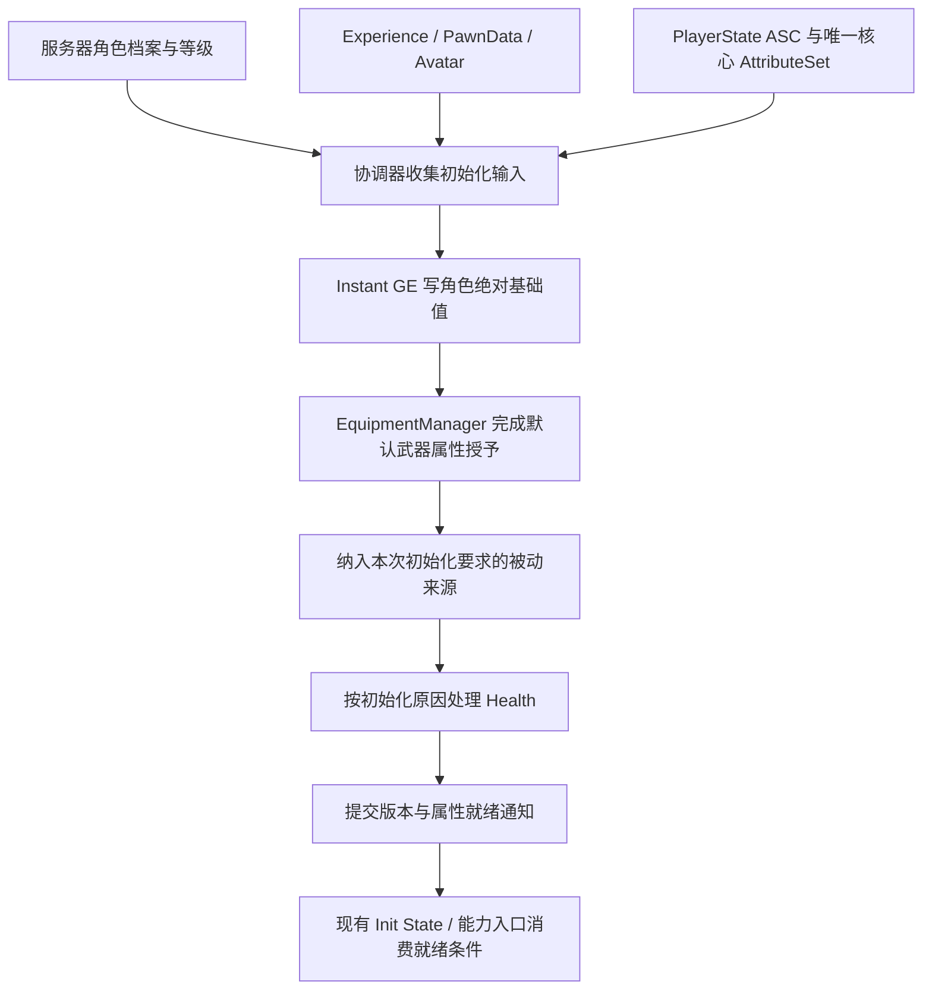

# 角色属性初始化、等级成长与装备加成设计

> 日期：2026-10-06。状态：**用户已批准设计，首版已实现；具体验证范围见第 13 节**。
>
> 第 1～12 节保留原设计依据和审阅条款；用户已授权按本稿开始实现。实际类型、资产、API 与尚未完成部分在第 13 节说明，不将原设计中的扩展目标自动算作实现。

[项目文档目录](../README.md) · [知识库](../KnowledgeBase/README.md) · [现有装备表现](weapon-presentation.md)

## 1. 核心方案与优先审阅项

采用三层职责：**角色成长决定基础值；装备/Buff 通过可撤销 GE 提供加成；出生、重生等操作单独处理当前资源**。CDO 保留安全默认值，不作为角色等级成长的最终数据来源。

建议规则，供本次审阅：

1. 角色成长用 Instant GE 写绝对 BaseValue；装备属性用非周期 Infinite GE，不用常驻 Override 覆盖角色基础上限。
2. 首次出生和明确重生在默认装备属性生效后补满；升级默认保持血量比例；换装保留当前血量并夹取上限。**升级是否补满仍由用户决定**。
3. 使用 PlayerState 持有的独立 UObject 协调属性，不为此新增 Pawn 常驻组件或业务模块。
4. 首版只接现有 MaxHealth、BaseDamage 与 Health 资源策略；保留当前属性名，防御、暴击及复杂百分比公式后续扩展。
5. 首版沿用一个玩家 PlayerState ASC，不实现多角色切换玩法、完整库存、后端存档或敌人 ASC；职责为这些扩展留入口。

## 2. 已核实的项目现状

- [PlayerState](../../Source/Hodgepodge/Private/Core/PlayState/HodgePlayerState.cpp) 创建玩家 ASC、HealthSet、CombatSet；玩家 ASC 所有权不随当前 Pawn 转移。
- HealthSet 构造默认 Health/MaxHealth 为 100；CombatSet 的 BaseDamage/BaseHeal 默认 0。
- PlayerState.SetPawnData 在服务器遍历 AbilitySets 授予技能、GE、额外 AttributeSet，当前没有保存完整 PawnData 来源撤销句柄。
- [AbilitySet](../../Source/Hodgepodge/Private/Data/HodgeAbilitySet.cpp) 已能 ApplyGameplayEffectToSelf，但 EffectLevel 是配置值，不是自动绑定的角色/武器等级。
- [角色 ASC 就绪回调](../../Source/Hodgepodge/Private/Character/HodgeCombatCharacter.cpp) 先初始化 HealthComponent，再调用 InitializeDefaultEquipment。
- [HealthComponent](../../Source/Hodgepodge/Private/Component/HodgeHealthComponent.cpp) 在绑定时直接将 Health BaseValue 写成当时的 MaxHealth；该方法内未把客户端监听和服务器资源初始化分开。
- [HealthSet](../../Source/Hodgepodge/Private/AbilitySystem/AttributeSet/HodgeHealthSet.cpp) 在 MaxHealth 下降时夹取过高 Health；上限增加时不会自动补满或保持比例。
- EquipmentManager 已保存装备 GrantedHandles，卸装时可针对原授予 ASC 精确撤销。
- 默认武器通过 PawnData.DefaultWeaponDefinition 和 Experience 注入的 EquipmentManager 装备；武器 Actor 的显示与属性来源是不同职责。

因此有一个明确顺序风险：如果默认武器增加 MaxHealth，在它生效前补血，出生 Health 可能低于最终上限。不能依靠多个初始化回调恰好按某种先后执行来保证属性正确。

另需在实施时核对 HealthComponent 初始化的 MaxHealth 广播：当前传入了 Health，而不是 MaxHealth。此项与通知链整理一起处理，不在本次文档任务中修复。

## 3. GAS 语义与方案边界

### 3.1 BaseValue 与 CurrentValue

- BaseValue 是角色当前等级/突破所提供的固有属性基础。
- CurrentValue 是 GAS 在基础上叠加装备、Buff 等活动效果后的值，战斗使用它。
- Health 是当前资源状态。它不因为角色基础属性重算而自动补满，也不由武器属性 GE 直接授予。

例如，角色基础 MaxHealth=100，装备加成=50，则最终 MaxHealth=150。不能把最终 150 又写回角色基础，否则会重复包含装备贡献。

### 3.2 GE 分类

- **角色基础 GE：Instant + Override**，写入本次计算的绝对基础值。升级时再次写入新值，不累计“每级增量”。Instant GE 不作为可卸载的活动效果长期保留；切换基础来源要重写受控字段，不能指望移除句柄撤销过去的基础写入。
- **装备属性 GE：Infinite，无 Period**，为共享属性提供加成，按装备来源保存句柄，卸装时撤销。
- **Buff GE：HasDuration 或 Infinite**，由其业务来源管理生命周期。
- **治疗/伤害 GE：Instant 或明确设计的周期执行**，经过现有 Damage/Healing 元属性结算。

普通非周期 Infinite Modifier 不执行一次性 Healing 结算。Healing 在本项目的 PostGameplayEffectExecute 中被消费，不能将它塞进普通 Infinite GE 就当作“应用时补满一次”。

Health 的 HideFromModifiers 是配置入口限制，不是运行时禁止写入；初始化可以由明确授权的 ASC 资源入口设置 Health，不必模拟一次普通治疗或触发治疗表现。

本机 UE 5.5 的 GameplayEffectAggregator 在同一计算通道有有效 Override 时直接返回覆盖值，可能绕过该通道的 Additive/倍率计算。射击靶的常驻 MaxHealth Override 不直接作为本方案的通用成长模型。

参考：[Epic 属性语义](https://dev.epicgames.com/documentation/unreal-engine/gameplay-attributes-and-attribute-sets-for-the-gameplay-ability-system-in-unreal-engine)、[GE 生命周期](https://dev.epicgames.com/documentation/unreal-engine/gameplay-effects-for-the-gameplay-ability-system-in-unreal-engine)。实现细节以本机 UE 5.5.4 源码为准，不升级引擎。

## 4. 数据与运行时职责

### 4.1 角色成长配置：拟议 UHodgeCharacterStatProfile

不可变 DataAsset，由 PawnData 新增的配置引用关联。首版描述：

- 合法等级范围和配置版本。
- MaxHealth、BaseDamage 的 FScalableFloat/CurveTable 成长曲线，或明确的常量值。
- 基础属性初始化 GE 类型及资源策略配置。
- 将来扩展突破、职业等修正时明确公式，不隐式改变装备加成。

曲线输入是角色等级。首版未实现突破玩法；突破字段/公式属于扩展契约，不假装已有完整系统。对所有受控基础字段写绝对值，包括合法的零值，避免角色基础来源切换后残留旧值。

数据校验要求等级范围合理、曲线引用有效、输出有限、MaxHealth>0、BaseDamage>=0。必需配置缺失时报告错误，不静默将 CDO 默认值当作已完成成长初始化。

### 4.2 角色运行状态

由 PlayerState 持有或关联角色档案：角色实例身份、成长配置标识、角色等级、状态版本。经验与突破可在后续成长玩法中加入。

角色等级、武器等级、技能等级是三个概念。更新 PlayerState 的等级字段不等于更新旧 GE Spec.Level，也不等于重授所有技能。

档案由存档/后端恢复后作为服务器输入。PlayerState 是本局运行和复制宿主，不等于永久存档；将来持久化保存角色/武器来源数据，不保存 Actor 指针、活动 GE 句柄或混入装备/Buff 的最终基础值。

### 4.3 武器数据与装备层

静态 EquipmentDefinition 继续使用当前 UObject/蓝图类形式，不为属性方案改掉继承或资产类型。拟议新增武器属性配置引用，描述等级曲线、初始加成和属性 GE。

动态武器记录保存实例 ID、定义标识、武器等级及将来支持的词条。没有库存系统时可由角色档案保存这条记录，创建 WeaponInstance 时传入；不能只把持久武器等级放在 Pawn 所属实例里。

WeaponInstance 提供动态参数，EquipmentManager 保持装备授予/撤销职责：

- 创建属性 Spec 时传入实际武器等级或 SetByCaller 数值。
- 维护该装备实例的属性效果句柄，和已存在的技能/GE 来源账本一致。
- 升级武器只刷新该来源，不重复授予整个 AbilitySet。
- 同一来源重复初始化幂等；不同来源各自可撤销，不依赖一个全局 StackLimit=1 合并所有装备。

默认武器是否显示在手中不影响它的装备属性。隐藏、回背或消隐不卸装，也不撤销属性 GE。

### 4.4 属性协调器：拟议 UHodgeAttributeCoordinator

由 PlayerState 以 UPROPERTY 强引用持有的 UObject，首版在服务器组织流程，无 Tick，不增加角色常驻组件、不增加业务模块。它接收 PawnExtension/角色的 ASC 与 Avatar 生命周期通知，以及成长/装备变化通知。

它负责：

- 汇合档案、PawnData、ASC/核心 AttributeSet、默认装备属性完成等条件。
- 应用角色基础快照，跟踪已提交版本。
- 以明确原因处理出生、重生、读档、升级和装备变化。
- 防重复、拒绝旧 Avatar/旧版本回调，发出提交完成通知。

它不负责输入、武器模型、命中、伤害公式、经验掉落或存档 IO；不接管 EquipmentManager 的全部授予账本。

### 4.5 AttributeSet 与 HealthComponent

HealthSet/CombatSet 继续存放 GAS 数值、约束和伤害/治疗结算。PlayerState 已创建的核心 AttributeSet 每个 ASC 只保留一份；AbilitySet 校验应拒绝再授予同类核心集合。

HealthComponent 的 ASC 绑定改为监听/通知职责，不无条件补血或清掉另一个生命周期的死亡状态。资源重置与死亡状态重置只由明确的出生/重生流程触发；解绑仅清理本次绑定拥有的通知和状态来源。

保留现有 BaseDamage 名称和引用；不在首版把它顺手改成 AttackPower。DamageExecution 仍读取经装备/Buff 聚合后的现有属性。

## 5. 初始化顺序与就绪条件



就绪是逻辑条件，不采用“延迟几秒后默认已完成”：

1. 服务器已取得合法档案/等级与静态配置。
2. ASC Owner 是正确 PlayerState，当前 Avatar 身份匹配，核心集合存在且唯一。
3. 角色基础值已提交。
4. 当前默认武器的服务器属性 GE 已生效，必要被动来源已完成。
5. 当前资源策略已执行一次。

装备属性初始化只依赖 ASC/档案/PawnData，不等待最终 StatsReady，避免“属性等装备、装备又等属性”循环。也不等待客户端武器 Actor、材质或模型复制完成。

现有 ASCReady/AbilityReady 不直接等于属性就绪。实施时在现有 Init State 与需要战斗属性的能力入口增加相应就绪判断，不新增一套 Experience 加载状态机；具体挂接点需同时覆盖服务器和本地预测端。

## 6. 资源策略：按原因执行

### 首次出生与明确重生

基础和装备全部生效后，服务器将 Health 设置为最终 MaxHealth。明确重生才复位死亡状态；普通属性刷新不清死亡 Tag。

通过受控 ASC 资源入口写入，不直接改 AttributeSet 成员、不修改 CDO。需要完整通知现有 HealthComponent/界面，且不错误触发治疗 Cue/治疗消息。实施时核对 ASC 值变化委托与现有 HealthSet 自定义通知之间的桥接，避免漏通知或双广播。

### 升级：建议保持比例，待确认

提交前保存旧 Health/MaxHealth，更新角色基础值并保留装备效果，最后按旧比例乘最终新上限。示例：75/150 升到最终上限 170，得到 85/170。

如果用户希望升级补满、保持绝对值或只补增加的上限差额，应配置为明确策略，而不是由某个 MaxHealth 回调隐式决定。已死亡时保持死亡资源状态，不能因升级获得自动复活。

### 换装/装备属性变化：建议保持绝对值，待确认

保留提交前 Health，最终上限降低时夹取。装备给上限加成不自动治疗；必要的回血被动应作为独立业务效果。

例如 85/170 卸下 +50 上限武器后为 85/120；若原 Health=150，则夹到 120/120。

### 读档与重新绑定

读档先按来源重建基础和装备，再恢复保存的 Health并夹取到最终上限；死亡档案不自动补满。

同一角色的 ASC/Pawn 重绑定、重复 Init State 通知和只换外观不视为重生，不再次满血。多角色切换将来应恢复各角色自己的资源记录，不能通过反复切换刷满血；首版不实现该玩法。

## 7. 属性更新、来源账本与事务边界

### 7.1 基础成长

角色升级：确认新等级 → 按 Profile 计算全量基础快照 → 用 Instant GE 重写受控 BaseValue → 应用本次资源策略 → 提交版本。

不重新调用整个 AbilitySet.GiveToAbilitySystem，否则可能重复授予技能、集合和被动 GE。也不把含装备贡献的 CurrentValue 作为下一次成长基础。

### 7.2 装备成长

装备升级优先更新指定活动 GE 的等级或 SetByCaller 参数；只有确需替换时才对该来源受控替换。不得运行时改 GE 资产/CDO，也不得移除所有活动 GE 来重建装备。

现有装备 GrantedHandles 与新增属性句柄的所有权须一致：旧句柄被替换后从来源账本移除，卸装只能撤销仍有效的本装备句柄。主动刷新、取消和装备卸载不能互相留下重复属性效果。

### 7.3 MaxHealth 中间变化

不能简单“卸全部加成 → 写基础 → 重装全部加成”：中间较低上限会使现有 HealthSet 提前夹血，或产生重复通知。

协调器应捕获旧资源快照，在更新期间区分正式伤害/治疗与上限重算。MaxHealth 引发的资源调整在提交最终上限时统一处理；普通伤害/治疗仍走现有即时结算，不被静默吞掉。

这需要 AttributeSet/通知链的明确配合，不声称一个 GAS batch scope 自动提供完整事务。若发生重入的真实资源变动，应合并其结果或终止/重试本次刷新，不能用旧快照覆盖已经发生的伤害。失败时不发 Ready、不补满、不遗留部分重复来源；回滚/重算按已知来源执行，不靠修改 CDO 恢复。

## 8. 身份、幂等与生命周期

至少区分三种身份：

- 基础身份：角色实例、配置版本、等级/成长版本，用于判断基础值是否需重算。
- 生命身份：当前 Avatar 和 LifeGeneration，用于判断出生资源策略是否已经执行。
- 来源身份：装备实例 ID 与属性版本，用于指定来源刷新/撤销。

同一输入版本重复调用无额外作用；不同生命实例可按明确 SpawnReason 重置资源。升级不能伪装成新的出生，重复回调不能重复叠 GE。

解绑、换 Pawn、注销或卸载时，取消旧的待处理工作；后续回调先核对 ASC、当前 Avatar 和版本，不得把旧装备/旧档案结果提交给新身体。Pawn 特有装备效果正常撤销，PlayerState 的角色等级/基础来源不因旧 Pawn 销毁而丢失。

## 9. 服务器与客户端

服务器负责选择合法角色/武器数据、计算基础与装备参数、应用/撤销 GE 和执行资源策略。客户端接收等级/状态和 GAS 属性复制，绑定监听并展示；不再因 HealthComponent 绑定而自己补满。

协调器首版为服务器本地 UObject，无需为了客户端 UI 将整个协调器做成复制子对象。必要的就绪/版本摘要通过 PlayerState/已有复制入口提供，并关联当前 Avatar/生命身份。

Ready 表示服务器已提交，不保证所有 GAS 属性、GE 或 Actor 引用同包到达。客户端须核对当前 Avatar 和必需集合，持续消费属性通知；不得用一次 Ready OnRep 假装拿到了原子完整快照。服务器的能力校验继续作为最终约束，预测拒绝沿用现有 GAS 恢复流程。

## 10. 首版范围与实施安排

以下为审阅后的拟议实施顺序，本次不执行：

1. 添加角色 Profile、最小等级运行状态和协调器；使用现有 Health/Combat 属性，不扩展完整数值体系。
2. 为基础 Instant GE 和默认武器非周期 Infinite GE 建立明确参数化路径。
3. 将 HealthComponent 的绑定、出生资源设置和通知分开，接默认装备完成条件；补核心集合防重复与幂等。
4. 迁移正式 PawnData/默认剑配置，核对现有 AbilitySets 是否已经对同一基础属性施加效果，防双重来源。
5. 更新受影响的测试夹具，使其明确提供常量配置/初始化原因；必需 Profile 缺失不静默沿用 CDO。
6. 执行 Editor/Game 常规构建、原生测试、资产校验、单人及双人 PIE，记录结果后再宣称实现完成。

拟议类型保持 Hodge 命名、Public/Private 对应、单类主 cpp；不把协调器按初始化/成长/资源再拆成多个同类 cpp。Profile 放 Data；协调器放 AbilitySystem 的独立子目录；装备属性逻辑在现有 Equipment 类中扩展。

新资产路径和具体类型/字段名在实现前核对并定稿。本次不创建 GE/DataAsset、不修改 Source/Config、不要求用户配置尚不存在的字段。

## 11. 验收用例（尚未执行）

- [ ] 角色基础上限 100、武器 +50 时首次出生为 150/150，不是 100/150。
- [ ] 相同初始化通知多次触发，GE/技能/集合数量不增长，Health 不再次补满。
- [ ] 核心 HealthSet/CombatSet 各一份，重复授予会被阻止或明确报错。
- [ ] 等级 1→2 更新绝对基础值，装备效果保留，BaseDamage 被现有伤害 Execution 正确读取。
- [ ] 升级、换装、上限降低、真实伤害重入符合选定策略，无中间夹血造成的永久损失。
- [ ] 武器升级只刷新该实例；卸装、再次装备及默认装备迟到不叠加、不漏撤销。
- [ ] Health/MaxHealth 通知数值和时序正确，客户端不在绑定时局部补血。
- [ ] 死亡角色升级/换装不复活；明确重生完成装备后补满。
- [ ] 同 ASC 换 Pawn、旧回调迟到及重复解绑不覆盖新身体、不丢角色成长记录。
- [ ] 数据缺失/曲线非法/装备失败不发布 Ready，也不留下部分重复效果。
- [ ] 单人、Listen Server 拥有者/模拟代理和延迟场景验证；其他网络/打包模式分别记录。

## 12. 审阅决策与后续记录

以下原审阅条款已按用户“先按着这个设计文档开始做”的指示接受，首版采用推荐策略：

- 升级血量策略：本稿建议保持比例，是否改为补满或保持绝对值？
- 换装策略：本稿建议保留绝对 Health、下降夹取，不自动治疗，是否符合玩法？
- 首版属性：仅 MaxHealth/BaseDamage，是否必须同步加入其他具体属性？
- 数据组织：曲线/表驱动基础、档案存等级/武器来源、装备用独立可撤销效果，是否接受？
- 首版边界：先做玩家和默认武器，不同时引入库存、多角色切换、完整存档后端，是否接受？

首版采用升级保持比例、装备变化保持绝对值、出生/明确重生补满，范围为 MaxHealth/BaseDamage 与资源策略；未扩展库存、突破、经验玩法、多角色或存档后端。

原设计阶段仅进行文档验证；以下记录实际实施结果。本次未自动提交。

## 13. 首版实际实现与验证

### 13.1 已实现的类型与入口

- PlayerState 持有 UHodgeAttributeCoordinator 默认 UObject 子对象、角色 ID/等级、就绪版本和装备实例 ID/等级记录；没有新 Pawn 常驻组件或额外业务模块。
- UHodgeCharacterStatProfile、UHodgeEquipmentStatProfile 保存曲线与严格的 GE 契约；角色使用 UHodgeCharacterBaseStatEffect 的 Instant Override，装备用 UHodgeEquipmentStatEffect 的非周期 Infinite Additive。
- SetByCaller.Stat.MaxHealth/BaseDamage 参数按真实角色/装备等级计算。装备活动效果用公开更新 API 刷新，不修改资产/CDO或私自改活动 Spec；外部移除句柄后可受控重建该来源。
- PawnData.StatProfile、EquipmentDefinition.StatProfile 已创建并接正式资产。Profile 与两种 GE 的有效性、合法等级和有限曲线输出会被校验。
- HealthComponent 绑定不补血、不清共享死亡状态，MaxHealth 初始通知参数已修正；数值提交由服务器协调器完成。
- HealthSet 在重算期间延后上限夹取，记录实际资源执行变化与是否归零；GE 执行快照使用栈，防重入覆盖。真实伤害/治疗不会被旧资源快照覆盖。
- 默认装备/属性准备失败不发布就绪；能力入口和 Hero GameplayReady 消费就绪条件。重复初始化、重复装备身份及同等级刷新幂等；能力可以按 bRequiresInitializedAttributes 选择是否依赖该条件，Definition 默认开启。
- GameMode.RestartPlayer 明确提示重生原因；普通 Avatar 重绑定保存当前资源。解绑在装备撤销前保存资源，旧 Avatar 不继续升级。装备变更有重入保护及延后卸载清理。
- AbilitySet 不再重复添加已存在的核心 HealthSet/CombatSet。

实际 API 与曲线说明见 [CharacterStats README](../../Content/Main/Data/CharacterStats/README.md)。InitializeCharacterProgression 只接受首次绑定前的输入；当前无后端/异步档案提供者时以开发默认一级启动，未来接异步档案需将“档案已到达”加入调用方的初始化前置条件。

RestoreCharacterHealth 是服务器资源恢复入口，不是治疗/复活 API。死亡事件 GA 仍属迁移清单的独立待办，不将只恢复 Health=0 宣称为完整死亡存档流程。

### 13.2 资产与示例数值

正式 CT_Pover_Growth、CT_Sword_Growth、DA_Pover_Stats、DA_Sword_Stats 当前位于 `/Game/Main/Data/CharacterStats/`；测试 DA_Test_Stats 保留在 `/Game/CodexText/CharacterStats/`。

正式角色基础一级 100/20、二级 120/22；剑一级 +50/+10、二级 +60/+12。数字用于验收，可由曲线调整。默认角色一级实际 Health/MaxHealth/BaseDamage=150/150/30；受伤到 75 后角色二级为 85/170/32；剑升级后 85/180/34。

正式 PawnData 和 BP_Equipment_Sword 已引用相应 Profile；三份命中夹具 PawnData 使用常量测试 Profile。相关蓝图重编译并保存；新/修改资产校验记录 18 条均 VALID、无校验错误/警告，其中同名回退路径解析到正式 PawnData，计数含该别名重复。

### 13.3 常规构建与原生测试

最终 Editor 与 Game Win64 Development 构建退出码均为 0，命令级关闭 UBA、单并行执行，不修改项目构建设置：

```powershell
& 'E:/UE/UE_5.5/Engine/Build/BatchFiles/Build.bat' HodgepodgeEditor Win64 Development '-Project=E:/Project/Git/Hodgepodge/Hodgepodge.uproject' -WaitMutex -architecture=x64 -NoHotReloadFromIDE -NoUBA -NoUBALocal -MaxParallelActions=1
& 'E:/UE/UE_5.5/Engine/Build/BatchFiles/Build.bat' Hodgepodge Win64 Development '-Project=E:/Project/Git/Hodgepodge/Hodgepodge.uproject' -WaitMutex -architecture=x64 -NoUBA -NoUBALocal -MaxParallelActions=1
& 'E:/UE/UE_5.5/Engine/Binaries/Win64/UnrealEditor-Cmd.exe' 'E:/Project/Git/Hodgepodge/Hodgepodge.uproject' -unattended -NullRHI -nosplash '-ExecCmds=Automation RunTests Hodge.Attributes' '-TestExit=Automation Test Queue Empty'
```

Hodge.Attributes 的 ProfileValidation、GrowthEquipmentLifecycle、ReentryAndFailure、AvatarAndBootstrapFailure 四项最终 Success，0 error；10 条 warning 为既有 Cue 路径配置和初始化/ActorInfo 诊断信息。覆盖出生含默认武器、等级比例、装备刷新/卸装、幂等、真实伤害重入、死亡不复活、初始化失败/重试、重绑定与明确重生。

分别运行 Hodge.Combo（5）、Hodge.Combat（5）、Hodge.Rotation（1）、Hodge.WeaponPresentation（2）、Hodge.Timeline（6），19 项全部 Success。完整 Hodge 前缀的 headless 运行在既有 Hodge.Editor.DefinitionWorkflow 关闭 Slate 窗口时触发 GenericWindow 异常，进程退出 3；未计为通过，也未修改不相关编辑器测试以掩盖该限制。此次仅列相关原生分组的独立最终结果。

早期编译有失败标签名、重入快照局部变量名和变量遮蔽错误，已修正；第一轮属性测试夹具未给 PawnExtension 提供 PawnData 导致 ensure，已修正并增加失败/重试用例。第一次曲线导入脚本读取受保护的 Result 属性失败，改为 GetObjects 后成功；未将这些初始记录计为通过。

### 13.4 PIE 与未验证项

- 正式地图单人 PIE：298 条记录通过出生、受伤、角色升级、武器升级、同等级幂等与属性就绪后的真实攻击输入；数值符合上述示例，攻击蒙太奇和武器表现继续运行。
- 两玩家 Listen Server +100ms：716 条记录，两个权威角色、自治客户端和模拟代理最终均为等级 2、Health=85、MaxHealth=180、Ready=true；延迟已恢复 0。
- 尚未执行 Cook/打包、独立进程、Dedicated Server、完整死亡 GA/重生玩法、异步档案、相关性重新进入、复杂 Buff/百分比公式与完整换装库存回归。明确重生的资源分支和重绑定由原生用例覆盖，不把它们描述为完整死亡复活玩法已通过。
- 正式五段 HitWindows 仍为空；本次未接正式伤害窗口，也未改 DefaultSlot、动画、连段或旋转配置。

修改前备份：E:/Project/Backups/Hodgepodge/AttributeGrowth/20261006-131409。原始构建、资产、自动化与 PIE 记录在 Saved/AttributeGrowth，不纳入源码。保持用户已有文档改动，未自动暂存/提交。
