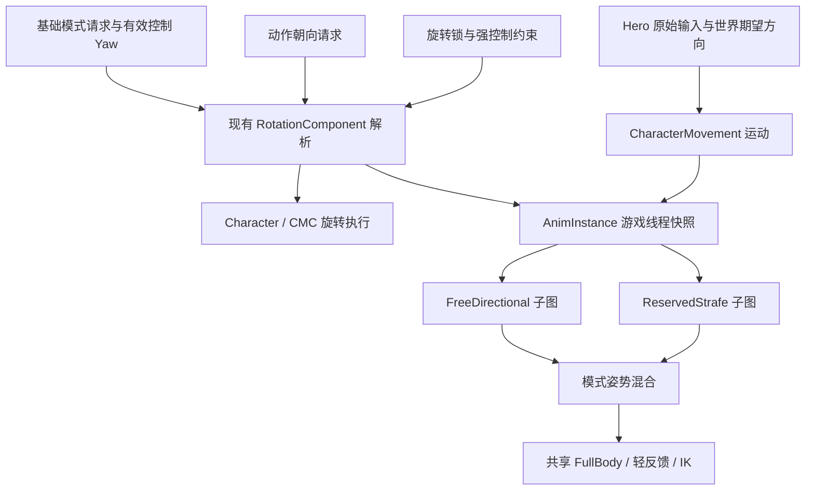
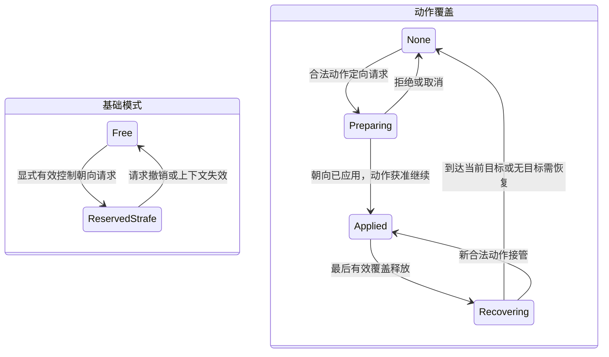
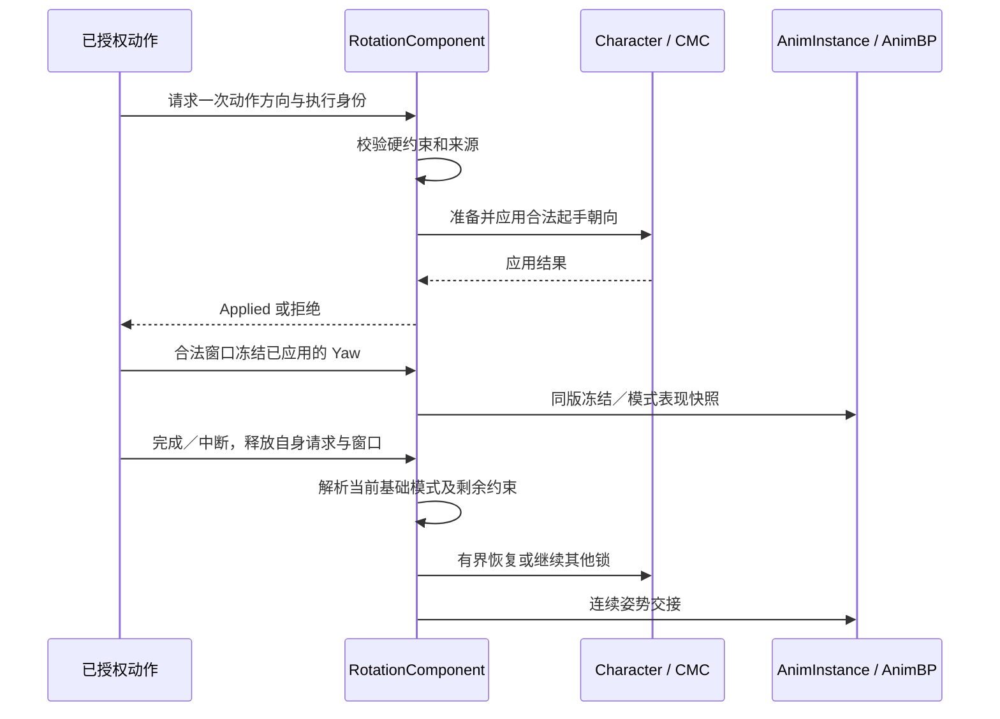

# 角色旋转与移动动画模式调整设计

日期：2026-10-09。版本：1.0。适用 Hodgepodge、UE 5.5.4 与现有 Hodgepodge Runtime 模块。

**状态：核心模式、旋转请求、输入快照、动画隔离与移动预测已实施。** 当前 API 及实际配置以[接口指南](../Guides/character-facing-configuration.md)为准，构建／测试及边界见[验证报告](../Validation/character-facing-implementation-2026-10-10.md)。正文保留设计契约和待决项，拟议名称不必与落地 API 一一相同；完整锁定目标服务和锁定 CameraMode 仍不在本轮范围。

关联文档：[既有旋转约束与历史实施记录](character-rotation-policy.md)、[Dash／Sprint 设计](dash-sprint-system.md)、[攻击配置手册](../Guides/attack-ability-configuration.md)、[受击配置手册](../Guides/hit-reaction-configuration.md)、[网络动画审查](../Validation/animation-network-review-2026-10-09.md)、[Main 动画说明](../../Content/Main/Character/Hero/Anim/README.md)。

阅读建议：第 1～3 节用于范围与概念评审；第 4～7 节用于旋转和动画方案；第 8～11 节用于接口、异常与联机实现；第 12～13 节用于实施验收与待决事项。

## 1. 设计目标、背景与适用场景

### 1.1 背景

正式主角目前已开启 OrientRotationToMovement，并关闭 UseControllerRotationYaw。常规角色朝向由移动组件驱动，镜头可以独立转动。此前动画图中的方向移动、RootYawOffset 和 TurnInPlace 逻辑仍保留，两个旋转开关不会自动移除这些动画功能。

本次讨论决定保留原八向移动，不直接删除；自由移动使用前向移动与转身，方向移动分支隔离后供未来锁定功能使用。Dash 等定向动作使用自身动作朝向，不能因八向移动分支存在就强制使用八向动作资源。

现有 AM_Move_F／AM_Move_B 的资源约束只影响对应动作的方向与姿势选择，不要求重写原始移动意图、GAS、伤害、装备或角色初始化。本文只讨论它们与角色旋转的接口，不设计完整 Dash 执行或体力系统。

### 1.2 目标

1. 自由移动时角色朝有效移动方向，静止转镜头不强制角色转身。
2. 原八向移动图和资源保留、隔离，未来可在控制朝向有效时进入侧移／后退移动。
3. 基础模式、动作朝向覆盖和强旋转约束独立表达，避免多个系统竞争写入 Yaw 开关。
4. 攻击、受击、取消及动作结束后恢复当前有效模式，保持胶囊与模型表现连续。
5. 保留原始输入与移动取消契约；真实运动方向不被动画资源选择篡改。
6. 动态模式切换覆盖拥有者预测、服务器验证、观察者表现和移动回放。
7. 沿用现有 RotationComponent、Character、CMC、AnimInstance 与固定动画层，不新增业务 Runtime 模块或重复的旋转管理器。

### 1.3 适用场景

- 常规前向移动、起停、方向改变和自由镜头操作。
- 未来外部系统请求固定控制朝向时的八向移动适配。
- 攻击起手定向、通知窗口锁 Yaw、后摇取消及恢复。
- 强受击、击退／挑飞结束后的朝向和移动姿势恢复。
- Dash 等短动作暂时取得朝向控制权，结束后释放。
- 重复绑定、换 Pawn、死亡、网络校正和复制乱序。

## 2. 现有基础与范围边界

### 2.1 已核实基础

本节引用 2026-10-09 上一轮正式资产只读审查及本次源码检查，不把旧验证视为本方案已通过。

- 主角 `/Game/Main/Character/Hero/BP_Hero_Pover`：ControllerYaw=False、OrientToMovement=True、UseControllerDesiredRotation=False；普通速度 420cm/s，旋转速率 Yaw=720°/s。数值是当时资产值，不是所有 Pawn 的强制基线。
- 主图 `/Game/Main/Character/Hero/Anim/ABP_Pover_Base`：EnablePivot=False、bEnableRootYawOffset=True，父类仍为 HodgeAnimInstance。
- 固定层 `/Game/Main/Character/Hero/Anim/Layer/ABP_Pover_LocomotionBase` 保留前后左右移动／Stop 资源及 OrientationWarping 节点。
- Cycle 使用 LocalVelocityDirectionNoOffset，Stop 使用 LocalVelocityDirection；部分方向包含 RootYawOffset 修正。
- [HeroComponent](../../Source/Hodgepodge/Public/Component/HodgeHeroComponent.h) 保存原始二维输入，提供 HasMoveIntent、GetMoveIntent 与布尔意图事件；Input_Move 按 Controller 水平 Yaw 生成世界移动输入。
- [RotationComponent](../../Source/Hodgepodge/Public/Component/HodgeCharacterRotationComponent.h) 已有锁定、恢复、复制及 SavedMove 回放接口，尚无本方案完整的模式／请求解析。
- [CharacterMovement](../../Source/Hodgepodge/Private/Component/HodgeCharacterMovementComponent.cpp) 已约束 PhysicsRotation 和最终移动 Yaw，SavedMove 保留旋转状态与受击控制。
- [CombatCharacter](../../Source/Hodgepodge/Private/Character/HodgeCombatCharacter.cpp) 的 FaceRotation 经旋转过滤；[AnimInstance](../../Source/Hodgepodge/Private/Animation/HodgeAnimInstance.cpp) 已缓存 FullBody、旋转锁和恢复相关表现值。
- [CameraComponent](../../Source/Hodgepodge/Private/Camera/HodgeCameraComponent.cpp) 从 CameraModeView.ControlRotation 更新 PlayerController。该控制旋转写入链本次不重构。
- 玩家 ASC 仍由 PlayerState 持有，Pawn 为 Avatar，初始化／解绑继续经过 PawnExtension。已有攻击取消与受击系统不被本方案替换。

### 2.2 本轮包含

包含基础朝向模式、动作请求与锁的组合规则；旋转组件接口；自由／预留八向动画分支；方向数据与动画快照；模式切换／恢复；相关网络与生命周期契约；实施与验收要求。

八向分支是可维护的预留能力。开发验证可以由测试入口提供合法模式请求和控制 Yaw，不需要制作一个临时产品锁定系统。

### 2.3 明确不包含

**完整锁定目标服务：不设计或实现敌人搜索、候选评分、目标切换、目标保持、距离／遮挡判定、目标死亡规则、锁定 UI 或目标 Actor 复制协议。**

**锁定 CameraMode：不设计或实现镜头吸附算法、目标构图、镜头碰撞适配、双目标取景、锁定镜头输入限制或相机跟踪平滑。**

还不包含完整 Dash／Sprint GA、共享体力、无敌／完美闪避、攻击吸附、空中追击、动画素材制作和全局时间膨胀。对应功能另行设计；本篇仅限定它们能怎样请求或释放旋转控制。

本方案消费有效控制 Yaw，不计算“玩家到敌人的目标角度”。未来调用方负责提供正确控制朝向；打开 ControllerYaw 本身不能证明已面向敌人。

## 3. 概念与术语

### 3.1 四类方向

- 原始移动输入 RawInput2D：玩家二维操作量，X=左右、Y=前后，沿用现有镜头／控制相对语义。
- 世界期望方向 DesiredMoveDirectionWorld：按本次输入采样的控制 Yaw 转成世界水平方向。
- 角色朝向 ActorYaw：胶囊及角色 Actor 的真实世界 Yaw，供运动、命中锚点和规则使用。
- 实际速度方向 VelocityDirectionWorld：运动结果；制动、撞墙、受击时可能不同于输入与 ActorYaw。

UE 5.5 的 OrientRotationToMovement 主要朝加速度或 AI 请求方向旋转，不保证每一帧都等于实际速度方向。反向输入时不应强制删掉真实局部速度的 Backward／Left／Right 数据。

### 3.2 控制与视觉方向

ControlYaw 是 Controller 的水平角度；VisualViewRotation 是镜头最终视觉旋转。二者在当前普通相机中通常关联，概念上必须区分。

UseControllerRotationYaw=True 表示 Actor 跟随控制 Yaw，不代表目标追踪或平滑已实现，也不保证模型因 RootYawOffset 而产生的偏移为零。CMC RotationRate 不能单独保证 FaceRotation 路径平滑。

RootYawOffset 是模型程序性朝向补偿，不是第二个 Gameplay 朝向。TurnInPlace 是静止脚步转身表现；Pivot 是运动中方向反转／大角度变向表现，两者不是同一状态。

### 3.3 三个独立维度

**基础朝向模式 BaseFacingMode**：正常状态使用哪个驱动，首版为 MovementFacing 或 ControllerFacing。

**基础移动动画风格 BaseLocomotionStyle**：FreeDirectional 或 ReservedStrafe。ReservedStrafe 就是保留给未来锁定的八向表现；名称不表示已经具备目标锁定功能。

**临时覆盖与约束**：动作可请求固定方向；攻击／受击等可冻结 Yaw；恢复状态控制从当前姿势回到当前有效驱动的速率。

未来锁定状态由外部系统拥有，不能用一个 bIsLockedOn 同时承载目标、相机、动作、旋转和动画权限。临时动作存在时，基础风格仍可保留，最终可见动作由 FullBody 权重覆盖。

### 3.4 八向移动与资源

八向移动描述前进、后退、侧移及斜向移动的表现能力，不等于必须有八个独立序列。当前图有四个基础方向及 Warping 节点，应作为完整分支保留。

隔离指按模式选择入口并保留资源、函数、状态出口及维护责任；不是断线后留下无法验证的图，也不是复制第二个主 AnimInstance。

## 4. 关键决策与整体架构

### 4.1 单一策略解析入口

在现有 UHodgeCharacterRotationComponent 内扩展模式与动作请求解析。组件只决定有效朝向、约束及恢复信息；Character／CMC 执行实际旋转，AnimInstance 消费只读表现。

GA 和外部调用方不分别保存并恢复 UseControllerRotationYaw／OrientRotationToMovement。参数开关只是有效模式的执行结果，不作为多个系统共享修改的状态来源。

先解析不可绕过的冻结／强控制约束，再解析合法动作请求，最后解析基础驱动。动作较高优先级不能解除别人的强受击锁。相同优先级按明确来源规则和接受序号决胜，不按容器遍历顺序决胜。

### 4.2 基础模式的映射

MovementFacing：ControllerYaw=False、OrientToMovement=True、UseControllerDesiredRotation=False；搭配 FreeDirectional。无有效移动方向时保留当前朝向，相机 Look 继续工作。

ControllerFacing：ControllerYaw=True、OrientToMovement=False、UseControllerDesiredRotation=False；搭配 ReservedStrafe。控制朝向必须有效，由外部上下文／现有 Controller 提供；进入及恢复由旋转组件限速。

模式与风格作为一次决议一起更新，避免动画先侧移、胶囊仍朝移动方向转。当前正式默认仍为 MovementFacing；未有有效调用方时不会自动启用产品锁定行为。

### 4.3 动作覆盖

动作请求使用一次性的世界方向或固定 Yaw，记录来源执行 ID。应用动作起手朝向后，可以按合法窗口冻结；动作结束仅释放自身请求，再解析当前基础模式。

动作期间基础模式改变，也不会突破仍有效的动作约束。释放后恢复最新模式，而不是恢复动作开始前缓存的开关。

Dash 只在此作为接口示例：任意方向前冲可以暂时取得朝向控制权，FullBody 覆盖底层移动姿势；外部镜头行为不由本组件修改。保持面向控制方向的后撤需不同动作朝向契约，不能仅凭 AM_Move_B 名称推断。

### 4.4 共享动画与数据

保留一个主 AnimInstance 和当前固定移动层。共同输入为速度、加速度、地面、ActorYaw、FullBody 权重及解析后的模式快照；Free／ReservedStrafe 分支只各自负责姿势选择和适配。

图中的基础模式请求是消费边界，不包含目标选择或锁定相机实现。

## 5. 核心模块与职责

### 5.1 UHodgeHeroComponent

继续采集 RawInput2D、HasMoveIntent 和 GetMoveIntent，保持在 Gameplay 移动限制之前记录意图。补充有明确坐标空间的世界方向快照或查询，不将 RawInput2D 的 Y 偷改成角色前方。

OnMoveIntentChanged 保持布尔翻转事件。持续方向变化使用快照读取或单独方向事件；按住 W→D 时不假定原布尔事件一定触发。Completed／Canceled、UI 输入取消和解绑清理自己的输入记录。

### 5.2 UHodgeCharacterRotationComponent

持有基础模式请求、动作请求、冻结约束和恢复状态；解析当前有效驱动；校验执行／Avatar 身份；维护模式变化与必要复制状态；提供回放及动画快照。

不负责位移、费用、敌人选择、相机控制旋转写入、攻击调度或伤害。现有 Tag 锁按计数继续生效，解绑不删除其他来源的 ASC 状态。

### 5.3 AHodgeCombatCharacter 与 UHodgeCharacterMovementComponent

Character 的 FaceRotation 是 ControllerFacing 的执行适配；CMC 的 PhysicsRotation 是 MovementFacing 的执行适配。动作起手朝向使用明确的受控执行入口；需要扩展 CMC 的动作驱动分支时，不能假定两个普通旋转开关都为 False 后 Super 仍会转向。

CMC 保持最终 MoveUpdatedComponentImpl 的锁定校验、碰撞、根运动及网络校正。Root Motion 默认不因普通模式自动获得额外物理转向；动作自身的起手定向与冻结必须明确。

模拟代理使用服务器运动结果与平滑，不能运行独立的本地目标朝向算法覆盖权威 Transform。

### 5.4 UHodgeAnimInstance 与两份 AnimBP

AnimInstance 在游戏线程缓存模式、冻结／恢复、FullBody 权重等；线程安全动画更新读取该快照，不访问可变 ASC／GA／目标 UObject。

ABP_Pover_Base 保留真实局部运动计算、RootYawOffset 与共享覆盖。ABP_Pover_LocomotionBase 隔离 Free／ReservedStrafe 的 Cycle、Stop、转向表现及资源。两者使用同一有效模式与版本。

### 5.5 CombatComponent、Definition GA 与 HitReaction

保留攻击窗口、取消授权、执行身份、通知状态、Body 判定与 Impact。需要定向的动作向旋转组件提出请求，通知窗口冻结当前合法朝向，完成或中断配对释放。

攻击是否朝输入或控制方向起手属于动作策略，不能靠攻击期间提交移动输入暗中实现。受击通过已有控制约束取得优先级，结束后释放自己，不强制恢复 ControllerYaw=True。

### 5.6 PawnExtension／PlayerState ASC

继续管理当前 Avatar 初始化和解绑，保持玩家 ASC 的 PlayerState 所有权。模式请求属于 Pawn／执行，不能跨 Pawn 残留；重复初始化不重复订阅或叠加请求。

相机、GameplayCue、UI 作为已有系统保持职责：相机仍提供正常视角链，Cue 不控制 Yaw，UI 不写旋转参数。未来完整锁定接入另行设计。

## 6. 动画蓝图的隔离与修改方案

### 6.1 分支组织

在固定移动层中将现有方向选择封装为 ReservedStrafe；新增 FreeDirectional 入口。可以采用子图／函数及明确的资源选择分支，首版无需复制整个主图或运行时反复 Link 新主实例。

共用运动数据、地面／空中状态、FullBody Slot、轻反馈 Group、脚部 IK 和最终输出。图仍需维护退出路径和可验证入口，保留八向资源，不清理其 Skeleton／类型／曲线引用。

### 6.2 具体函数

主图重点：UpdateVelocityData、UpdateAccelerationData、UpdateRotationData、UpdateRootYawOffset、SetRootYawOffset、ProcessTurnYawCurve、UpdateIdleState，以及 Pivot 准入。

固定层重点：UpdateCycleAnim、SetUpStopAnim、UpdateStopAnim、SetUpPivotAnim、UpdatePivotAnim、GetDesiredPivotSequence、WantsTurnInPlaceAllowed、SetupTurnInPlaceAnim、UpdateTurnInPlaceAnim。

Free 分支优先使用适配的前向 Cycle 和停止姿势，转向由当前动作／Pivot／适量 Lean 表现。ReservedStrafe 保留方向 Cycle／Stop 和 Warping。不能只把 Cycle 强制 Forward 而让 Stop 继续旧选择。

### 6.3 真实方向与资源方向

ActorRelativeVelocityAngle 继续由真实 ActorYaw 与速度计算；VisualRelativeAngle 可在明确需要时减去 RootYawOffset。动画资源选择使用哪个空间须注明，不把真实方向变量全局写死 Forward。

现有 Cycle 的 NoOffset 与 Stop 的带偏移方向并不天然相同。本轮应明确各自空间契约、过渡期间如何保持当前姿势和脚步；统一语义不等于将全部公式强改成同一个数值。

Free 转身未完成时，局部速度可能暂时指向后方或侧方。它用于物理／转向分析，不必立即选择侧移资源；视觉分支需有转向过渡。ReservedStrafe 则正常消费此真实局部方向。

### 6.4 RootYawOffset、Turn 与 Pivot

Free：静止转镜头不产生角色转身需求；模型偏移用于有限连续性，不能作为第二套 Actor 朝向控制。

ReservedStrafe：允许脚步转身与受限偏移，避免胶囊跟随控制 Yaw 而模型长期偏到另一侧。具体角度范围与资源匹配需要美术验收，不在本篇固定数值。

FullBody／冻结／恢复：保留 bSuppressLocomotionYaw、bResetLocomotionYaw 和 LocomotionRootYawScale 的现有保护并扩展模式消费。禁止在非零可见权重时突然清 RootYawOffset；模式切换可先混出再安全重置。

Pivot 的允许与正在播放分开。当前 EnablePivot=False，不因隔离分支自动开启；若后续启用 Free Pivot，需验证地面、速度、变向夹角、重入和制动条件。ReservedStrafe 使用独立准入，不能复用所有 Free 掉头规则。

Turn 状态入口和现有左右资源先保留。仅有前后 Dash 动画不要求删除 Turn 资源；是否合并为单一 Turn 序列是独立素材决策，不作为本轮实施前提。

### 6.5 切换连续性

模式决议原子更新，姿势使用配置化混合／Inertialization，保留必要脚相位或已有同步标记。没有有效同步素材时记录缺口，不以一个 SyncGroup 名称宣称已同步。

若正在 Stop／Pivot 时切换，应完成可见姿势交接，再由目标分支接管；不能强制重置到 Idle。FullBody 动作期间基础模式可以更新，底层图按新模式准备，动作按自身权重退出。

## 7. 状态流转、恢复与时序

### 7.1 基础模式与动作约束分别流转

基础状态：Free ↔ ReservedStrafe，只有显式有效请求才切换；外部上下文失效回退 Free。

动作状态：None → Preparing → Applied → Released；冻结和恢复是可叠加的约束状态。多个来源同时存在时，释放一个不解除剩余约束。

两部分表示独立维度，不要求新建两份独立状态管理组件。Recovering 时仍需响应新的强约束。

### 7.2 模式切换

1. 校验请求来源、上下文、Avatar 与版本。
2. 更新基础模式候选，检查现有冻结／动作覆盖。
3. 得到同一版有效驱动和基础动画风格。
4. 执行器应用对应开关和恢复规则；AnimInstance 缓存同版结果。
5. 如有动作覆盖，只更新待恢复的基础模式，不突破覆盖。

进入 ControllerFacing 的大角度变化须限制角速度，不能依赖 RotationRate 自动处理 FaceRotation。退出到 MovementFacing 时无输入则保留当前朝向；有输入恢复有效运动方向，不追上一个镜头角度。

### 7.3 动作起手与窗口锁

不能先捕获旧 LockedYaw，再由 GA 另行转向；也不能尚未应用期望方向就开始依赖该方向的运动或首次命中。请求句柄创建成功不代表起手已定向，需要 Applied 状态或结果事件。

是否允许某些动作起手瞬时定向，见第 13 节；基础模式切换默认平滑。镜头和完整锁定服务均不参与本序列。

### 7.4 动作结束

先失效旧执行、禁止其后续阶段请求，再释放自己持有的旋转／通知资源；重新解析最新模式，处理恢复与动画混出。不是恢复旧布尔值、旧方向或旧目标。

基础模式在动作期间被撤销，释放动作后进入 Free；被强受击打断，动作释放不解除强受击冻结。回调按执行 ID 校验，迟到 End 不结束新执行。

## 8. 数据结构与接口契约（拟议）

### 8.1 数据结构

`EHodgeCharacterFacingDriver`：Movement、Controller、ActionDirection。Frozen 表达为约束，不成为第四套竞争驱动；对外有效状态可以注明当前被冻结。

`EHodgeLocomotionStyle`：FreeDirectional、ReservedStrafe。动作 FullBody 是覆盖，不要求为每个 GA 新增一种常规移动风格。

`FHodgeMoveIntentSnapshot`：RawInput2D、ControllerYawAtSample、DesiredDirectionWorld、InputMagnitude、SampleFrame／Time、AvatarGeneration。无输入时方向无效但幅值为零，不凭空制造 Forward 输入。

`FHodgeFacingRequest`：来源执行 ID、AvatarGeneration、请求种类、合法优先级、基础模式／风格或动作方向、阶段／接受序号。两种请求用途区分，不能客户端任意填写高优先级绕过控制。

`FHodgeFacingRequestHandle`：唯一标识和来源绑定；重复释放幂等，旧 Avatar 句柄失效。请求应持有弱生命周期身份，配置资源按 UObject／GC 规则保存。

扩展现有 `FHodgeCharacterRotationState` 或关联的解析状态：BaseDriver、EffectiveDriver、BaseLocomotionStyle、bYawLocked、LockedYaw、bRecoveringFacing、当前恢复规则、StateVersion、AvatarGeneration。回放使用当时必要状态，不从最新模式反推过去。

`FHodgeFacingPresentationSnapshot`：基础风格、有效驱动、冻结／恢复、动画准入、状态版本及 FullBody 权重。高频 Transform 不在这里重复复制；世界速度与加速度继续消费 CMC 缓存。

### 8.2 基础模式接口

`AcquireBaseFacingMode(ModeContext, SourceIdentity) -> Handle / Failure`：申请模式与对应风格，验证当前 Avatar 与有效来源；当前默认 Free，预留分支只由明确请求进入。未来上下文更新由外部调用方负责。

`ReleaseFacingRequest(Handle)`：仅释放自己的基础或动作请求，并重新解析；重复／过时释放无副作用。

`GetResolvedFacingState()`：供 Character／CMC 使用。正常、模拟代理及 SavedMove 回放读取各自正确来源。

`OnFacingStateChanged(OldState, NewState)`：本地解析通知，不自动复制。接收方核对版本，不能在 Delegate 中重新申请同一模式造成重入循环。

### 8.3 动作接口

`RequestActionFacing(WorldDirection, ExecutionIdentity) -> Handle / Failure`：有限水平单位方向，具备动作授权且没有更高约束；不接受客户端任意 Actor Transform。

`GetFacingRequestStatus(Handle)` 或 `OnActionFacingApplied(Handle, Result)`：区分 Pending、Applied、Blocked、Invalid／Expired。请求获准创建与实际应用分开；动作根据契约等待或终止，不能假设创建后即已转好。

现有通知 Tag 冻结入口继续使用。动作若需精确固定 Yaw，捕获发生在合法方向应用后；禁止调用方移除他人的 Status.Rotation.Locked／Controlled 来完成自己的准备。

### 8.4 输入与动画接口

`GetWorldMoveIntent()`／`GetMoveIntentSnapshot()`：补充明确空间，保留旧 GetMoveIntent 的原始二维语义；需要方向的调用方在决定时获取快照，不以布尔事件承担方向传输。

`GetFacingPresentationSnapshot()`：游戏线程只读查询，AnimInstance 更新后供动画线程消费。模式／风格与版本一次更新，不让主图和固定层各猜 Bool。

现有 IsYawLocked、IsRecoveringFacing、GetLockedYaw、SetMoveReplayState 等保持明确兼容；若扩展签名，先核对蓝图与测试引用。以上新增 API 名称不是当前现成编辑器字段。

### 8.5 外部集成边界

ControllerFacing 只消费现有控制器有效 Yaw。未来锁定功能负责选择目标并保证控制朝向语义；本轮接口不传目标 Actor、不检索目标、不计算目标保持与镜头行为。

由于当前相机会更新 ControlRotation，不在旋转组件另外 SetControlRotation。未来接入若改变控制旋转来源，应由其自身设计统一写入链；本篇不实现该链路。

若以后 LocomotionPolicyComponent 管理速度／步态，它可向本组件提供基础请求，但不能再直接写同一组旋转开关。朝向解析仍保持单一入口。

## 9. 边界条件与异常处理

### 9.1 输入、方向与模式

- 零输入：HasMoveIntent=False；MovementFacing 不新增转向目标，不从残余偏移或镜头角度制造转身。
- 有输入但撞墙：保留输入意图；实际速度可为零，转向／动画按其各自规则处理，不影响移动取消判断。
- 非有限方向、零方向的动作请求、无 Controller 的 ControllerFacing：拒绝请求并保持当前合法状态，或撤销失效基础请求回退 Free；记录原因。
- ±180° 附近：统一最短角差及精度阈值，避免转向方向抖动。方向切换／资源选择使用合适滞回，不反复切换动画。
- 两个普通旋转驱动同时开启：由模式解析纠正为唯一驱动并诊断来源。临时冻结下仍保持基础模式记录，不用随机布尔值恢复。

### 9.2 动作与根运动

- 现有旋转锁／受击控制：拒绝未经授权的动作改向，不靠移除 Tag 强行转身。
- 运动蒙太奇默认不启用额外物理旋转。动作使用自己的合法起手或根运动旋转策略，最终锁入口仍有效。
- 后撤素材与前冲方向不匹配：请求配置判为无效，不在动画图偷偷旋转根骨弥补错误 Gameplay 方向。
- 请求准备中被取消／死亡：立即失效结果，Applied 回调不能继续启动旧动作。
- Mode 切换发生在 FullBody 中：更新基础状态并保持当前动作，混出时再显示目标分支，不强制 Idle。

### 9.3 生命周期与系统边界

- 重复初始化：不叠加请求／订阅，读取现有约束；所有回调核对 ASC 当前 Avatar。
- Pawn 解绑／更换：撤销本 Pawn 请求、清回放与快照、解绑；不清共享 ASC 上其他来源 Tag，不把旧恢复目标带入新 Pawn。
- 预测拒绝：释放匹配预测请求，回到权威有效状态；旧请求不能覆盖新执行。
- Teleport、物理模拟、网络校正：遵循引擎／服务器 Transform，不让本地冻结阻断必要校正；按合法重置契约处理模型残余偏移。
- 缺少动画资源：编辑器验证失败；运行时使用角色合法基础姿势回退并诊断，不改变真实速度／ActorYaw 来掩盖素材缺口。

本篇不判断“目标丢失”。未来调用方撤销或使上下文失效时，本组件只负责模式回退与动作结束后的最新状态解析。

## 10. 联机与移动回放

拥有者预测合法模式／动作请求和表现；服务器验证来源、Avatar、执行授权及模式资格，发布状态版本；模拟代理使用权威状态和 CMC 平滑，不从自己的 Controller 或动画猜目标方向。

固定的 Free 蓝图配置不要求新增复制协议。动态模式切换与动作请求则必须同步必要的模式／身份，并进入既有 SavedMove；只在拥有者修改三个 Bool 不足以保证联机正确。

扩展现有 SetMoveFor／PrepMoveFor／CanCombineWith，保留已有旋转锁与受击控制字段：记录当时有效驱动、风格及必要恢复状态；跨模式／约束边界不合并移动；回放不重复产生模式请求或动作事件。

若回放应用了历史旋转开关，回放结束必须重新应用最新正常状态的开关；只清回放缓存而保留历史 Bool 会使角色长期处于错误模式。模拟代理的动画风格也不能读取拥有者专用的预测请求容器。

SavedMove 的本地字段不自动上传服务器。实施时明确压缩标志或自定义移动数据的必要序列化，并由服务器消费合法请求；不能随包传任意优先级或忽略服务器控制。

PlayerState ASC、Pawn 模式状态与移动包可能跨 Actor 不同顺序到达。使用执行身份、AvatarGeneration、状态版本和移动时点拒绝旧消息。权威接受不能仅按请求到达速度产生不同来源的竞争结果。

Actor Transform 继续由 CMC 同步，不增加逐帧 GA／Cue 旋转多播。ControllerFacing 在服务器侧不能依赖一个只有拥有者相机计算的未同步值；具体控制输入与模式请求的协议须在实施时核实，不能假定打开开关即完成网络支持。

冻结／恢复状态与动画 FullBody 复制是不同信息；观察者以实际运动和有效表现快照求值，保留现有 Owner 刷新、取消复制与蒙太奇混出语义。网络传播延迟仍存在，验收目标是减少额外空档和跳变，不承诺零延迟。

## 11. 参数与配置归属

默认基础模式／角色基线由当前 Pawn 配置确定，Main 默认 Free。普通／控制朝向恢复速率、角差完成阈值、模式混合时间、RootYawOffset 范围、Turn／Pivot 准入及素材引用分别归旋转组件配置或现有动画层配置。

首版不强制新增数据资产；多个角色需要共用配置时再集中为 Facing／Locomotion Profile。Actor 开关是解析结果，动画变量是快照输出，作者配置是不可变输入，三者不可混为同一份可随意写入的 Bool。

验证拒绝非有限参数、负速率、无效模式组合、未适配骨架资源和越界偏移。明确哪些值可为零（例如禁用混合），哪些为零意味着非法配置，避免无法结束的恢复。

现有速度 420cm/s、Yaw 速率 720°/s 及 RotationComponent 恢复配置只作基线参考。新模式的实际角速度、RootYawOffset 角度和动画混合值需按角色手感与联机采样确定，不能把记录值作为完整方案已验收。

## 12. 实施范围、顺序与验收

### 12.1 修改位置

- HodgeCharacterRotationComponent.h／主 cpp：模式、请求、恢复、生命周期及必要复制。
- HodgeCharacterMovementComponent.h／主 cpp：唯一驱动执行、最终锁、SavedMove 和必要移动数据。
- HodgeCombatCharacter 主 cpp：FaceRotation 适配与合法动作起手入口。
- HodgeHeroComponent.h／主 cpp：方向快照，保留原始意图与输入清理。
- HodgeAnimInstance.h／主 cpp：同版只读表现快照与模式化抑制。
- ABP_Pover_Base、ABP_Pover_LocomotionBase：分支隔离、Cycle／Stop、RootYawOffset、Turn／Pivot 与连续混合。
- 必要的 GA／Combat 集成点：只接动作请求与配对清理，不重写伤害／连段；相关测试与配置文档同步。

不重构第三方 ALS、实验 CodexText 角色或未参与正式主角链路的资产。修改命名、Tag 或反射字段前核对引用；同类实现放在一个主 cpp，维持 UE 5.5.4。

### 12.2 顺序

1. 建立基础模式和方向语义，扩展既有旋转解析／执行／生命周期。
2. 隔离 ReservedStrafe，建立 Free 分支，保持共享 Slot／IK 和真实运动数据。
3. 加入切换恢复、RootYawOffset／Turn 校准及动作定向接口。
4. 接入当前攻击／受击边界，扩展预测与移动回放。
5. 使用明确测试请求验证预留分支，不引入完整锁定目标或 CameraMode。

### 12.3 验收（全部待执行）

- Free 下各方向输入保留镜头相对操作；静止转镜头不驱动角色转身；转向、制动数据正确。
- ReservedStrafe 由测试上下文进入，ControllerYaw 跟随有效控制方向，前后左右及斜向表现可用；没有敌人服务也能验证分支。
- 两个普通驱动互斥；进入／退出模式不跳到 Idle，不瞬间追回旧镜头方向。
- Cycle／Stop 的空间契约一致且有依据，方向资源不在边界抖动；真实局部方向未被写死。
- RootYawOffset、Turn、Pivot 与 FullBody、轻反馈及 IK 保持连续；胶囊与模型偏移有界。
- 动作方向已应用后才冻结；多个锁来源释放正确；强控制不能被动作请求绕过。
- 动作期间基础请求撤销，结束回到最新模式；受击／取消拒绝恢复无残留。
- 无 Controller、非法方向、取消准备、死亡、重复初始化、换 Pawn、Teleport／校正有确定结果。
- 原始意图、后摇取消、正式五段连段、Body／Impact 和轻反馈 Group 不退化。
- 原生测试补 MovementFacing／ControllerFacing／动作覆盖，保留旧约束测试；单人和双客户端分别采样 ActorYaw、ControlYaw、速度／加速度、模式版本、RootYawOffset 与蒙太奇权重。
- 0／100ms 模拟延迟下验证切换、动作结束、受击和拒绝恢复；更高延迟／丢包／跨机器覆盖另记录，不扩大结论。

实施时按开发流程执行 Editor／Game 常规构建；蓝图、PIE、联机、Cook／打包分别记录。文档阶段只检查链接、结构、差异，不声称上述验收已经通过。

## 13. 待决事项与后续扩展

待决但不阻塞本文评审：

- 动作起手是否允许瞬时定向，还是必须等角度进入允许范围；应逐动作配置，基础模式默认有界恢复。
- 空中是否跟随输入旋转，及落地后回到哪种最新模式；不能因本轮地面调整自动更改全部 Jump／Fall 行为。
- ReservedStrafe 的 RootYawOffset 范围、Turn 资源与角度；Free Pivot 是否启用及素材是否适配。
- 模式切换时 Stop／Pivot 的退出混合与脚相位规则。
- 动态模式网络消息与移动包的具体同步编码、拒绝及校正时点。

后续可扩展：完整锁定目标服务、锁定 CameraMode、瞄准／脚本朝向、AI 专属控制朝向和更多角色配置。上述功能各自拥有目标和相机职责，通过本文模式／动作请求边界接入，不反向接管 RotationComponent 的最终解析。

最新决策是“八向保留并隔离、Free 为默认、动作暂时覆盖、恢复当前有效模式”。此前文档中固定恢复 ControllerYaw 或默认全部方向图沿用旧配置的描述，不能覆盖此决策；既有旋转约束和网络修正继续复用。
