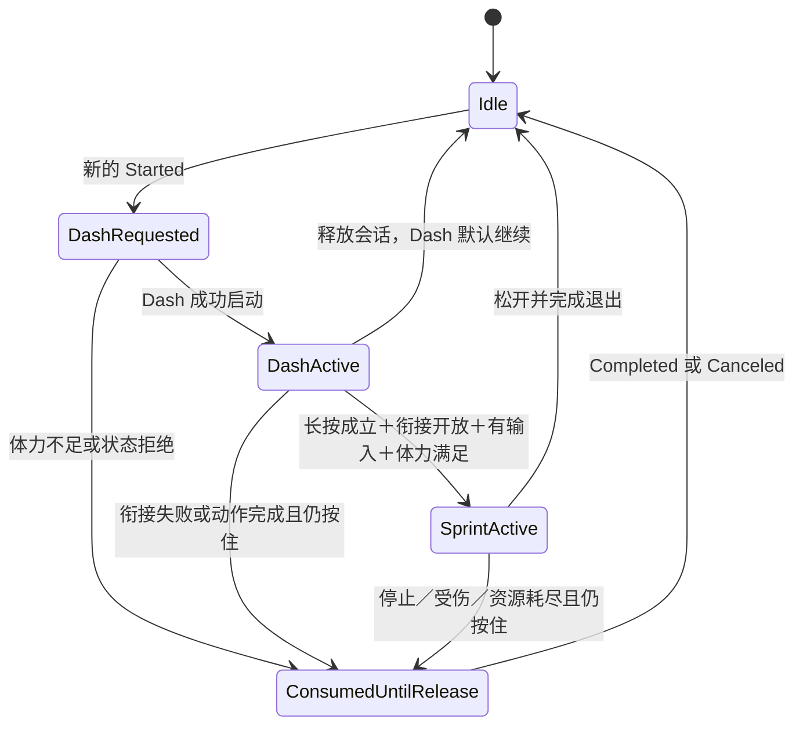
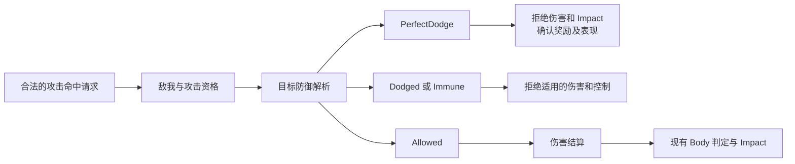
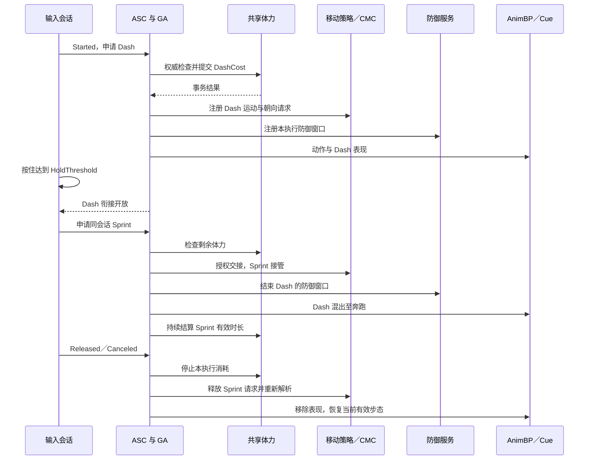

# Dash 与 Sprint 设计：共享体力、动作衔接与移动策略

日期：2026-10-09。版本：1.0，整合本次讨论及用户对体力机制的修订。适用 Hodgepodge、UE 5.5.4。

**状态：设计草案，尚未实施。** 本次仅创建文档和文档索引，不创建 C++ 类型、GameplayTag、蓝图或配置字段，不执行构建、PIE、联机或打包。本文中的新增名称是接口与数据契约提议，不能直接当成现有编辑器配置项。

旋转与动画的最新边界见[角色旋转与移动动画模式调整](character-facing-modes.md)：自由移动默认朝运动方向，八向分支保留给未来控制朝向场景，动作结束恢复当前有效模式。本文的体力与输入决策保留；普通状态恢复不能固定写回 ControllerYaw=True。完整锁定目标服务和锁定 CameraMode 不纳入该轮旋转设计。

阅读顺序：第 1 节查看确定规则；第 3～5 节查看输入与能力流程；第 6～9 节查看体力、防御、动画与退出；第 10～14 节用于接口开发和项目集成；第 15～17 节用于实施、验收与维护。

关联文档：[受击配置手册](../Guides/hit-reaction-configuration.md)、[受击核心设计](hit-reaction-system.md)、[攻击配置手册](../Guides/attack-ability-configuration.md)、[旋转约束](character-rotation-policy.md)、[网络动画审查](../Validation/animation-network-review-2026-10-09.md)、[Main 动画说明](../../Content/Main/Character/Hero/Anim/README.md)、[攻击吸附设计](melee-attack-assist.md)。历史设计不覆盖当前源码和最新配置手册。

## 1. 目标、术语与确定规则

### 1.1 两种行为

**Dash：短冲刺／闪避。** 在有限动作时长内执行一次定向位移，支付固定体力，具有配置化无敌窗口和完美闪避窗口，可以通过允许的动作窗口衔接后续行为。

**Sprint：持续奔跑。** 长按成立后，由一次成功的 Dash 衔接进入；持续提高速度，采用朝运动方向转向与前向奔跑姿势，持续消耗同一条体力。

本文“Dash 组件”指可独立开发和维护的功能单元，组成是 Dash GA、执行配置、运动任务及共享服务。其生命周期主体是 GA；首版不另建重复调度同一动作的 `UHodgeDashComponent`。Sprint 模块同样是业务功能单元，两者均属于现有 Hodgepodge Runtime，不新增 UE 模块。

### 1.2 本次讨论确定的设计规则

1. **Dash 没有冷却。Sprint 也不引入冷却。** 不创建冷却 GE、冷却 Tag、冷却 UI 或等待冷却结束的状态。
2. Dash 和 Sprint 使用同一条体力；体力不足时，相应行为不能执行。
3. 按下立即尝试 Dash，继续按住满足长按条件后，在 Dash 允许衔接的阶段尝试 Sprint。不是松开后才开始 Dash。
4. 一次按键会话只尝试一次 Dash。按住不会在动作结束、资源恢复后重复 Dash。
5. Dash 因体力不足或状态限制失败，本次会话不得绕过 Dash 直接进入 Sprint。需松开后重新按下。
6. Dash 成功后，Sprint 必须重新检查剩余体力；成功 Dash 不保证成功衔接。
7. Sprint 衔接失败后，不持续按住等待资源恢复。停止、受击或体力耗尽退出后，也要求重新按键。
8. Dash 每次成功启动只扣一次固定体力；Dash→Sprint 不再扣第二次 Dash 消耗。
9. Sprint 启动体力门槛只是准入检查，首版不增加一次性启动费用；开始后按每秒消耗支付。
10. 无敌与完美闪避独立于 `State.Combat.Body.*`。防御拒绝命中发生在伤害与受击 Impact 之前。
11. Sprint 保留全部方向输入；取消的是八向战斗移动姿势，切换为朝运动方向奔跑。
12. 正常 Sprint 使用朝运动方向旋转、关闭 Character Controller Yaw，允许合适条件下播放 Pivot／Turn；相机 Look 输入继续工作。
13. 松开、停止移动、接受实际伤害或强受击，均结束 Sprint。被无敌拒绝的攻击、完美闪避不算真正受击。
14. 退出只释放本次行为拥有的效果、请求和句柄，再解析剩余规则；不能覆盖仍生效的受击、减速、锁定或其他来源。
15. GameplayCue 只处理表现。服务器拥有体力、防御、伤害、奖励与能力准入的最终权限；拥有者执行预测，观察者消费复制结果。

动作尚未结束或不在取消窗口中不能再次 Dash，属于动作约束；资源不足属于资源约束。二者均不得实现成隐藏的固定冷却计时器。

### 1.3 首版建议与扩展边界

首版建议：地面 Dash、输入方向优先、无方向时朝角色前方、Dash 主动运动阶段锁定方向、每次 Dash 最多一次完美奖励、Sprint 使用期间暂停自然体力恢复。调参值和这些可配置选择仍需实现后的实际手感验收。

后续扩展：空中 Dash、专属反击能力、擦身威胁检测、锁定目标下的特殊闪避、不同角色奔跑资源规则。首版不实现攻击吸附、完整锁定摄像机、全局联机慢动作或新韧性系统。

## 2. 当前项目基础与实际缺口

本节根据 2026-10-09 的 Source、Config、项目描述及现有文档核对；未重新读取二进制动画图或验证运行效果。

- [.uproject](../../Hodgepodge.uproject) 使用 UE 5.5；本机引擎 Build.version 为 5.5.4。维持现有 Runtime／Editor 结构。
- [HodgeGameplayAbility](../../Source/Hodgepodge/Public/AbilitySystem/Abilities/HodgeGameplayAbility.h) 已有输入激活策略、ActivationGroup，基类默认 InstancedPerActor 和 LocalPredicted。
- [HodgeInputComponent](../../Source/Hodgepodge/Public/Input/HodgeInputComponent.h) 通用能力绑定当前是 Triggered→Pressed、Completed→Released。冲刺所需 Started／Canceled 和按键会话识别尚未接入。
- [HodgeHeroComponent](../../Source/Hodgepodge/Public/Component/HodgeHeroComponent.h) 已有移动意图、`HasMoveIntent`、`GetMoveIntent` 和 `OnMoveIntentChanged`；移动 Completed／Canceled 会清零意图。
- [ASC](../../Source/Hodgepodge/Private/AbilitySystem/HodgeAbilitySystemComponent.cpp) 已有能力输入转发与 GAS 输入事件入口；事件是否发送到服务器取决于监听 Task 等逻辑，不是任意本地广播自动复制。
- [PlayerState](../../Source/Hodgepodge/Private/Core/PlayState/HodgePlayerState.cpp) 持有玩家 ASC，采用 Mixed 复制；[PawnData](../../Source/Hodgepodge/Public/Data/HodgePawnData.h) 和 AbilitySet 负责能力／属性授予，经 PawnExtension 接入当前 Avatar。
- [CharacterMovement](../../Source/Hodgepodge/Private/Component/HodgeCharacterMovementComponent.cpp) 已有自定义 SavedMove，保存旋转状态和受击控制。尚无 Sprint 速度策略、Sprint 移动请求序列化和对应回放数据。
- [RotationComponent](../../Source/Hodgepodge/Public/Component/HodgeCharacterRotationComponent.h) 已有 Yaw 锁定、复制与恢复；[AnimInstance](../../Source/Hodgepodge/Public/Animation/HodgeAnimInstance.h) 已有 Tag 映射和旋转表现快照。
- [HealthSet](../../Source/Hodgepodge/Private/AbilitySystem/AttributeSet/HodgeHealthSet.cpp) 消费 `Gameplay.DamageImmunity`；[HitReactionComponent](../../Source/Hodgepodge/Private/Component/HodgeHitReactionComponent.cpp) 已处理伤害接受结果、四级判定和 Impact。
- 正式属性集中没有已实现的 Stamina／MaxStamina。基类注释中的 Stamina 示例不代表实际存在；[StatProfile](../../Source/Hodgepodge/Public/Data/HodgeCharacterStatProfile.h) 当前只配置生命与基础伤害。
- 已注册 `InputTag.Ability.Dash`、`Ability.Type.Action.Dash`、`GameplayCue.Character.Dash`；另有 `InputTag.Sprint` 和旧 `GameplayCue.Character.Dash.Cooldown`。Tag 存在不代表能力或冷却已实现。旧 Cooldown Cue 不参与本方案，未核对引用前不删除旧 Tag。
- Main 动画说明记录普通朝向为 UseControllerRotationYaw=True、OrientRotationToMovement=False、UseControllerDesiredRotation=False，普通速度验收值 420cm/s；Pivot 资源保留但 EnablePivot=False。这些是记录值，不是所有角色的强制默认值。

缺口包括两份 GA、共享体力系统、输入会话、移动策略请求、防御窗口与完美判定、动画步态快照及完整联机协议。不能靠用户配置尚不存在的字段补齐。

## 3. 输入识别与按键会话

### 3.1 事件绑定与唯一识别来源

使用一个物理冲刺 InputAction：Started 开始会话，Completed／Canceled 结束会话。不要在该路径直接复用每帧 Triggered 作为“新的按下”。

长按时间由会话解释器统一维护，首版放在 HeroComponent 的小型状态记录中；其他操作需要复用点按／长按后再抽通用解释器。GA 与 Enhanced Input 不各自维护不同阈值。按下即可执行 Dash，因此不以 Tap Trigger 的释放时点作为 Dash 的启动入口。

避免同一个物理 InputTag 同时授予两份自动激活的 GA。解释器选择具体 AbilitySpec；直接路由时只建立一条启动链，不能又调用通用 Pressed 路径而重复激活。Sprint 的释放要路由到正在执行的 Spec／激活身份；无输入绑定的能力不会凭空收到 WaitInputRelease。

Triggered 持续采样可更新输入值，但不能新增会话。UI 阻塞、失焦、移除 Mapping Context、解绑、暂停策略和 Pawn 更换，均要执行会话取消，不能只忽略后续输入。

### 3.2 会话状态

建议 `EHodgeSprintInputSessionState`：Idle、DashRequested、DashActive、SprintActive、ConsumedUntilRelease。HoldQualified 是会话标志，不额外启动一个动作。

输入会话与玩法状态分别维护。图中的 Idle 只表示没有有效按键会话，不表示尚在完成的 Dash 或受击、死亡、下落已经结束。新的 Started 可以创建新会话，但仍需接受当前动作的准入检查；旧 Dash 的完成回调不能消费新会话。

### 3.3 边界规则

- Dash 期间松开：关闭 Sprint 衔接资格，Dash 本身默认继续完成。
- 达到长按阈值但尚未到衔接阶段：只设置 HoldQualified，不截断动作、不扣 Sprint 费用。
- 衔接开放时没有移动意图或体力不足：本次衔接失败并消费会话，不挂起等待条件恢复。
- 同帧释放与衔接：先消费释放／取消，再判断衔接；服务器按会话序号及有效状态拒绝过时请求。
- Dash 已自然结束才满足长按：不补发 Sprint。配置须使 HoldThreshold 不晚于衔接开放时点。
- 正在 Dash 时出现新的按下：依当前取消规则决定准入；失败不能重复消耗体力。
- 首版新一次操作要先成功 Dash，再进入 Sprint。不提供体力不足时的直接 Sprint 备用分支；AI 的独立 Sprint 意图属于未来另行定义的入口。

## 4. Dash 组件：功能、场景与技术规范

### 4.1 功能定义与使用场景

Dash 提供有限时长的战术位移与闪避机会，适用于躲避可闪避攻击、主动调整站位、在攻击授权取消窗口内脱离动作，以及长按奔跑的起步。它不负责搜索敌人、自动追击、伤害计算、起身或长期移动属性管理。

### 4.2 执行主体

新增 `UHodgeGameplayAbility_Dash`，继承项目基础 GA；Main 主角使用蓝图子类配置资源。InstancedPerActor、LocalPredicted，执行阶段使用 Exclusive_Replaceable。能力不是复制到所有观察者的状态容器。

ActivationGroup 管理粗粒度动作互斥。攻击能否被 Dash 取消仍由 CombatComponent 的具体窗口授权；不能用新 Exclusive 能力的自动替换绕过窗口。能力成功提交前必须验证授权和资源，不能“先取消攻击，再发现体力不足”。异步拒绝需恢复预测改动，参见第 13 节。

建议启动准备使用 Independent，显式检查目标 Exclusive 组是否允许、当前攻击是否可取消，再支付资源并调用现有 ChangeActivationGroup 进入 Exclusive_Replaceable。这样基础 NotifyAbilityActivated 不会在 ActivateAbility 提交费用前自动替换攻击。准备过程不开放运动／防御窗口；组切换失败按执行故障补偿与清理。后续攻击替换 Dash 也必须遵守 Dash 阶段授权，不能只依赖组的可替换属性。

InstancedPerActor 会复用实例；收尾必须通过正确的组计数流程复原 Independent 准备组，避免下一次启动继承上次的 Exclusive 状态。不能只修改成员值而留下 ASC 计数不一致。

首版不继承 Melee GA，不把命中检测、攻击伤害或 ComboCoordinated 的执行契约带入移动能力。可复用现有通知和蒙太奇任务，但不恢复已归档的自建 Timeline。

### 4.3 阶段与方向

建议 `EHodgeDashPhase`：Startup、Travel、Recovery、Ended。无敌、完美窗口和衔接开放是阶段上的时间区间／事件，并不各自代表一个新 GA。

方向选择：读取并缓存本次有效移动意图，转换为世界水平单位方向；没有方向时回退为角色前向。主动 Travel 阶段默认保持该方向，避免镜头突然旋转导致路径改变。无方向回退、是否允许转向和空中行为均由角色配置明确选择。

服务器校验方向是否有限、归一化、符合允许的输入方向和执行规则。距离、时长与曲线来自权威配置，不能接受客户端任意填写的参数。Dash 不保证到达穿墙目标点，胶囊保持碰撞并由 CMC 处理扫掠、地面、障碍和滑动。

### 4.4 位移方式

推荐首版使用 GAS Root Motion Source 位移任务，便于数据驱动距离／时长；有适配的根运动素材时可以选择根运动蒙太奇。每次执行只选择一个主位移来源。

Root Motion Source 模式下，姿势蒙太奇不得再叠加完整根位移。由 CMC 执行运动、碰撞及网络同步，不在 GA／Cue 中逐帧 SetActorLocation 或 Multicast Transform。

能力保存运动句柄、蒙太奇身份和退出速度策略。撞墙后的沿墙滑动或停止需要配置与测试；撞墙不退款，不消除已经支付的体力。Root Motion Source 结束／中断时只移除自身句柄。

### 4.5 成功启动与结束

1. 验证 ASC／Avatar、初始化、动作授权、移动模式、资源及配置。
2. 提交一次体力消耗，记录执行身份；失败不进入有效阶段。
3. 注册本次策略、防御窗口与恢复阻塞请求。
4. 启动蒙太奇、位移任务及表现；任一必要资源启动失败，按明确失败契约清理。
5. 达到衔接阶段时广播一次授权事件，由输入会话决定是否申请 Sprint。
6. 完成、取消、死亡、预测拒绝、失去 Avatar 均进入统一 EndAbility 清理。

成功提交后被打断、撞墙或主动结束，默认不退款。必要资源缺失应尽可能在提交前拦截；若提交后发生执行故障，退款必须是服务器按执行 ID 处理的一次性补偿，不允许所有 EndAbility 分支盲目加回体力。

没有冷却 Check／Apply 路径。再次 Dash 只需新的输入、足够体力与动作准入；取消窗口可以限制重开，不能附加未讨论的固定重开等待时间。

## 5. Sprint 模块：目标与核心流程

### 5.1 定位与主体

Sprint 提供连续地面奔跑，改变步态、有效速度、朝向与动画准入，使用 `UHodgeGameplayAbility_Sprint` 管理生命周期。首版建议 Independent，通过能力 Tag 关系及明确事件与攻击、受击等状态协调。

Independent 不代表忽略状态限制。当前受击、死亡、脚本控制或非法移动模式仍阻止激活。默认地面 Sprint；走出悬崖进入 Falling 时结束，空中延续以后另配。

### 5.2 启动

1. 输入会话必须持有同一次成功 Dash 的合法衔接身份。
2. Dash 已开放衔接，长按成立、按键仍按住、有效移动意图存在。
3. 服务器再次验证状态及剩余体力不低于 SprintStartRequiredStamina。
4. 提交 Sprint 策略和运行状态；启动条件本身不扣一次性费用。
5. 衔接完成后开始持续体力消耗与 Sprint Cue；动画进入对应步态。

### 5.3 持续与退出

持续读取移动意图、有效资源与地面条件。角色使用提高后的速度、Sprint 加速度／制动／转向参数。动画根据运动数据选择 Cycle、Pivot、Stop 或合适 Turn，而不是每帧由 GA 指定动画。

结束原因统一为 InputReleased、InputCanceled、NoMoveIntent、BlockedMovement、StaminaDepleted、DamageAccepted、HitControlled、MovementModeChanged、AbilityCanceled、PredictionRejected、Death、AvatarLost、ConfigurationInvalid。不存在 CooldownExpired 或 WaitingCooldown 状态。

发生退出后，只移除自己的策略、消耗任务、Tag／GE、Cue、镜头覆盖和订阅；真实恢复由当前策略解析结果决定。资源恢复不重新触发技能。

### 5.4 Dash→Sprint 交接

衔接是一次有身份、有结果的请求，不能由 Dash EndAbility 无条件调用 Sprint。

建议先准备并授权 Sprint 请求，Dash 仍持有较高优先级的短运动策略；成功后在确定切换时点结束 Dash 运动，并使 Sprint 策略接管。Sprint 消耗从实际接管开始，而不是候选请求刚创建时开始。

Dash 只释放自身资源，不能清掉新 Sprint 的状态或 Cue。结束速度采用显式策略保留合法水平动量，再受 Sprint 最大速度与 CMC 参数约束；不为了换 GA 将 Velocity 清零。Dash 蒙太奇按配置混出到正在求值的 Sprint 姿势，不能先强制 Idle 再进入 Sprint。

默认衔接时点必须晚于无敌窗口结束；Dash 防御能力不随着 Sprint 延长。Sprint 请求拒绝时，撤销候选状态，Dash 按原规则完成；若本地已预测交接，按执行身份恢复服务器仍有效的 Dash 状态。

## 6. 共享体力系统

### 6.1 数据与归属

新增 `UHodgeStaminaSet`：Stamina、MaxStamina，满足 `0 <= Stamina <= MaxStamina`。其他技能共享同一资源，不在 Dash／Sprint 中各保存一个可独立扣除的体力变量。

服务器统一初始化、结算和复制，拥有者用 GAS 支持的属性 Modifier 做预测与 UI 展示。周期结算和 Execution 不假定自动预测。体力 UI 读取属性／公共数据源，不从 Cue 或动画读数。

玩家资源属于 PlayerState ASC，运动、防御窗口与按键会话属于当前 Pawn／执行。Pawn 重新绑定不自动回满体力；正式重生是否补满由资源初始化策略明确决定，不能在重复初始化回调中暗中回满。

### 6.2 Dash 费用

`DashCost > 0`。只有成功提交扣一次；不因输入回调次数、无敌窗口开始、松开或进入 Sprint 重复扣费。

客户端预测与服务器结算共享执行身份／PredictionKey。预测拒绝使用对应回滚契约，不通过额外无条件恢复 GE 造成双重退款。其他技能同帧消费体力时，服务器顺序处理并在真正提交时检查余额；早先的 CanActivate 检查不是资源预留。

### 6.3 Sprint 门槛与持续费用

`SprintStartRequiredStamina > 0`，仅在开始时检查；`SprintDrainPerSecond > 0`。启动门槛应足够覆盖首个计划结算区间。持续期间不要求每一帧都保持启动门槛，只要求尚有可支付的资源。

期望消费 `SprintDrainPerSecond * 有效运行秒数`。服务器用统一资源任务按配置区间结算，不逐帧创建大量 GE。发生大帧时仍按有效时长计算，不重复结算同一段时间，不发生负体力。

最后一个区间不足时，消费剩余体力至零，并按可支付时长 `RemainingStamina / DrainPerSecond` 确定有效结束时点；不能无资源继续整个大帧奔跑。有效预算应在对应移动模拟前确定，超过截止时点的模拟使用退出后的策略。移动回放只恢复当时的预算／策略，不再次提交费用事务；资源校正走 GAS 路径。客户端余额有延迟时可先预测退出，最终以服务器状态纠正。

### 6.4 恢复

默认 Dash／Sprint 生效期间持有自然恢复阻塞请求，退出后释放；普通状态下按公共恢复规则运行。其他技能仍阻止恢复时，不因 Dash 结束强制开启恢复。没有固定的“Dash 冷却”或依资源恢复自动重开的机制。

### 6.5 示例边界

假设 DashCost=20、SprintStartRequiredStamina=10、SprintDrainPerSecond=10，仅用于说明：

- 体力 19：本次 Dash 失败，本次会话也不能改走 Sprint，即使 Sprint 的独立门槛较低。
- 体力 20：Dash 成功，剩余 0，Sprint 衔接失败。
- 体力 29：Dash 后剩余 9，不满足 Sprint 启动门槛。
- 体力 50：Dash 后剩余 30，满足其他条件时 Sprint 可持续约 3 秒；其他资源消费会缩短时长。
- Sprint 从 10 点启动后降到 9：继续消费至不足，不因低于启动门槛立即退出。
- 按住期间耗尽或启动失败，再恢复到足够体力：本次会话仍已消费，需释放并重新按下。

## 7. 防御窗口与完美闪避

### 7.1 判定入口

新增共享 `UHodgeDefenseComponent`，提供防御窗口注册及命中解析。它位于目标侧，不负责播放受击动作。近战、投射物和范围攻击统一在实际伤害／控制提交前访问该入口。

“受击触发完美闪避”指合法攻击尝试命中时触发，不能等待实际受击 GA 激活。HealthSet 拒绝伤害后，普通受击事件可能不存在。

仅伤害 GE Application 阶段的免疫也不足以覆盖同 GE 的其他业务效果。攻击附带减益、控制与命中回调必须共同消费防御结果；拒绝后不继续执行这些攻击附带效果。HealthSet 保留全局伤害免疫的最终保护，但不是完美判定的唯一入口。

### 7.2 窗口规则

Dash 按执行服务器时间注册 InvulnerabilityWindow 与 PerfectDodgeWindow；完美窗口是无敌窗口的子区间。完美奖励消费后，剩余无敌窗口仍然有效。

每个窗口使用统一 `[Start, End)` 边界。时间偏移以 Dash 成功启动为基准。通知可协助作者制作和动作对齐，但客户端 Notify／动画可见性不拥有防御权限。服务器必须有不依赖网格是否求值的时间与阶段依据。

无敌不禁用角色碰撞；胶囊继续处理墙体，攻击仍能提交命中请求用于判定。不可闪避攻击按配置绕过 Dash 防御；普通全局免疫是否适用由公共免疫规则决定，不能误奖励完美闪避。

### 7.3 完美资格与去重

攻击需具备 CanBeDodged 与 CanTriggerPerfectDodge 资格，来源有效且可与目标交互；默认排除持续伤害、环境伤害、自毁和作弊免疫。具体来源以后按攻击规则显式扩展。

首版每次 Dash 最多确认一次完美奖励。重复 Trace 使用稳定的 AttackExecutionId、HitWindowId／HitIndex、ProjectileId（适用时）与目标组成命中身份；不得每次扫描生成新随机 ID 后重复领奖。再关联 DashExecutionId 去重。

身体已移出攻击范围而没有命中请求，不自动构成完美闪避。要奖励擦身躲避，需要另行设计服务器威胁检测范围和时间，属于后续扩展。

### 7.4 与现有 Body／Impact 的关系

四级 Body 和 `AttackRank >= TargetBodyRank` 规则保持不变。无敌不是 Vajra；正常通过防御后才进入 Body 与 Impact 规则。

防御被拒绝时，AcceptedDamage 与 ExplicitControl 都不能通过这次攻击施加控制。不能因为伤害为零就允许 ExplicitControl 继续击退／挑飞。可闪避的纯控制攻击同样走防御解析；是否可触发完美奖励需明确配置。

`FHodgeHitReactionOutcome` 当前没有 PerfectDodge／Dodged。未来增加的是公共命中结果，默认不把防御结果塞成新的 Impact；如需在受击结果中展示，只增加清晰的拒绝原因映射并保持类型职责。

### 7.5 奖励与 GameplayCue

服务器确认后广播 `Event.Combat.PerfectDodge`，携带命中／Dash 身份、来源、位置、方向和时间。奖励由公共奖励逻辑或独立能力给予，例如资源恢复、Buff 或反击窗口；首版具体奖励由配置指定，不硬编码到粒子蓝图。

Gameplay Event 的本地广播不自动复制。奖励效果通过 GAS 权威流程生效，拥有者成功通知需明确网络入口；视觉效果由 Cue 传播。奖励在命中决议完成后派发，避免在伤害处理中重入同一命中事务。

建议使用已有 `GameplayCue.Character.Dash`，新增 Sprint 与 PerfectDodge Cue。一次性使用 Execute，持续效果优先随持有状态的 GE 管理，覆盖添加、存在和移除生命周期；有实例状态的 Cue 使用合适 Notify Actor。

拥有者普通 Dash 效果可预测，但预测与服务器确认不能重复播放；完美奖励默认由服务器确认。Cue 不授予无敌、不扣体力、不恢复速度。Cue 丢失不改变玩法；持续效果应能随现有状态重新建立并在解绑时清理。

镜头震动、FOV 和个人表现只作用于拥有者。全局时间膨胀影响服务器和其他玩家，首版不加入；可选本地表现慢动作也需独立设计。

## 8. 移动、旋转与动画规范

### 8.1 策略与单一写入者

新增 `UHodgeLocomotionPolicyComponent`，解析带来源的步态、速度和朝向请求。优先级建议：死亡／强控制／脚本控制 > Dash > Sprint > 普通朝向（未来可含锁定目标）> 默认步态。

速度 Buff／Debuff 与优先级正交：Sprint 选择基础步态配置，再叠加合法的持续修正与限速；结束后保留仍生效的减速。硬控制可独立禁止输入／旋转，不被低优先级请求解除。

GA 提交策略，不直接散落写入 MaxWalkSpeed 和 Yaw 开关。CMC 执行速度、加速度、制动和移动；RotationComponent 解析并应用最终朝向，协调 Character 与 CMC 开关；AnimInstance 在游戏线程缓存表现快照，动画线程只读。

### 8.2 Sprint 有效策略

- Gait=Sprint，动画分支使用前向奔跑。
- Character `bUseControllerRotationYaw=false`。
- CMC `bOrientRotationToMovement=true`、`bUseControllerDesiredRotation=false`。
- 使用 Sprint 的速度、加速度、制动、转向速率。
- 允许 Pivot 准入，提供 Turn／Stop 选择规则。
- Move 和 Look 输入均继续工作，输入仍按控制器水平朝向转成世界方向。

取消八向移动指取消八向战斗姿势，不禁止侧向／后向输入，不强行把所有输入映射成角色前方。改变方向时角色转向新运动方向。

普通策略保留角色自己的基线。Main 当前记录基线是 ControllerYaw=True、OrientToMovement=False；其他角色不能强制复用 420cm/s 或同样开关。

### 8.3 Pivot

`bPivotAllowed`（拟议快照字段）表达策略准入；已有图中的 EnablePivot 可以消费它。真正进入仍检查地面、最小速度、速度与新加速度夹角、FullBody 权重、受击和防重复触发条件。

允许不代表持续播放。Pivot 掉头经过低速度时，不立即作为停止退出 Sprint。胶囊 Yaw 的变化须与动作匹配，采用合适转向速率／曲线，不先瞬转 180° 再播放掉头。

退出 Sprint 先关闭新 Pivot 准入，正在播放的 Pivot 根据状态出口与混合时间退出，不直接重置节点跳到 Idle。

### 8.4 单一 Turn

首版以一个 Turn 状态入口组织播放，配置一份基础 Turn 序列及支持角度／方向。要区分移动中大角度转向与静止 TurnInPlace，两者使用不同准入条件。

单一序列只有在动作适配时才能通过镜像处理另一侧。必须核对骨架镜像、武器、脚步和曲线；不把一个右转动作自动解释为任意方向。超出支持角度使用受限转向或 Pivot，最终素材不足时记录待补，而不是制造旋转跳变。

Sprint 停止后，普通步态接管静止转身。若 Sprint 已因零输入结束，不继续持有 Sprint Turn 控制权。Turn／Pivot 的模型表现不能成为第二个独立的 Actor 旋转写入者。

### 8.5 Slot 与混合

Dash 动作首版使用现有 FullBody，并通过 GAS 蒙太奇任务播放；同一 FullBody 的受击／攻击替换必须遵守动作授权。Dash 退出 BlendOut 与阶段时长匹配，不复用任意硬编码停止时间。

Sprint 的 Cycle／Pivot／Turn／Stop 使用移动图／层，不持有长期 FullBody 蒙太奇。主角轻反馈继续使用独立 Group 和上身混合，不迁回同组，也不因 Sprint 清理破坏现有受击链。

步态切换考虑 Inertialization、脚相位和可用同步标记；没有同步素材时不假装完成步态同步。恢复 Controller Yaw 时，RotationComponent 进入限速恢复，AnimBP 平滑处理 RootYawOffset，避免蒙太奇、胶囊与模型同时重复补偿。

## 9. 统一退出与恢复契约

### 9.1 停止与受击识别

NoMoveIntent：读取原始输入并短暂防抖；客户端复用 Hero 事件，服务器消费经过移动协议传输的输入／加速度。

BlockedMovement：持续有意图但水平速度低于阈值，且持续时间达到阻塞超时。Pivot、合法制动和当前高优先级动作需要单独排除，不能只检查 Velocity==0。

DamageAccepted：默认任何合法、实际大于零的接受伤害均退出 Sprint，即使 Body 判定只产生轻反馈。只监听强受击 GA 会漏掉这种情形；需要公共伤害接受事件，不能依赖 HealthChanged 猜测完整命中身份。

HitControlled：纯控制等零伤害强受击也必须退出。被防御拒绝的命中不发送实际伤害接受／控制开始，因此不会错误退出 Sprint。

### 9.2 收尾顺序

1. 将执行标记为结束，禁止新阶段、交接和重复结算。
2. 停止本执行的持续消耗及运动任务，撤销防御窗口。
3. 按身份处理自身蒙太奇和 Cue／相机覆盖。
4. 释放自己的策略、状态效果及恢复阻塞句柄。
5. 重新解析其他仍有效的约束，通知动画表现快照。
6. 移除事件订阅，关闭本次按键会话的重启资格。

重复完成、取消和解绑必须幂等。旧 Pawn 的回调不得清掉新 Pawn／新执行的效果。取消一个能力时只停止它拥有的蒙太奇，不 StopAllMontages。

### 9.3 正常恢复结果

没有其他约束时，关闭 Pivot 准入、退出 Sprint 分支、关闭 OrientToMovement、恢复角色普通 ControllerYaw 规则和当前有效普通速度。朝向恢复须限速，不能瞬间面向镜头。

受击仍有效时保留受击锁；减速仍有效时保留减速；处于 Falling 时保持下落，不强行 SetMovementMode(Walking)。输入会话结束和恢复普通步态不代表 Gameplay 控制已全部解除。

## 10. 数据结构契约（拟议）

### 10.1 FHodgeSprintInputSession

字段：SessionId（Pawn 内递增，附 AvatarGeneration）、InputState、PressedAtLocalTime、bHeld、bDashAttempted、bHoldQualified、bConsumed、DashExecutionId、ActiveSprintExecutionId。

只用于解释操作，不能作为服务器体力或无敌的事实来源。服务器维护必要的已验证会话记录；本地时间用于操作识别，不能直接决定服务器完美窗口。释放后清理会话，迟到消息按身份丢弃。

### 10.2 FHodgeMovementActionContext

字段：ExecutionId、SessionId、AvatarGeneration、AbilitySpecHandle、ActivationPredictionKey、ProfileId／ConfigurationVersion、服务器开始时刻、世界水平输入方向、阶段／状态版本、结束原因。

客户端可提交执行意图；配置、有效时间、权限与最终方向由服务器校验。内部 SpecHandle／PredictionKey 不充当所有观察者都可用的表现身份，观察者使用明确的执行 ID 与状态版本。

### 10.3 FHodgeLocomotionPolicyRequest 与 Handle

字段：来源执行身份、优先级、Gait、FacingMode、配置引用、速度修正规则、Pivot／Turn 准入、有效阶段。Handle 唯一标识本次申请，释放只能作用于本来源。

最终解析状态：EffectiveGait、EffectiveFacingMode、EffectiveMaxSpeed、输入／旋转约束、允许的动画功能。不要让多个 GA 各保存“旧速度／旧开关”然后互相覆盖。

### 10.4 FHodgeLocomotionPresentationSnapshot

字段：AvatarGeneration、ExecutionId、StateVersion、ServerPhaseStartTime、Gait、DashPhase、FacingMode、bPivotAllowed、TurnPolicy、移动模式。速度、加速度与方向来自运动组件缓存。

服务器复制必要的离散状态；拥有者叠加匹配执行的预测状态，观察者使用权威状态。高频位置与速度继续使用 CMC，表现快照不重复复制 Actor Transform。

### 10.5 FHodgeDefenseWindowSpec 与 IncomingHit

窗口字段：OwnerExecutionId、权威起点、InvulnerabilityStart／End、PerfectStart／End、允许攻击类别、完美奖励次数、ProfileVersion。

命中字段：稳定攻击身份、来源／目标、攻击类别、可闪避及可完美资格、HitResult、控制资格、服务器解析时点。远程滞后补偿若以后加入，必须同时对齐攻击接触与防御窗口的历史时点；首版不能用客户端自报时间无限回溯。

结果 `EHodgeIncomingHitOutcome`：Allowed、Immune、Dodged、PerfectDodge、Invalid。结果载荷包含拒绝原因、关联身份及是否允许伤害／附带控制，不等于现有受击 Impact。

### 10.6 FHodgeStaminaSpendResult

字段：TransactionId、ExecutionId、SpentAmount、RemainingStamina、FundedDuration（持续消费时）、bSucceeded／bDepleted、失败原因。请求包含期望消费、有效时长与目的；服务器统一防重与结算。

输入失败原因建议：InsufficientStamina、ActionBlocked、InvalidMovementMode、InvalidAvatar、MissingConfiguration、HandoffRejected。没有 Cooldown 失败原因。

## 11. 配置资产与参数（拟议）

### 11.1 UHodgeSprintAbilityProfile

作为同一按键行为的配置根，包含 DashConfig 与 SprintConfig，引用独立角色 LocomotionProfile。由两份 GA 配置同一根资产，能力 Spec 的 SourceObject 或蓝图默认值使用一个明确入口，不同时维护两份冲突参数。

DashConfig 参数：

- DashCost：体力点，必须 >0。
- Duration、TravelStart／End、HandoffOpenTime：秒，阶段必须在 Duration 内。
- MovementMethod：RootMotionSource 或 MontageRootMotion；首版选择一个。
- Distance：厘米；SpeedCurve：约定归一化时间／倍率，明确积分得到距离的方法。
- DirectionPolicy、FallbackDirection、bAllowSteering：方向策略及是否可修正。
- bAllowAirDash：首版 False；允许时需补空中运动和资源规则。
- InvulnerabilityStart／End、PerfectStart／End：秒，相对成功启动。
- MaxPerfectRewardsPerDash：首版 1。
- Montage、BlendIn／BlendOut、FinishVelocityPolicy：角色资源与退出策略。
- DashCue、PerfectDodgeCue、PerfectRewardEffect／Ability：表现与奖励引用。

SprintConfig 参数：

- HoldThreshold：秒，按键会话识别门槛。
- SprintStartRequiredStamina：体力点，准入阈值，不扣启动费。
- SprintDrainPerSecond：体力点／秒。
- DrainInterval：秒，资源任务的计划结算间隔，不是冷却。
- SprintMovementProfile：速度、加速度、制动与转向引用。
- MoveIntentThreshold：输入幅值；NoMoveIntentGrace：秒，防止短噪声。
- BlockedSpeedThreshold：cm/s；BlockedExitDelay：秒，阻塞识别。
- bExitOnAcceptedDamage：首版 True；强受击退出始终强制。
- bResumeWhileHeldAfterInterrupt：首版 False，不在首版开放自动重启。
- bBlockNaturalStaminaRegen：首版 True，采用来源计数。
- SprintCue、可选拥有者 CameraMode：持续表现与相机引用。

本资产没有 CooldownDuration、CooldownEffect 或冷却后进入 Sprint 的配置。

### 11.2 UHodgeLocomotionProfile

普通／Sprint 的速度、加速度、地面摩擦、制动、旋转速率；朝向恢复速率；Sprint Cycle、Pivot、Turn、Stop 动画；混合时间、可用同步组／标记；Pivot 最小速度、角度和重入条件；单一 Turn 支持方向、角度及可选镜像资源。

资源应匹配目标 Skeleton／动画层；同一套能力可以使用不同角色姿势。普通参数读角色基线，不从 Dash GA 写死恢复值。

### 11.3 属性与效果资产

AbilitySet 授予 StaminaSet 与两份 GA；初始化效果与公共属性协调流程明确接入，避免新增另一套重复初始化。初始化需扩展现有 StatProfile／协调器的资源契约，当前只有生命／基础伤害的字段不能直接承担新体力值。

需要的效果类别：一次性 Dash 费用、Sprint 状态／持续表现、Dash 防御状态、自然恢复阻塞及可选完美奖励。实际体力修改与请求必须有唯一执行者，不能资源组件扣一次、GE 又扣一次。

防御状态可以复用现有 DamageImmunity 作为适用情况下的最终保护，但仍保留来源和窗口记录；未来按攻击类别选择免疫时，不能一个全局 Tag 错误屏蔽所有不可闪避攻击。持续状态优先使用有句柄的 GE，精确处理取消、预测和解绑。

### 11.4 示例调参与验证规则

示例：HoldThreshold=0.22s、DashDuration=0.35s、HandoffOpenTime=0.28s、Invulnerability=[0.04,0.22)s、Perfect=[0.04,0.10)s、DashCost=20、SprintStartRequiredStamina=10、SprintDrainPerSecond=10。不是现有配置或已验收的手感值。

编辑器验证至少拒绝：非有限／负数、无效方向、重复角色资源、缺少必要动画；不满足 `0 <= PerfectStart < PerfectEnd <= InvulnerabilityEnd <= HandoffOpenTime <= Duration` 的阶段，以及 PerfectStart 早于 InvulnerabilityStart。

还要检查 HoldThreshold<=HandoffOpenTime、Travel／运动结束与交接一致、启动门槛覆盖首个结算区间、Turn 镜像资源有效。技能时长变化后必须同步防御、交接与 BlendOut，不能分别散落在多个蓝图常量中。

## 12. 接口说明（概念契约，非已实现 API）

### 12.1 输入路由与能力入口

`BeginSprintInputSession(InputTag, InputValue)`：拥有者本地开始一次会话，生成身份并通过现有 ASC 尝试 Dash。已有会话／重复 Started 幂等，不重复支付。服务器只接受受控 Actor 的合法执行请求。

`EndSprintInputSession(SessionId, ReleaseReason)`：消费释放／取消，停止衔接，向匹配 Sprint 执行传递释放事件；Dash 默认继续，UI／Pawn 解绑可按取消规则终止。过时会话无副作用。

`TryRequestDash(SessionContext) -> RequestResult`：检查与激活入口；本地提交成功只代表预测请求，权威成功以服务器决议为准。返回失败原因／执行身份，不暴露可随意指定的费用或距离。

`TryRequestSprintHandoff(DashExecutionId, SessionId) -> RequestResult`：验证成功 Dash、窗口、按住、输入和资源；一次请求、一次结果。拒绝消费本次衔接资格。

`OnDashHandoffOpened(Context)`、`OnMovementActionEnded(Context, Reason)`：带执行身份的阶段通知；监听器负责验证匹配，不以一个无参数 Bool 广播决定所有角色行为。

### 12.2 移动策略组件

`AcquirePolicy(Request) -> PolicyHandle`：在合法 Avatar／执行上申请策略，保存来源和优先级。策略候选与实际生效时点区分；本地预测请求可暂时参与解析，服务器请求是权威来源。

`ReleasePolicy(Handle)`：仅释放对应来源，重复释放无副作用。请求创建于旧 Avatar 时不能改变新 Avatar。

`GetResolvedPolicy() -> ResolvedState`：供 CMC／Rotation 读取当前策略；回放时可读取匹配 SavedMove 的历史解析状态，不读最新 Tag 冒充过去状态。

`GetPresentationSnapshot() -> Snapshot`：供游戏线程动画缓存与 UI 查询；线程安全更新，不在动画工作线程访问可变 ASC／GA。

`OnResolvedPolicyChanged(Old, New)`：本地策略解析事件；跨网络使用复制快照，不把这个 Delegate 当作复制机制。

### 12.3 体力服务

`CanAffordDash(Cost)`、`CanStartSprint(Threshold)`：查询，只用于提前判断，不预留资源。

`TrySpendStamina(TransactionId, ExecutionId, Amount) -> SpendResult`：权威提交入口／预测包装；同事务不得重复消费，失败不产生负余额。只有经过授权的能力能调用权威支付。

`ConsumeSprintStamina(ExecutionId, EffectiveDeltaTime) -> SpendResult`：按持续运行时长结算，返回可支付时长和耗尽信息；结束后迟到的请求被拒绝，不重复扣费。

`AcquireRegenBlock(Source) -> Handle`、`ReleaseRegenBlock(Handle)`：计数化恢复阻塞，释放自己不解除其他来源。

这些是统一资源提交边界，可实现为共享能力任务／服务与 GE 的组合，不必另建一套替代 GAS 的属性存储组件。

### 12.4 防御接口

`RegisterDodgeWindow(WindowSpec) -> WindowHandle`：由合法 Dash 执行注册。客户端预测用于表现，服务器副本才有命中决议权限。

`UnregisterDodgeWindow(Handle)`：结束／中断即时取消窗口，幂等，不保留旧执行的无敌。

`ResolveIncomingHit(HitContext) -> DefenseResult`：服务器命中提交前调用。校验来源与身份，查询当前窗口，按稳定 ID 去重；不直接修改速度或播放受击蒙太奇。

`OnPerfectDodgeConfirmed(Result)`、`OnDamageAccepted(Result)`：权威决议事件，由奖励／Sprint 退出逻辑分别消费。拥有者通知需显式复制，视觉由 Cue 传播；不可因 Delegate 回调重入同一事务。

可以通过 `IHodgeIncomingHitResolver` 对接不同目标类型。所有目标都使用公共组件时，先提供组件查询入口即可，不为单次转发创建大量接口。

### 12.5 生命周期

新 Pawn 组件统一提供 InitializeWithAbilitySystem／UninitializeFromAbilitySystem，并沿用 PawnExtension 委托。绑定要求 ASC 当前 Avatar 正确；重复初始化不得重复授予、添加 Tag 或订阅。

反初始化取消当前执行、释放全部本组件拥有的句柄、清会话并解绑；PlayerState ASC 继续存在。任何异步回调都校验 WeakObject／执行 ID／AvatarGeneration；Runtime 不能无条件依赖 Editor。

## 13. 联机、预测与复制协议

### 13.1 三种角色

拥有者：立即预测 Dash 动作、合法运动、体力反馈与模式切换；提交带身份的请求，收到拒绝时按执行清理／恢复。

服务器：验证技能、窗口、输入、方向和资源，拥有防御、伤害、奖励最终决议；死亡、换 Pawn 和取消及时关闭执行。

模拟代理：读取 CMC 运动与权威步态／阶段快照，不依赖其本地存在运行中的两份 GA，不猜其他玩家的按键。

### 13.2 CMC 扩展

在现有 SavedMove 扩展 Sprint 意图、执行／策略版本及回放必要参数，保留已有旋转和受击字段。SetMoveFor 保存当时状态，PrepMoveFor 恢复回放策略；状态不同时 CanCombineWith 返回不可合并。

SavedMove 本地保存不等于上传服务器。需要压缩标志或自定义 FCharacterNetworkMoveData 序列化必要请求，在服务器移动模拟中消费；客户端不能用一个 Sprint=true 标志自行授予高速权限。速度配置来自权威 Profile，不能随包传任意速度。

GA 激活、PlayerState ASC、Pawn 状态和移动 RPC 不保证跨 Actor 的到达顺序。协议使用 Session／Execution／版本以及移动时间戳关联切换；早到的移动请求要在有界授权流程中处理或校正，不能未经验证提高速度，也不能依靠固定 Sleep 等 Tag 到达。

### 13.3 预测窗口与拒绝

GA 标记 LocalPredicted 不覆盖任意 Timer／潜伏回调的后续副作用。输入释放、阶段切换与新 Sprint 激活应使用相应 Task／预测窗口；Dash 和 Sprint 的成功／失败是独立决议，衔接依赖显式服务器阶段授权。

Dash 拒绝：结束自身运动、动作与窗口，撤销预测策略和费用反馈，清除本会话的衔接资格；旧攻击如被预测取消，按其执行身份与服务器状态恢复。

Sprint 拒绝：撤销候选奔跑、持续表现与消耗；服务器仍有效的 Dash／其他动作应恢复到当前权威阶段。不能承诺任意串联能力自动级联回滚，必须实现交接依赖与恢复契约。

GE 移除、周期效果、普通成员字段不会因为初始激活预测自动拥有完整回滚。所有非自动覆盖的副作用需有明确句柄、终止和状态校正路径。

### 13.4 时序与观察者

复制离散状态携带服务器阶段起点和版本，用于剩余时长／姿势校正；旧 End 消息不能结束新执行。Actor Transform 由 CMC 同步并平滑，不能加第二套 Cue／GA Transform 多播。

PlayerState 是 ASC Owner，相关蒙太奇变化沿用项目已经修正的 Owner 刷新；保持 GAS 取消和正常结束语义一致，不能重新引入“本地结束、观察者先 Idle 再移动”的协议缺口。

观察者网络传播延迟仍存在，不承诺零延迟。验收关注额外等待、动作与运动空档、错误重播和不连续校正；不通过无限提高复制频率掩盖问题。

## 14. 项目集成与资源规划

### 14.1 复用与新增

复用：Experience、PawnData、AbilitySet、PlayerState ASC、PawnExtension、Hero 输入／意图、Combat 取消授权、CMC SavedMove、Rotation、AnimInstance、现有受击与 UI 数据源。

拟议新增：两份 GA、StaminaSet、LocomotionPolicyComponent、DefenseComponent、SprintAbilityProfile／LocomotionProfile、资源任务与必要类型。状态管理集中在这些现有边界，不创建接管所有角色系统的巨大状态组件。

所有同类非内联实现留在对应主 cpp；不为 Dash/Sprint 阶段拆同类多个实现文件。沿用 Public／Private 与 Hodge 命名，反射和 GC 规则遵循项目 AGENTS.md。

### 14.2 初始化与配置入口

现有 Experience 选择 PawnData，PlayerState 授予 AbilitySet，PawnExtension 完成 ASC／Avatar 绑定后初始化 Pawn 服务。新服务选择原生默认子对象或 Experience 注入中的一种，不重复创建。

能力执行配置通过 GA 引用同一 SprintAbilityProfile；PawnData 后续拟新增 LocomotionProfile 用于角色普通与 Sprint 资源。该字段当前不存在，必须实现后才能要求编辑器配置。初始化完成后一次性校验引用与版本，不每帧加载资产。

拟议 Main 资源路径：

- `/Game/Main/Character/Hero/Ability/GA_Hero_Dash`。
- `/Game/Main/Character/Hero/Ability/GA_Hero_Sprint`。
- `/Game/Main/Character/Hero/Ability/Sprint/DA_Hero_SprintAbility`。
- `/Game/Main/Character/Hero/Anim/Locomotion/DA_Hero_Locomotion`。
- `/Game/Main/Character/Hero/Anim/Montages/AM_Hero_Dash`。
- `/Game/Main/GameplayCues/Movement`：Dash／Sprint／PerfectDodge 表现。

上述路径均为规划，未创建。实施时先查现有命名和引用；Cue 搜索／加载路径必须正式配置，不能因路径中有 GameplayCues 就假定运行时可发现。

### 14.3 Tag 规划

复用已存在的 Dash 输入／Ability／Cue Tag。拟议新 Tag：Ability.Type.Action.Sprint、State.Movement.Dashing、State.Movement.Sprinting、State.Combat.Dodge.Window、State.Combat.Dodge.PerfectWindow、Event.Combat.PerfectDodge、GameplayCue.Character.Sprint、GameplayCue.Character.PerfectDodge。

这些名称未注册；实际实施前核对配置、蓝图和关系表。状态 Tag 是能力／效果的有来源输出，不能只靠裸 LooseTag 与手写 Bool 假定观察者同步。窗口的精确时间仍由 Defense 记录判断，不能只有 Tag 就决定完美。

TagRelationshipMapping 配置死亡／受击阻塞、攻击对 Sprint 的取消和 Dash 互斥。动态攻击取消窗口继续走 Combat 授权，关系表不替代具体窗口。能力级 Tag 与目标 Body Tag 不混用。

### 14.4 完整事件流程

图展示正常成功路径；任何准入失败都会消费会话并停止后续步骤。伤害、耗尽、死亡和解绑从各自事件进入同一退出契约，不需要等待按键释放才解除玩法状态。

## 15. 实施顺序

1. 公共体力：属性、初始化、费用事务、恢复阻塞与 UI；核实 PlayerState／Pawn 生命周期。
2. 输入与 Dash：会话、立即响应、无冷却的固定扣费、动作准入、真实 CMC 位移和预测拒绝。
3. Sprint 与交接：剩余体力复检、持续消费、策略接管、释放／停止与耗尽退出、SavedMove 协议。
4. 防御与完美：公共命中入口、ExplicitControl 拒绝、窗口、去重及奖励。
5. 动画与 Cue：Sprint/Pivot/Turn/Stop、Yaw 恢复、混出、持续表现和个人镜头。
6. 生命周期与联机回归：重复绑定、取消、死亡、Pawn 更换、乱序／延迟和既有攻击／受击保护。

可隔离实现后两项表现，但正式交付不能只实现本地速度开关或只完成编译。Runtime 修改必须按开发流程完成 Editor／Game 常规构建，再分别核对蓝图、PIE 和联机。

## 16. 验收标准（全部待执行）

### 16.1 输入与动作

- 点按在 Started 当次响应；释放不重复 Dash。
- Triggered 重复采样、Hold 阈值附近释放、Completed／Canceled 不造成重复执行。
- 长按在合法阶段衔接，不提前截断，无 Dash→Idle→Sprint 空档。
- Dash 失败或 Sprint 衔接失败后，持续按住和资源恢复均不自动启动。
- 动作允许且体力够时，新按下可再次 Dash；无固定冷却 GE／Tag／计时限制。
- 攻击窗口外拒绝 Dash，不错误取消攻击；窗口内正确取消；服务器拒绝恢复正确。

### 16.2 体力

- 验证第 6.5 节全部边界；成功 Dash 只扣一次，不存在 Sprint 启动二次 Dash 费用。
- 同帧其他技能消耗、重复请求、取消、失败、预测确认不重复支付或退款。
- 不同帧率／大帧下持续费用按有效时长一致，最后不足区间不产生负值或免费继续。
- 启动门槛只在准入检查；低于门槛但未耗尽时仍可持续消费。
- 多来源恢复阻塞、解绑、重生不泄漏计数或错误回满。

### 16.3 防御与受击

- 无敌／完美窗口起止边界、提前取消、不可闪避攻击和普通全局免疫分别验证。
- 完美判定发生在实际受击前，普通免疫不领奖；每 Dash 默认最多一次奖励。
- 同一攻击多次 Trace、不同命中段／投射物去重符合配置。
- 防御拒绝后伤害、附带控制／减益以及 ExplicitControl 都不穿透。
- Sprint 接受轻反馈伤害、强受击／纯控制都会退出；完美闪避不误触发受伤退出。
- 已有 Body 同等级可 Impact、轻反馈独立 Slot Group、倒地／挑飞恢复规则不退化。

### 16.4 移动与动画

- Sprint 保留各方向输入与相机 Look；角色实际朝运动方向转，普通八向姿势退出。
- Pivot 准入与实际播放分离，掉头低速不误退出；单一 Turn 的角度／方向／镜像正确。
- 松开、无输入、撞墙、下落各自退出；不强制 Walking、不覆盖受击锁或减速。
- Controller Yaw 恢复平滑，蒙太奇权重、速度、步态和旋转采样连续。
- Root Motion 只推动一次，碰撞有效，句柄清理正确，Cue／镜头覆盖无残留。

### 16.5 联机与生命周期

- 至少 Listen Server 双玩家、Play As Client 两客户端＋PIE 服务器；分别检查拥有者、服务器、观察者。
- 0／100ms 模拟延迟下，覆盖启动、交接、释放、耗尽、受伤和服务器拒绝；增加乱序／丢包用例后记录实际范围。
- CMC 回放使用当时策略，服务器不接受未授权的高速标志，过时执行消息不影响新能力。
- 死亡、重复初始化、换 Pawn、UI 输入取消和失焦清理无残留；玩家 ASC 所有权不改变。
- 测试结束清理监听器和 NetEmulation，防止编辑器保留模拟延迟。构建通过不等于蓝图／PIE／联机／Cook／打包通过。

## 17. 文档维护与依据

第 1.2 节是本次讨论的行为约束。其他首版建议、接口名称、路径和数值均按实现评审及资产验收落地；如需改变“先 Dash 再 Sprint”“无冷却”“耗尽后重新按键”，必须明确更新决策，不能在蓝图中悄悄改变。

实施后新增实际配置手册，并将本文状态与已实现范围同步；验证报告分别记录目标、命令、结果、失败与未覆盖项。保持当前源码为事实，不把拟议数据结构描述成已经存在。

技术依据：当前项目源码链接见第 2 节；[UE 5.5 Enhanced Input](https://dev.epicgames.com/documentation/en-us/unreal-engine/enhanced-input-in-unreal-engine?application_version=5.5)说明输入 Trigger／事件；[UE 5.5 GAS PredictionKey](https://dev.epicgames.com/documentation/en-us/unreal-engine/API/Plugins/GameplayAbilities/FPredictionKey?application_version=5.5)说明预测窗口与周期效果边界；[UE 5.5 GAS 概览](https://dev.epicgames.com/documentation/en-us/unreal-engine/understanding-the-unreal-engine-gameplay-ability-system?application_version=5.5)说明表现 Cue 与复制职责。本地 UE 5.5 的 CharacterMovement／Root Motion Task 为运动实现依据，不因在线文档默认新版而升级引擎。
