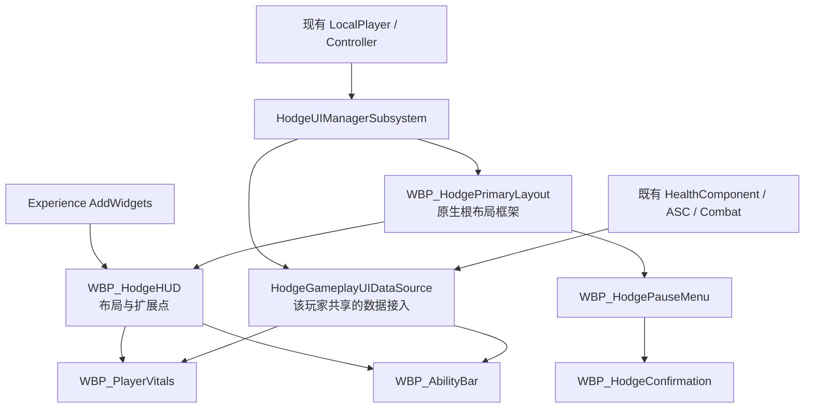

# UMG 可视化制作与 UI 父类精简方案

> 2026-10-08 · 已实施。以下保留设计约定；实际完成项和验证见 [本轮报告](../Validation/umg-authoring-refactor-2026-10-08.md)。

[现有 UI 实现](hodge-ui-foundation.md) · [现有配置指南](../Guides/ui-foundation-configuration.md) · [此前运行验证](../Validation/ui-foundation-2026-10-08.md)

## 1. 设计结论

采用用户熟悉的 UMG 工作方式：界面的控件树保存在 WBP，打开 Designer 就能看见并编辑；位置、尺寸、图片、颜色、字体、排版、按钮和动画由蓝图制作。C++ 保留通用框架以及玩法数据接入，不再逐个创建这些界面的控件树。

建议退役目前六个业务控件 C++ 类，新增一个按本地玩家共享的 `UHodgeGameplayUIDataSource` 数据对象。血条、技能栏、菜单和确认框不再各有专属原生父类。新增的是可组合的数据对象，不是新的 Widget 父类，也不挂到角色身上。

仍保留 `UHodgePrimaryGameLayout`、`UHodgeHUDLayout`、`UHodgeActivatableWidget` 等框架类。WBP 需要基础父类来参与层栈和输入路由，但不需要为每张具体页面增加一个 C++ 类。

保持 UE 5.5.4、现有单一 Hodgepodge Runtime、GameInstance／LocalPlayer／Controller 继承体系及 Experience 注入。不引入 CommonGame、CommonUser、ModularGameplayActors 或新的数据绑定插件。

## 2. 当前问题与实现依据

[HodgeGameplayWidgets.cpp](../../Archive/UI/NativePrototype/HodgeGameplayWidgets.cpp) 在 `NativeOnInitialized` 中调用 `WidgetTree->ConstructWidget`，创建 HUD、血条、技能栏、菜单和确认框。Designer 中没有对应的序列化控件树，因此无法直接编辑游戏里看到的布局。

[HodgePrimaryGameLayout.cpp](../../Source/Hodgepodge/Private/UI/Foundation/HodgePrimaryGameLayout.cpp) 同样在运行时创建四个 Stack。[制作工具](../../Source/HodgeAbilityEditor/Private/HodgeUIAuthoringLibrary.cpp) 当前只创建空 WBP，并选择上述原生父类。

现有“发现非空 WidgetTree 就跳过原生创建”的分支，只允许替换布局；它没有完整连接自制菜单按钮、技能项和确认结果。血条的 `BindWidgetOptional` 与两个显示更新事件，也不能替代整套 Designer 制作契约。

上一轮已经验证的是运行闭环。可视化制作、预览、修改与复用需要本轮另行补齐。

## 3. C++ 类的取舍

### 保留通用框架

- `UHodgeUIManagerSubsystem`：每个 LocalPlayer 的根布局、Controller 更换、输入令牌与清理；同时管理该玩家的数据源生命周期。
- `UHodgePrimaryGameLayout`：层栈注册、Push／Pop、异步加载与取消。四个容器改为绑定 WBP 中的控件，不再构造布局。
- `UHodgeHUDLayout`：通用 HUD 页面入口、Escape 菜单和既有设备处理。它不认识具体血条、技能项或面板样式。
- `UHodgeActivatableWidget`：通用页面的 Game／Menu 输入配置；菜单和确认框都复用它。
- `UHodgeGameViewportClient`、现有 UIExtension：保留输入路由、玩家 Context 和 Experience 注入／撤销。

这些类是框架职责，不因采用 Designer 而消失。不新增一种 UI 页面就复制一套框架。

### 退役六个业务控件类

- `UHodgeGameplayHUDWidget`：布局进入 `WBP_HodgeHUD`，该 WBP 改为直接继承 `UHodgeHUDLayout`。
- `UHodgePlayerVitalsWidget`：布局和显示进入 `WBP_PlayerVitals`；属性订阅与重绑移入共享数据源。
- `UHodgeAbilityBarWidget`：布局和技能项管理进入 `WBP_AbilityBar`；GAS 查询与提交输入移入共享数据源。
- `UHodgeAbilitySlotButton`：替换为蓝图技能项与通用按钮模板。
- `UHodgePauseMenuWidget`：按钮、默认焦点和所属确认框管理进入 `WBP_HodgePauseMenu`。
- `UHodgeConfirmationWidget`：一次性结果、确认／取消按钮和关闭处理进入 `WBP_HodgeConfirmation`。

`FHodgeHUDAbilitySlot` 是数据结构，可以保留并移到适当的 UI 数据头文件；不为了保存一个结构体而保留整套业务 Widget 类。

退役必须在 WBP 重设父类、旧引用清零与验证完成后进行。旧原型源文件可集中保留在 `Archive/UI/NativePrototype`，不参与 UBT／UHT；不是本次审查阶段就删除文件。

## 4. 目标所有权

框架负责页面所在的玩家与层，数据源负责连接该玩家的玩法对象，WBP 负责显示和交互。数据源不持有界面对象、不创建菜单、不决定装备或伤害，也不承担 UIManager 的页面调度职责。

## 5. 正式 WBP 的制作方式

### WBP_HodgePrimaryLayout

路径保持 `/Game/Main/UI/Foundation/WBP_HodgePrimaryLayout`，仍继承 `UHodgePrimaryGameLayout`。

Designer 中放一个 Overlay，其下四个 `CommonActivatableWidgetStack` 从低到高为：

- `GameLayer` → `UI.Layer.Game`。
- `GameMenuLayer` → `UI.Layer.GameMenu`。
- `MenuLayer` → `UI.Layer.Menu`。
- `ModalLayer` → `UI.Layer.Modal`。

原生根布局新增对应的 `BindWidget` 容器引用，在初始化时注册四个层；注册完成后才允许管理器广播根布局就绪。这些名称是框架绑定契约，位置和样式可以在 Designer 修改。现有 `RegisterLayer` 接口保留用于明确的扩展。

正式根布局缺少必需容器时应给出编译／配置错误，不再静默生成另一棵运行时树。初始化顺序应保证蓝图初始化流程看到的是已注册的层。

根布局 Designer 可预览层结构；默认不会显示尚未压入的 HUD、菜单或确认框，这符合层栈的运行方式。

### WBP_HodgeHUD

路径保持 `/Game/Main/UI/HUD/WBP_HodgeHUD`，直接继承 `UHodgeHUDLayout`。

Designer 中放实际布局面板、提示文本，以及两个现有 `UIExtensionPointWidget`：生命区域配置 `UI.Slot.PlayerVitals`，技能区域配置 `UI.Slot.AbilityBar`。锚点、边距、对齐、尺寸等均在这里编辑。

保留 Experience 注入，因此 HUD Designer 默认显示扩展点占位；血条与技能栏在各自 WBP 中完整预览，进入游戏后由 Action 注入。第一版不再增加一套预览 DataAsset 或专门的预览父类。

重设父类后必须显式检查 Class Defaults：`InputConfig=Game`，`EscapeMenuClass` 指向正式 `WBP_HodgePauseMenu`。原先由业务 C++ 构造函数赋值的默认值不能假设会自动保留。

### WBP_PlayerVitals

路径保持 `/Game/Main/UI/HUD/WBP_PlayerVitals`，直接继承引擎 `UCommonUserWidget`。

Designer 中放真实的文字、ProgressBar、图标与背景；Graph 绑定共享数据源的生命更新事件，并调用自己的 `ApplyVitals` 蓝图函数更新显示。控件名称属于这个 WBP 的内部实现，不再依赖 C++ 的 `HealthValue`／`HealthBar` 成员名。

移动血条、改颜色、字体、背景或添加 UMG 动画，不需要修改 C++ 或属性系统。生命比例为 `Health / MaxHealth`，未就绪或 MaxHealth 无效时显示占位并避免除零。

### WBP_AbilityBar 与技能项

路径保持 `/Game/Main/UI/HUD/WBP_AbilityBar`，直接继承 `UCommonUserWidget`。在 Designer 中放技能项容器；槽位配置仍保留显示名称和 InputTag，可按外观需要增加图标等展示数据。

新增蓝图 `/Game/Main/UI/HUD/WBP_AbilitySlot`，同样继承 `UCommonUserWidget`。它负责一个技能项的图标、名称、不可用状态与冷却显示，通过蓝图初始化接收槽位配置和数据源。

技能栏创建这些蓝图条目，持有条目引用并统一刷新。点击技能项只提交 InputTag；普攻仍由 CombatComponent 选择连段，不能改为固定激活 GA_Attack_1。

按需新增 `/Game/Main/UI/Foundation/WBP_UIButton`，直接继承引擎 `UCommonButtonBase`，在 Designer 制作按钮外观，供菜单和技能项复用。这是 WBP 模板，不增加 C++ 按钮类。

### WBP_HodgePauseMenu 与 WBP_HodgeConfirmation

两者保持 `/Game/Main/UI/Menu` 的原路径，均直接继承 `UHodgeActivatableWidget`，配置 Menu 输入模式和返回处理；Designer 中制作面板、按钮、文字与动画。

菜单的“继续”按钮通过根布局 Pop 自己；“确认后继续”按钮 Push 已配置的确认 WBP，并绑定其一次性结果。确认框的接受／取消按钮进入蓝图统一的 `Finish(Result)` 流程。

两个页面均在蓝图实现 `BP_GetDesiredFocusTarget`，返回自己 Designer 中的默认按钮。菜单和确认框使用同一个原生页面基类，无须分别创建原生父类。

## 6. 唯一新增的通用数据对象

拟新增 `UHodgeGameplayUIDataSource : UObject`，位于 `Public/UI/Data`／`Private/UI/Data`。同一类的实现集中在一个主 cpp。它属于当前 LocalPlayer，由 UIManager 通过 UPROPERTY 强引用保存；玩法对象保存弱引用并显式解绑。

这是 UI 与既有玩法代码之间的小型接入对象，不是新的角色组件、复制对象、全局单例或每个控件独立的一套 ViewModel。

拟提供的能力：

- 获取当前生命快照：Health、MaxHealth、归一化比例、就绪与死亡状态。
- 广播生命快照变化及玩法目标变化，供多个 WBP 复用。
- 按 InputTag 查询技能显示状态：输入是否已接入、是否允许提交、实际冷却剩余时间。
- 按 InputTag 提交一次按下／释放意图，复用当前 ASC／Combat 输入链。

拟新增 `FHodgeUIVitalsSnapshot`、`FHodgeUIAbilityDisplayState` 等 BlueprintType 数据结构；字段不包含字体、颜色、控件引用或页面路径。数据源只读玩法状态，不修改属性、授予技能、结算伤害或调用死亡／重生流程。

UIManager 拟补 `GetRootLayoutForController` 与 `GetGameplayDataForController` 的蓝图查询入口：WBP 用自己的 OwningPlayer 获取对象，不使用全局 PlayerController(0)，并检查 Controller 所属 GameInstance 与 LocalPlayer。现有原生查询接口继续保留。

## 7. 数据订阅与就绪契约

### 共享数据源生命周期

LocalPlayer 加入时建立记录；Controller 就绪时创建／绑定该玩家的数据源和根布局。更换 Controller 或移除 LocalPlayer 时，取消旧请求、解绑旧玩法对象并清理记录。专服不创建这些本地 UI 对象。

旧数据源解除绑定后即失效：即使控件池暂时仍保存其引用，查询也返回未就绪，提交输入被拒绝，不能继续操作旧 Controller 或新的玩家对象。

Pawn 更换时，数据源先解除旧 HealthComponent、PawnExtension 与 PlayerState 的订阅，发布未就绪快照，再绑定新对象。ASC 未就绪时等待现有初始化通知；不能每帧遍历全世界寻找角色。

当前 [PlayerState](../../Source/Hodgepodge/Public/Core/PlayState/HodgePlayerState.h) 已有 `AreAttributesReadyFor` 与复制的 AttributeReadyState，但没有供 UI 数据源订阅的就绪变化委托。本方案拟在现有 PlayerState 增加轻量原生就绪通知，并从现有 `NotifyAttributeReadiness` 路径广播，覆盖服务器更新与客户端 OnRep。该通知属于玩法就绪契约，不引用 WBP 或 UI 数据源。

生命快照的 Ready 必须同时确认当前 Pawn／ASC Avatar、HealthComponent 和属性就绪，而不是仅判断 MaxHealth 大于零。就绪变化时主动重新读取并发布，即使生命数值没有变化也要更新 UI。

之前观察到的重生 +50 过渡值仍是需要专项检查的玩法时序；本方案不靠固定 Delay 隐藏它，也不承诺增加就绪通知就能修复装备 GE 的撤销顺序。

### WBP 的订阅与复用

血条在 Construct 时获取数据源，绑定自己的更新事件，然后立即读取一次快照；Destruct 时只解绑自己的事件并释放引用。重复 Construct 不得重复绑定，重新加入界面后必须立即刷新。

初始化一次的配置放 OnInitialized；与显示次数相关的绑定、定时器和解除放 Construct／Destruct。可激活页面的每次请求状态在 OnActivated 重置，不能假设 OnInitialized 每次打开都会执行。

生命显示采用事件更新。第一版技能栏用一个约 0.1 秒的 Blueprint 定时器查询可见槽位的冷却／输入状态；条目自身不再各建一个定时器，栏移除时清理定时器。不使用每帧属性绑定去扫描 ASC。

数据源提交输入时重新检查玩法就绪、死亡、输入阻断 Tag 和当前玩家 UI 模式，不能只相信按钮上一次刷新时的 Enabled 状态。连段输入允许缓存的语义与直接技能的 CanActivate 区分处理，不能把普攻按钮固定为“下一段 GA 此刻能立即激活”。

## 8. 确认框与输入清理必须保留

确认框改成蓝图实现也要保持此前修复的资源所有权：

- 菜单保存自己打开的确认框引用，重复点击不叠加同一个请求。
- 菜单停用／销毁时先清空记录，再撤销这个确认框，避免结果回调重入；不清空其他页面的 Modal。
- 确认框每次激活重置完成标记；`Finish(Result)` 先标记完成，再关闭并广播结果。
- Esc、外部 Pop、菜单卸载和根布局销毁都按取消结果结束未完成的请求；确认／取消结果只广播一次。
- 调用者明确解绑结果事件；控件池复用时不保留上一轮菜单的绑定或完成状态。
- 晚到结果只作用于仍有效且匹配当前请求的菜单，不得关闭下一次打开的页面。

菜单打开／关闭仍由 CommonUI 和 UIManager 调整输入、释放能力按住状态、清空连段缓存和移动意图。Blueprint 按钮不能另行调用一套 SetInputMode／暂停服务器来争夺输入配置；原有客户端隔离继续保留。

菜单的确认类采用已加载的蓝图类引用，直接使用现有 Push／Pop；Escape 菜单软加载继续由通用 HUD／根布局处理。第一版不新增 Blueprint 异步节点类、页面定义 DataAsset 或第三套调度机制。

## 9. Designer 预览约定

六个正式界面的 WidgetTree 必须保存到资产，打开 Designer 能看见对应控件层级和静态外观。技能项与按钮模板也必须可独立预览。

WBP 在 PreConstruct 的 IsDesignTime 分支中设置本地预览文字、比例、图标和冷却示例。预览时不查找游戏 Pawn，不访问 ASC、不注册数据源、不启动运行定时器，也不施加 GE。

HUD 预览显示扩展点占位；运行时的模块注入内容在对应子 WBP 编辑。根布局预览显示层容器。迁移后的操作指南要明确这两种预览方式，不能继续笼统承诺“打开 HUD 就自动显示完整运行实例”。

## 10. 原路径、默认值与制作工具

现有六个 WBP、EAS_HodgeGameplayUI、输入数据和默认 Experience 均保留原路径。原则上只重设 WBP 父类、制作控件树和蓝图行为；新技能项／按钮模板在 Main/UI 下，不新增每个功能一套 DataAsset。

EAS 的 Layout／Widgets 继续引用原 WBP 路径和原 Slot Tag；RootLayoutClass、ViewportClient 配置及 InputData 路径继续使用现有值。角色、普攻、武器、动画和伤害资产不属于本轮修改范围。

重设父类前逐项保存并迁移默认值：HUD 的 InputConfig／EscapeMenuClass，技能栏 Slots，菜单 ConfirmationClass、页面返回设置、焦点和其他用户已修改的配置。业务界面的控制成员变为 WBP 变量，不能依赖删除原生父类后仍然存在。

旧原生类的引用必须同时检查 C++、WBP 父类、资产引用、制作工具与测试脚本。优先显式 Reparent，不使用宽泛 CoreRedirects 把所有旧类都映射到不兼容的统一基类。

制作工具改为在编辑模式创建并保存初始 WidgetTree／Graph。运行时不得生成正式布局。模板生成只作用于本轮明确授权的迁移或新资产，后续检查／复跑不能覆盖用户已经编辑的 Designer 树与 Graph。

[HodgeUIAuthoringLibrary](../../Source/HodgeAbilityEditor/Private/HodgeUIAuthoringLibrary.cpp) 的旧业务类 StaticClass／Cast，以及 [UI 测试](../../Tools/UIFoundation/README.md) 的旧原生类型查找都要同步调整。测试读取共享数据快照和正式 WBP 的实际结构／结果，不为保留旧测试而留下空的业务 C++ 父类。编辑器工具引用保留基类时需核对跨模块导出，Runtime 不能无条件依赖 Editor 模块。

## 11. 实施顺序与恢复

1. 用户已批准实施，迁移与回归按下述顺序完成。
2. 核对用户当前未保存的 UI 修改，按相关文件与资产做小范围备份，建议放 `Saved/UMGAuthoringRefactor/Before` 并记录 manifest；不复制整个项目，也不把备份放回 Content。
3. 增加共享数据源、必要的蓝图查询接口和属性就绪通知；暂时保留旧业务类型供资产迁移。按项目约定关闭编辑器后构建 Editor／Game。
4. 编辑器中逐个重设 WBP 父类、建立 Designer 树、配置默认值与 Graph；制作技能项／按钮模板，编译保存并检查引用。迁移工作由实施完成，不能要求用户自行补缺失接口。
5. 清除运行时布局生成与旧业务类依赖，更新工具和回归脚本；验收后把旧原型源移到编译范围外的统一目录。
6. 最终 Editor／Game 构建、Blueprint／资产检查、可视化编辑与玩法回归；更新配置指南和知识库，再交付用户编辑入口。

回滚需要恢复相关旧 C++ 与原 WBP 资产，并在关闭编辑器后常规构建；不能只恢复指向已退役父类的旧 uasset。迁移完成前不移除仍被资产引用的原生类型。

## 12. 验收标准

### UMG 制作验收

- 打开每个正式 WBP，Designer 中有真实控件树；没有整张页面依靠运行时 ConstructWidget 才出现。
- 修改血条位置、宽度、颜色、字体，保存后 PIE 生效；修改这些外观不需要 C++ 构建。
- 技能项可在 Designer 调整图标、间距、冷却表现；增加展示槽位只修改蓝图配置，技能本身仍需既有玩法授予。
- 菜单／确认框可编辑按钮、面板与 UMG 动画；点击、Esc 与默认焦点保持正确。
- HUD 扩展点与子 WBP 的预览差异在指南中明确说明；Designer 无 Pawn 时无报错、无玩法副作用。
- 修改用户 Designer 树后复跑制作／检查工具，外观和 Graph 不被覆盖。

### 框架与玩法回归

- 生命初值、伤害、MaxHealth、死亡、Pawn 更换、属性就绪和重复订阅／解绑。
- 技能提交仍走 InputTag，普攻仍保持当前五段连段和缓存；实际冷却展示不依赖自造倒计时。
- 菜单不重放旧攻击／移动输入；确认框结果只执行一次，反复打开及对象池复用无残留绑定。
- 打开确认框后卸载 HUD／移除玩家，Menu／Modal 均按所属关系清理；重新注入不阻断输入。
- Experience 冷加载、卸载／再激活、根布局重建和异步取消／失败。
- 单人、两人 Listen／Client 的 UI 和数据隔离，以及 100ms 延迟下连段／移动取消回归。
- Editor／Game、Blueprint 编译、资产校验和 Designer 视觉检查分别记录；未执行的 Cook／打包或独立进程不能计为通过。

## 13. 本次审查重点

建议确认的核心方向是：保留通用层栈／页面框架，退役六个业务原生控件类，新增一个共享数据接入对象；界面、按钮行为和预览全部在 WBP 制作。蓝图资产会增加可复用的技能项和按钮模板，而业务 C++ 控件父类数量减少。

这次不扩展完整前端、库存、设置、登录、匹配或加载屏，也不修复完整重生属性流程。本轮已按用户授权开始迁移；实际验证见交付报告。

审查阶段仅编写文档；后续实施阶段的构建、资产与 PIE 验证另行记录，不沿用审查阶段的未实施描述。
