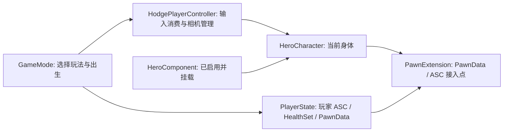

# 架构职责与对象所有权

> 最近源码核对：2026-09-17。源码接入状态与运行验收分开记录。
[返回首页](README.md) · [下一步：启动链](03-runtime-startup.md) · [本轮变更](21-update-2026-09-17.md)

## 全局与世界级对象

`UHodgeAssetManager` 负责项目资产入口、同步取用、启动任务及 GameData。它不是关卡角色数据的拥有者，也不应承担战斗状态。

`UHodgeGameInstanceBase` 注册 Init State 顺序，并提供主玩家控制器访问。GameInstance 的生命周期跨地图，但这不等于所有 WorldSubsystem 或 Actor 也跨地图。

`AHodgeGameModeBase` 负责服务器侧玩法选择和玩家出生。构造函数设置 GameState、PlayerState、PlayerController、HUD 与默认 Pawn 类。地图蓝图可覆盖 GameMode，实际使用类型必须在 PIE 确认。

`AHodgeGameState` 挂载 ExperienceManager，并有自己的 ASC。GameState ASC 不是玩家 ASC，调试时必须检查 OwnerActor，不能看到一个 ASC 就认定玩家初始化完成。

`UHodgeGlobalAbilitySystem` 是世界级全局能力管理器。玩家 ASC 在获得新 Pawn Avatar 后向它注册，ASC EndPlay 时注销。它管理全局授予，不负责选择玩家的 PawnClass。

## 玩家对象链

PlayerState 持有玩家 ASC，有利于换 Pawn 时保留能力系统所属对象。AvatarActor 是当前执行动画、移动和技能表现的身体。死亡后是否保留某项 GE、是否清空技能输入、是否重置 Health，是项目策略，不能仅凭 ASC 放在 PlayerState 上就认为处理完毕。

PlayerController 当前主要把 ReceivedPlayer、SetPawn、OnPossess、OnUnPossess、OnRep_PlayerState 桥接到 LocalPlayer 的委托。该基类仍主要做事件桥。当前 GameMode 选择新增 AHodgePlayerController 派生类，它在 PostProcessInput 调用 ASC::ProcessAbilityInput，并指定 HodgePlayerCameraManager。

## 角色继承与组件

`AHodgeCharacterBase → AHodgeCombatCharacter → AHodgeHeroCharacter` 是玩家继承链；Enemy 从 Combat 分支扩展。

- Base：直接继承 ACharacter，替换 CharacterMovement，并接入 ModularGameplay Receiver；PreInitializeComponents 注册 Receiver、BeginPlay 发送 GameActorReady、EndPlay 成对移除，生命周期已对称。
- Combat：创建 PawnExtension 和 HodgeCameraComponent；提供 ASC 查询、移动标签、蹲伏、死亡相关占位和移动复制逻辑；构造设置朝向移动（`bOrientRotationToMovement`）、`RotationRate=(0,720,0)` 与 Mesh 相对旋转 (0,-90,0)。
- Hero：构造创建 HeroComponent，由其协调初始化；`PossessedBy` / `OnRep_PlayerState` 现仅调用 Super，ASC 接入已收敛为 HeroComponent→PawnExtension 单一入口。
- Enemy：只设置 AI 自动控制；自身旋转/移动参数均已注释，改由 Combat 基类统一设置，尚未建立自己的完整 ASC 初始化。

CombatComponentBase 虽然名字表达战斗职责，但当前主要是构造函数关闭 Tick。不能把 V2 方案里的 Weapon、Combo、Trace 当成它已经具有的方法。

`Source/Hodgepodge/*/CodexText` 是一组**独立实验模块**：`AHodgeSurvivorHero`、`AHodgeSurvivorMode` 直接继承引擎 ACharacter / AGameModeBase，完全绕开 Hodge 的 GAS/Experience 体系；`AHodgeLocomotionLabMode` 则复用 HodgeGameModeBase。除自身外，主角色体系没有任何 C++ 引用它们。它们不改变上面的玩家对象链，也不代表主框架已具备对应能力。

## 组合架构的正确边界

PawnData 描述“这类 Pawn 使用什么”；PawnExtension 协调“数据和 ASC 是否已接入”；HeroComponent 已协调“玩家依赖就绪后如何绑定输入和选择相机”；Ability 执行技能；HealthSet 存储和约束属性。

这套分工可以避免 HeroCharacter 的 PossessedBy 越写越大。ASC 接入路径现已收敛到 HeroComponent→PawnExtension 单一入口，双路径不再是当前风险；剩余工作是验证换 Pawn、重生和 GameFeature 卸载时的清理顺序。

## 三种就绪不能混为一谈

1. Experience Loaded：本次玩法的加载和 Action 执行阶段结束。
2. Pawn GameplayReady：组件 Init State 达到末端。
3. 可玩：输入、相机、能力授予、动画和资产实际配置全部通过运行验收。

PawnExtension 自己推进到 DataInitialized 时只广播通知，不执行 ASC 初始化；实际 ASC 接入发生在 HeroComponent 观察到 PawnExtension 到达 DataInitialized 后、进入自身 DataInitialized 的转换里。因此即使状态推进，也不能单靠 GameplayReady 标签宣称系统完整；Hero 末端仍留有 `TODO add ability initialization checks?`。

源码入口：[GameMode](../../Source/Hodgepodge/Private/Core/GameMode/HodgeGameModeBase.cpp)、[PlayerState](../../Source/Hodgepodge/Private/Core/PlayState/HodgePlayerState.cpp)、[CombatCharacter](../../Source/Hodgepodge/Private/Character/HodgeCombatCharacter.cpp)、[GlobalAbilitySystem](../../Source/Hodgepodge/Private/AbilitySystem/HodgeGlobalAbilitySystem.cpp)。
