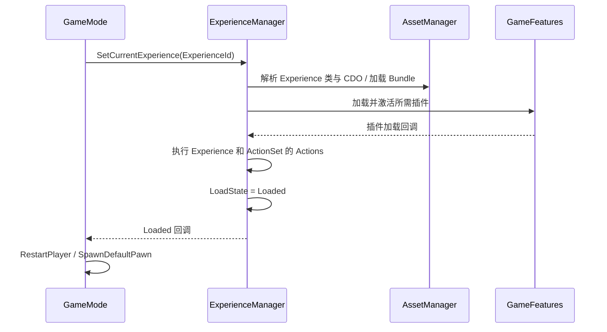

# 从启动到生成玩家的调用链

[返回首页](README.md)

## 启动前的选择

DefaultEngine.ini 指向 ThirdPersonMap，并通过旧类名和 CoreRedirects 指定项目 GameMode、GameInstance。必须分别验证配置解析和地图 World Settings 覆盖。不要直接采用 Lyra 参考文档中的 FrontEnd 默认地图。

AssetManager 的启动任务调用 InitializeGameplayCueManager 和 GameData 加载。前者目前只有占位，不代表 Cue 预加载已经执行。GameData 加载失败存在 Fatal 路径，因此默认资源路径属于启动基础依赖。

GameInstance::Init 注册四个 Init State 的先后顺序。注册状态名只是定义顺序，不会主动给任何 Pawn 绑定输入。

## Experience 选择链

GameMode::InitGame 将玩法分配延迟到下一帧。HandleMatchAssignmentIfNotExpectingOne 依次检查 URL 的 Experience 参数、编辑器覆盖占位、命令行参数、WorldSettings 占位、Dedicated Server 分支及默认 Experience。

当前有效来源包括 URL、命令行和默认 `Exp_HodgeDefaultExperience`。代码注释列举的 Matchmaking、DeveloperSettings、WorldSettings 不能都算有效功能，因为对应主体仍有注释或空分支。

命令行不指定类型时会补 HodgeExperienceDefinition；指定但 AssetManager 找不到时记录错误并回退。确认选中了什么，优先查 `Identified experience ... (Source: ...)` 日志。

## 加载流程

状态机依次涉及 Unloaded、Loading、LoadingGameFeatures、可选的 LoadingChaosTestingDelay、ExecutingActions、Loaded。没有插件时可以直接进入后续阶段。加载延迟是调试异步竞态的入口，不是生产玩法规则。

Loaded 委托分 HighPriority、普通、LowPriority。调用 CallOrRegister 时若已加载，则立即执行；未加载则挂起等待。开发时要考虑两条路径，不要默认回调总在未来某一帧。

CurrentExperience 通过复制到客户端，OnRep_CurrentExperience 启动客户端加载。客户端资源加载完成时间不能假定与服务器完全同步。

## PlayerState 与出生

PlayerState::PreInitializeComponents 创建后的 ASC 已存在，调用 InitAbilityActorInfo(this, GetPawn())，此时 Pawn 可能尚未产生。服务器注册 Experience 完成回调后，通过 GameMode 获取 PawnData，再调用自身 SetPawnData。

GameMode 对 Experience 未完成的玩家暂缓 HandleStartingNewPlayer；完成后遍历没有 Pawn 的控制器，符合重生条件的调用 RestartPlayer。

GetPawnDataForController 按以下顺序取数据：PlayerState 上的数据 → 已加载 Experience 的 DefaultPawnData → AssetManager 默认 PawnData。Experience 尚未加载时返回空。

GetDefaultPawnClassForController 优先 PawnData.PawnClass；空时回退构造函数的 AHodgeCharacterBase。SpawnDefaultPawnAtTransform 使用延迟构造，为 FinishSpawning 之前注入数据留了位置，但注入块目前仍注释。

## 失败与退出边界

- 指定 Experience 不存在：有日志和默认回退，不代表回退资源一定存在。
- GameFeature 回调：需要复核失败结果如何影响状态；当前不能把 Loaded 当成所有外部插件成功的强保证。
- Dedicated Server 默认地图分支：TryDedicatedServerLogin 返回 true，但实际登录回调停用，可能提前结束分配。
- Experience EndPlay：有停用 Action、插件引用计数和暂停等待逻辑；源码注明部分加载状态的清理尚不完整。

源码入口：[GameMode](../../Source/Hodgepodge/Private/Core/GameMode/HodgeGameModeBase.cpp)、[ExperienceManagerComponent](../../Source/Hodgepodge/Private/Component/HodgeExperienceManagerComponent.cpp)、[ExperienceManager](../../Source/Hodgepodge/Private/Data/HodgeExperienceManager.cpp)。
