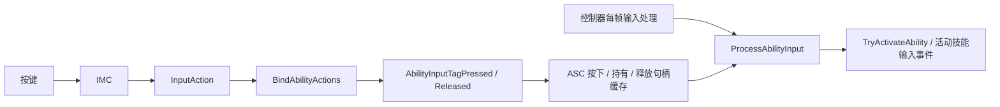

# Enhanced Input 与技能输入

> 最近源码核对：2026-09-13。源码接入状态与运行验收分开记录。
[返回首页](README.md)

## 两套映射分别负责什么

IMC 把物理按键/手柄轴映射到 InputAction，带触发器、修饰器和优先级。InputConfig 把 InputAction 关联到 GameplayTag，分 NativeInputActions 与 AbilityInputActions。只有 InputConfig 而没有活动 IMC，按键不会产生目标 Action；只有 IMC 而没有绑定，Action 不会驱动项目函数。

当前 Content/Main 有 IA_Move、IA_LookMouse、IA_Look、IA_Jump 等资源，名称说明意图，不证明 Axis 类型、Swizzle、Negate、触发条件和键位配置正确。

## 移动与视角目标链

物理输入 → 活动 IMC → InputAction → HodgeInputComponent::BindNativeAction → HeroComponent 的 Move/Look → AddMovementInput / AddControllerYawInput / AddControllerPitchInput。

Move 实现用控制器 Yaw 计算世界方向，X 对应 Right、Y 对应 Forward。鼠标 Look 直接使用输入增量；手柄 Look 乘速率和 DeltaSeconds。实现时不要给鼠标再套同样的每秒速率逻辑而改变灵敏度语义。

## 技能输入目标链

AbilityInputTagPressed 遍历已授予 Spec，用动态源标签精确匹配。ProcessAbilityInput 根据策略处理持有和按下，尝试激活，然后处理释放并清理本帧缓存。它不是自动 Tick 的组件函数，需要显式调用。

## 当前实现与剩余条件

- HeroComponent 已启用，绑定 Move、Look_Mouse、Look_Stick、Crouch、AutoRun 和 AbilityActions；AutoRun 回调的实际切换调用仍注释。
- PawnExtension::SetupPlayerInputComponent 只重新检查状态。
- HodgeInputComponent::AddInputMappings / RemoveInputMappings 只有参数 check，没有实际映射工作。
- DefaultInput.ini 已选择 HodgeInputComponent，LocalPlayerClassName 已选择 HodgeLocalPlayerBase。
- 新 AHodgePlayerController 已在 PostProcessInput 调用 ProcessAbilityInput，GameMode 已选择该控制器。
- 两个 GameFeature 输入 Action 的添加分支已启用，BindInputsNow 已发送；实际 Action 配置仍待资产验证。
- Hero 在初始化开头 ClearAllMappings，且 AddMappingContext 位于 bRegisterWithSettings 条件内；该标志为 false、DefaultInputMappings 为空、软引用未加载或 InputConfig 为空都会影响映射。
- 即使 InputConfig 为空或组件 Cast 失败，尾部仍可能置 bReadyToBindInputs 并发送事件；Ready 不等于实际绑定成功。

## 绑定和解绑的所有权

基础玩家映射适合由 Hero 初始化负责；玩法扩展映射由对应 GameFeature 管；UI 模态映射将来由 UI 生命周期管。明确谁加谁删，比统一 ClearAllMappings 更容易兼容多玩法和 UI。

当前基础和额外绑定的 BindHandles 为局部数组；绑定句柄应保存到与 InputComponent 生命周期一致的对象，移除额外配置时只删除自己的绑定。当前 RemoveAdditionalInputConfig 仍是 TODO，不能在启用 GameFeature 热切换前忽略。

## 最小排障顺序

1. 实际 Pawn 是目标 Hero，且被本地 Controller 控制。
2. LocalPlayer 和 EnhancedInput 子系统存在。
3. 活动 IMC 中有目标 IA。
4. 实际 InputComponent 为预期类型。
5. Native 回调确实收到非零 Value。
6. AbilitySet 已在服务器授予且客户端能看到 Spec。
7. InputConfig Tag 与 Spec 动态源 Tag 精确一致。
8. Pressed 缓存后 ProcessAbilityInput 每帧执行。
9. 最后查技能 Cost、Cooldown、Tag 和 ActivationGroup 拒绝原因。

源码：[InputComponent](../../Source/Hodgepodge/Public/Input/HodgeInputComponent.h)、[InputConfig](../../Source/Hodgepodge/Public/Input/HodgeInputConfig.h)、[ASC](../../Source/Hodgepodge/Private/AbilitySystem/HodgeAbilitySystemComponent.cpp)、[控制器](../../Source/Hodgepodge/Private/Core/PlayerController/HodgePlayerControllerBase.cpp)。
