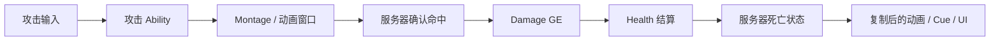

# 属性、伤害、战斗与死亡

> 最近源码核对：2026-09-17。源码接入状态与运行验收分开记录。
[返回首页](README.md)

## 已实现的属性基础

UHodgeHealthSet 构造默认 Health=100、MaxHealth=100、BaseDamage=0、BaseHeal=0。Health 与 MaxHealth 向相关客户端复制；BaseDamage 与 BaseHeal 使用 OwnerOnly 条件。复制通知调用 GAS 属性通知宏。

Health OnRep 会广播 OnHealthChanged，在血量首次到零时广播 OnOutOfHealth。MaxHealth OnRep 广播最大血量改变。PreAttributeChange 与 PreAttributeBaseChange 会进行约束：Health 在 0 到 MaxHealth 之间，MaxHealth 至少为 1。

最大血量降低时，PostAttributeChange 会把超出的当前 Health 压回新上限；血量恢复为正时重置耗尽标记。这些是有效逻辑。

## 不能误认为已经完成的部分

当前头文件已声明 Damage、Healing 元属性。PostGameplayEffectExecute 已实现 Damage 扣 Health、Healing 加 Health、夹取、重置元属性、Health/MaxHealth 变化广播和 OnOutOfHealth 广播；PreGameplayEffectExecute 已加入免疫与非 Shipping GodMode 条件。伤害消息路由代码仍注释。

因此当前已经有“GE 写 Damage/Healing → Health 结算 → 耗尽事件”的有效管线；但耗尽事件不是完整服务器死亡流程，角色 HealthComponent 和死亡绑定仍需接通。客户端 OnRep 的通知也不能替代权威端行为。

CombatCharacter 的 HealthComponent 创建与绑定仍注释。角色存在 OnDeathStarted/Finished 等接口，不代表 HealthSet 零血量会自动调用这些接口。

CombatComponentBase 没有武器 Trace、连招状态或命中去重主体。EnemyCharacter 没有自己的完整 ASC/AttributeSet 创建与初始化。当前无法以 C++ 证据确认完整的攻击怪物闭环。

攻击侧进展（⚠️ **已修正**）：~~连招数据（`UHodgeComboSet`）与时间轴 Task（`UHodgeAbilityTask_PlayTimeline`）已有实现，但没有任何 C++ 攻击 Ability 调用它们~~ —— 实际是连招与时间轴**已随未提交改动回退，当前工作区不存在**；`GA_Melee.uasset` 与 `Content/Main/Character/Hero/Ability/` 目录同样不存在，当前 Hero 目录下是 `GA_Attack.uasset`（工作区未提交，父类 / Montage / 命中配置未解析）。技能授予路径本身已接通（PlayerState::SetPawnData），所以缺的仍是"**具体攻击 Ability（含时间轴/连击的从零实现）+ 命中判定 + 目标 ASC**"这三环。详见 [GAS 章节](07-gas.md) 与 [回退标注](21-update-2026-09-17.md)。

## 推荐最小战斗闭环

第一版可以先用明确的测试目标验证 GE 改 Health，不要在尚未验证属性管线时同时加入复杂连招、RootMotion、锁定和装备。

## 伤害契约需要先确定

1. 伤害量从哪里来：固定值、SetByCaller 或 ExecutionCalculation。
2. 目标是哪一个 ASC：玩家来自 PlayerState，敌人需定义所有权。
3. 当前结算采用 Damage/Healing 元属性；具体 GE 如何填值以及是否允许直改 Health，应保持一致。
4. 谁在服务器触发零血量事件，以及如何保证只触发一次。
5. 死亡后哪些技能被取消，哪些 SurvivesDeath 能力保留。
6. 重生重置哪些属性、Tag、输入、碰撞和动画状态。

其中元属性结算已经实现，其余伤害来源、目标和死亡策略仍需补全。知识库不替项目选定一个尚未落地的伤害公式。

## 命中与表现职责

Notify 可标记攻击窗口，但客户端动画回调不能直接成为最终扣血事实。需要服务器验证目标、范围、阵营和本次攻击是否已命中。一次攻击的去重集合应有明确生命周期，不能把每帧 Trace 的同一目标都重复伤害。

Cue、音效、命中特效和浮字属于表现。丢失特效不应改变服务器伤害结果；同样，客户端播放了 Montage 不能作为服务器成功激活能力的唯一证据。

## 最小验收

使用两个可确认 ASC 的测试单位。记录服务器 GE 应用前后 Health，确认远端看到同样数值；使 Health 归零，确认权威死亡事件只发生一次；再重生验证 ASC Avatar 更新，旧 Pawn 不再响应输入或伤害回调。

源码：[HealthSet](../../Source/Hodgepodge/Private/AbilitySystem/AttributeSet/HodgeHealthSet.cpp)、[CombatCharacter](../../Source/Hodgepodge/Private/Character/HodgeCombatCharacter.cpp)、[CombatComponent](../../Source/Hodgepodge/Private/Component/HodgeCombatComponentBase.cpp)、[Enemy](../../Source/Hodgepodge/Private/Character/HodgeEnemyCharacter.cpp)。
