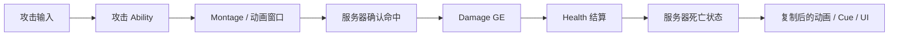

# 属性、伤害、战斗与死亡

> 最近源码核对：2026-09-28（HEAD `6eec094`）。源码接入状态与运行验收分开记录。
[返回首页](README.md)

## 已实现的属性基础

属性分在两个 AttributeSet：

- `UHodgeHealthSet`：`Health` / `MaxHealth`（向相关客户端复制）+ 元属性 `Damage` / `Healing`。构造默认 Health=100、MaxHealth=100。
- `UHodgeCombatSet`：`BaseDamage` / `BaseHeal`（OwnerOnly 条件）—— 能力 / GE 配置用的基础值，本轮从 HealthSet 拆出。

复制通知调用 GAS 属性通知宏。

Health OnRep 会广播 OnHealthChanged，在血量首次到零时广播 OnOutOfHealth。MaxHealth OnRep 广播最大血量改变。PreAttributeChange 与 PreAttributeBaseChange 会进行约束：Health 在 0 到 MaxHealth 之间，MaxHealth 至少为 1。

最大血量降低时，PostAttributeChange 会把超出的当前 Health 压回新上限；血量恢复为正时重置耗尽标记。这些是有效逻辑。

## 已接通的部分（2026-09-28 更新）

- **元属性结算**：PostGameplayEffectExecute 已实现 Damage 扣 Health、Healing 加 Health、Clamp、重置元属性、Health/MaxHealth 变化广播与 `OnOutOfHealth` 广播；PreGameplayEffectExecute 处理自毁 / 免疫 / 非 Shipping GodMode。
- **生命组件与死亡流程** ✅：`UHodgeHealthComponent` 已由 `AHodgeCombatCharacter` 构造创建并绑定 `OnDeathStarted` / `OnDeathFinished`；监听 HealthSet 的三个事件，维护 `DeathState`（ReplicatedUsing）状态机 → 禁用移动与碰撞 → 下一帧销毁 → `UninitAndDestroy`。与"存数值"的 HealthSet 分工明确。
- **伤害 / 治疗 Execution** 🆕：`HodgeDamageExecution` 捕获 Source 的 `BaseDamage`（snapshot）→ × 距离衰减 × 物理材质衰减 × `DamageInteractionAllowedMultiplier` → 写入 `HealthSet.Damage`；`HodgeHealExecution` 捕获 `BaseHeal` → clamp ≥ 0 → 写入 `Healing`。
- **攻击 Ability** 🆕：`UHodgeGameplayAbility_BasicAttack` 五段连招已消费时间轴与 `WaitMoveCancel`，见 [KB-16](12-integration-backlog.md)。

## 不能误认为已经完成的部分

🔴 **伤害恒为 0**：`HodgeDamageExecution` 里 TeamSubsystem 判敌我的整段被注释，`DamageInteractionAllowedMultiplier` 恒 `0.0f` → **打中也不掉血**。这是当前战斗闭环最大的缺口（[KB-08](12-integration-backlog.md)）。

其余缺口：

- 无防御属性、无暴击、无 `DamageType.*` 分支（只有 `BaseDamage × 距离衰减 × 物理材质衰减`）。
- `HandleOutOfHealth` 里 Elimination / Verb Message 广播整段注释（淘汰 / 击杀提示链未接）。
- `CombatComponentBase` 没有武器 Trace、连招状态或命中去重主体。
- `EnemyCharacter` 没有完整 ASC / AttributeSet 创建与初始化 → 无法以 C++ 证据确认"打怪物"闭环。
- `UHodgeComboSet` 仍不存在；时间轴的**重入类时序**与跨端、时钟倒退仍未验证。

客户端 OnRep 的通知不能替代权威端行为。角色存在 `OnDeathStarted/Finished` 接口不等于 HealthSet 归零会自动调用——现在之所以会调用，是因为 HealthComponent 已真正挂载并绑定。

## 推荐最小战斗闭环

```mermaid
flowchart LR
    Input[攻击输入] --> GA[攻击 Ability]
    GA --> Montage[Montage / 动画窗口]
    Montage --> Hit[服务器确认命中]
    Hit --> GE[Damage GE]
    GE --> HP[Health 结算]
    HP --> Death[服务器死亡状态]
    Death --> Present[复制后的动画 / Cue / UI]
```

第一版可以先用明确的测试目标验证 GE 改 Health，不要在尚未验证属性管线时同时加入复杂连招、RootMotion、锁定和装备。

## 伤害契约需要先确定

1. 伤害量从哪里来：固定值、SetByCaller 或 ExecutionCalculation。
2. 目标是哪一个 ASC：玩家来自 PlayerState，敌人需定义所有权。
3. 当前结算采用 Damage/Healing 元属性；具体 GE 如何填值以及是否允许直改 Health，应保持一致。
4. 谁在服务器触发零血量事件，以及如何保证只触发一次。
5. 死亡后哪些技能被取消，哪些 SurvivesDeath 能力保留。
6. 重生重置哪些属性、Tag、输入、碰撞和动画状态。

其中元属性结算已经实现，其余伤害来源、目标和死亡策略仍需补全。知识库不替项目选定一个尚未落地的伤害公式。

## 命中与表现职责

Notify 可标记攻击窗口，但客户端动画回调不能直接成为最终扣血事实。需要服务器验证目标、范围、阵营和本次攻击是否已命中。一次攻击的去重集合应有明确生命周期，不能把每帧 Trace 的同一目标都重复伤害。

Cue、音效、命中特效和浮字属于表现。丢失特效不应改变服务器伤害结果；同样，客户端播放了 Montage 不能作为服务器成功激活能力的唯一证据。

## 最小验收

使用两个可确认 ASC 的测试单位。记录服务器 GE 应用前后 Health，确认远端看到同样数值；使 Health 归零，确认权威死亡事件只发生一次；再重生验证 ASC Avatar 更新，旧 Pawn 不再响应输入或伤害回调。

源码：[HealthSet](../../Source/Hodgepodge/Private/AbilitySystem/AttributeSet/HodgeHealthSet.cpp)、[CombatSet](../../Source/Hodgepodge/Private/AbilitySystem/AttributeSet/HodgeCombatSet.cpp)、[HealthComponent](../../Source/Hodgepodge/Private/Component/HodgeHealthComponent.cpp)、[DamageExecution](../../Source/Hodgepodge/Private/AbilitySystem/Executions/HodgeDamageExecution.cpp)、[HealExecution](../../Source/Hodgepodge/Private/AbilitySystem/Executions/HodgeHealExecution.cpp)、[BasicAttack](../../Source/Hodgepodge/Private/AbilitySystem/Abilities/HodgeGameplayAbility_BasicAttack.cpp)、[CombatCharacter](../../Source/Hodgepodge/Private/Character/HodgeCombatCharacter.cpp)、[CombatComponent](../../Source/Hodgepodge/Private/Component/HodgeCombatComponentBase.cpp)、[Enemy](../../Source/Hodgepodge/Private/Character/HodgeEnemyCharacter.cpp)。
