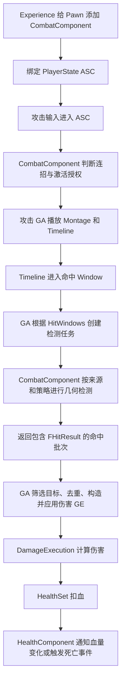

现在这套链路已经变成：**统一的 CombatComponent 管理连招和几何检测，攻击 GA 接收命中结果并应用现有伤害 GE，HealthSet 处理扣血。**

> 2026-10-06 状态同步：学习解说保留；当前角色攻击由统一 Combat 检测上报、Melee GA 构建/施加 GE。DamageRules 不再恒零，正式 HitWindows 仍为空，不能用流程图代替接入证据。 当前项目事实见 [本轮更新](../KnowledgeBase/26-update-2026-10-06.md)。

但要先说明当前完成程度：**底层链路在测试资产中已经跑通，正式五段攻击还没有配置伤害窗口；客户端首次攻击也有一个尚未解决的服务器属性初始化问题。** 所以目前还不能说正式战斗系统全部完成。

**一、从进入游戏到造成伤害，完整流程是什么**

````

````

这里虽然图中 CombatComponent 出现了两个职责，但它们已经在**同一个 Pawn 组件**里面，没有独立的 ComboComponent 了。

1. **角色准备阶段**

   Experience 通过 `GameFeatureAction_AddComponents` 给 Pawn 添加 `UHodgeCombatComponentBase`。它不是角色 C++ 构造函数中的默认子对象。

   玩家 ASC 仍属于 PlayerState。Pawn 初始化后，CombatComponent 通过 PawnExtension 的初始化入口绑定当前 ASC，建立连招运行状态和相关监听。

   常驻武器继续走之前完成的链路：PawnData 配置默认武器，服务器在 ASC 初始化后装备，解绑时撤销，重生后的新 Pawn 重新装备。

   **拥有武器和能够用武器造成伤害是两件事。** 武器生成出来以后，还需要配置它的检测来源，并让攻击定义引用这些来源。

2. **攻击输入阶段**

   输入先进入 ASC，再交给当前 Pawn 的 CombatComponent 判断：

   - 当前处于哪个连招节点。
   - 本次输入对应什么意图。
   - 当前是否允许进入下一段。
   - 是否需要缓存输入，以及缓存是否过期。
   - 是否满足转移条件、取消窗口和激活要求。

   满足条件后，组件授权并激活对应攻击 GA。客户端可以参与输入和预测，但服务器仍会校验激活请求。

   当前资产里的实际连招路线是 **01 → 02 → 03 → 05 → 04**，系统遵循你的数据配置。

3. **攻击执行阶段**

   攻击 GA 读取对应 `AbilityDefinition` 的执行配置，播放 Montage，创建与 Montage 时间同步的 Timeline 任务。

   Timeline 上的不同事件有不同用途：

   - 恢复窗口：描述攻击恢复状态。
   - 移动取消窗口：允许移动打断。
   - 下一段取消窗口：允许连招衔接。
   - 命中窗口：启动、持续和关闭伤害检测。
   - Point 事件：按配置触发事件或连招转移。

   因此，**动画正在播放，不代表正在检测伤害**。只有进入配置好的命中窗口，检测才会启动。

**二、命中 Window 到底怎么触发检测**

这里需要区分三个配置，它们分别回答三个问题：

- **WindowTag：什么时候检测。**
- **SourceTag：从哪里检测。**
- **Profile：用什么算法检测。**

例如，一段剑攻击可以配置成：

```
Timeline 的 Window：
    WindowTag = Status.Attack.HitCheck.Weapon
    StartTime / EndTime = 动画中刀刃有效接触的时间区间

攻击 Definition 的 HitWindows：
    WindowTag = Status.Attack.HitCheck.Weapon
    SourceTag = Combat.Source.Weapon.MainHand
    Profile = 使用 SocketSweep 的检测配置
    DamageEffect = GameplayEffectParent_Damage_Basic
    DamageMultiplier = 本段攻击倍率
    RepeatHitInterval = 0
    HitGroup = 留空
```

Timeline 进入该 Window 后，会把窗口进入事件直接交给 GA。GA 在 `HitWindows` 中查找对应配置，再通过 `WaitHitResults` 任务让 CombatComponent 创建检测会话。

**现在并不是靠监听 ASC 的 loose tag 数量启动检测。** 单独调用 `AddLooseGameplayTag(Status.Attack.HitCheck.Weapon)`，不会自动开启伤害检测。真正的入口是 Timeline 的窗口进入/退出回调。

这样同一个 Tag 出现在不同时间窗口，或者存在重叠窗口时，仍然可以按事件索引和会话分别管理。

另外，Timeline 的 `WindowEffectClass` 是窗口期间的状态效果位置，**不要把瞬时伤害 GE 填在那里**。伤害 GE 配在攻击定义的 `HitWindows.DamageEffect` 中。

**三、武器、本体、碰撞盒分别怎么检测**

CombatComponent 根据 `SourceTag` 查找实际来源，再调用 Profile 配置的策略。

- **武器检测**

  来源配置在 `HodgeWeaponInstance.HitSources` 中。

  需要指定武器表现 Actor 的下标、实际组件名、Socket 名称和检测半径。配置刀根、刀尖两个 Socket 后，可以沿刀身增加采样点，再扫掠上一帧到当前帧的位置。

  这比只在武器原点放一个球更适合刀剑。但是否覆盖完整刀刃，取决于实际 Socket 和采样配置。

- **本体检测**

  来源配置在 CombatComponent 的 `HitSources` 中。

  可以使用角色 Mesh 原点加局部偏移，也可以使用拳头、脚部等 Socket。它同样可以使用 SocketSweep 策略。

  所以“本体”表示来源属于角色，**不代表固定使用某一种前方球形算法**。

- **指定碰撞盒检测**

  来源同样配置在 CombatComponent 中，通过组件对象名找到角色上的 `UBoxComponent`，再使用 BoxSweep 策略。

  它读取盒体的位置、朝向和尺寸。当前旋转检测使用有限次插值查询，并非精确的连续旋转碰撞。

来源必须能够唯一解析。找不到来源，或者角色与已装备武器中出现多个相同 SourceTag 的来源，系统会报配置错误，不会随便选一把武器继续检测。

检测任务在服务器的 `PostPhysics` 阶段采样，并依赖相关 Mesh、来源组件的更新。窗口进入时立即采样，窗口内持续采样，正常退出时可以补最后一次采样。

**取消、死亡或移除组件时只清理，不额外补一次伤害。**

**四、检测之后，GA 怎么处理伤害**

CombatComponent 返回的是包含 `FHitResult` 的命中批次，而不是只返回 Actor 数组。

批次保留了：

- 命中的 Actor、组件和命中位置等信息。
- 本次 GA 的执行标识。
- 窗口索引和检测会话标识。
- 采样序号、采样时间。
- 来源位置和武器实例。

GA 先检查结果是不是属于当前执行，避免上一段攻击或旧 Pawn 的回调进入新攻击。然后执行默认处理：

1. 找到目标 ASC 和它的 Avatar。
2. 排除自己、无效目标、死亡目标，以及不符合队伍规则的目标。
3. 按目标 ASC 去重，避免同一角色的多个碰撞组件造成重复伤害。
4. 检查该目标是否已经在当前窗口或共享组中命中过。
5. 为这个目标单独创建伤害 Spec 和 EffectContext。
6. 把 `HitResult`、来源位置、攻击倍率等信息放进去。
7. 由 GA 应用伤害 GE。

因此，**CombatComponent 不决定伤害数值，也不应用伤害 GE。**

当前命中次数规则是：

- `RepeatHitInterval = 0`：每个目标在该窗口内只命中一次。
- `RepeatHitInterval > 0`：允许按指定世界时间间隔再次命中。
- `HitGroup` 留空：不同窗口分别记录命中。
- 同一次 GA 执行中使用相同 `HitGroup`：多个窗口共享命中记录。
- 下一次攻击 GA 激活：重新建立记录。

例如，一次挥刀用两个窗口描述前后两个阶段，如果不希望同一个敌人吃两次伤害，可以给两个窗口配置相同 HitGroup。

**五、GE 应用后，伤害和死亡怎么处理**

使用的是项目已有的：

```
/Game/GameplayEffects/Damage/GameplayEffectParent_Damage_Basic
```

默认近战链要求它是 Instant GE，并包含 `HodgeDamageExecution`，也可以使用满足该要求的子类。

DamageExecution 读取来源的 `CombatSet.BaseDamage` 捕获值，并结合：

```
最终伤害 =
    捕获的 BaseDamage
    × 本段 DamageMultiplier
    × 距离衰减
    × 物理材质衰减
    × 是否允许造成伤害
```

其中距离和材质衰减需要来源实现对应能力来源接口，否则使用默认系数。伤害类型 Tag 已经可以传入，但**不同元素、抗性等独立计算规则还没有因此自动实现**。

计算结果写入 `HealthSet.Damage`。HealthSet 再检查伤害免疫等规则，扣除 Health，并清空 Damage 这个临时属性。

HealthComponent 接收血量变化通知，供血条等逻辑使用。血量归零时，服务器会发送死亡 GameplayEvent，后续由配置好的死亡能力及角色死亡流程接手。

这里要区分三个事实：

- 检测到了碰撞。
- GA 尝试应用了伤害 GE。
- 目标实际掉血了。

它们并不等价。例如，目标免疫伤害时可能发生前两项，但不会掉血。后续做命中特效、伤害数字时，需要明确表现依赖哪一种事实。

**六、以后扩展功能，应该改哪里**

目前已经留了三个 GA 扩展入口：

- `CanApplyMeleeHit`：扩展目标资格，例如额外的阵营、状态、部位限制。
- `ApplyMeleeHitEffects`：扩展命中后应用的效果，例如伤害之外再施加减速、击退或异常状态。
- `ProcessMeleeHitResults`：替换整批结果处理，例如攻击没有 ASC 的资源、建筑或交互对象。

覆盖整批处理后，需要自己负责相应过滤和命中记录；覆盖效果提交时，如果调用父实现，父实现已经提交伤害，不要再提交一次相同 GE。

后续的职责分配可以继续保持：

- 新连招、输入缓存和转移规则：CombatComponent。
- 新检测形状：新增检测策略，并配置 Profile。
- 新武器或拳脚来源：配置 HitSources。
- 新攻击段的窗口和倍率：配置 AbilityDefinition 与 Timeline。
- 命中后的技能效果：攻击 GA。
- 通用伤害公式、抗性和减伤：DamageExecution。
- 扣血、免疫和死亡事实：HealthSet、HealthComponent。
- 声音、Niagara、受击表现：GameplayCue 或表现逻辑。

普通攻击变化应优先通过数据配置实现，不需要每换一把武器就新增一个完整 GA。

**七、现在已经完成了什么，还差什么**

已经完成并验证的部分包括：

- ComboComponent 合并到统一 CombatComponent。
- Experience 添加 Pawn 组件，玩家 ASC 继续归 PlayerState。
- 连招输入、授权、缓存、转移、取消和重生后恢复。
- Timeline 命中窗口到检测任务的连接。
- 本体、武器 Socket、命名碰撞盒三种来源。
- GA 接收结果、目标筛选、命中记录和应用既有伤害 GE。
- 取消、Pawn 更换、组件移除时的清理。

上一轮实际结果是：9 项原生测试通过；单人连招 13 个断言、客户端网络连招 17 个断言通过；伤害用例 **12 项中 11 项通过、1 项失败**。详细证据在[回归报告](E:/Project/Git/Hodgepodge/Docs/Design/combat-component-unification-validation-20261001.md)。

当前还差以下几块：

1. **正式攻击资产没有接上伤害配置。**

   `/Game/Main/Character/Hero/Ability/BasicAttack/DA_Attack_1` 到 `DA_Attack_5` 的 `HitWindows` 都为空。

   它们实际引用的 `/Game/Main/Character/Hero/Ability/BasicAttack/Timeline/DA_Attack01_Timeline` 到 `DA_Attack05_Timeline` 只有恢复和取消窗口，没有命中窗口。

   正式剑实例的 HitSources 也为空。因此现在正式连招能播放，不代表正式五段攻击已经可以造成伤害。

2. **客户端首次攻击的服务器属性初始化有问题。**

   测试预期目标从 100 降到 70，但客户端首次攻击实际降到 98.5；同时记录到服务器来源 BaseDamage 为 0，拥有端为 20。

   这说明服务器和拥有端的属性状态不一致。具体为何最终造成 1.5 伤害，还需要追踪 GE 捕获和修饰，不能只凭 BaseDamage 为 0 就直接定论。

3. **正式敌人的受伤链还需要接通并验收。**

   当前测试靶使用具备 ASC 和生命属性的角色。不能据此认定现有 Enemy 类已经完成 ASC、HealthSet、基础属性及死亡能力初始化。

   目标只为了受伤，不要求拥有 CombatComponent；但需要有效的 ASC、Avatar 和生命属性。敌人自己也要攻击时，再接入它的 CombatComponent 和攻击配置。

4. **战斗表现还没有完整接入。**

   命中火花、受击动画、音效、伤害数字、击退等不会因为扣血链路存在而自动完成。当前也不能把死亡事件入口描述成真实死亡动画已验证。

5. **还有部分边界未验证。**

   包括完整 GameFeature 卸载再激活、窗口中途卸下武器、友伤组合、真实死亡流程、延迟丢包、独立进程和打包。

**八、你后续应该按什么顺序推进**

我建议按下面顺序，每一步都建立明确的验收结果。

**第一步：先修客户端服务器属性初始化。**

追踪 PlayerState 授予 AbilitySet、属性初始化 GE、CombatSet 创建及 Pawn 绑定时序，保证服务器首次攻击使用正确基础属性，同时避免重生时重复叠加初始化效果。

验收标准是：新加入客户端第一次攻击就得到预期伤害，两端血量一致，不需要临时重新应用属性 GE 才能通过。

**第二步：只接通正式第一段剑攻击。**

打开正式 PawnData：

```
/Game/Main/Data/PawnData/DA_Dafult_PawnData
```

沿默认武器 `/Game/Main/Data/Equipments/BP_Equipment_Sword` 的 `InstanceType` 找到实际武器实例蓝图，在 HitSources 中配置主手剑来源，核实真实组件名、刀根刀尖 Socket 和半径。

然后给 `DA_Attack_1.HitWindows` 增加武器绑定，并在它实际引用的 `DA_Attack01_Timeline` 上增加同名命中 Window。开始、结束时间按动画中有效挥刀动作确定。

验收结果应当是：窗口内接触掉血、窗口外接触不掉血、同一窗口不重复掉血、取消后停止检测。

**第三步：把其余四段攻击配完。**

每一段单独调整命中窗口、倍率和来源。需要踢击的段使用脚部来源，需要特殊范围的段使用对应 Profile。

如果使用本体或碰撞盒来源，可以创建正式 CombatComponent 蓝图配置 HitSources，并让 Experience 的 AddComponents 引用它。武器来源已经足够的情况下，可以继续使用现有原生组件。不要同时再给角色添加第二个 CombatComponent。

**第四步：接入一个正式敌人。**

先完成它的 ASC、生命属性和初始化，再验证攻击、受伤、死亡、销毁或重生。先让一个敌人完整工作，再扩展不同敌人。

**第五步：补战斗反馈。**

先做受击反馈和命中特效，再做伤害数字、击退、顿帧等。挥刀拖尾可以跟动画 Notify；实际命中、实际伤害表现应从对应战斗事实触发，并处理网络播放。

**第六步：再增加复杂伤害规则。**

例如格挡、霸体、韧性、部位倍率和元素抗性。先明确每条规则属于目标资格、命中效果还是通用伤害公式，再放进相应层，避免所有逻辑重新堆到 CombatComponent。

当前设计说明在[近战检测与 GA 效果文档](E:/Project/Git/Hodgepodge/Docs/Design/melee-detection-ga-effects.md)。这次只核对和说明现有代码、资产记录与测试结果，没有修改代码，也没有重新执行构建或游戏测试。
