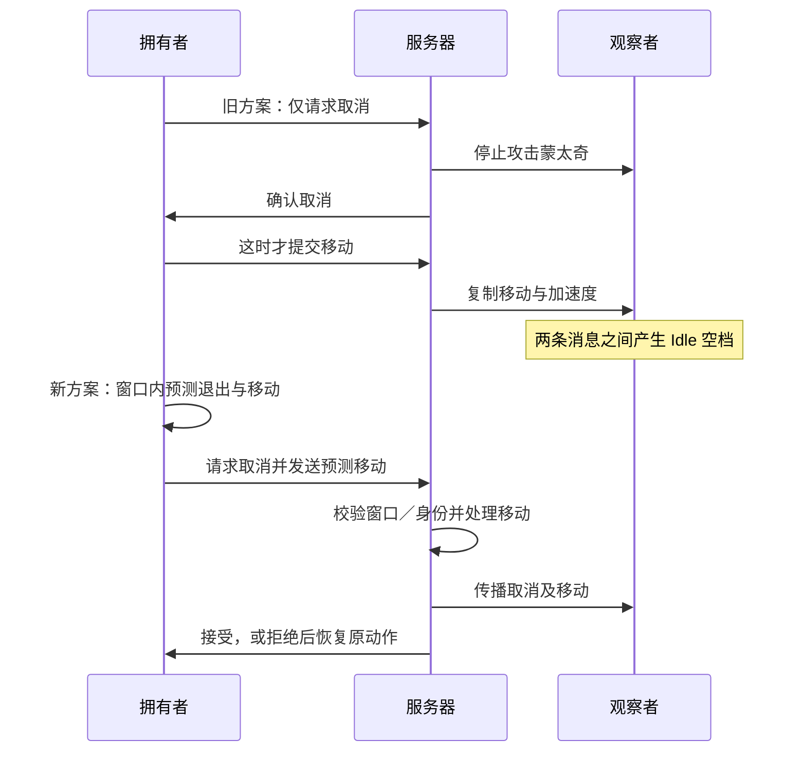

# 受击退出、移动取消与连段联机审查

日期：2026-10-09，UE 5.5.4。针对“受击结束跳 Idle、取消后摇先 Idle 再移动、其他客户端连段明显滞后”追踪实际代码，并采样一个 PIE 服务器和两个客户端。保留用户已有修改，源码／受击蒙太奇修改前副本在 `Saved/AnimationNetworkReview/Before`。

## 结论与架构边界

当前 Experience → PawnData → PlayerState ASC、原生 Definition GA、蒙太奇通知、伤害结算和目标受击的职责划分可以继续使用。问题集中在网络取消协议、退出语义和表现时间配置，不能仅凭症状判定全部框架必须重写。

但当前首版不能称为成熟 ACT 网络动作系统：本地执行预测、服务器裁决、模拟代理表现和移动重放必须一致；上一轮验收只检查动作播放／结束与控制清理，没有充分检查混出权重、取消与移动连续性，是验证缺口。

## 已确认问题及修正

### P1：移动取消等待服务器往返，制造远端 Idle 空档

旧链路：Hero.Input_Move 保存意图，但 Status.Attack 挡住实际输入；Combat.Tick 在窗口内发送 ServerMoveCancel；服务器下一动画帧校验后结束 GA；拥有者接收结束后才提交移动；移动再从拥有者传到服务器、从服务器传到观察者。

取消和移动不是同一次本地动作，因此观察者先收到停止蒙太奇，再收到加速度。100ms 包延迟基线中，观察者攻击权重归零约 0.941 秒，移动加速度约 1.074 秒，空档约 133ms。服务器也有约 128ms 空档。

修正保留原执行身份：拥有者在自己真实取消窗口中预测蒙太奇退出与移动权限，服务器仍校验 Avatar、SpecHandle、激活键、移动意图、窗口、可取消状态与输入限制。接受后结束原动作；拒绝且原动作仍有效时，按服务器位置／时间／倍率重放原蒙太奇并重绑实例回调。过期回复不能操作新执行。拒绝后持续按住同一移动输入不再反复退出／恢复，需要松开重按或新执行。

服务器 CharacterMovement 同时限制攻击期间未经授权的输入加速度；原实现主要在本地 Hero 输入入口限制，不能作为服务器资格验证。外部根运动与受击运动仍由各自路径管理。

### P1：Cancelled 参数没有变成 GAS 取消消息

Definition.FinishExecution 原先直接调用 EndAbility(..., bCancelled=true)。UE 的 UGameplayAbility::EndAbility 网络复制仍调用 ReplicateEndOrCancelAbility(..., false)，对应正常结束；真正的 CancelAbility 才复制取消。

实测拥有者因此使用 NaturalBlendOut=0.2，而服务器／观察者使用 StopBlendOut=0.1。现由项目在取消结束时明确复制 GAS 取消消息，再禁止 Super 重复复制正常结束，保留原生命周期清理。正常结束仍走原 GAS 结束路径。

### P1：0.4 秒硬直配了 4.33 秒完整受击，退出必然截断

正式 Profile 的 HitStun 默认控制时间为 0.4 秒，AM_Hero_HitStun 却覆盖源动画完整 4.333 秒。原受击 GA 结束还硬编码 CurrentMontageStop(0.1)，没有使用目标蒙太奇配置的退出时间。

本轮保留原源动画和攻击 Impact，主角 HitStun 蒙太奇段取默认 0.4 秒，预留 0.18 秒混出；退出改用蒙太奇自身 BlendOut。默认短硬直不再等价于播放完整长动作再在任意时刻切断。它仍是现有素材的配置结果，最终冲击、恢复和动作观感需要人工验收，不能用数值采样替代。

### P1：测试网络模拟未恢复，污染后续手工测试

UE NetEmulationHelper 的 PersistentPacketSimulationSettings 跨 NetDriver／PIE 生命周期保留。上一轮设置 PktLag=100 后，旧 stop_pie.py 只关闭 PIE，没有关闭模拟；原编辑器继续使用时可能保留测试延迟。

这些是 Console Command，不是普通 Console Variable。GetConsoleVariableIntValue 返回 0 并伴随“未找到变量”不能证明模拟关闭。当前结束脚本在所有有效 PIE 世界执行 NetEmulation.Off，再关闭 PIE。测试在开始时明确设置 0／100 并核对原生 PktLag 日志。不要对没有游戏 NetDriver 上下文的编辑器预览世界调用网络模拟命令。

### P2：ASC 在 PlayerState，但蒙太奇变更只优先刷新 Avatar

UE PlayMontage 默认 ForceNetUpdate Avatar；本项目 ASC 所有者是 PlayerState，不能把 Avatar 的刷新当作 ASC 更新保证。本轮在播放／停止时补刷新实际 ASC Owner。PlayerState 已设置 100Hz，不通过无界提高复制频率掩盖协议问题。

自定义 CurrentMontageStop 现在也尊重显式传入的复制混出时间；避免用本地配置覆盖 GAS 已收到的服务器 BlendTime。

## 实测时序

0ms 为明确关闭模拟后的同进程网络，100ms 为每个参与 NetDriver 的模拟发送包延迟；不声称真实 RTT 恰为 100ms。

100ms 基线：

- 拥有者停止约 0.844 秒，输入加速度也到 0.844 秒才出现，退出混出 0.2 秒。
- 服务器停止约 0.734 秒，权重归零约 0.844 秒，加速度约 0.973 秒。
- 观察者停止约 0.844 秒，权重归零约 0.941 秒，加速度约 1.074 秒，空档约 133ms。

首次修正复测：

- 拥有者停止约 0.612 秒，移动加速度约 0.642 秒，退出混出 0.1 秒。
- 服务器停止约 0.759 秒，权重归零约 0.875 秒，加速度约 0.786 秒。
- 观察者停止约 0.875 秒，权重归零约 0.959 秒，加速度约 0.904 秒；本次采样没有“权重归零后才开始移动”的空档。

基线正式连段顺序 01→02→03→05→04 在拥有者、服务器和观察者一致。100ms 场景拥有者首段约 0.014 秒开始，服务器约 0.135 秒、观察者约 0.237 秒；这是输入上行和动作下行的传播。其他玩家的输入不能凭空在观察者本地预测，不能承诺零延迟。需要控制额外等待、累计时钟误差、切段空档与不连续校正。

本轮使用 InspectMontageState 读取已开始混出的实例权重，而不是将 IsPlaying=false 当作权重已为 0。采样同时记录 CMC 加速度／速度、蒙太奇位置与实例、Locomotion 状态、骨骼和控制状态。

## 深层后续设计需要保留的约束

- Gameplay 控制阶段与动画表现阶段要有明确退出策略，不能将任意控制时长直接解释为任意动画的播放时长。
- ASC 蒙太奇复制与 Pawn 上的受击状态／观察者 Tag 是不同复制流；跨 Actor 不能依赖固定到达顺序，始终用执行身份、阶段和服务器时间约束过时消息。
- 预测成功之外还要验证拒绝恢复、持续输入、换 Pawn、死亡及消息乱序；不要把“本地先 EndAbility”当作完整预测协议。
- 观察者表现需要服务器时钟和位置校正，但网络传播与角色平滑本身仍有延迟；不要通过提前给权限、缩短取消窗口或盲目扩大误差阈值让测试通过。
- 原始受击素材与 Additive 轻反馈的美术品质属于独立验收。LightFeedback 已补匹配第 0 帧的静态预览基准；独立预览不会自动套用 AnimBP 上身 0.35 权重。

## 证据、命令与最终状态

源码副本、基线、修正采样、失败中间记录都在 Saved/AnimationNetworkReview。主要数据：baseline-0ms.json、baseline-100ms.json、fixed-0ms.json、fixed-100ms.json、final-100ms.json、timing-summary.json、rejected-move-cancel.json。

最终 Editor／Game 构建退出 0。18 项原生回归通过（15 无警告、3 带既有警告），新增服务器攻击输入约束断言通过。最终 0ms／100ms 下移动取消、正式五段连段和默认短受击三组均完成，无脚本断言失败；拒绝恢复负向用例通过，服务器保持原动作、拒绝移动加速度，本地恢复新蒙太奇实例，持续按住不再重复预测。

短受击最终采样的混出约 0.17～0.18 秒，三个视角都有连续权重衰减。本轮只验证配置和时序连续性，不声称素材的最终美术观感已验收。

构建使用 UE 5.5.4 的 Build.bat，目标 HodgepodgeEditor／Hodgepodge，Win64 Development，-WaitMutex -architecture=x64 -NoUBA -NoUBALocal -MaxParallelActions=2；Editor 另加 -NoHotReloadFromIDE。未使用 Live Coding，Runtime 修改均验证 Game 目标。最终日志 EditorBuildFinal.log／GameBuildFinal.log。

PIE 调用均通过 `E:/Python/python.exe Tools/HitReaction/mcp_execute.py <脚本>`：start_two_clients.py → setup_two_clients.py → setup_actors.py → review_animation_network.py；100ms 先 set_network_lag.py；负向验证 test_move_cancel_rejection.py；结束 stop_pie.py。原生回归在普通编辑器执行 `Automation RunTests Hodge.HitReaction+Hodge.Combat+Hodge.Combo+Hodge.Rotation`。

中间测试曾因目标被正式连段击杀导致句柄失效，已把观察者移出武器范围；首次受击有 0.4 秒大帧样本，不作为平滑混出通过证据。测试脚本曾误向编辑器世界发送 NetEmulation.Off，触发无效 WorldContext 断言，已删除该调用，只在有效 PIE 世界清理。以上问题与业务修正分别记录，不隐藏失败日志。

长时间复用编辑器 Python 环境的中间会话还出现过 python311.dll 调用栈异常；最终 0ms 复测改用新编辑器会话，保留原日志，不把工具异常描述成玩法通过或直接归因于 GAS。

本轮不升级引擎／插件，不改攻击判定与 Impact，不提交或覆盖用户已有工作。独立进程、跨机器、丢包／抖动压力、Cook 和打包未执行。
