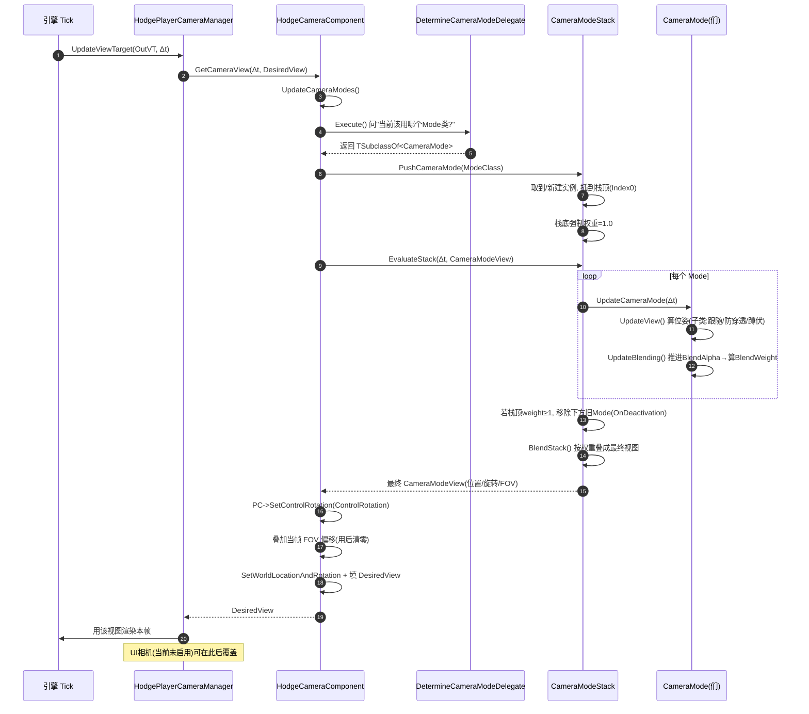

# Hodgepodge

> 一个基于 **UE 5.5** 的个人游戏框架，目标是"**Lyra 的架构理念 + GAS 的战斗**"，最终形态是 **UE Dedicated Server + 数据驱动的动作 RPG 底层框架**。

| 项目 | 值 |
|---|---|
| 引擎版本 | Unreal Engine **5.5** |
| 主模块 | `Hodgepodge`（Runtime，单模块） |
| 代码规模 | `Source/Hodgepodge` 共 130 个文件（65 `.h` + 62 `.cpp` + 3 `.cs`），约 16900 行 |
| 核心依赖 | GameplayAbilities、GameFeatures、EnhancedInput、**ModularGameplay**、AnimationWarping、ControlRig |
| 项目阶段 | ⚠️ **能编译、能启动，但角色不可操控** —— 见下方当前状态 |
| 相关文档 | [`LYRA_LEARNING_GUIDE.md`](LYRA_LEARNING_GUIDE.md)（学什么）、[`LYRA_RUNTIME_FLOW.md`](LYRA_RUNTIME_FLOW.md)（怎么跑）、[`UE5 开放世界动作 RPG 架构方案 V2.md`](UE5%20开放世界动作%20RPG%20架构方案%20V2.md)（总体方案） |
| 代码基线 | 提交 `25a1eb9`（HeroComponent + PawnData 注入 + 伤害治疗闭环 + UnrealMCP） |

---

## ⚠️ 当前状态：HeroComponent 就位，只差"挂上去"

上一阶段把 GAS / 输入 / PawnExtension 换成了 Lyra 实现，这一阶段补齐了 **HeroComponent、PawnData 注入、伤害治疗闭环**，并引入了 **UnrealMCP（AI 操控编辑器）** 工具链。好消息：卡了两轮的"链断在 `Spawned`"已经修好；坏消息：**真正驱动输入的 `UHodgeHeroComponent` 写完了但没人挂载**。

### 这一轮做了什么（`7488d31` → `25a1eb9`）

| 变更 | 说明 |
|---|---|
| **夺舍 HeroComponent** | 新增 `UHodgeHeroComponent`（`ULyraHeroComponent` 移植，FeatureName = `Hero`）：`InitializePlayerInput`（绑 Move / Look_Mouse / Look_Stick / Crouch / AutoRun + AbilityInputTag）、`AbilityCameraMode`、`DetermineCameraModeDelegate` 绑定、`AddAdditionalInputConfig` |
| **PawnData 注入修好了** ✅ | `AHodgeGameModeBase::SpawnDefaultPawnAtTransform` 里 `PawnExtComp->SetPawnData(PawnData)` **已解注释并真调用**（上一版 README 记的 P0 已解决） |
| **PawnData 补齐 5 个字段** ✅ | `PawnClass` / `AbilitySets[]` / `TagRelationshipMapping` / `InputConfig` / `DefaultCameraMode`（AbilitySets 的授予循环仍注释） |
| **伤害 / 治疗闭环** | `UHodgeHealthSet::PostGameplayEffectExecute` 完整结算（Damage / Healing Meta 属性 → 扣血加血 → 死亡判定 `bOutOfHealth` 边沿触发），`PreGameplayEffectExecute` 处理 `DamageImmunity` / `Cheat.GodMode`，外加 `ClampAttribute` 与 MaxHealth 下降压制 |
| **Ability 增强** | `UHodgeGameplayAbility` 新增 `ActiveCameraMode` + `Set/ClearCameraMode`；`AdditionalCosts` 解开（含 `ShouldOnlyApplyCostOnHit`，命中才付费且多个只算一次） |
| **Tag 体系扩充** | 新增 `Ability.ActivateFail.*`、`Ability.Type.Action/Passive.*`、`GameplayCue.*`、`GameplayEffect.DamageType.*`、`SetByCaller.Damage/Heal`、`Cheat.*`、`Status.Death.*`、`Movement.Mode.*` 等 |
| **UnrealMCP 插件 + AI 工具链** | 第三方 `UnrealMCP`（编辑器 MCP 服务端，`127.0.0.1:55557`）+ `Tools/UnrealMCP/server.py`（Python 前端）+ `AGENTS.md` / `.cursor/rules` / `.codex/config.toml`，见 [§12.6](#126-ai-辅助开发工具链) |
| **小修** | `DefaultEngine.ini` 加 `LyraHeroComponent → HodgeHeroComponent` 重定向；`.uproject` 禁用不存在的 `UNTLink`；`Content/CodexText/` 是 AI 演练产物（5 蓝图 + 4 关卡 + 4 UMG + 53 贴图），非正式内容 |

**编译状态**：✅ 通过（`25a1eb9`，Development Editor，约 42 秒）

### 当前的坑：HeroComponent 写好了，但没人 `CreateDefaultSubobject`

```
谁创建 UHodgeHeroComponent？     ← ❌ 全工程没有一处 CreateDefaultSubobject
   ↓ 于是
InitializePlayerInput()          ← 不执行 → 没有 Move / Look / Crouch 绑定
DetermineCameraModeDelegate      ← 不绑定 → 相机模式栈依旧空转
PawnExtension::InitializeAbilitySystem()  ← 唯一调用者在 HeroComponent 里 → 依旧不执行
```

**连带效果**：角色侧 `GetAbilitySystemComponent()` 仍然恒 nullptr，`OnAbilitySystemInitialized` 不触发，玩家**依然不能移动、不能转视角**。

### 三个 P0（按修完的收益排序）

| 缺口 | 说明 |
|---|---|
| **挂载 HeroComponent** 🔥 | 在 `AHodgeHeroCharacter` 构造里加 `CreateDefaultSubobject<UHodgeHeroComponent>(...)`。**这一行能同时点亮输入、相机模式栈、PawnExtension 的 ASC 初始化三件事** |
| **`DefaultPawnClass` 是基类** | `AHodgeGameModeBase` 构造函数里仍是 `DefaultPawnClass = AHodgeCharacterBase::StaticClass()`，而基类**没有 PawnExtensionComponent**（只在 CombatCharacter 里建）→ 若 `DA_Dafult_PawnData.PawnClass` 不指向 CombatCharacter 子类，`FindPawnExtensionComponent` 返回 nullptr，`SetPawnData` 会**静默跳过**（只打 Error 日志） |
| **`DefaultInputComponentClass` 不对** | `Config/DefaultInput.ini` 仍指向引擎 `EnhancedInputComponent`，HeroComponent 里 `Cast<UHodgeInputComponent>` 会 ensure 失败。要改成 `/Script/Hodgepodge.HodgeInputComponent` |

### 两个"编译得过、运行会炸/不生效"的隐患（上一版就有，仍未修）

| 隐患 | 说明 |
|---|---|
| **EffectContext 会 check 崩溃** | `UHodgeGameplayAbility::MakeEffectContext` 里 `check(EffectContext)`，但项目**仍然没有自定义 `UAbilitySystemGlobals`** 分配 `FHodgeGameplayEffectContext` → 一旦有 Ability 创建 EffectSpec 就直接崩 |
| **CueManager 空转** | `UHodgeGameplayCueManager::Get()` 把默认 CueManager 强转成本项目类型 → 返回 nullptr；且 `HodgeGameFeaturePolicy` 里注册那个 Observer 的一行**仍是注释**（L39），`InitializeGameplayCueManager()` 也还是空实现 |

> 修 `UAbilitySystemGlobals` 子类能一次解决上面两条，是目前性价比最高的一处改动。

> Experience 链路本身仍然完好（`5b8f460` 的成果），默认 Experience 是 `Exp_HodgeDefaultExperience`，换玩法依旧用 `-Experience=<资产名>`。

---

## 目录

- [1. 项目定位](#1-项目定位)
- [2. 技术栈与依赖](#2-技术栈与依赖)
- [3. 目录结构](#3-目录结构)
- [4. 快速开始](#4-快速开始)
- [5. 架构总览](#5-架构总览)
- [6. 核心系统详解](#6-核心系统详解)
- [7. 当前进度](#7-当前进度)
- [8. 代码规范与约定](#8-代码规范与约定)
- [9. 新人上手路径](#9-新人上手路径)
- [10. 调试与验证工具箱](#10-调试与验证工具箱)
- [11. 已知问题与技术债](#11-已知问题与技术债)
- [12. 附录：文件速查索引](#12-附录文件速查索引)

---

## 1. 项目定位

### 1.1 这是什么

Hodgepodge（大杂烩）是一个**用来长本事的框架工程**，不是一个要上线的游戏。它的定位与 Lyra 完全一致 —— 是 **bootstrapping framework（样板框架）**，不是 finished game。

它要回答的问题是：

> 如何围绕 UE 的核心技术，搭一套**能长出来**、**不推倒重来**、**从第一行代码就支持 Dedicated Server** 的动作 RPG 底层？

### 1.2 这不是什么

- **不是游戏** —— 没有可玩的玩法循环，没有 UI，没有关卡内容
- **不是 Lyra 的复制品** —— 只吸收理念，不整体照搬（Lyra 耦合的 CommonUI / CommonUser / GameSettings 等子系统，本项目一个都没引入）
- **不是稳定可运行的状态** —— 项目处于活跃的 Lyra 化重构中，能跑但有不少技术债，见 [§7 进度](#7-当前进度) 和 [§11 技术债](#11-已知问题与技术债)

### 1.3 从 Lyra 借来的设计信条

这些是本项目的"宪法"。完整推导见 [`LYRA_LEARNING_GUIDE.md` 第 4 章](LYRA_LEARNING_GUIDE.md#4-lyra-的十大核心设计理念)。

| # | 信条 | 本项目对应实现 | 状态 |
|---|---|---|---|
| 1 | **一套代码，多种玩法** | `UHodgeExperienceDefinition` + `AHodgeGameModeBase` 完整流程 | ✅ **已跑通** |
| 2 | **数据驱动** | `UHodgePawnData` / `UHodgeGameData` / `UHodgeInputConfig` | 🚧 PawnData 有 5 个字段了，但资产没配、授予代码仍注释 |
| 3 | **插件化扩展** | `UHodgeGameFeaturePolicy` + `GameFeatureAction_*` | 🚧 Policy 完成，4 个 Action 已解注释，但还没有插件实例 |
| 4 | **GameplayTag 作万能胶水** | `HodgeGameplayTags.h` + `FGameplayTagStackContainer` | ✅ |
| 5 | **组合优于继承** | `PawnData` 决定 Pawn 类、ModularGameplay 组件化 | ✅ |
| 6 | **服务器权威** | ASC 放 PlayerState、`Mixed` 复制模式 | ✅ |
| 7 | **Base / Concrete 分层** | `HodgeGameStateBase` → `HodgeGameState`、`HodgePlayerStateBase` → `HodgePlayerState` | ✅ **新增** |
| 8 | **Init State 链解耦异步依赖** | `UGameFrameworkComponentManager` + 4 个 InitState Tag + `PawnExtensionComponent` / `HeroComponent` 两个 Feature | 🚧 链已能走到 `GameplayReady`，但 HeroComponent **未挂载** → 输入/相机/ASC 三件事仍靠双入口顶着 |

### 1.4 与 Lyra 的关键分歧

读代码前务必理解这三点，否则会困惑"为什么这里和 Lyra 不一样"：

| 维度 | Lyra | Hodgepodge | 原因 |
|---|---|---|---|
| **Locomotion / Camera** | 自研 `LyraCharacterMovementComponent` + 相机模式栈 | **移动组件自研**：`UHodgeCharacterMovementComponent` 构造时替换默认组件；**相机直接夺舍 Lyra**：`UHodgeCameraComponent` + 相机模式栈 + `AHodgePlayerCameraManager` | 从 ALS 迁移途中：相机系统已按 Lyra 完整接入；移动仍是 UE 默认物理 + 少量扩展，locomotion 动画逻辑待重建 |
| **Pawn 与 GAS 的协调** | `ULyraPawnExtensionComponent` 驱动 Init State 链 | **PawnExtensionComponent 本轮已建并挂上**，但 `InitializeAbilitySystem()` 零调用者 → 实际**仍走双入口**：`PossessedBy` / `OnRep_PlayerState` 里 `InitAbilityActorInfo(PS, this)` | 迁移只差最后一步：先让 Init State 链走到 `DataAvailable`，再把双入口换成 PawnExtension 统一入口，见 [§6.6](#66-modulargameplay-与-init-state-链) / [§6.8](#68-gas-夺舍-lyra) |
| **UI / 设置 / 登录** | CommonUI + UIExtension + GameSettings + CommonUser 全家桶 | **全部没有** | 体量大、非核心矛盾，延后引入 |

---

## 2. 技术栈与依赖

### 2.1 引擎与模块依赖

`Source/Hodgepodge/Hodgepodge.Build.cs`：

```csharp
PublicDependencyModuleNames:  Core, CoreUObject, Engine, InputCore,
                              GameplayAbilities, GameplayTags, GameplayTasks,
                              ModularGameplay, GameFeatures,
                              AIModule, EngineSettings, NetCore,
                              AnimGraphRuntime,  // ← 斩杀 ALS 后新增（HodgeAnimInstance）
                              RigVM,             // ← 斩杀 ALS 后新增（ControlRig 节点）
                              ControlRig         // ← 斩杀 ALS 后新增
PrivateDependencyModuleNames: EnhancedInput, PhysicsCore, Niagara, SignificanceManager
```

`Hodgepodge.uproject` 启用的插件：`GameFeatures`、`GameplayAbilities`、`ModelingToolsEditorMode`（仅 Editor）、`AnimationLocomotionLibrary`、`AnimationWarping`（`UNTLink` 本轮已 `Enabled=False`）。

> ⚠️ 一个小警告（不影响编译）：模块依赖 `ModularGameplay` / `SignificanceManager`，但 `.uproject` 的 `Plugins` 段没把这两个**引擎插件**声明出来（代码级依赖能过，只是 UBT 会提示）。

### 2.2 插件清单

| 插件 | 版本 | 位置 | 状态 |
|---|---|---|---|
| **AnimationWarping** | 引擎自带 | 引擎插件 | ✅ `.uproject` 启用（动画变形/步法） |
| **AnimationLocomotionLibrary** | 引擎自带 | 引擎插件 | ✅ `.uproject` 启用 |
| **GameFeatures** | 引擎自带 | 引擎插件 | ✅ `.uproject` 启用 |
| **GameplayAbilities** | 引擎自带 | 引擎插件 | ✅ `.uproject` 启用 |
| **RiderLink** | — | `Plugins/Developer/RiderLink/` | ✅ Rider 联动，不参与游戏逻辑 |
| **UnrealMCP** | 第三方（MIT） | `Plugins/UnrealMCP/` | 🆕 **本轮新增**：编辑器 MCP 服务端（`127.0.0.1:55557`，仅 Editor，主模块不依赖）。详见 [§12.6](#126-ai-辅助开发工具链) |
| **ALS-Refactored** | 4.15 | `Plugins/ALS-Refactored-4.15/` | 🗑️ **已斩杀**：`.uproject` / `Build.cs` 均不再依赖它。目录还留着供参考，确认无用后删除 |

**斩杀 ALS 后，原有职责的顶替者**：

| ALS 组件（已删） | 顶替者 | 职责 |
|---|---|---|
| `AAlsCharacter`（继承基类） | `AHodgeCharacterBase` 直接继承 `ACharacter` | 角色基类恢复 UE 原生 |
| `UAlsCharacterMovementComponent` | `UHodgeCharacterMovementComponent` | 移动组件占位，构造时 `SetDefaultSubobjectClass` 换装 |
| `UAlsAnimationInstance` | `UHodgeAnimInstance` | GameplayTag → 动画变量映射 + 地面距离，见 [§6.14](#614-动画实例uhodgeaniminstance) |
| `UAlsCameraComponent`（自带 PCM） | `UHodgeCameraComponent` + `UHodgeCameraMode*` + `AHodgePlayerCameraManager` | Lyra 相机模式栈完整移植，见 [§6.13](#613-camera-系统lyra-移植) |

> 内容侧残留：`Content/ALSCamera/`、`AdvancedLocomotionV4/`、`ThirdPerson/` 与代码无关，等美术资源替换后清理。

### 2.3 未引入的 Lyra 插件

以下插件在 `LYRA_LEARNING_GUIDE.md` 里被标为"强烈推荐"，但**本项目一个都没有**。看到 `#include` 它们的代码，一定是编译不过的死代码。

`AsyncMixin`、`GameplayMessageRouter`、`UIExtension`、`ModularGameplayActors`、`CommonGame`、`GameSettings`、`CommonUser`、`CommonLoadingScreen`、`PocketWorlds`、`GameSubtitles`

---

## 3. 目录结构

### 3.1 源码目录

```
Source/
├── Hodgepodge.Target.cs
├── HodgepodgeEditor.Target.cs
└── Hodgepodge/
    ├── Hodgepodge.Build.cs
    ├── Hodgepodge.h / Hodgepodge.cpp
    ├── Public/       ← 65 个头文件
    └── Private/      ← 62 个实现文件，与 Public 大体镜像
```

| 目录 | 文件数 | 职责 | 重要度 |
|---|---|---|---|
| `AbilitySystem/` | 11 | ASC、**Ability + AbilityCost**、TagRelationship、GameplayCueManager、EffectContext、**GlobalAbilitySystem**、GameplayTags、GameplayTagStack、AttributeSet 2 个 | ★★★★★ |
| `Data/` | 8 | AssetManager、GameData、PawnData（5 字段）、**AbilitySet**、Experience 三件套 | ★★★★★ |
| `Core/` | 9 | GameInstance / GameMode / **GameState + GameStateBase** / PlayerController / **PlayerState + PlayerStateBase** / HUD / LocalPlayer | ★★★★★ |
| `Component/` | 8 | 组件基类 + ExperienceManagerComponent + 移动组件 + **PawnExtensionComponent** + **HeroComponent** | ★★★★★ |
| `Character/` | 4 | 角色继承链（Base → Combat → Hero；另有 Enemy） | ★★★★★ |
| `Camera/` | 7 | 相机模式栈整套（Lyra 移植） | ★★★★ |
| `Input/` | 6 | InputConfig（数据）+ InputComponent（绑定）+ UserSettings / MappableKeyProfile / Modifiers / AimSensitivity | ★★★★ |
| `GameFeatures/` | 8 | 7 个 GameFeatureAction + Policy | ★★（4 个已解注释） |
| `Interface/` | 2 | `ILoadingProcessInterface` + **AbilitySourceInterface** | ★ |
| `Animation/` | 1 | `UHodgeAnimInstance`（GameplayTag 映射动画变量） | ★★★★ |
| `Actor/` | 1 | Actor 基类 | ★ |

**本轮的文件变化**（`7488d31` → `25a1eb9`）：

```
新增：
  Component/     HodgeHeroComponent    ★ Init State 链第二个 Feature（输入 + 相机 + ASC 入口）
修改：
  Core/          HodgeGameModeBase     ★ SetPawnData 解注释（PawnData 注入修好了）
  Data/          HodgePawnData         补 5 个字段（PawnClass / AbilitySets / TagRelationshipMapping
                                       / InputConfig / DefaultCameraMode）
  AbilitySystem/ HodgeHealthSet        伤害/治疗结算 + 死亡判定；HodgeGameplayAbility 加 CameraMode
                                       与 AdditionalCosts；HodgeGameplayTags 大幅扩充
  GameFeatures/  HodgeGameFeaturePolicy  Cue 路径 Add 已实现（但 Observer 注册仍是注释）
  Plugins/       UnrealMCP/           第三方编辑器 MCP 插件 + Tools/UnrealMCP/server.py
项目根新增：AGENTS.md、.agents/、.cursor/rules/、.codex/config.toml（AI 协作配置）
```

**上一轮（`fb72c8c` → `7488d31`）的变化**：

```
新增：
  Component/     HodgePawnExtensionComponent            ★ Init State 链的第一个 Feature
  AbilitySystem/ HodgeAbilitySystemComponent            取代旧的 ...Base
                 HodgeAbilityTagRelationshipMapping / HodgeGameplayCueManager
                 HodgeGameplayEffectContext / HodgeGlobalAbilitySystem
  Abilities/     HodgeGameplayAbility / HodgeAbilityCost
  Data/          HodgeAbilitySet
  Interface/     HodgeAbilitySourceInterface
  Input/         HodgeInputUserSettings / HodgePlayerMappableKeyProfile
                 HodgeInputModifiers / HodgeAimSensitivityData
删除：
  AbilitySystem/ HodgeAbilitySystemComponentBase / HodgeGameplayAbilityBase（被 Lyra 版取代）
重命名：
  Input/         HodgeInputComponentBase → HodgeInputComponent（DefaultEngine.ini 加了 ClassRedirect）
```

> `Core/` 下有个历史遗留拼写错误：目录名是 `PlayState/`，应为 `PlayerState/`。**暂不修改**（改目录会动一堆 include 和 git 历史）。

### 3.2 内容目录

```
Content/
├── Main/                    ★ 项目自有内容，新东西放这里（36 个资产）
│   ├── Experiences/         Exp_HodgeDefaultExperience（当前默认）
│   ├── Data/                DA_Dafult_GameData / DA_Dafult_PawnData
│   ├── Input/               DA_HodgeInputConfig / IMC_Default / IMC_UI / InputAction/(18)
│   └── Character/
│       ├── Hero/Anim/       ABP_Pover_Base（漂泊者动画蓝图，基于 UHodgeAnimInstance）
│       │                    + Layer 动画层（ABP_ItemAnimLayers_Pover_Base / ALI_ItemAnimLayers）
│       └── EnemyBase/       ABP_Enemy_Base
├── CodexText/               ⚠️ **AI / MCP 演练产物，非正式内容**（见 [§12.6](#126-ai-辅助开发工具链)）
│                            5 个蓝图（BP_*Host / BP_MainMenuMode）+ 4 个关卡 + 4 个 UMG + 53 张贴图
├── qiuyuan/                 漂泊者角色资源（285）★ 新导入
├── Wuwa/                    鸣潮风格资源包（675 = 342 uasset + 322 fbx 模型 + 贴图）★ 新导入
├── Assets/                  通用资产（645）：Enemies / HeroCharacter / Weapons /
│                            Niagara / Sounds / Textures / Meshes / MaterialFunctions
├── Characters/              角色资源（146）
├── Collections/ Developers/ LevelPrototyping/   编辑器辅助目录
├── ALSCamera/ AdvancedLocomotionV4/   ALS 内容残留（待清理，代码已不依赖）
└── ThirdPerson/             UE 模板内容
```

> `__ExternalActors__/`、`__ExternalObjects__/` 是启用世界分区（World Partition）后关卡对象外置产生的，别手动改。

---

## 4. 快速开始

### 4.1 环境要求

| 项 | 要求 |
|---|---|
| 引擎 | Unreal Engine **5.5** |
| IDE | Visual Studio 2022 或 Rider for Unreal |
| 平台 | Windows（当前只验证过 Win64，DX12） |
| 渲染 | 开启了 DX12 / SM6 / 虚拟阴影贴图 / Lumen，显卡要求偏高 |

### 4.2 编译与运行

```powershell
# 1) 生成解决方案（引擎装在 E:\UE\UE_5.5，按你的实际位置调整）
& "E:\UE\UE_5.5\Engine\Build\BatchFiles\GenerateProjectFiles.bat" `
    -projectfiles -project="e:\Project\Git\Hodgepodge\Hodgepodge.uproject" -game -engine

# 2) 编译
& "E:\UE\UE_5.5\Engine\Build\BatchFiles\Build.bat" `
    HodgepodgeEditor Win64 Development -project="e:\Project\Git\Hodgepodge\Hodgepodge.uproject"

# 3) 打开编辑器
& "E:\UE\UE_5.5\Engine\Binaries\Win64\UnrealEditor.exe" `
    "e:\Project\Git\Hodgepodge\Hodgepodge.uproject"
```

### 4.3 运行检查清单

项目已可运行。如果启动异常，按这个顺序查：

1. **Experience 扫得到吗？** 看日志里有没有 `Identified experience ... (Source: Default)`。
   扫不到就检查 `DefaultGame.ini` 里 `HodgeExperienceDefinition` 的扫描目录是否是 `/Game/Main/Experiences`，以及 `Exp_HodgeDefaultExperience.uasset` 是否在那儿。

2. **`DefaultEngine.ini` 的 `AssetManagerClassName`** 必须是 `/Script/Hodgepodge.HodgeAssetManager`。
   错了会直接 `UE_LOG(Fatal)` 退出。

3. **`DefaultGame.ini` 的 `[/Script/HodgePodge.HodgeAssetManager]` 段**：
   ```ini
   HodgeGameDataPath=/Game/Main/Data/DA_Dafult_GameData.DA_Dafult_GameData
   DefaultPawnData=/Game/Main/Data/DA_Dafult_PawnData.DA_Dafult_PawnData
   ```
   GameData 加载失败是 **Fatal**，不是 Warning。

4. **`GlobalDefaultGameMode` 用的是旧类名** `/Script/Hodgepodge.HodgepodgeGameModeBase`，靠 `DefaultEngine.ini` 的 `[CoreRedirects]` 生效。能跑，但建议改成 `HodgeGameModeBase`。

5. **启动地图**：✅ `GameDefaultMap` / `EditorStartupMap` 都改成了 `/Game/ThirdPerson/Maps/ThirdPersonMap`（上一版指向的 ALS 关卡 `L_Als_Grid` 已删，本轮已修）。项目目前**还没有自己的关卡**，建好后记得换回来。

### 4.4 切换玩法

现在只有 `Exp_HodgeDefaultExperience` 一个 Experience。要试多种玩法：

```powershell
# 命令行指定（优先级高于 WorldSettings）
UnrealEditor.exe Hodgepodge.uproject -game -Experience=Exp_HodgeDefaultExperience

# 或在编辑器里新建：Content/Main/Experiences/ 下右键
# → Blueprint Class → 父类选 HodgeExperienceDefinition
# → 配 DefaultPawnData / GameFeaturesToEnable / Actions
```

> 新建的 Experience 会**自动被扫描到**，因为扫描项是整目录 `/Game/Main/Experiences`（`bHasBlueprintClasses=True`），不用改配置。

**验证是否生效**：日志过滤 `Identified experience`，`Source:` 字段会告诉你是从 OptionsString / CommandLine / WorldSettings / Default 哪一级来的。

---

## 5. 架构总览

### 5.1 分层图

```
┌──────────────────────────────────────────────────────────────┐
│  内容层    Content/Main  +  GameFeature 插件（尚未建立）        │
│           数据资产组合出的玩法，不改 C++ 代码                    │
├──────────────────────────────────────────────────────────────┤
│  玩法层    AbilitySystem/  Character/  Camera/  Animation/     │
│           Component/  GameFeatures/                            │
│           （战斗、装备、背包 — 大部分待建）                       │
├──────────────────────────────────────────────────────────────┤
│  框架层    Core/                                              │
│           ├─ Base 层   GameStateBase / PlayerStateBase         │
│           │            （生命周期 + ModularGameplay 接收者）     │
│           └─ 实例层   GameMode / GameState / PlayerState       │
│                       （Experience + GAS + 玩家状态）           │
│           Data/（AssetManager + Experience 三件套）            │
├──────────────────────────────────────────────────────────────┤
│  基础层    引擎: GAS / EnhancedInput / GameFeatures /           │
│             ModularGameplay / AnimationWarping / AssetManager   │
│            （ALS 已斩杀，插件仅剩 RiderLink 等开发者工具）       │
└──────────────────────────────────────────────────────────────┘
```

### 5.2 启动时序（当前实现）

Experience 已经接通，这是现在的完整流程：

```
① 引擎启动
   UHodgeAssetManager::StartInitialLoading()
     ├─ Super::StartInitialLoading()              扫描 PrimaryAssetTypesToScan
     ├─ STARTUP_JOB(InitializeGameplayCueManager())       [空实现]
     ├─ STARTUP_JOB_WEIGHTED(GetGameData(), 25.f)        同步加载 GameData
     └─ DoAllStartupJobs()                        权重进度 → [空实现]

   UHodgeGameInstanceBase::Init()
     └─ UGameFrameworkComponentManager 注册 4 个 Init State
        Spawned → DataAvailable → DataInitialized → GameplayReady

② 地图加载
   AHodgeGameModeBase::InitGame()
     └─ SetTimerForNextTick(HandleMatchAssignmentIfNotExpectingOne)

③ 下一帧 → HandleMatchAssignmentIfNotExpectingOne()
   按优先级确定 Experience：
     1. Matchmaking 分配        （未接入）
     2. URL Options             ?Experience=XXX
     3. Developer Settings      （仅 PIE，代码注释中）
     4. 命令行                  -Experience=XXX
     5. WorldSettings           （代码注释中，缺 UHodgeWorldSettings）
     6. Dedicated Server        TryDedicatedServerLogin()
     7. 硬编码默认               "Exp_HodgeDefaultExperience"   ← 目前总会走到这里

④ OnMatchAssignmentGiven(ExperienceId, Source)
     └─ ExperienceComponent->SetCurrentExperience(ExperienceId)

⑤ AHodgeGameModeBase::InitGameState()   （早于 ③④ 执行）
     └─ CallOrRegister_OnExperienceLoaded(→ this->OnExperienceLoaded)

⑥ UHodgeExperienceManagerComponent 状态机
   Unloaded → Loading（Bundle 异步加载，区分客户端/服务端）
            → LoadingGameFeatures（LoadAndActivateGameFeaturePlugin）
            → [LoadingChaosTestingDelay]（可选）
            → ExecutingActions（执行 Experience.Actions + ActionSets.Actions）
            → Loaded
   └─ 三档委托广播：HighPriority → Normal → LowPriority

⑦ AHodgeGameModeBase::OnExperienceLoaded()
     └─ 遍历所有 PlayerController，给还没有 Pawn 的玩家 RestartPlayer()

⑧ 生成 Pawn
   GetDefaultPawnClassForController()
     └─ GetPawnDataForController()
          ├─ PlayerState->GetPawnData()          （由 ⑨ 设置）
          ├─ Experience->DefaultPawnData
          └─ UHodgeAssetManager::GetDefaultPawnData()

⑨ AHodgePlayerState::OnExperienceLoaded()   （非客户端，注册于 PreInitializeComponents）
     └─ SetPawnData(GameMode->GetPawnDataForController(...))
          ├─ MARK_PROPERTY_DIRTY_FROM_NAME + 赋值
          ├─ [注释] AbilitySet->GiveToAbilitySystem()
          └─ SendGameFrameworkComponentExtensionEvent(NAME_HodgeAbilityReady)
```

### 5.3 关键设计：为什么 Pawn 要等 Experience 加载完才生成

只有 Experience 加载完成后，才知道该用哪个 `PawnData`、该授予哪些能力。所以：

- `HandleStartingNewPlayer_Implementation()` 里加了 `IsExperienceLoaded()` 守卫，没加载完就不处理新玩家
- `GetPawnDataForController()` 在 Experience 未加载时直接返回 `nullptr`
- `OnExperienceLoaded()` 负责给"已连接但还没 Pawn"的玩家补一次 `RestartPlayer()`

---

## 6. 核心系统详解

### 6.1 AssetManager ✅

`Data/HodgeAssetManager.h/.cpp` —— 整个项目完成度最高的部分，Lyra `LyraAssetManager` 的等价实现。

| 能力 | 说明 |
|---|---|
| **StartupJob 权重进度系统** | `STARTUP_JOB(func)` / `STARTUP_JOB_WEIGHTED(func, weight)` |
| **GameData 类型化缓存** | `GameDataMap` 以 Class 为 Key，避免重复加载 |
| **软引用同步加载** | `GetAsset<T>()` / `GetSubclass<T>()`，`bKeepInMemory` 控制常驻 |
| **常驻资源池** | `LoadedAssets` + `FCriticalSection` 持强引用防 GC |
| **PIE 预加载** | `PreBeginPIE()` 确保进入 PIE 前 GameData 就绪 |
| **调试命令** | `Hodge.DumpLoadedAssets` |

**零依赖的必读文件**：`Data/HodgeAssetManagerStartupJob.h` —— 全项目最值得先读的文件，把"多个异步加载 → 按序回调 → 汇报加权进度"完整封装了一遍。

**空实现（待办）**：`InitializeGameplayCueManager()`、`UpdateInitialGameContentLoadPercent()`

### 6.2 Experience 系统 ✅ 已跑通

本项目的 Experience 是 Lyra 同名系统的移植，**代码结构与 Lyra 高度一致**。
想深入理解每一步在干什么，强烈建议对照 [`LYRA_RUNTIME_FLOW.md`](LYRA_RUNTIME_FLOW.md) 的第 4~6 章阅读 —— 那篇文档把决策链路、状态机、启动时序逐行拆开讲了，把里面的 `Lyra` 前缀换成 `Hodge` 基本就是本项目的行为。

#### 已落地的资产

| 资产 | 路径 | 说明 |
|---|---|---|
| `Exp_HodgeDefaultExperience` | `/Game/Main/Experiences/` | 默认 Experience。GameMode 兜底硬编码引用它；用 `Exp_` 前缀比 Lyra 的 `B_` 更能区分资产类型 |
| `DA_Dafult_PawnData` | `/Game/Main/Data/` | 已配进 Experience 的 `DefaultPawnData` |

新建玩法 Experience：在 `/Game/Main/Experiences/` 建蓝图，父类选 `HodgeExperienceDefinition`，**不需要改任何配置**（扫描项覆盖整个目录，`bHasBlueprintClasses=True`）—— 建完即被 AssetManager 发现，用 `-Experience=<名字>` 切换即可。

#### 三个数据资产

| 类 | 文件 | 内容 |
|---|---|---|
| `UHodgeExperienceDefinition` | `Data/HodgeExperienceDefinition.h` | `GameFeaturesToEnable[]`、`DefaultPawnData`、`Actions[]`（Instanced）、`ActionSets[]` |
| `UHodgeExperienceActionSet` | `Data/HodgeExperienceActionSet.h` | 可复用的 `Actions[]` + `GameFeaturesToEnable[]` |
| `UHodgePawnData` | `Data/HodgePawnData.h` | **目前只剩 `PawnClass` 一个字段**，其余 4 个仍被注释 |

#### 加载状态机

`Component/HodgeExperienceManagerComponent.h/.cpp`，挂在 `AHodgeGameState` 上（继承 `UGameStateComponent` + `ILoadingProcessInterface`）。

```
Unloaded → Loading → LoadingGameFeatures → LoadingChaosTestingDelay
                                                    ↓
                                          ExecutingActions → Loaded → Deactivating → Unloaded
```

| 方法 | 职责 |
|---|---|
| `SetCurrentExperience(FPrimaryAssetId)` | 服务端入口，`CurrentExperience` 通过 `DOREPLIFETIME` 复制到客户端 |
| `OnRep_CurrentExperience()` | 客户端收到后自行启动加载 |
| `StartExperienceLoad()` | 收集 Bundle 资源，按客户端/服务端区分后异步加载 |
| `OnExperienceLoadComplete()` | 收集插件 URL 并 `LoadAndActivateGameFeaturePlugin` |
| `OnGameFeaturePluginLoadComplete()` | 计数归零后进入下一步 |
| `OnExperienceFullLoadCompleted()` | 执行 Actions，按三档广播委托 |
| `EndPlay()` | 逆序停用插件 + Deactivating 流程 |
| `ShouldShowLoadingScreen()` | 给 Loading Screen 用（目前无消费者） |

**三档委托**（`CallOrRegister_OnExperienceLoaded_HighPriority` / `_` / `_LowPriority`）解决异步依赖的经典问题：**"如果已经加载完就立即回调，否则注册等通知"**。这个模式在 `UHodgeLocalPlayerBase` 里也用了，是本项目标准手法。

#### GameMode 侧的新增接口

| 方法 | 作用 |
|---|---|
| `HandleMatchAssignmentIfNotExpectingOne()` | 按 7 级优先级确定 Experience |
| `OnMatchAssignmentGiven()` | 触发 `SetCurrentExperience` |
| `OnExperienceLoaded()` | 给未生成 Pawn 的玩家补 `RestartPlayer()` |
| `GetPawnDataForController()` | PlayerState.PawnData → Experience.DefaultPawnData → AssetManager 默认 |
| `GetDefaultPawnClassForController_Implementation()` | 用 PawnData->PawnClass 决定 Pawn 类 |
| `SpawnDefaultPawnAtTransform_Implementation()` | `bDeferConstruction = true` 延迟构造，预留了设置 PawnData 的位置（注释中） |
| `RequestPlayerRestartNextFrame()` | 下一帧重生，`bForceReset` 可强制放弃当前 Pawn |
| `FailedToRestartPlayer()` | 重生失败后按条件下一帧重试，避免无限循环 |
| `TryDedicatedServerLogin()` | DS 专用，仅占位（CommonUser 逻辑注释中） |
| `OnGameModePlayerInitialized` | 玩家完成 GameMode 层初始化的多播委托 |

### 6.3 新增：`AHodgeGameState`（游戏级 GAS + Experience 宿主）

`Core/GameState/HodgeGameState.h/.cpp`，继承 `AHodgeGameStateBase` + `IAbilitySystemInterface`。

| 成员 | 说明 |
|---|---|
| `ExperienceManagerComponent` | **Experience 的宿主**，构造函数里 `CreateDefaultSubobject` |
| `AbilitySystemComponent` | **游戏级 ASC**，`PostInitializeComponents` 里 `InitAbilityActorInfo(this, this)`（Owner 和 Avatar 都是 GameState） |
| `ServerFPS` | 服务器 Tick 里 `GAverageFPS` 更新，`DOREPLIFETIME` 复制 |
| `RecorderPlayerState` | 回放录制者，用 `COND_ReplayOnly` 只在回放流复制 |
| `OnRecorderPlayerStateChangedEvent` | 录制者变化的委托 |

游戏级 ASC 的典型用途：全局 GameplayCue、全场 Buff、需要"不隶属于任何玩家"的效果。目前还没使用者。

`AHodgeGameStateBase` 已**瘦身为纯基类**（只剩 `PreInitializeComponents` / `BeginPlay` / `EndPlay` 三个空扩展点）。

### 6.4 新增：`AHodgePlayerState`（玩家状态主体）

`Core/PlayState/HodgePlayerState.h/.cpp`，继承 `AHodgePlayerStateBase` + `IAbilitySystemInterface`。

| 成员 | 说明 |
|---|---|
| `AbilitySystemComponent` | 玩家 ASC，构造时创建，`SetIsReplicated(true)` + `Mixed` 模式。`NetUpdateFrequency = 100.f` |
| `HealthSet` | 构造时 `CreateDefaultSubobject`，靠 ASC 的 `InitializeComponent` 自动检测 |
| `PawnData` | `ReplicatedUsing = OnRep_PawnData`，由 `OnExperienceLoaded` 设置 |
| `MyPlayerConnectionType` | `EHodgePlayerConnectionType` 枚举：Player / LiveSpectator / ReplaySpectator / InactivePlayer |
| `MyTeamID` / `MySquadID` | 队伍 / 小队 ID（`FGenericTeamId`），复制回调目前是空的 |
| `StatTags` | `FGameplayTagStackContainer`，玩家统计数据的 Tag+数量容器 |
| `ReplicatedViewRotation` | 观战用视角旋转，`COND_SkipOwner` |
| `NAME_HodgeAbilityReady` | 静态 `FName("HodgeAbilitiesReady")`，SetPawnData 后发送该扩展事件 |

**生命周期要点**：

```cpp
// PreInitializeComponents
AbilitySystemComponent->InitAbilityActorInfo(this, GetPawn());
// ⚠️ 这行绑定基本无效：PlayerState 创建早于 Pawn，GetPawn() 此时是 nullptr。
//    真正的 Avatar 绑定在 HodgeHeroCharacter 的双入口里（见 §6.8），
//    这行只是"先绑个 Owner 兜底"。
// 非客户端：注册 Experience 加载完成回调
ExperienceComponent->CallOrRegister_OnExperienceLoaded(...);
```

复制全部用 **Push Model**（`bIsPushBased = true` + `MARK_PROPERTY_DIRTY_FROM_NAME`），比传统轮询复制省 CPU。

### 6.5 新增：`GameplayTagStack`（Tag + 数量的通用容器）

`AbilitySystem/GameplayTagStack.h/.cpp`，Lyra 同名文件的移植。

```cpp
USTRUCT(BlueprintType)
struct FGameplayTagStack : public FFastArraySerializerItem
{
    FGameplayTag Tag;
    int32 StackCount = 0;
};

USTRUCT(BlueprintType)
struct FGameplayTagStackContainer : public FFastArraySerializer
{
    void AddStack(FGameplayTag Tag, int32 StackCount);
    void RemoveStack(FGameplayTag Tag, int32 StackCount);
    int32 GetStackCount(FGameplayTag Tag) const;
    bool ContainsTag(FGameplayTag Tag) const;

    TArray<FGameplayTagStack> Stacks;        // 参与复制
    TMap<FGameplayTag, int32> TagToCountMap; // 查询缓存，不复制
};
```

用 `FFastArraySerializer` 做**增量复制**（改一项只传增量，不是整体替换），并提供 `PostReplicatedAdd` / `PreReplicatedRemove` / `PostReplicatedChange` 三个钩子。Lyra 用弹药、分数、统计都靠它，本项目目前只有 `StatTags` 一处使用。

### 6.6 ModularGameplay 与 Init State 链

> 状态：🚧 **链已经能跑通了**（PawnData 注入本轮修好），但第二个 Feature（`Hero`）写了却没挂载，导致输入 / 相机 / 角色侧 ASC 三件事依旧不动。

链上现在有**两个 Feature 类**：`UHodgePawnExtensionComponent`（已挂载到 `AHodgeCombatCharacter`）和 `UHodgeHeroComponent`（**类写完了，但全工程没有一处 `CreateDefaultSubobject`**）。

**状态注册**（`UHodgeGameInstanceBase::Init()`）：

```cpp
// UHodgeGameInstanceBase::Init()
UGameFrameworkComponentManager* ComponentManager = GetSubsystem<UGameFrameworkComponentManager>(this);
ComponentManager->RegisterInitState(InitState_Spawned,         false, FGameplayTag());
ComponentManager->RegisterInitState(InitState_DataAvailable,   false, InitState_Spawned);
ComponentManager->RegisterInitState(InitState_DataInitialized, false, InitState_DataAvailable);
ComponentManager->RegisterInitState(InitState_GameplayReady,   false, InitState_DataInitialized);
```

**节点本身**（`UHodgePawnExtensionComponent : UPawnComponent + IGameFrameworkInitStateInterface`，FeatureName = `PawnExtension`）：

```cpp
OnRegister() → RegisterInitStateFeature()
BeginPlay()  → BindOnActorInitStateChanged(NAME_None, FGameplayTag(), false)
             → TryToChangeInitState(InitState_Spawned) → CheckDefaultInitialization()
EndPlay()    → UninitializeAbilitySystem() + UnregisterInitStateFeature()
```

**准入条件（`CanChangeInitState`）**：

| 目标状态 | 条件 |
|---|---|
| `Spawned` | Pawn 有效 |
| `DataAvailable` | `PawnData != nullptr`；Authority / 本地控制时还必须有 Controller |
| `DataInitialized` | `HaveAllFeaturesReachedInitState(Pawn, DataAvailable)`（现在只有 PawnExtension 自己注册了，恒真） |
| `GameplayReady` | 直接 `true` |

关键 API：`FindPawnExtensionComponent(Actor)`、`SetPawnData` / `GetPawnData<T>()`、`InitializeAbilitySystem` / `UninitializeAbilitySystem`、`HandleControllerChanged` / `HandlePlayerStateReplicated`、`SetupPlayerInputComponent`、`OnAbilitySystemInitialized_RegisterAndCall` / `OnAbilitySystemUninitialized_Register`。
（Lyra 里的 `IsReadyToInitialize()` 和 `OnPawnReadyToInitialize` 没移植过来。）

**第二个 Feature：`UHodgeHeroComponent`**（FeatureName = `Hero`，见 [§6.7](#67-角色体系)）：

| 目标状态 | 条件 |
|---|---|
| `Spawned` | Pawn 有效 |
| `DataAvailable` | 有 `AHodgePlayerState`；非 SimulatedProxy 时 Controller.PlayerState 归属正确；本地控制还需 `Pawn->InputComponent` + `HodgePC` + `LocalPlayer` |
| `DataInitialized` | 有 PS，且 **PawnExtension 已到 `DataInitialized`** |
| `GameplayReady` | 直接 `true` |

它在 `HandleChangeInitState`（`DataAvailable` → `DataInitialized`）里做三件事 —— **这三件事就是整条链的意义所在**：

```cpp
PawnExtComp->InitializeAbilitySystem(PS->GetHodgeAbilitySystemComponent(), PS);  // ① 角色侧 ASC
InitializePlayerInput(Pawn->InputComponent);                                     // ② 输入绑定
DetermineCameraModeDelegate.BindUObject(this, &ThisClass::DetermineCameraMode);   // ③ 相机模式选择
```

⚠️ 但因为它没被挂载，这三行**一行都不会执行**。

**PlayerState 侧的 Receiver**（上一轮就有）：

```cpp
// AHodgePlayerStateBase
PreInitializeComponents() → AddGameFrameworkComponentReceiver(this);
BeginPlay()               → SendGameFrameworkComponentExtensionEvent(NAME_GameActorReady);
EndPlay()                 → RemoveGameFrameworkComponentReceiver(this);
Reset()                   → 转发给所有 UPlayerStateComponent
CopyProperties()          → 按类型+名字匹配，逐个复制 UPlayerStateComponent 的数据
```

**上一版的卡点已修好** ✅：`AHodgeGameModeBase::SpawnDefaultPawnAtTransform` 里 `PawnExtComp->SetPawnData(PawnData)` 已解注释并真调用，链现在能一路走到 `GameplayReady`。

**但剩下两个坑**：

```
① PawnData 注入了，可 Pawn 是基类
   AHodgeGameModeBase 构造里 DefaultPawnClass = AHodgeCharacterBase::StaticClass()
   → 基类没有 PawnExtensionComponent（只在 CombatCharacter 里建）
   → FindPawnExtensionComponent() 返回 nullptr → SetPawnData 静默跳过（只打 Error 日志）
   ✔ 修法：DA_Dafult_PawnData 的 PawnClass 指向 AHodgeHeroCharacter 或其蓝图子类

② 链走到 GameplayReady 也没用
   PawnExtension 自己到 DataInitialized 后没有第二个人接棒
   → 需要挂载 UHodgeHeroComponent，它才会在 DataInitialized 时
     初始化 ASC / 绑定输入 / 设置相机模式
   ✔ 修法：AHodgeHeroCharacter 构造里 CreateDefaultSubobject<UHodgeHeroComponent>
```

### 6.7 角色体系

> 状态：✅ 斩杀 ALS 后已是 `ALyraCharacter` 的移植；`PawnExtensionComponent` 挂在 CombatCharacter 层；本轮新增 `UHodgeHeroComponent`（**类完整，但没人挂载**）。

```
ACharacter
    ↓
AHodgeCharacterBase              ← 直接继承 ACharacter（不再经 ALS）
    ↓                             构造时 SetDefaultSubobjectClass 换装 UHodgeCharacterMovementComponent
AHodgeCombatCharacter            ← 本轮重写 ≈ Lyra 的 ALyraCharacter
    ↓                             相机组件 / FastShared 移动复制 / 死亡流程 / 移动模式 Tag / Team
    ├── AHodgeHeroCharacter      ← 玩家：只剩 GAS 双入口一个职责
    └── AHodgeEnemyCharacter     ← 敌人：骨架实现
```

| 类 | 文件 | 关键点 |
|---|---|---|
| `AHodgeCharacterBase` | `Character/HodgeCharacterBase.h` | 生命周期扩展点基类。构造函数里 `SetDefaultSubobjectClass` 把默认 `CharacterMovement` 换成 `UHodgeCharacterMovementComponent`；移动参数交给蓝图 / 数据资产，C++ 不硬编码。**刻意不依赖 GAS** |
| `AHodgeCombatCharacter` | `Character/HodgeCombatCharacter.h` | Lyra `ALyraCharacter` 移植：`UHodgeCameraComponent`（摆位 `-300, 0, 75`）、`bUseControllerRotationYaw`、`FSharedRepMovement` FastShared 复制、死亡流程（`OnDeathStarted/Finished` + `UninitAndDestroy`，`HealthComponent` 仍注释）、移动模式→GameplayTag、`IGenericTeamAgentInterface`。<br>**本轮新增 `UHodgePawnExtensionComponent`**：构造时 `CreateDefaultSubobject`，`PossessedBy`/`UnPossessed`/`OnRep_Controller` → `HandleControllerChanged()`，`OnRep_PlayerState` → `HandlePlayerStateReplicated()`，`SetupPlayerInputComponent` 与 `UninitAndDestroy` 也都转发给它。⚠️ `GetAbilitySystemComponent()` 转发给 `PawnExtComponent->GetHodgeAbilitySystemComponent()`，但后者恒 nullptr（见下） |
| `AHodgeHeroCharacter` | `Character/HodgeHeroCharacter.h` | 玩家角色，目前只剩一项职责：`PossessedBy` / `OnRep_PlayerState` **双入口绑定玩家 ASC 的 Avatar**（见 [§6.8](#68-gas-夺舍-lyra)）。⚠️ **缺 `CreateDefaultSubobject<UHodgeHeroComponent>`** —— 这是当前最大的单点缺口 |
| `AHodgeEnemyCharacter` | `Character/HodgeEnemyCharacter.h` | 继承 `AHodgeCombatCharacter`。骨架：碰撞盒 / 血条 / 战斗组件全部注释 |
| `UHodgeHeroComponent` 🆕 | `Component/HodgeHeroComponent.h` | **本轮新增**，`ULyraHeroComponent` 移植。已实现：`InitializePlayerInput`（绑 Move / Look_Mouse / Look_Stick / Crouch / AutoRun + AbilityInputTag 的 Pressed/Released）、`AbilityCameraMode`（`Set/ClearAbilityCameraMode`）、`DetermineCameraMode`（Ability 相机优先，回落 `PawnData->DefaultCameraMode`）、`AddAdditionalInputConfig`、`IsReadyToBindInputs`。<br>空实现/注释：`RemoveAdditionalInputConfig`（TODO）、`Input_AutoRun` 内部逻辑、**没有死亡重生**（仍在 CombatCharacter，且 HealthComponent 被注释无触发者）。<br>⚠️ **没有任何地方创建它** |

要点：

- **相机落在 CombatCharacter 层**：Hero / Enemy 共享同一个 `UHodgeCameraComponent`，具体见 [§6.13](#613-camera-系统lyra-移植)。
- **PawnExtension 落在 CombatCharacter 层**：Init State 链的基础入口（[§6.6](#66-modulargameplay-与-init-state-链)）。
- **HeroComponent 应该落在 HeroCharacter 层**（Lyra 就是这么做的），但现在没挂 —— 挂上之后输入、相机模式选择、角色侧 ASC 会一起通电。
- **输入仍然没绑**：`SetupPlayerInputComponent()` 转发给 `PawnExtComponent->SetupPlayerInputComponent()`，后者只调 `CheckDefaultInitialization()`。真正的绑定逻辑在 HeroComponent 的 `InitializePlayerInput()` 里（见 [§6.9](#69-输入夺舍-lyra)）。

### 6.8 GAS 夺舍 Lyra

> 状态：🚧 新类全部就位；本轮补上了**伤害/治疗结算闭环**与 Ability 的相机/消耗能力；但入口仍差一步 —— `InitializeAbilitySystem()` 的唯一调用者在没挂载的 `UHodgeHeroComponent` 里，实际仍走旧双入口。

GAS 整套已换成 Lyra 实现。先给新类一张表（全是 Lyra 同名类改名而来），再看初始化链路。

| 新类 | Lyra 原型 | 职责 | 接入状态 |
|---|---|---|---|
| `UHodgeAbilitySystemComponent` | `ULyraAbilitySystemComponent` | 项目 ASC：输入缓冲（`ProcessAbilityInput` / `AbilityInputTagPressed/Released`）、`ActivationGroup`、`CancelAbilitiesByFunc`、TagRelationship 查询、`TryActivateAbilitiesOnSpawn` | ✅ 已接入（PlayerState 构造 + 双入口初始化）<br>⚠️ 输入侧 `ProcessAbilityInput` 无调用者 |
| `UHodgeGameplayAbility` | `ULyraGameplayAbility` | Ability 基类：`ActivationPolicy` / `ActivationGroup`、`OnPawnAvatarSet`、`MakeEffectContext` 重写。<br>**本轮新增**：`ActiveCameraMode` + `Set/ClearCameraMode`（经 HeroComponent 切换能力相机）；`AdditionalCosts` 循环解开 —— 命中才付费（`ShouldOnlyApplyCostOnHit`），多个 OnHit Cost 只算一次 | ✅ 已接入，但**全项目还没有任何子类**；`ActivateAbility` 仍只调 `Super::`（空壳，等子类实现） |
| `UHodgeAbilityCost` | `ULyraAbilityCost` | 可插拔消耗项（`CheckCost` / `ApplyCost`） | ⚠️ Ability 里的循环已解开，但无子类 → 无实际消耗 |
| `UHodgeAbilityTagRelationshipMapping` | 同名 | DataAsset：AbilityTag 的 Block / Cancel / Required 关系 | ⚠️ ASC 会查询，但 `SetTagRelationshipMapping` 唯一调用点被注释 → 运行时为 null |
| `UHodgeAbilitySet` | `ULyraAbilitySet` | "能力包"：Ability + Effect + AttributeSet 一次性授予/回收 | ✅ GameFeature 路径已用（`_AddAbilities`），`SetPawnData` 路径仍注释 |
| `UHodgeGlobalAbilitySystem` | `ULyraGlobalAbilitySystem` | `UWorldSubsystem`，对世界内所有 ASC 批量授予/移除 | ✅ 自动生效（UE 自动实例化，ASC 注册/注销），但 `Apply*ToAll` 无调用者 |
| `FHodgeGameplayEffectContext` | `FLyraGameplayEffectContext` | 自定义 EffectContext，携带 AbilitySource + 等级 | ⚠️ **有崩溃风险，见下** |
| `IHodgeAbilitySourceInterface` | 同名 | 武器/投射物提供距离衰减、物理材质衰减 | ❌ 无实现类 |
| `UHodgeGameplayCueManager` | `ULyraGameplayCueManager` | Cue 预加载 / 延迟加载 / 常驻管理 | ❌ 没接上（AssetManager 与 ini 都没指向它） |
| 属性集 | `ULyraAttributeSet` / `HealthSet` | `UHodgeAttributeSet` 新增 `GetHodgeAbilitySystemComponent()`；`UHodgeHealthSet` 增加 BaseDamage/BaseHeal、ClampAttribute | ✅ 已接入 |

> 两个"编译得过、运行会炸/不生效"的点（**上一版就有，本轮仍未修**，是当前性价比最高的一处改动）：
> 1. **`FHodgeGameplayEffectContext` 会 check 崩溃**：`UHodgeGameplayAbility::MakeEffectContext` 里 `check(EffectContext)`，但项目**没有自定义 `UAbilitySystemGlobals`** 去分配这个 struct → 一旦有 Ability 创建 EffectSpec 就直接崩。
> 2. **`UHodgeGameplayCueManager` 空转**：`Get()` 把引擎默认 CueManager 强转成 Hodge 类型 → 返回 nullptr。本轮 `HodgeGameFeaturePolicy::OnGameFeatureRegistering` 的 Cue 路径 Add 逻辑**已经写好了**，但注册那个 Observer 的一行**仍是注释**（`HodgeGameFeaturePolicy.cpp:39`），所以整段不会跑；`OnGameFeatureUnregistering`（Remove）整段也还是注释；`InitializeGameplayCueManager()` 也仍是空实现。
>
> 加一个 `UAbilitySystemGlobals` 子类（并在 ini 里配 `AbilitySystemGlobalsClassName`）能同时解决上面两条。

#### 初始化链路：三处并存

`AHodgePlayerState` 构造函数创建 `UHodgeAbilitySystemComponent`（`Mixed` 复制模式 + `UHodgeHealthSet`，`NetUpdateFrequency=100`）。初始化**仍是上一轮的老办法**，没有迁到 PawnExtension：

#### 历史：为什么会断裂

重构删掉了旧的 `AHodgePlayerStateBase::InitializeAbilitySystemForCharacter()`（原方案：由 Character 在 `PossessedBy` / `OnRep_PlayerState` 里调用，统一做 ASC 绑定 + 属性集创建），改成在 `AHodgePlayerState::PreInitializeComponents()` 里 `InitAbilityActorInfo(this, GetPawn())`。

**问题在于 PlayerState 创建早于 Pawn**：`PreInitializeComponents` 那一刻 `GetPawn()` 还是 nullptr，而旧的调用点（`PossessedBy` / `OnRep_PlayerState`）又被删成了空块 —— 于是没有任何地方在 Pawn 就绪后重绑 Avatar，Avatar 永远是 nullptr。

```cpp
// ① AHodgePlayerState::PreInitializeComponents() —— 此时 GetPawn() 还是 nullptr，只算兜底
AbilitySystemComponent->InitAbilityActorInfo(this, GetPawn());

// ② 服务端：Pawn 被 Possess 时
void AHodgeHeroCharacter::PossessedBy(AController* NewController)
{
    Super::PossessedBy(NewController);
    if (AHodgePlayerState* PS = GetPlayerState<AHodgePlayerState>())
    {
        PS->GetAbilitySystemComponent()->InitAbilityActorInfo(PS, this);
    }
}

// ③ 客户端：PlayerState 复制到位时
void AHodgeHeroCharacter::OnRep_PlayerState()
{
    Super::OnRep_PlayerState();
    if (AHodgePlayerState* PS = GetPlayerState<AHodgePlayerState>())
    {
        PS->GetAbilitySystemComponent()->InitAbilityActorInfo(PS, this);
    }
}
```

要点：

- **`AHodgePlayerStateBase` → `AHodgePlayerState`**：ASC 在 **Concrete 层**（继承关系见 [§6.4](#64-新增ahodgeplayerstate玩家状态主体)），用基类指针拿不到。
- **②③ 各管一条路**：服务端走 `PossessedBy`，客户端走 `OnRep_PlayerState`（属性复制回调），谁先到都不漏。**玩家 ASC 是好的，GAS 没坏。**
- **Lyra 的统一入口还没接**：`UHodgePawnExtensionComponent::InitializeAbilitySystem()` 才是正解，但它**全工程零调用者** → 组件内部的 `AbilitySystemComponent` 恒为 null → `AHodgeCombatCharacter::GetAbilitySystemComponent()` 返回 nullptr、`OnAbilitySystemInitialized` 回调永不触发。

**迁移路径（现在只差一步）**：链本身已经修通（`SetPawnData` 本轮已解注释），只要在 `AHodgeHeroCharacter` 构造里挂上 `UHodgeHeroComponent`，它就会在 `DataInitialized` 时调 `PawnExtComp->InitializeAbilitySystem(PS ASC, PS)`，届时 ②③ 双入口就可以删掉了。Lyra 这套能覆盖换 Pawn / 死亡重生 / 观战，双入口覆盖不了。

#### 本轮扩充的 Tag

`HodgeGameplayTags.h/.cpp` 补齐了 Lyra 的常用分组：`Ability.ActivateFail.*`（IsDead / Cooldown / Cost / TagsBlocked / TagsMissing / Networking / ActivationGroup）、`Ability.Type.Action.*`（Dash / Melee / Grenade / Jump / ADS / Reload / WeaponFire…）与 `Ability.Type.Passive.*`、`GameplayCue.*`（Character.DamageTaken / Death / Heal / Dash.Cooldown…）、`GameplayEffect.DamageType.*`、`SetByCaller.Damage/Heal`、`Cheat.GodMode/UnlimitedHealth`、`Status.Death.*`、`Movement.Mode.*`。

> 注意 `Gameplay.MovementStopped`（移动组件用）定义在 `HodgeCharacterMovementComponent` 里，不在这张表里；伤害类 Tag 定义在 `HodgeHealthSet.cpp` 顶部。

#### 两套 ASC + 角色侧现状

| ASC | 宿主 | 状态 |
|---|---|---|
| `AHodgePlayerState::AbilitySystemComponent` | 玩家 | ✅ 有效，Avatar 已由双入口绑定 |
| `AHodgeGameState::AbilitySystemComponent` | 游戏全局 | ✅ 有效（Owner = Avatar = GameState），暂无使用者 |
| 角色侧的 `GetAbilitySystemComponent()` | — | ⚠️ 现在转发给 `PawnExtComponent->GetHodgeAbilitySystemComponent()`，但 `InitializeAbilitySystem()` 无调用者 → **实际恒返回 nullptr**，`OnAbilitySystemInitialized` 回调也永不触发 |

#### 属性集

| 类 | 文件 | 说明 |
|---|---|---|
| `UHodgeAttributeSet` | `AbilitySystem/AttributeSet/HodgeAttributeSet.h` | 基类，`ATTRIBUTE_ACCESSORS` 宏 + `FHodgeAttributeEvent` 六参委托 |
| `UHodgeHealthSet` | `AbilitySystem/AttributeSet/HodgeHealthSet.h` | Health / MaxHealth / **Healing** / **Damage**（Meta 属性）/ BaseDamage / BaseHeal |

**HealthSet 的 Meta 属性设计**（来自 Lyra，必须理解）：

```
GE 施加伤害 → Damage（Meta 属性，一次性）
            → PostGameplayEffectExecute 里 Health -= Damage
            → Damage 清零，广播 OnHealthChanged
```

为什么要绕一圈？因为要**在扣减前做统一处理**（死亡判定、护盾、溢出治疗转护盾等），并拿到完整的 `FGameplayEffectModCallbackData` 上下文。

#### 本轮补完的伤害 / 治疗闭环 ✅

`UHodgeHealthSet::PreGameplayEffectExecute` → `PostGameplayEffectExecute` 现在是一条完整链路：

```
PreGameplayEffectExecute（仅处理 Damage）
  ├─ 非自毁时：Gameplay.DamageImmunity / Cheat.GodMode → Magnitude 归零并 return false
  └─ 缓存 HealthBeforeAttributeChange / MaxHealthBeforeAttributeChange

PostGameplayEffectExecute
  ├─ Damage   → Health = Clamp(Health - Damage, 0, MaxHealth)；Damage 清零
  ├─ Healing  → Health = Clamp(Health + Healing, 0, MaxHealth)；Healing 清零
  ├─ Health   → 直接改血（Clamp）
  ├─ MaxHealth→ 广播 OnMaxHealthChanged
  └─ 统一死亡判定：血量变化 → OnHealthChanged；血量 ≤ 0 且 !bOutOfHealth → OnOutOfHealth
     （bOutOfHealth 是边沿触发，回调里改血后会重算；客户端 OnRep_Health 有一份同样逻辑）
```

配套还有：`ClampAttribute`（Health ∈ [0, MaxHealth]、MaxHealth ≥ 1）在 `PreAttributeBaseChange` / `PreAttributeChange` 里调用；`PostAttributeChange` 在 MaxHealth 下降时用 `ApplyModToAttribute(Override)` 把 Health 压下来，血量回正时复位 `bOutOfHealth`。

> 目前的**简化之处**：没有护盾、没有溢出治疗转护盾（溢出部分直接丢弃）；`Gameplay.Damage` / `DamageImmunity` / `FellOutOfWorld` 等伤害类 Tag 直接定义在 `HodgeHealthSet.cpp` 顶部，没有并入 `HodgeGameplayTags.h` 的统一 Tag 表。

### 6.9 输入夺舍 Lyra

> 状态：🚧 组件与绑定 API 都齐了，但**一个绑定都没有**，玩家不可操控。

本轮把输入组件换成了 Lyra 的 `ULyraInputComponent` 等价物，并补齐了绑定 API。

**改名**：`UHodgeInputComponentBase` → **`UHodgeInputComponent`**（`DefaultEngine.ini` 加了 `ClassRedirects`，旧资产不会失效）。

```
UHodgeInputConfig  (DataAsset)          UHodgeInputComponent  (: UEnhancedInputComponent)
├─ NativeInputActions[]                 ├─ BindNativeAction<T>(Tag, TriggerEvent, Obj, Func)
│   （InputAction + InputTag）           │     └─ InputConfig->FindNativeInputActionForTag()
└─ AbilityInputActions[]                ├─ BindAbilityActions<T>(...)
   FindNativeInputActionForTag()        │     └─ Triggered→Pressed / Completed→Released
   FindAbilityInputActionForTag()       ├─ RemoveBinds(Handles)
                                        └─ AddInputMappings / RemoveInputMappings（⚠️ 仍是空壳）
```

`BindNativeAction` / `BindAbilityActions` **实现完整**（内部查 InputConfig 后 `BindAction`，句柄存进 `BindHandles`），和 Lyra 基本 1:1。内容资产也在：`DA_HodgeInputConfig`、`IMC_Default`、`IMC_UI`、`InputAction/`（18 个）。

**本轮新增的 Lyra 输入类**（都是 `ULyra*` 移植，文件头保留 Epic Copyright）：

| 类 | 职责 | 状态 |
|---|---|---|
| `UHodgeInputUserSettings` | `UEnhancedInputUserSettings` 子类，重写 `ApplySettings()` | ⚠️ 无人使用 |
| `UHodgePlayerMappableKeyProfile` | `UEnhancedPlayerMappableKeyProfile` 子类（键位方案） | ⚠️ 无人使用 |
| `HodgeInputModifiers.h` | 4 个 Modifier：`UHodgeSettingBasedScalar`、`UHodgeInputModifierDeadZone`、`UHodgeInputModifierGamepadSensitivity`、`UHodgeInputModifierAimInversion` | ⚠️ 无人使用（读 `UHodgeSettingsShared` 的代码还注释着） |
| `UHodgeAimSensitivityData` | 瞄准灵敏度曲线资产 | ⚠️ 空壳，`SensitivityMap` 全注释 |

**好消息：绑定逻辑本轮写完了**，就在 `UHodgeHeroComponent::InitializePlayerInput()` 里：

```cpp
// UHodgeHeroComponent::InitializePlayerInput(UInputComponent* IC)
UHodgeInputComponent* HodgeIC = CastChecked<UHodgeInputComponent>(IC);
InputSubsystem->ClearAllMappings();                       // 清掉旧的 IMC
InputSubsystem->AddMappingContext(DefaultInputMappings, ...);
HodgeIC->AddInputMappings(InputConfig, InputSubsystem);   // 按 InputConfig 注册映射
HodgeIC->BindAbilityActions(InputConfig, this, &Pressed, &Released, ...);  // InputTag → ASC
HodgeIC->BindNativeAction(InputConfig, HodgeGameplayTags::InputTag_Move,      ETriggerEvent::Triggered, this, &Input_Move);
HodgeIC->BindNativeAction(InputConfig, HodgeGameplayTags::InputTag_Look_Mouse, ETriggerEvent::Triggered, this, &Input_LookMouse);
HodgeIC->BindNativeAction(InputConfig, HodgeGameplayTags::InputTag_Look_Stick, ETriggerEvent::Triggered, this, &Input_LookStick);
HodgeIC->BindNativeAction(InputConfig, HodgeGameplayTags::InputTag_Crouch,     ETriggerEvent::Triggered, this, &Input_Crouch);
HodgeIC->BindNativeAction(InputConfig, HodgeGameplayTags::InputTag_AutoRun,    ETriggerEvent::Triggered, this, &Input_AutoRun);
```

**坏消息：它一次都不会执行** —— `UHodgeHeroComponent` 没有被任何 Pawn 创建，`InitializePlayerInput` 的唯一调用点就在它自己里面。

```
AHodgeCombatCharacter::SetupPlayerInputComponent()
  └─ PawnExtComponent->SetupPlayerInputComponent()
       └─ 只调 CheckDefaultInitialization()   ← 不绑任何 Action
```

所以**玩家依然不能移动、不能转视角**。接回的最短路径就是**挂载 HeroComponent**（一行 `CreateDefaultSubobject`），外加下面两条：

1. `Config/DefaultInput.ini` 的 `DefaultInputComponentClass` 改成 `/Script/Hodgepodge.HodgeInputComponent`（现在是引擎的 `EnhancedInputComponent`，`CastChecked<UHodgeInputComponent>` 会失败）；
2. `DefaultInputMappings`（IMC，EditAnywhere）C++ 里没填，要在蓝图子类或 `DA_Dafult_PawnData.InputConfig` 里给。

> 另外：IMC 增删的 GameFeature 路径仍未跑起来（`_AddInputContextMapping` 的 `ExtensionAdded` 分支注释、`_AddInputBinding` 的 `AddInputMappingForPlayer` 主体注释）；`InputAction/` 里大部分还是 ALS 时代的（IA_Roll / IA_Ragdoll / IA_Slomo / IA_ViewMode…），接回时按需清理。

### 6.10 GameFeature 四个 Action 已解注释

> 状态：🚧 4 个 Action 能用了，但**还没有任何 GameFeature 插件实例**去用它们。

`GameFeatures/HodgeGameFeaturePolicy.h` 实现 3 个 Observer：`UHodgeGameFeaturePolicy` / `UHodgeGameFeature_HotfixManager` / `UHodgeGameFeature_AddGameplayCuePaths`。

**7 个 GameFeatureAction 的真实状态**（本轮除 `_AddWidget` 外全部解注释）：

| 文件 | 状态 | 说明 |
|---|---|---|
| `GameFeatureAction_WorldActionBase.h` | ✅ 可用 | Lyra 原版 |
| `GameFeatureAction_SplitscreenConfig.h` | ✅ 可用 | Lyra 原版 |
| `GameFeatureAction_AddAbilities.h` | ✅ **可用** | 依赖的 `UHodgeAbilitySet` 本轮已建，`CastChecked<UHodgeAbilitySystemComponent>` 授予/回收逻辑完整 |
| `GameFeatureAction_AddGameplayCuePath.h` | ✅ **可用** | 只有构造 + `IsDataValid`，依赖全是引擎类型 |
| `GameFeatureAction_AddInputContextMapping.h` | ✅ **可用** | 完整实现，用 `UEnhancedInputLocalPlayerSubsystem` + `UHodgeAssetManager` |
| `GameFeatureAction_AddInputBinding.h` | ⚠️ **能编译但没效果** | `UHodgeHeroComponent` 本轮已建，但 `AddInputMappingForPlayer` 的主体与 `HandlePawnExtension` 的 `NAME_ExtensionAdded` 分支**仍是注释** |
| `GameFeatureAction_AddWidget.h` | ❌ 仍注释 | 每一行都是注释，需要 UIExtension + CommonUI |

**结论**：4 个真的能用了，但**还没有任何 GameFeature 插件实例去用它们**（`Content/` 下无 `.uplugin`）。`_AddInputBinding` 想跑起来，除了挂载 HeroComponent，还得把那段主体逻辑解注释。

### 6.11 其他框架类

| 类 | 文件 | 说明 |
|---|---|---|
| `UHodgeGameInstanceBase` | `Core/GameInstance/` | 注册 Init State 链；持有 `DebugTestEncryptionKey`（硬编码测试密钥） |
| `AHodgePlayerControllerBase` | `Core/PlayerController/` | **事件桥梁**：把引擎回调转成 LocalPlayer 的多播委托 |
| `UHodgeLocalPlayerBase` | `Core/LocalPlayer/` | 三个 `CallAndRegister_On*Set` 委托 + `bIsPlayerViewEnabled` |
| `AHodgeHUDBase` | `Core/HUD/` | HUD 占位 |
| `UHodgeActorComponentBase` | `Component/` | 组件基类，默认**开 Tick** |
| `UHodgeCombatComponentBase` | `Component/` | 战斗组件，默认**关 Tick**；空实现 |
| `UHodgeInteractionComponentBase` | `Component/` | 交互组件；空实现 |
| `UHodgeMovementComponentBase` | `Component/` | 历史遗留空壳，**别用**；真正的移动组件是 `UHodgeCharacterMovementComponent`（[§6.12](#612-移动组件uhodgecharactermovementcomponent)） |
| `ILoadingProcessInterface` | `Interface/` | `ShouldShowLoadingScreen()`，目前无消费者 |

### 6.12 移动组件：`UHodgeCharacterMovementComponent`

`Component/HodgeCharacterMovementComponent.h/.cpp`，直接继承 `UCharacterMovementComponent`，是 Lyra `ULyraCharacterMovementComponent` 的移植。

**接入方式**：`AHodgeCharacterBase` 构造时用 `SetDefaultSubobjectClass<UHodgeCharacterMovementComponent>(TEXT("CharacterMovement0"))` 换掉引擎默认组件 —— UE 换装默认子组件的标准姿势，子类不需要再 `CreateDefaultSubobject`。

| 能力 | 说明 |
|---|---|
| `GetGroundInfo()` | Lyra 同款地面信息缓存（`FHodgeCharacterGroundInfo`：帧号 + 命中结果 + 离地距离）。Walking 状态直接复用 `CurrentFloor`；其他模式向下打一条超长射线（`HodgeCharacter.GroundTraceDistance` CVar 控制）。每帧只算一次 |
| `GetDeltaRotation()` / `GetMaxSpeed()` | 角色 ASC 带上 `TAG_Gameplay_MovementStopped`（`Gameplay.MovementStopped`）时**锁旋转 / 速度归零** —— GAS 经 Tag 直接操纵移动的第一块拼图 |
| `SetReplicatedAcceleration()` + `SimulateMovement()` | 配合 CombatCharacter 的 FastShared 移动复制：模拟客户端保护服务端同步下来的加速度不被父类逻辑覆盖 |
| `CanAttemptJump()` | 允许空中起跳（不检查蹲伏），给二段跳留口子 |

> **边界要说清**：这不是 ALS 级别的 locomotion——没有蹲伏盖特/跑停状态机、没有步态/旋转模式/Overlay 概念。ALS 里"状态机 → 动画"那半边要靠动画蓝图重建，见 [§6.14](#614-动画实例uhodgeaniminstance)。

### 6.13 Camera 系统（Lyra 移植）

`Camera/` 全套 7 个文件，是 Lyra `LyraCamera` 模块的逐类移植（类名、函数结构基本原样）：

| 类 | Lyra 原型 | 职责 |
|---|---|---|
| `UHodgeCameraComponent` | `ULyraCameraComponent` | 相机组件。挂在 `AHodgeCombatCharacter`（相对位置 `-300,0,75`）。持有 `CameraModeStack`，`DetermineCameraModeDelegate` 负责回答"现在该用哪个 CameraMode 类" |
| `UHodgeCameraMode` | `ULyraCameraMode` | 单个模式的抽象基类；`FHodgeCameraModeView`（位置/旋转/FOV/控制旋转）支持按权重混合 |
| `UHodgeCameraModeStack` | `ULyraCameraModeStack` | 模式栈：Push/Pop 进出场、按 BlendTime 平滑混合（`BlendStack` 自栈底向栈顶叠加）、`GetBlendInfo` 给外部读混合权重 |
| `UHodgeCameraMode_ThirdPerson` | `ULyraCameraMode_ThirdPerson` | **Abstract + Blueprintable**。第三人称实现：`TargetOffsetCurve`（按俯仰查曲线得相机偏移）、蹲伏平滑（`CrouchOffsetBlendMultiplier=5`）、防穿透（多射线 `PenetrationAvoidanceFeelers` + 预测避让 + 进出混合时间） |
| `AHodgePlayerCameraManager` | `ALyraPlayerCameraManager` | 相机管理器基类。默认 FOV 80°、Pitch ±89°；`UpdateViewTarget` 允许 UI 相机接管；`DisplayDebug` |
| `UHodgeUICameraManagerComponent` | `ULyraUICameraManagerComponent` | `Within=AHodgePlayerCameraManager`。UI（大招演出/剧情镜头）用 `SetViewTarget` 临时接管相机 |
| `UHodgeCameraAssistInterface` / `FHodgePenetrationAvoidanceFeeler` | 同名 | 给 ViewTarget 提供自定义视角补充的接口 / 防穿透射线参数结构 |

**工作流**（与 Lyra 完全一致）：

```
CombatCharacter.CameraComponent（每帧被 PlayerCameraManager 调用）
  └─ GetCameraView()
       ├─ UpdateCameraModes()：若栈激活 → DetermineCameraModeDelegate 返回的类 PushCameraMode
       └─ CameraModeStack->EvaluateStack()
            ├─ UpdateStack()：模式进出场、BlendTime 推进
            └─ BlendStack()：栈底模式打底，向上逐层混合 → 最终 Location/Rotation/FOV
       → 回写 PC 的 ControlRotation + 相机组件自身位置/FOV
```

**当前状态：外壳完整、没接电**（能编译不代表能用）：

- `DetermineCameraModeDelegate` **全工程没有任何地方赋值**（Lyra 在 PawnData 的 `DefaultCameraMode` / PlayerController 里给）→ 栈永远为空，`EvaluateStack` 产不出有效视图；
- `ActivateStack()/DeactivateStack()` 同样没有调用者；
- 所以第三人称跟随 / 撞击避让这些要等"PawnData 配 `DefaultCameraMode` + 模式选择逻辑"接上才真正生效（已记入 [§7.3](#73-未完成-) 和 [§11.2](#112-功能性缺陷)）。

#### 6.13.1 每帧时序图（相机怎么被驱动）

相机系统完全是「被动被问、主动算」：引擎每帧通过 `APlayerCameraManager` 主动调用 `UHodgeCameraComponent::GetCameraView()`（`HodgeCameraComponent.cpp:36`），相机组件在那一帧里问委托、压栈、混合、回写。



要点：
- `UpdateCameraModes()`（`HodgeCameraComponent.cpp:111`）只在栈激活且委托已绑定时才把委托返回的类 `PushCameraMode` 进栈；
- `EvaluateStack` 内部先 `UpdateStack`（推进每个 Mode 的视图与权重、清理已 100% 覆盖的下方 Mode），再 `BlendStack`（叠加成最终视图）；
- 最终视图回写两处：① `PlayerController->SetControlRotation`（让输入控制方向与相机一致）；② 相机组件自身 `Location/Rotation/FOV` 与引擎要的 `FMinimalViewInfo`。

#### 6.13.2 多个 Mode 同时在栈里，画面怎么混合

混合的本质在 `UHodgeCameraModeStack::BlendStack()`（`HodgeCameraMode.cpp:572`）。两条铁律：

1. **栈底永远是权重 1.0**（`.cpp:456`），它是「地基」；
2. **混合是顺序叠加**：从栈底往栈顶，逐个用 `Lerp`/`Blend` 把上层 Mode 按它的权重叠到当前结果上。

公式（位置举例，旋转/FOV 同理）：

```
Result = 栈底.View
Result = Lerp(Result, 上一层.View, 上一层.BlendWeight)
Result = Lerp(Result, 栈顶.View, 栈顶.BlendWeight)
```

**具体例子**：第三人称下按住瞄准，栈变成 `[AimMode(栈顶, 权重0→1淡入), ThirdPerson(栈底, 权重=1)]`：
- 刚开始按：`AimMode.weight = 0.3` → `Result = Lerp(ThirdPerson, Aim, 0.3)`，画面 70% 第三人称 + 30% 瞄准（FOV 略缩、相机略拉近）；
- 0.5 秒后（默认 `BlendTime`）：`AimMode.weight = 1.0` → `Result = Aim`，完全瞄准视角；
- 此时 `UpdateStack` 发现栈顶已 100% 覆盖，把 `ThirdPerson` 从栈移除（`.cpp:540`），稳态栈只剩 `AimMode`。

**三个同时存在的情形** `[Vehicle, Aim, ThirdPerson]`，三者各自权重：

```
Result = ThirdPerson
Result = Lerp(Result, Aim,     wAim)
Result = Lerp(Result, Vehicle, wVehicle)
```

即「越靠栈顶、权重越高，越主导画面」的层叠关系。每个 Mode 的 `BlendWeight` 是它**覆盖下层的比例**。

`FHodgeCameraModeView::Blend`（`HodgeCameraMode.cpp:29`）实现细节：
- 权重 ≤0：完全不动；权重 ≥1：直接替换为目标；
- 之间：`Location` 线性插值、旋转走**最短角差**（`(Other.Rotation - Rotation).GetNormalized()`，避免 359°→1° 反向转）、FOV 线性插值。

> 多个 Mode 的权重**不会相加到超过 1**——它是层叠覆盖，不是平均。权重描述的是「我覆盖下面多少」。

#### 6.13.3 怎么新增一个自定义 Mode

**第 1 步：写一个子类。** 最简单继承 `UHodgeCameraMode`（纯基类），想直接复用跟随+防穿透+蹲伏就继承 `UHodgeCameraMode_ThirdPerson`。下面以「瞄准模式」为例：

`Public/Camera/HodgeCameraMode_Aim.h`：
```cpp
#pragma once
#include "CoreMinimal.h"
#include "Camera/HodgeCameraMode.h"
#include "HodgeCameraMode_Aim.generated.h"

UCLASS(Abstract, NotBlueprintable)
class UHodgeCameraMode_Aim : public UHodgeCameraMode
{
    GENERATED_BODY()
public:
    UHodgeCameraMode_Aim();
protected:
    virtual void UpdateView(float DeltaTime) override;
};
```

`Private/Camera/HodgeCameraMode_Aim.cpp`：
```cpp
#include "Camera/HodgeCameraMode_Aim.h"
#include UE_INLINE_GENERATED_CPP_BY_NAME(HodgeCameraMode_Aim)

UHodgeCameraMode_Aim::UHodgeCameraMode_Aim()
{
    FieldOfView   = 50.0f;   // 瞄准时视野收窄
    BlendTime     = 0.2f;    // 0.2 秒平滑淡入
    BlendFunction = EHodgeCameraModeBlendFunction::EaseOut;
    BlendExponent = 4.0f;
    // 打标签，方便上层逻辑查询"当前是不是瞄准相机"
    CameraTypeTag = FGameplayTag::RequestGameplayTag(TEXT("Camera.Mode.Aim"));
}

void UHodgeCameraMode_Aim::UpdateView(float DeltaTime)
{
    Super::UpdateView(DeltaTime); // 基类已算好跟随目标的位姿，这里只改 FOV
    // 想拉近相机：View.Location += View.Rotation.Vector() * -100.f;
}
```
> `CameraTypeTag` 需先在项目的 GameplayTag 配置里注册（编辑器 Gameplay Tags 面板或 `DefaultGameplayTags.ini` 加 `Camera.Mode.Aim`），否则 `RequestGameplayTag` 拿到空标签。

**第 2 步：让相机真正用上它（关键）。** 新建类不会自动生效，两种接法：

- **A·Lyra 官方套路：绑定 `DetermineCameraModeDelegate`**（推荐）。每帧引擎调这个委托问「当前该用哪个 Mode」，返回对应类即可，`PushCameraMode` 自动去重、压栈、淡入。在角色（如 `AHodgeCombatCharacter`）里绑定：
  ```cpp
  // BeginPlay / OnPossessed 时
  if (UHodgeCameraComponent* Cam = UHodgeCameraComponent::FindCameraComponent(this))
  {
      Cam->DetermineCameraModeDelegate.BindUObject(this, &AHodgeCombatCharacter::ChooseCameraMode);
  }
  ```
  ```cpp
  TSubclassOf<UHodgeCameraMode> AHodgeCombatCharacter::ChooseCameraMode() const
  {
      if (bIsAiming) return UHodgeCameraMode_Aim::StaticClass();
      return UHodgeCameraMode_ThirdPerson::StaticClass(); // 平时第三人称
  }
  ```
- **B·手动触发式**：状态变化时直接 `PushCameraMode`。注意 `CameraModeStack` 是 `protected`，要么加 `public` 包装函数，要么用委托法：
  ```cpp
  Cam->CameraModeStack->PushCameraMode(UHodgeCameraMode_Aim::StaticClass());
  ```

> ⚠️ **当前项目的坑**：`DetermineCameraModeDelegate` 全工程没有任何 `.BindXxx` 调用、第三人称模式也没被 push，栈恒为空 → `BlendStack` 直接 `return`（`HodgeCameraMode.cpp:578`），画面退化成 `CameraComponent` 默认位姿（即 `HodgeCombatCharacter.cpp:132` 的 `(-300, 0, 75)` 相对位置），完全没走模式逻辑。要让相机活起来，至少：①在角色 `CreateDefaultSubobject` 后（或 `OnPossessed`）绑定 `DetermineCameraModeDelegate`；②让委托返回默认模式类（通常 `UHodgeCameraMode_ThirdPerson`）。

### 6.14 动画实例：`UHodgeAnimInstance`

`Animation/HodgeAnimInstance.h/.cpp`，Lyra `ULyraAnimInstance` 的移植，是 `ABP_Pover_Base` / `ABP_Enemy_Base` 的动画蓝图基类。

- `FGameplayTagBlueprintPropertyMap`：把 **GameplayTag ↔ 动画蓝图变量** 绑定的映射表。Tag 加上/移除时自动写变量 —— 动画层不用轮询 GAS，Tag 即状态（ALS 时代靠大枚举同步，这里改成了 Tag 驱动）。
- `GroundDistance`：`NativeUpdateAnimation` 里从 Owner 的 `UHodgeCharacterMovementComponent::GetGroundInfo()` 每帧同步，供落地/脚部逻辑用。
- `NativeInitializeAnimation`：自动找 Owner 的 ASC（`GetAbilitySystemComponentFromActor`）并 `InitializeWithAbilitySystem` 绑定映射。
- 编辑器 `IsDataValid`：校验映射表配置，防止写错变量名只在运行时爆炸。

> 注意：动画蓝图换了基类后，原先 ALS 动画蓝图里的 Gait/Stance/RotationMode 等整套状态节点都要在 `ABP_Pover_Base` 里用新的 Tag 映射 + 引擎原生动画系统重建，这是一块待补的大工作。

---

## 7. 当前进度

对照 `UE5 开放世界动作 RPG 架构方案 V2.md` 的 Phase 划分。

### 7.1 已完成 ✅

| 模块 | 内容 |
|---|---|
| **Experience 系统（全链路已跑通）** | 数据资产三件套 + 7 状态机 + Bundle 加载 + GameFeature 激活/停用 + 三档委托 + GameMode 全流程接通（7 级优先级、延迟生成 Pawn、PawnData 三级回退、重生重试）<br>✅ 资产实例：`Exp_HodgeDefaultExperience`（提交 `5b8f460` 跑通） |
| **GAS 初始化（双入口）** | `HodgeHeroCharacter::PossessedBy` / `OnRep_PlayerState` 重绑玩家 ASC 的 Avatar（见 [§6.8](#68-gas-夺舍-lyra)） |
| **Base / Concrete 分层** | `GameStateBase → GameState`、`PlayerStateBase → PlayerState`，职责分离 |
| **游戏级 ASC** | `AHodgeGameState` 持有全局 ASC，Owner = Avatar = GameState |
| **玩家状态主体** | PawnData 复制、连接类型枚举、队伍/小队、StatTags、观战视角旋转、Push Model 复制 |
| **GameplayTagStack** | Tag + 数量的 FastArray 增量复制容器 |
| **ModularGameplay 基础设施** | Init State 链注册、PlayerState 的 Receiver 注册与事件转发、PlayerStateComponent 的 Reset/CopyProperties |
| **AssetManager** | StartupJob 权重进度、GameData 类型化缓存、软引用同步加载、常驻资源池、PIE 预加载 |
| **斩杀 ALS** | 删除 fork 的 `Private/ALS/` 整目录（约 8000 行），`Build.cs` / `.uproject` 摘掉 ALS 依赖，角色基类回归 `ACharacter` |
| **角色体系 Lyra 化** | `AHodgeCombatCharacter` ≈ `ALyraCharacter`（相机组件 / FastShared / 死亡流程 / 移动模式 Tag / Team），见 [§6.7](#67-角色体系) |
| **相机系统（Lyra 移植）** | `Camera/` 全套 7 类：CameraMode 栈 / 第三人称 / PlayerCameraManager / UI 相机，见 [§6.13](#613-camera-系统lyra-移植) |
| **移动组件 / 动画实例** | `UHodgeCharacterMovementComponent`（GroundInfo / MovementStopped 锁移动）+ `UHodgeAnimInstance`（Tag 映射 + GroundDistance），见 [§6.12](#612-移动组件uhodgecharactermovementcomponent) / [§6.14](#614-动画实例uhodgeaniminstance) |
| **PawnExtensionComponent** | `UHodgePawnExtensionComponent`（`UPawnComponent` + `IGameFrameworkInitStateInterface`），**Init State 链的第一个 Feature**，由 `AHodgeCombatCharacter` 创建并注册，见 [§6.6](#66-modulargameplay-与-init-state-链) |
| **GAS 夺舍 Lyra** | `UHodgeAbilitySystemComponent` + `UHodgeGameplayAbility` + `UHodgeAbilityCost` + `UHodgeAbilityTagRelationshipMapping` + `UHodgeAbilitySet` + `UHodgeGlobalAbilitySystem`（WorldSubsystem，自动注册）+ `FHodgeGameplayEffectContext` + `IHodgeAbilitySourceInterface`，见 [§6.8](#68-gas-夺舍-lyra) |
| **输入夺舍 Lyra** | `UHodgeInputComponentBase` → `UHodgeInputComponent`（带 ClassRedirect），补齐 `BindNativeAction` / `BindAbilityActions`；新增 `UHodgeInputUserSettings` / `UHodgePlayerMappableKeyProfile` / 4 个 `HodgeInputModifiers` / `UHodgeAimSensitivityData`，见 [§6.9](#69-输入夺舍-lyra) |
| **GameFeatureAction 解注释** | `_AddAbilities` ✅ / `_AddGameplayCuePath` ✅ / `_AddInputContextMapping` ✅ / `_AddInputBinding` ⚠️（能编译但无效），见 [§6.10](#610-gamefeature-四个-action-已解注释) |
| **默认地图修复** | `GameDefaultMap` / `EditorStartupMap` 从已删的 ALS 关卡 `L_Als_Grid` 改到 `ThirdPersonMap` |
| **编译优化** | 全项目 `.gen.cpp` 改 `#include UE_INLINE_GENERATED_CPP_BY_NAME(ClassName)` |
| **GameplayTag 体系** | 100+ 原生 Tag（本轮再扩 `Ability.ActivateFail.*`、`Ability.Type.*`、`GameplayCue.*`、`GameplayEffect.DamageType.*`、`SetByCaller.*`、`Cheat.*`、`Status.Death.*`、`Movement.Mode.*`） |
| **夺舍 HeroComponent** 🆕 | `UHodgeHeroComponent`（`ULyraHeroComponent` 移植）：`InitializePlayerInput`（Move / Look / Crouch / AutoRun + AbilityInputTag）、`AbilityCameraMode`、`DetermineCameraMode` 委托、`AddAdditionalInputConfig`。⚠️ **尚未挂载到任何 Pawn**，见 [§6.7](#67-角色体系) |
| **PawnData 注入修好** 🆕 | `GameMode::SpawnDefaultPawnAtTransform` 里 `SetPawnData` 解注释；`UHodgePawnData` 补齐 5 个字段（`PawnClass` / `AbilitySets` / `TagRelationshipMapping` / `InputConfig` / `DefaultCameraMode`） |
| **伤害 / 治疗闭环** 🆕 | `UHodgeHealthSet` 的 `Pre/PostGameplayEffectExecute` + `ClampAttribute` + 死亡判定（`bOutOfHealth` 边沿）+ MaxHealth 下降压制 |
| **Ability 增强** 🆕 | `UHodgeGameplayAbility` 加 `ActiveCameraMode` / `Set-ClearCameraMode`；`AdditionalCosts` 解开（命中才付费） |
| **UnrealMCP + AI 工具链** 🆕 | 第三方编辑器 MCP 插件（`127.0.0.1:55557`）+ `Tools/UnrealMCP/server.py` + `AGENTS.md` / `.cursor/rules` / `.codex/config.toml`，见 [§12.6](#126-ai-辅助开发工具链) |

### 7.2 已解决 ✅（上一版的阻塞项）

| # | 曾经的问题 | 怎么解决的 | 提交 |
|---|---|---|---|
| 1 | 没有 Experience 资产 | 建了 `Exp_HodgeDefaultExperience`（`/Game/Main/Experiences/`） | `5b8f460` |
| 2 | 没注册扫描项 | `DefaultGame.ini` 补 `HodgeExperienceDefinition` / `HodgePawnData` / `HodgeExperienceActionSet` 三项，顺带修了 `DefaultPawnData` 路径笔误 | `5b8f460` |
| 3 | ASC Avatar 是 nullptr | `HodgeHeroCharacter` 双入口 `InitAbilityActorInfo(PS, this)` | ✅ `fba3170`（随斩杀 ALS 一并提交） |
| 4 | `GameDefaultMap` 指向已删的 ALS 关卡 | 改到 `/Game/ThirdPerson/Maps/ThirdPersonMap` | ✅ `7488d31` 一轮 |
| 5 | PawnData 没注入 PawnExtension（链止步 `Spawned`） | `GameMode::SpawnDefaultPawnAtTransform` 里 `SetPawnData` 解注释 | ✅ `25a1eb9` |
| 6 | `UNTLink` 插件启用但不存在 | `.uproject` 里改成 `Enabled=False` | ✅ 本轮 |

### 7.3 未完成 🚧（最上面是当前最该做的三件）

| 优先级 | 事项 | 说明 |
|---|---|---|
| 🔴 P0 | **挂载 `UHodgeHeroComponent`** 🔥 | 在 `AHodgeHeroCharacter` 构造里加 `CreateDefaultSubobject<UHodgeHeroComponent>`。**一行点亮三件事**：输入绑定、相机模式选择、PawnExtension 的 ASC 初始化（[§6.7](#67-角色体系)） |
| 🔴 P0 | **给 PawnData 配 PawnClass** | `DA_Dafult_PawnData` 的 `PawnClass` 仍为空 → 生成的是基类 `AHodgeCharacterBase`，而基类**没有 PawnExtensionComponent** → `FindPawnExtensionComponent` 返回 nullptr，`SetPawnData` 静默跳过 |
| 🔴 P0 | **改 `DefaultInputComponentClass`** | `Config/DefaultInput.ini` 仍指向引擎 `EnhancedInputComponent`，HeroComponent 里 `CastChecked<UHodgeInputComponent>` 会失败 |
| 🟠 P1 | **补 `UHodgeAbilitySystemGlobals` 子类** | 一举解决两件事：`FHodgeGameplayEffectContext` 的 `check` 崩溃 + `UHodgeGameplayCueManager` 不生效（[§6.8](#68-gas-夺舍-lyra)）。**目前性价比最高的一处改动** |
| 🟠 P1 | **接上 Cue 路径增删** | `HodgeGameFeaturePolicy.cpp:39` 注册 Observer 的那行仍是注释 → 写好的 `OnGameFeatureRegistering` 不会跑；`OnGameFeatureUnregistering` 整段注释 |
| 🟠 P1 | **ASC 初始化迁到 PawnExtension** | 挂载 HeroComponent 后它会自动调 `InitializeAbilitySystem()`，之后删掉双入口即可 |
| 🟠 P1 | **给相机模式栈接电** | `DetermineCameraModeDelegate` 的绑定点在 HeroComponent 里（未挂载）；`PawnData->DefaultCameraMode` 也要配 |
| 🟠 P1 | **建立独立 Log Category** | 全部用 `LogTemp`。`HodgeLogChannels.h` **文件本身不存在** |
| 🟠 P1 | **清理过时注释** | 多处注释还写着已删除的 `InitializeAbilitySystemForCharacter` / `CreatePlayerInputComponent`；另有 3 处 ALS 残留注释（`HodgeHeroCharacter.h:31`、`.cpp:7`、`HodgeGameplayTags.h:171`） |
| 🟡 P2 | **第一个 Ability 子类 + AbilitySet 资产** | `UHodgeGameplayAbility` 目前**没有任何子类**，`Content/` 也没有 `UHodgeAbilitySet` 资产，等于 GAS 新体系还没被真正用起来（伤害闭环写好了，但没有 GE/GA 去触发它） |
| 🟡 P2 | **解开 AbilitySets 授予循环** | `HodgePlayerState::SetPawnData` 里遍历 `PawnData->AbilitySets` 授予的代码仍注释（GameFeature 那条路径倒是通的） |
| 🟡 P2 | **删除 ALS 残留** | `Plugins/ALS-Refactored-4.15/`（1515 个文件）+ `Content/ALSCamera/`、`AdvancedLocomotionV4/` |
| 🟡 P2 | **清理 `Content/CodexText/`** | AI 演练产物（5 蓝图 + 4 关卡 + 4 UMG + 53 贴图），无任何引用，确认无用后删除 |
| 🟡 P2 | **清理 `.uproject` 与编译警告** | `Plugins` 段补 `ModularGameplay` / `SignificanceManager` 引擎插件声明（UNTLink 本轮已禁用 ✅） |
| 🟡 P2 | 建 `UHodgeWorldSettings` | 让地图能指定默认 Experience |
| 🟡 P2 | 建第一个 GameFeature 插件实例 | `Content/` 下无 `.uplugin`（4 个 Action 已可用，可以试了） |
| 🟡 P2 | 战斗系统 | `HodgeCombatComponentBase` 空的；`HodgeEnemyCharacter` 全注释 |
| 🟡 P2 | Loading Screen | `ILoadingProcessInterface` 和 `UpdateInitialGameContentLoadPercent` 都无消费者 |
| 🟡 P2 | UI 系统 | 完全没有 |
| 🟢 P3 | Equipment / Inventory / Weapon 三段式模型 | 待建 |
| 🟢 P3 | Teams 阵营系统 | `MyTeamID` 有了，但子系统没有 |
| 🟢 P3 | AI（AIController / BehaviorTree / EQS） | 待建（AIModule 依赖已加） |
| 🟢 P3 | ReplicationGraph / SignificanceManager | 大规模 Actor 时才需要 |
| 🟢 P3 | 开放世界 / 后端 | 按方案最后做 |

### 7.4 路线图（建议顺序）

```
阶段 A（已完成）：跑通 + 斩杀 ALS           ✅
  ├─ Experience 资产与扫描项                            ✅ 5b8f460
  ├─ GAS 双入口修复 Avatar                             ✅ fba3170
  ├─ 斩杀 ALS + Lyra Character / Camera / 移动 / 动画    ✅ fb72c8c
  └─ 编译通过（Development Editor）

阶段 B（当前）：把角色接电 —— 从"能编译"到"能操控"
  ├─ AHodgeHeroCharacter 构造挂 UHodgeHeroComponent        ★ 一行点亮输入/相机/ASC
  ├─ DA_Dafult_PawnData 配 PawnClass（必须是 CombatCharacter 子类）
  ├─ DefaultInput.ini 改 DefaultInputComponentClass = HodgeInputComponent
  ├─ PawnData 配 DefaultCameraMode + InputConfig，删掉双入口
  └─ 补 UHodgeAbilitySystemGlobals（顺便解决 EffectContext 崩溃 + CueManager）

阶段 C（2~3 周）：战斗闭环
  ├─ 第一个 GameplayAbility 子类 + AbilitySet 资产 → GE 伤害 → 死亡
  ├─ 接上 HealthSet 的 OnOutOfHealth（当前无消费者，死亡流程走不起来）
  └─ 解注释 AbilitySets 授予循环 + Cue 路径 Observer

阶段 D：联机验证 + 内容层
  ├─ Dedicated Server + 2 Client 验证同步
  ├─ 建 GameFeature 插件，验证热插拔
  └─ Equipment / Inventory 三段式模型
```

---

## 8. 代码规范与约定

### 8.1 命名

| 类别 | 前缀 | 示例 |
|---|---|---|
| UObject 派生类 | 引擎前缀 + `Hodge` | `UHodgePawnData`、`AHodgeHeroCharacter` |
| Blueprint 资产 | 类型前缀 | `DA_`（DataAsset）、`IMC_`、`IA_`、`GA_`、`GE_`、`WBP_`、`B_`（蓝图类） |
| 模块导出宏 | `HODGEPODGE_API` | |

> **历史遗留**：类名曾从 `Hodgepodge` 前缀改名为 `Hodge` 前缀。`DefaultEngine.ini` 的 `[CoreRedirects]` 段保留了全部重命名映射，**不要删除**，否则旧蓝图资产会失效。

### 8.2 Base / Concrete 分层（本次重构引入）

这是 Lyra 的重要模式，新写代码请遵守：

| 层 | 职责 | 例子 |
|---|---|---|
| **Base 层** | 只放生命周期扩展点和跨项目通用机制，**不放具体业务逻辑** | `AHodgeGameStateBase`（3 个生命周期方法）、`AHodgePlayerStateBase`（ModularGameplay Receiver 封装） |
| **Concrete 层** | 放具体游戏逻辑 | `AHodgeGameState`（Experience + 全局 ASC）、`AHodgePlayerState`（PawnData + 玩家 ASC） |

好处：Base 层可以随时被替换或复用，Concrete 层随便改不影响底层。

### 8.3 目录与文件

- `Public/Private` 严格镜像，一个 `.h` 对应一个同路径 `.cpp`
- include 用**完整相对路径**（`#include "Character/HodgeHeroCharacter.h"`）
- 每个 `.cpp` 顶部用 `#include UE_INLINE_GENERATED_CPP_BY_NAME(ClassName)` 加速编译

### 8.4 注释

新写的代码统一用**中文 Doxygen 风格**（`@file` / `@brief` / `@param` / `@return`）。从 Lyra 拷贝的代码保留原版英文注释，再叠加中文说明。

> ⚠️ 部分注释存在**机器翻译痕迹**（`Actor`→"演员"、`GameplayAbility`→"能力"、`InputAction`→"输入动作" 中英混排）。看到不要困惑，逐步修正即可。

### 8.5 网络编程

- **一切默认服务器权威**。永远不要在客户端直接改属性（`HP -= 50` 是错的），走 `GameplayEffect`
- 新增可复制属性记得在 `GetLifetimeReplicatedProps` 里注册
- **Push Model**：本项目 PlayerState 已启用（`bIsPushBased = true`）。修改属性前必须 `MARK_PROPERTY_DIRTY_FROM_NAME(ThisClass, 属性名, this)`，否则**客户端收不到更新**。这是很容易踩的坑
- 数组/容器复制优先用 `FFastArraySerializer`，不要直接复制 `TArray`

### 8.6 异步依赖

统一用 **"Register + 若已完成立即回调"** 模式，项目里已有三处范例：

```cpp
// UHodgeExperienceManagerComponent
CallOrRegister_OnExperienceLoaded_HighPriority(...)
// UHodgeLocalPlayerBase
CallAndRegister_OnPlayerControllerSet(...)
// AHodgePlayerState::PreInitializeComponents
ExperienceComponent->CallOrRegister_OnExperienceLoaded(...)
```

新写异步系统时照抄这个模式，不要让调用方自己判断"是不是已经初始化完了"。

---

## 9. 新人上手路径

按 `LYRA_LEARNING_GUIDE.md` 的经验，**不要从 UI 或玩法目录开始读**，从框架层开始性价比最高。

**两份 Lyra 文档怎么配合用**（都是讲 Lyra 原版，把 `Lyra` 前缀换成 `Hodge` 即可对应到本项目）：

| 文档 | 回答什么问题 | 什么时候读 |
|---|---|---|
| [`LYRA_LEARNING_GUIDE.md`](LYRA_LEARNING_GUIDE.md) | **学什么**、按什么顺序学、哪些重要 | 规划学习路线时 |
| [`LYRA_RUNTIME_FLOW.md`](LYRA_RUNTIME_FLOW.md) | **怎么跑**、执行顺序、各系统生命周期、调试技巧 | 读 Experience / Init State 代码时，边读边对照 |

> 读 [§6.2 Experience](#62-experience-系统-已跑通) 和 [§6.6 Init State 链](#66-modulargameplay-与-init-state-链) 时，强烈建议把 `LYRA_RUNTIME_FLOW.md` 的第 4~7 章打开对照着看 —— 本项目这两块基本是 Lyra 的直接移植，原版讲得更细。

### 9.1 第一天：建立整体认知（约 5 小时）

| # | 文件 | 时间 | 收获 |
|---|---|---|---|
| 1 | `Data/HodgeAssetManagerStartupJob.h` | 15 min | 零依赖，理解启动加载进度系统 |
| 2 | `Data/HodgeExperienceDefinition.h` | 10 min | 理解数据驱动 |
| 3 | `Component/HodgeExperienceManagerComponent.cpp` | 1.5 h | **核心中的核心**，逐行走一遍状态机（对照 Runtime Flow 第 5 章） |
| 4 | `Private/Core/GameMode/HodgeGameModeBase.cpp` | 1.5 h | Experience 如何被选中、如何触发 Pawn 生成（对照第 4 章） |
| 5 | `Data/HodgePawnData.h` + `AbilitySystem/HodgeGameplayTags.h` | 30 min | 数据契约与 Tag 体系 |

然后按 [§4.3](#43-运行检查清单) 把项目跑起来 —— 现在能直接跑，跑通后对照 [§10.6](#106-诊断pawn-没生成--卡住的标准流程) 排查异常。

### 9.2 第一周：玩家状态与角色

| 天 | 内容 | 目标问题 |
|---|---|---|
| 1-2 | `Core/PlayState/HodgePlayerState.h/.cpp` + `HodgePlayerStateBase.h/.cpp` | Base/Concrete 分层各自负责什么？PawnData 什么时候被设置？ |
| 3-4 | `Core/GameState/HodgeGameState.h/.cpp` | 为什么需要游戏级 ASC？ExperienceManagerComponent 挂在哪？ |
| 5 | `AbilitySystem/GameplayTagStack.h` | FastArray 增量复制相比直接复制 TArray 好在哪？ |
| 6-7 | `Component/HodgePawnExtensionComponent.cpp` + `HodgeHeroComponent.cpp` + [§6.6](#66-modulargameplay-与-init-state-链) + [§6.8](#68-gas-夺舍-lyra) | 两个 Feature 的准入条件各是什么？HeroComponent 在 `DataInitialized` 做的三件事分别点亮了什么？双入口和 `InitializeAbilitySystem` 差在哪？ |

### 9.3 第一个月：参与修复与扩展

- 完成 [§7.4 阶段 B](#74-路线图建议顺序)：把角色接电 —— **挂载 `UHodgeHeroComponent`**、`PawnClass` 配 Hero、`DefaultInputComponentClass` 改对、PawnData 配 `DefaultCameraMode` + `InputConfig`（做完项目就从"能编译"变成"能操控"）
- 配套阅读：`LYRA_RUNTIME_FLOW.md` 第 7 章（四个状态、准入条件 `CanChangeInitState`、协作式推进机制）和第 8.1 节（ASC 初始化的 `InitializeAbilitySystem`）—— 本项目的 PawnExtension / HeroComponent 就是照它写的，改之前先对一遍
- 对照阅读 Lyra 源码：`LyraCharacter` / `LyraCamera` / `LyraCharacterMovement` / `LyraAnimInstance` —— 本项目 [§6.7](#67-角色体系)~[§6.14](#614-动画实例uhodgeaniminstance) 的新代码全是它们的移植，有疑问回原版查最准

### 9.4 前置知识自检

有任意一项完全没接触过，先补，否则读代码会很吃力：

| 知识点 | 重要度 | 说明 |
|---|---|---|
| **GAS** | 🔴 极高 | ASC / GameplayAbility / GameplayEffect / AttributeSet / GameplayCue / GameplayTag |
| **网络复制基础** | 🔴 极高 | RPC、属性复制、`OnRep`、**Push Model**、FastArray、服务端权威 |
| **GameplayTag** | 🔴 极高 | 输入通道、状态标记、能力分类，"万能胶水" |
| **Enhanced Input** | 🟠 高 | InputAction / InputMappingContext / Trigger |
| **AssetManager / 软引用 / PrimaryDataAsset** | 🟠 高 | 资源加载体系 |
| **ModularGameplay / GameFrameworkComponentManager** | 🟠 高 | 本次重构大量使用，必须懂 |
| **GameFeatures** | 🟡 中 | 边用边学 |
| **相机模式栈 / 动画蓝图** | 🟡 中 | 本项目 Camera / AnimInstance 是 Lyra 移植，做相机与动画时再深入 |

### 9.5 进度自查表

- [ ] 能画出 Experience 的 7 个状态流转图
- [ ] 能说出 Experience 的 7 级选择优先级
- [ ] 能解释为什么 Pawn 要等 Experience 加载完才生成
- [ ] 能说出 `GetPawnDataForController` 的三级回退顺序
- [ ] 能解释 Base / Concrete 分层的好处
- [ ] 能说出双入口方案怎么修好 ASC Avatar 断裂的，以及 Lyra 的 Init State 链为什么更优
- [ ] 能解释 HealthSet 里 Damage 为什么是 Meta 属性
- [ ] 能说出 Push Model 下改属性必须做什么
- [ ] 能解释 GameplayTagStack 为什么用 FastArray 而不是直接复制 TArray

---

## 10. 调试与验证工具箱

### 10.1 控制台命令

| 命令 | 作用 |
|---|---|
| `Hodge.DumpLoadedAssets` | 列出 AssetManager 常驻内存的所有资源（查内存泄漏） |
| `Hodge.chaos.ExperienceDelayLoad.MinSecs 2` | 人为延迟 Experience 加载 2 秒，便于观察中间状态 |
| `Hodge.chaos.ExperienceDelayLoad.RandomSecs 3` | 随机延迟 0~3 秒 |

### 10.2 启动参数

| 参数 | 作用 |
|---|---|
| `-LogAssetLoads` | 打印每个资源的同步加载耗时 |
| `-Experience=<Name>` | 指定要加载的 Experience（绕过 WorldSettings/默认） |

### 10.3 日志

⚠️ 项目**没有独立 Log Category**，全部走 `LogTemp`。`HodgeLogChannels.h` **文件并不存在**（只在 `HodgeExperienceManagerComponent.cpp` 里留了一行注释掉的 `#include`），需要新建。

在此之前，调试靠断点 + `LogTemp` 过滤。几处有用的诊断输出：

| 日志 | 位置 | 用途 |
|---|---|---|
| `Identified experience %s (Source: %s)` | `OnMatchAssignmentGiven` | **确认 Experience 选择结果**，排查启动问题第一步 |
| `Failed to identify experience, loading screen will stay up forever` | `OnMatchAssignmentGiven` | Experience Id 无效 |
| `EXPERIENCE: Wanted to use %s but couldn't find it` | `HandleMatchAssignmentIfNotExpectingOne` | 指定的 Experience 找不到，已回退默认 |
| `OW GameInstance Init` | `UHodgeGameInstanceBase::Init` | 确认 GameInstance 初始化 |
| `[HodgeHeroCharacter] SetupPlayerInputComponent called...` | `SetupPlayerInputComponent` | 输入不生效时先看这个 |

### 10.4 关键断点位置

| 想知道什么 | 在哪打断点 |
|---|---|
| 最终选定了哪个 Experience | `AHodgeGameModeBase::HandleMatchAssignmentIfNotExpectingOne()` |
| Experience 何时开始加载 | `AHodgeGameModeBase::OnMatchAssignmentGiven()` |
| Bundle 加载了什么 | `UHodgeExperienceManagerComponent::StartExperienceLoad()` |
| 插件何时激活 | `UHodgeExperienceManagerComponent::OnExperienceLoadComplete()` |
| Actions 何时执行 | `UHodgeExperienceManagerComponent::OnExperienceFullLoadCompleted()` |
| Pawn 何时生成 | `AHodgeGameModeBase::OnExperienceLoaded()` |
| Pawn 用哪个类 | `AHodgeGameModeBase::GetDefaultPawnClassForController_Implementation()` |
| PawnData 何时设置到 PlayerState | `AHodgePlayerState::SetPawnData()` |
| ASC 的 Avatar 何时绑定 | `HodgeHeroCharacter::PossessedBy()`（服务端）/ `OnRep_PlayerState()`（客户端） |
| GameData 何时加载 | `UHodgeAssetManager::LoadGameDataOfClass()` |
| 伤害如何结算 | `UHodgeHealthSet::PostGameplayEffectExecute()` |
| Init State 链推进到哪一步 | `UHodgePawnExtensionComponent::CanChangeInitState()`（现在 PawnData 有值了，看能走到 `GameplayReady` 吗） |
| 输入绑定是否执行 | `UHodgeHeroComponent::InitializePlayerInput()`（**断点不会命中** —— 组件未挂载，先挂上再看） |
| 角色侧 ASC 为什么是空 | `UHodgeHeroComponent::HandleChangeInitState()` → `InitializeAbilitySystem()`（唯一调用者，组件未挂载所以不执行） |
| 伤害怎么结算 | `UHodgeHealthSet::PostGameplayEffectExecute()`（Damage/Healing Meta 属性 → 扣血/加血 → 死亡判定） |

### 10.5 推荐实验

1. **建两个 Experience 资产，用 `-Experience=` 切换**，观察 PawnData 不同导致的角色行为变化 —— 这是理解 Experience 价值最快的方式
2. **用 `Hodge.chaos.ExperienceDelayLoad.MinSecs 5`** 人为拖慢加载，观察状态机的中间状态
3. **给 `AHodgePlayerState` 加一个 StatTag**，在服务端 `AddStatTagStack`，客户端验证复制
4. **给 `HodgeHeroCharacter::PossessedBy()` 打断点**，观察双入口把 Avatar 绑到 Pawn —— 同时对比 `PreInitializeComponents` 里 `GetPawn()` 还是 nullptr 的时序差异

### 10.6 诊断"Pawn 没生成 / 卡住"的标准流程

Pawn 不出现或初始化卡住时，按这个顺序排查（改编自 `LYRA_RUNTIME_FLOW.md` 第 9.4 节）：

| 步骤 | 查什么 | 怎么看 |
|---|---|---|
| 1 | Experience 找到了吗？ | 日志搜 `Identified experience`，看有没有、`Source:` 是什么 |
| 2 | 加载卡在哪个状态？ | 日志搜 `EXPERIENCE:`，看走到 `StartExperienceLoad` / `OnExperienceLoadComplete` 的哪一步 |
| 3 | 插件名写错了吗？ | 日志搜 `Failed to find plugin URL from PluginName` |
| 4 | PawnData 有了吗？ | 断点 `AHodgePlayerState::SetPawnData()` |
| 5 | Pawn 类对不对？ | 断点 `AHodgeGameModeBase::GetDefaultPawnClassForController_Implementation()` |
| 6 | ASC 的 Avatar 绑上了吗？ | 断点 `HodgeHeroCharacter::PossessedBy()` / `OnRep_PlayerState()`，确认 `InitAbilityActorInfo` 执行了且 Avatar 是 this |

> 第 6 步在 `5b8f460` 之前**必然是 nullptr**（旧断裂点）；现在由双入口修复，但该改动**还没提交**，别在 revert 时把它一起弄丢。

---

## 11. 已知问题与技术债

按影响面排序。改这里的东西前先看一眼。

### 11.1 ✅ 已修复（上一版的阻塞级）

| 曾经的问题 | 现在 |
|---|---|
| 没有 Experience 资产 → `check(AssetClass)` 崩溃 | ✅ `Exp_HodgeDefaultExperience` + 3 个扫描项（`5b8f460`） |
| ASC 的 Avatar 是 nullptr | ✅ 双入口 `InitAbilityActorInfo(PS, this)`（`fba3170` 已提交） |
| `AHodgeCombatCharacter` 的孤儿 ASC | ✅ 斩杀 ALS 时一并删除（代价：角色侧现在 `return nullptr`，见 11.2） |
| 整个角色体系挂在 ALS 上 | ✅ ALS 斩杀：继承链回归 `ACharacter`，相机/移动/动画各有自研或 Lyra 移植的替代（`fb72c8c`） |
| Init State 链无组件参与 | ✅ `UHodgePawnExtensionComponent` + `UHodgeHeroComponent` 两个 Feature 都写好了（后者未挂载，见 11.2） |
| `GameDefaultMap` 指向已删关卡 | ✅ 改到 `/Game/ThirdPerson/Maps/ThirdPersonMap` |
| PawnData 没注入 PawnExtension（链止步 `Spawned`） | ✅ `25a1eb9` 解注释了 `SetPawnData`，链能走到 `GameplayReady` |
| `UNTLink` 插件启用但不存在 | ✅ `.uproject` 改成 `Enabled=False` |

### 11.2 🔴 功能性缺陷

| 问题 | 影响 | 位置 |
|---|---|---|
| **`UHodgeHeroComponent` 没被挂载** 🔴 | 类写完了但全工程没有 `CreateDefaultSubobject` → `InitializePlayerInput` / `DetermineCameraModeDelegate` / `InitializeAbilitySystem` 三件事全不执行，**输入、相机模式、角色侧 ASC 一起瘫痪** | `Private/Character/HodgeHeroCharacter.cpp`（缺一行） |
| **`DefaultPawnClass` 是基类** | `AHodgeGameModeBase` 构造里仍是 `AHodgeCharacterBase::StaticClass()`，而基类没有 PawnExtensionComponent → `FindPawnExtensionComponent` 返回 nullptr，`SetPawnData` 静默跳过（只打 Error 日志） | `Private/Core/GameMode/HodgeGameModeBase.cpp` |
| **PawnData 的 `PawnClass` 是空的** | 生成的 Pawn 是基类 `AHodgeCharacterBase`，相机 / GAS 双入口全落空 | `Content/Main/Data/DA_Dafult_PawnData.uasset` |
| **`DefaultInputComponentClass` 不对** | `Config/DefaultInput.ini` 指向引擎 `EnhancedInputComponent` → HeroComponent 里 `CastChecked<UHodgeInputComponent>` 会 ensure 失败 | `Config/DefaultInput.ini:94` |
| **输入完全没有绑定** | 绑定逻辑在 HeroComponent 的 `InitializePlayerInput()` 里（已实现），但组件没挂载 → **玩家不可操控** | `HodgeHeroComponent.cpp` + `HodgeCombatCharacter.cpp` |
| **角色侧 `GetAbilitySystemComponent()` 恒 nullptr** | 转发给 `PawnExtComponent`，但 `InitializeAbilitySystem()` 的唯一调用者在未挂载的 HeroComponent 里 → `OnAbilitySystemInitialized` 永不触发 | `Private/Character/HodgeCombatCharacter.cpp` |
| **`FHodgeGameplayEffectContext` 会 `check` 崩溃** | `MakeEffectContext` 里 `check(EffectContext)`，但项目**没有自定义 `UAbilitySystemGlobals`** 分配它 → 任一 Ability 创建 EffectSpec 就崩 | `Private/AbilitySystem/Abilities/HodgeGameplayAbility.cpp` |
| **Cue 路径增删没生效** | `OnGameFeatureRegistering` 写好了，但注册 Observer 的那行**仍是注释**（`HodgeGameFeaturePolicy.cpp:39`）；`OnGameFeatureUnregistering` 整段注释；`InitializeGameplayCueManager()` 空实现 | `Private/GameFeatures/HodgeGameFeaturePolicy.cpp` + `HodgeAssetManager.cpp` |
| **相机模式栈没接电** | `DetermineCameraModeDelegate` 的绑定点在未挂载的 HeroComponent 里 → 栈恒空 | 见 [§6.13](#613-camera-系统lyra-移植) |
| **`PossessedBy` / `OnRep_PlayerState` 注释过时** | 注释还写着已删除的 `InitializeAbilitySystemForCharacter` | `Private/Character/HodgeHeroCharacter.cpp` |
| **`UHodgeGameplayAbility` 没有子类** | 新 Ability 体系还没被真正用起来；`UHodgeAbilityCost` 同理（无子类 = 无消耗） | `AbilitySystem/Abilities/` |
| **属性集不再是配置驱动** | 原来通过 `AttributeSetClasses` 数组配置，现在 `CreateDefaultSubobject` 写死 | `AHodgePlayerState` 构造函数 |
| `UHodgePawnData` 有 5 个字段但都没配上 | 类里补齐了 `PawnClass` / `AbilitySets` / `TagRelationshipMapping` / `InputConfig` / `DefaultCameraMode`，但**资产里没填、授予代码也注释** → 数据驱动仍然只在纸面上 | `Content/Main/Data/DA_Dafult_PawnData.uasset` |
| `HodgePlayerState::OnRep_PawnData()` 是空的 | PawnData 复制到客户端后什么都不做 | `Private/Core/PlayState/HodgePlayerState.cpp:243` |
| `HodgePlayerState::OnRep_MyTeamID()` / `OnRep_MySquadID()` 是空的 | 队伍/小队变化无响应 | 同上 |
| `AddInputMappings` / `RemoveInputMappings` 仍是空壳 | IMC 增删没地方做（`BindNativeAction` 倒是实现了） | `Input/HodgeInputComponent.cpp` |
| 新增的 4 个输入类是空壳 | `UHodgeAimSensitivityData`（`SensitivityMap` 全注释）、`InputUserSettings`、`MappableKeyProfile`、`InputModifiers` 均无使用者 | `Input/` |

### 11.3 配置与命名

| 问题 | 说明 |
|---|---|
| `GlobalDefaultGameMode` 用旧类名 | `/Script/Hodgepodge.HodgepodgeGameModeBase`，靠 `[CoreRedirects]` 生效 |
| `GameInstanceClass` 用旧类名 | `/Script/Hodgepodge.HodgepodgeGameInstanceBase` |
| 资产名拼写错误 | `DA_Dafult_GameData` / `DA_DafultPawnData`（`Dafult` 应为 `Default`），已写进 `DefaultGame.ini`，改名要同步 |
| GameData 资产重复 | `Content/Main/Data/` 下同时有 `DA_Dafult_GameData` 和 `DA_DafultGameData` |
| 目录名拼写错误 | `Core/PlayState/` 应为 `Core/PlayerState/` |
| `UNTLink` 插件启用但不存在 | `.uproject` 里启用，项目内搜不到任何文件 |
| 引擎插件依赖没写全 | 模块用了 `ModularGameplay` / `SignificanceManager` 但 `.uproject` 的 `Plugins` 段没声明 → 编译时 UBT 警告（不影响编译） |

### 11.4 安全隐患

| 问题 | 说明 |
|---|---|
| **硬编码调试密钥** | `UHodgeGameInstanceBase::Init()` 里 `DebugTestEncryptionKey` 用固定递增数据填充。源码注释已标注"正式项目中不能使用"，但记得在发布前移除 |

### 11.5 代码卫生

| 问题 | 说明 |
|---|---|
| 日志全部用 `LogTemp` | 无独立 Log Category，`HodgeLogChannels.h` 不存在 |
| 注释机器翻译痕迹 | `Actor`→"演员"、`GameplayAbility`→"能力" 等中英混排 |
| 死代码未清理 | `HodgeEnemyCharacter` 大段注释、`MotionWarpingComponent` 注释、`HostDedicatedServerMatch` 整段注释 |
| ALS 残留未删 | `Plugins/ALS-Refactored-4.15/`（1515 个文件）+ `Content/ALSCamera/`、`AdvancedLocomotionV4/`；代码已完全不依赖，只剩 3 处注释提及（`HodgeHeroCharacter.h:31`、`.cpp:7`、`HodgeGameplayTags.h:171`） |
| `Content/CodexText/` 是 AI 演练产物 | 5 个蓝图 + 4 个关卡 + 4 个 UMG + 53 张贴图，**全仓库无任何引用**（C++ / Config 都没有），确认无用后删除 | `Content/CodexText/` |
| Lyra 遗留 Tag | `HodgeGameplayTags.h` 里有 `Lyra_*`、`ShooterGame_*` 前缀的 Tag，应改名或删除 |
| `// 111屎山代码来袭` | 多个文件顶部的自嘲注释，无害但会随时间失效 |

### 11.6 明确的设计取舍（不是 bug）

| 取舍 | 理由 |
|---|---|
| 斩杀 ALS 后 locomotion 先留白 | ALS 已摘除，但不立即自研全套；先用引擎默认移动 + `UHodgeAnimInstance` 的 Tag 驱动重建动画层 |
| 不引入 CommonUI / UIExtension / GameSettings / CommonUser | 体量大、非核心矛盾，延后 |
| 保留 5 个注释掉的 Lyra GameFeatureAction | 作为参考实现，启用前需先补依赖 |
| 走 Init State 链而非简单双入口 | 依赖会越来越多（PawnData / InputConfig / AbilitySet），双入口会失控。当前处于迁移中途 |

---

## 12. 附录：文件速查索引

### 12.1 架构核心（必读）

```
Source/Hodgepodge/Public/Data/HodgeAssetManagerStartupJob.h              启动任务（零依赖，先读这个）
Source/Hodgepodge/Public/Data/HodgeExperienceDefinition.h              Experience 数据结构
Source/Hodgepodge/Private/Component/HodgeExperienceManagerComponent.cpp  状态机实现 ★★★
Source/Hodgepodge/Private/Core/GameMode/HodgeGameModeBase.cpp            Experience 接入流程 ★★★
Source/Hodgepodge/Private/Core/PlayState/HodgePlayerState.cpp            玩家状态主体 ★★★
Source/Hodgepodge/Private/Core/GameState/HodgeGameState.cpp              Experience 宿主 + 全局 ASC
Source/Hodgepodge/Private/Core/GameInstance/HodgeGameInstanceBase.cpp    Init State 链注册
Source/Hodgepodge/Private/Component/HodgePawnExtensionComponent.cpp      Init State 节点 + ASC 容器 ★★★
Source/Hodgepodge/Private/Component/HodgeHeroComponent.cpp               输入 / 相机 / ASC 入口（⚠️ 未挂载）★★★
Source/Hodgepodge/Private/AbilitySystem/AttributeSet/HodgeHealthSet.cpp  伤害治疗结算 + 死亡判定 ★★★
Source/Hodgepodge/Public/AbilitySystem/HodgeAbilitySystemComponent.h     Lyra ASC：输入缓冲 / ActivationGroup
```

### 12.2 小而美的文件（值得精读）

```
Source/Hodgepodge/Public/Data/HodgeAssetManagerStartupJob.h      ~46 行，进度系统设计
Source/Hodgepodge/Public/AbilitySystem/GameplayTagStack.h        FastArray 增量复制范例
Source/Hodgepodge/Public/Input/HodgeInputConfig.h                Tag → InputAction 数据驱动
Source/Hodgepodge/Public/Core/LocalPlayer/HodgeLocalPlayerBase.h CallAndRegister 模式范例
Source/Hodgepodge/Public/Interface/LoadingProcessInterface.h     极简接口设计
```

### 12.3 配置文件

```
Config/DefaultEngine.ini     AssetManagerClassName、GlobalDefaultGameMode（旧类名）、
                             GameInstanceClass（旧类名）、[CoreRedirects]（勿删）
Config/DefaultGame.ini       [/Script/HodgePodge.HodgeAssetManager] 数据路径、
                             PrimaryAssetTypesToScan ★ 共 7 项：
                               Map / PrimaryAssetLabel / HodgeGameData /
                               GameFeatureData / HodgeExperienceDefinition /
                               HodgePawnData / HodgeExperienceActionSet
Config/DefaultInput.ini      Enhanced Input 按键映射
```

> 6 项扫描里后 3 项（Experience / PawnData / ActionSet）是 `5b8f460` 加的。新建 Experience 蓝图放在 `/Game/Main/Experiences/` 即自动被扫到，无需改 ini。

### 12.4 类继承关系速查

```
UAssetManager
└── UHodgeAssetManager

UGameInstance
└── UHodgeGameInstanceBase                 （注册 Init State 链）

AGameModeBase
└── AHodgeGameModeBase                     （Experience 全流程）

AGameStateBase
└── AHodgeGameStateBase                    （纯生命周期基类）
    └── AHodgeGameState (+ IAbilitySystemInterface)
                                            ExperienceManagerComponent + 全局 ASC

APlayerState
└── AHodgePlayerStateBase                  （ModularGameplay Receiver 封装）
    └── AHodgePlayerState (+ IAbilitySystemInterface)
                                            PawnData + 玩家 ASC + HealthSet + StatTags

APlayerController
└── AHodgePlayerControllerBase             （事件桥梁）

ULocalPlayer
└── UHodgeLocalPlayerBase                  （三套 CallAndRegister 委托）

ACharacter
└── AHodgeCharacterBase                  ← 构造换装 UHodgeCharacterMovementComponent
    └── AHodgeCombatCharacter            ← Lyra Character 移植：相机组件 / FastShared / 死亡流程 / Team
        ├── AHodgeHeroCharacter          ← GAS 双入口（玩家）
        └── AHodgeEnemyCharacter         ← 骨架

UActorComponent
└── UHodgeActorComponentBase
    ├── UHodgeCombatComponentBase
    ├── UHodgeInteractionComponentBase
    └── UHodgeMovementComponentBase      （空壳，别用）

UPawnComponent + IGameFrameworkInitStateInterface
├── UHodgePawnExtensionComponent         （Feature ①：PawnData + ASC 容器，见 §6.6）
└── UHodgeHeroComponent                  （Feature ②：输入 + 相机模式 + ASC 入口，⚠️ 未挂载）

UCharacterMovementComponent
└── UHodgeCharacterMovementComponent     （Lyra 移植：GroundInfo / MovementStopped，见 §6.12）

UCameraComponent
└── UHodgeCameraComponent                （Lyra 移植：相机模式栈，见 §6.13）

UAnimInstance
└── UHodgeAnimInstance                   （Lyra 移植：Tag 映射 + GroundDistance，见 §6.14）

UEnhancedInputComponent
└── UHodgeInputComponent                 （原 ...Base，本轮改名 + 补绑定 API，见 §6.9）

UEnhancedInputUserSettings
└── UHodgeInputUserSettings              （⚠️ 无人使用）

UEnhancedPlayerMappableKeyProfile
└── UHodgePlayerMappableKeyProfile       （⚠️ 无人使用）

UGameStateComponent + ILoadingProcessInterface
└── UHodgeExperienceManagerComponent

UAbilitySystemComponent
└── UHodgeAbilitySystemComponent         （Lyra 移植：输入缓冲 / ActivationGroup，见 §6.8）

UAttributeSet
└── UHodgeAttributeSet
    └── UHodgeHealthSet

UGameplayAbility
└── UHodgeGameplayAbility                （Lyra 移植：暂无子类）

UWorldSubsystem
└── UHodgeGlobalAbilitySystem            （对所有 ASC 批量授予，自动实例化）

UPrimaryDataAsset
├── UHodgeGameData
├── UHodgePawnData
├── UHodgeExperienceDefinition
├── UHodgeExperienceActionSet
└── UHodgeAbilitySet                     （能力包：Ability + Effect + AttributeSet）

UDataAsset
├── UHodgeInputConfig                    （InputAction ↔ InputTag）
└── UHodgeAbilityTagRelationshipMapping  （AbilityTag 的 Block/Cancel 关系）

UDefaultGameFeaturesProjectPolicies
└── UHodgeGameFeaturePolicy

FFastArraySerializer
└── FGameplayTagStackContainer              （Tag + 数量，增量复制）
```

### 12.5 参考文档

> 前两份是 **Lyra 原版**的学习文档（讲 Lyra 自己怎么跑），不是本项目文档。但本项目大量直接移植 Lyra，把类名前缀 `Lyra` 换成 `Hodge` 基本就能对应上，价值极高。

| 文档 | 内容 | 本项目对应关系 |
|---|---|---|
| [`LYRA_LEARNING_GUIDE.md`](LYRA_LEARNING_GUIDE.md) | Lyra 架构学习指南：学什么、按什么顺序学、哪些重要。**新系统设计的第一参考**，第 4 章的十大理念是本项目的设计宪法 | 全部理念的来源 |
| [`LYRA_RUNTIME_FLOW.md`](LYRA_RUNTIME_FLOW.md) | Lyra 运行时执行链路：Experience 决策链路、加载状态机、完整启动时序、Pawn Init State 链、各系统生命周期、调试技巧 | [§6.2](#62-experience-系统-已跑通) Experience（第 4~6 章）<br>[§6.6](#66-modulargameplay-与-init-state-链) Init State 链（第 7 章）<br>[§6.8](#68-gas-夺舍-lyra) ASC 初始化（第 8.1 节） |
| [`UE5 开放世界动作 RPG 架构方案 V2.md`](UE5%20开放世界动作%20RPG%20架构方案%20V2.md) | 本项目的总体方案与 Phase 划分，含角色职责、组件设计、DS 路线 | [§7 当前进度](#7-当前进度) 的 Phase 依据 |
| ALS 插件源码（历史参考） | `Plugins/ALS-Refactored-4.15/`。已斩杀，代码不再依赖；仅当重建 locomotion 时回去翻 | — |

### 12.6 AI 辅助开发工具链

本轮引入了一套"让 AI 直接操作 UE 编辑器"的工具链。**它们不影响游戏运行时**，主模块 `Hodgepodge` 也不依赖其中任何一个。

```
AI 客户端（Codex / Cursor / 其它 MCP 客户端）
   ↓ stdio
Tools/UnrealMCP/server.py        Python MCP 前端（FastMCP），只暴露 15 个"安全"工具
   ↓ TCP 127.0.0.1:55557（换行分隔的 JSON 行）
Plugins/UnrealMCP/               UE 编辑器插件（UEditorSubsystem），把命令派发到游戏线程
   ↓
编辑器：创建蓝图 / 加组件 / 编译 / UMG / 资产查看 / 控制台 …
```

| 组成 | 说明 |
|---|---|
| `Plugins/UnrealMCP/` | **第三方开源**（`github.com/voodoofox/unreal-mcp`，MIT，作者 Bojan Spasojevic），本地做过 UE5.5 适配：修 include、关掉 Niagara 能力（本工程 Niagara 不可用）、`EnabledByDefault=true`。`Type: Editor`，只在编辑器生效 |
| `Tools/UnrealMCP/server.py` | Python MCP 服务端（FastMCP + stdio）。**刻意不暴露任意 Python / 控制台执行**；每次调用先 `identity()` 校验是不是 Hodgepodge 工程；README 里强制"改动前先 duplicate 备份、先读 Pin 再连线、编译成功才保存" |
| `AGENTS.md` | 项目级 AI 协作规则（中文）：以现有源码为准、UE 5.5 不改引擎、单模块 + `Hodge` 命名、GAS/PlayerState 所有权、交付需说明验证情况 |
| `.agents/ue-project-context.md` | 英文工程事实快照（模块 / 类 / UI / 输入 / 动画现状），给 AI 读的"当前状态说明书" |
| `.cursor/rules/project.mdc` | `alwaysApply: true` 的指针文件，指向 `AGENTS.md`（Cursor 用） |
| `.codex/config.toml` | 注册 `mcp_servers.hodge_blueprints`，用 venv 的 python 启动 `server.py` |

> ⚠️ 两处待办：① `.codex/config.toml` 里写死的路径是 `D:\Hodgepodge\...`，和当前工作区 `e:\Project\Git\Hodgepodge` 不一致，换机器要改；② `Content/CodexText/`（5 蓝图 + 4 关卡 + 4 UMG + 53 贴图）是这套工具链的**演练产物**，展示的是示例数据、不是正式玩法，全仓库无引用，确认无用后删掉。

---

*本 README 基于 UE 5.5 + Hodgepodge 当前代码状态（提交 `25a1eb9`，HeroComponent + PawnData 注入 + 伤害治疗闭环 + UnrealMCP）整理。项目处于活跃的 Lyra 化重构中，**[§7 进度表](#7-当前进度) 请优先关注并定期更新**。*
