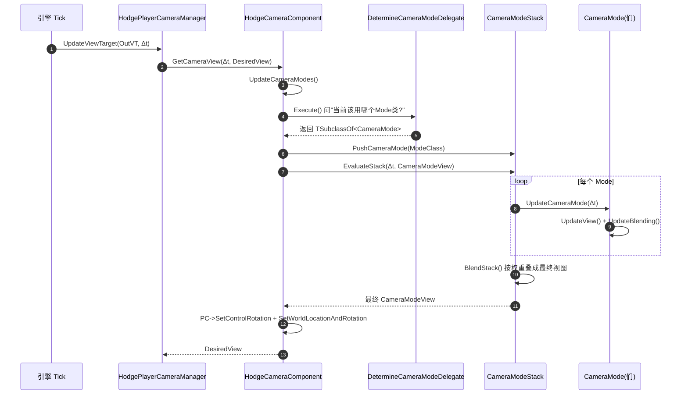

# Hodgepodge

> 一个基于 **UE 5.5** 的个人游戏框架，目标是"**Lyra 的架构理念 + GAS 的战斗**"，最终形态是 **UE Dedicated Server + 数据驱动的动作 RPG 底层框架**。

| 项目 | 值 |
|---|---|
| 引擎版本 | Unreal Engine **5.5** |
| 主模块 | `Hodgepodge`（Runtime，单模块） |
| 代码规模 | `Source/Hodgepodge` 共 **131 个文件**（66 `.h` + 63 `.cpp` + 根目录 `Hodgepodge.h/.cpp` + 3 `.cs`），约 **17000 行** |
| 核心依赖 | GameplayAbilities、GameFeatures、EnhancedInput、**ModularGameplay**、AnimationWarping、ControlRig |
| 项目阶段 | ⚠️ **能编译、能启动，但角色不可操控** —— 见下方当前状态 |
| 相关文档 | [`LYRA_LEARNING_GUIDE.md`](LYRA_LEARNING_GUIDE.md)（学什么）、[`LYRA_RUNTIME_FLOW.md`](LYRA_RUNTIME_FLOW.md)（怎么跑）、[`UE5 开放世界动作 RPG 架构方案 V2.md`](UE5%20开放世界动作%20RPG%20架构方案%20V2.md)（总体方案） |
| 代码基线 | 提交 `8df7f52` |

---

## 当前状态

项目处于 **Lyra 化重构的中后段**：框架层（Experience / AssetManager / GAS / 相机 / 输入）已经基本是 Lyra 的等价实现，但**"驱动它们的最后一公里"还有几处没接**。

**编译状态**：✅ 通过（`8df7f52`，Development Editor，约 42 秒增量）

### 已通电 ✅ / 未通电 ❌

| 系统 | 状态 | 说明 |
|---|---|---|
| Experience 全链路 | ✅ | 状态机、Bundle 加载、GameFeature 激活、GameMode 流程全部跑通，有资产实例 |
| AssetManager | ✅ | StartupJob 进度、GameData 缓存、常驻资源池、PIE 预加载 |
| 玩家 ASC | ✅ | `AHodgePlayerState` 持有，双入口绑定 Avatar（`PossessedBy` / `OnRep_PlayerState`） |
| 游戏级 ASC | ✅ | `AHodgeGameState` 持有（Owner = Avatar = GameState），暂无使用者 |
| Init State 链 | ✅ | `UHodgePawnExtensionComponent` 已挂载，PawnData 由 GameMode 注入，链能走到 `GameplayReady` |
| AbilitySystemGlobals | ✅ | 新增 `UHodgeAbilitySystemGlobals`，ini 已配；自定义 EffectContext 的 `check` 崩溃已消除 |
| 伤害 / 治疗结算 | ✅ | `UHodgeHealthSet` 的 Meta 属性闭环 + 死亡判定 + Clamp |
| **输入绑定** | ❌ | 绑定逻辑写在 `UHodgeHeroComponent` 里，但**该组件未被任何 Pawn 创建** |
| **相机模式栈** | ❌ | `DetermineCameraModeDelegate` 的绑定点同样在未挂载的 HeroComponent 里 |
| **角色侧 ASC** | ❌ | `AHodgeCombatCharacter::GetAbilitySystemComponent()` 恒 nullptr |
| **Pawn 生成** | ❌ | `DefaultPawnClass` 仍是基类 `AHodgeCharacterBase`（没有 PawnExtensionComponent） |
| 战斗 / UI / AI / 背包 | ❌ | 完全未建 |

### 当前的坑：HeroComponent 写好了，但没人 `CreateDefaultSubobject`

```
谁创建 UHodgeHeroComponent？     ← ❌ 全工程没有一处 CreateDefaultSubobject
   ↓ 于是
InitializePlayerInput()          ← 不执行 → 没有 Move / Look / Crouch 绑定
DetermineCameraModeDelegate      ← 不绑定 → 相机模式栈空转
PawnExtension::InitializeAbilitySystem()  ← 唯一调用者在 HeroComponent 里 → 不执行
```

**连带效果**：角色侧 ASC 恒 nullptr，`OnAbilitySystemInitialized` 不触发，玩家**不能移动、不能转视角**。

### 三个 P0（按收益排序）

| 缺口 | 说明 |
|---|---|
| **挂载 `UHodgeHeroComponent`** 🔥 | 在 `AHodgeHeroCharacter` 构造里加一行 `CreateDefaultSubobject<UHodgeHeroComponent>(TEXT("HeroComponent"))`。**这一行同时点亮输入、相机模式、角色侧 ASC 三件事** |
| **给 PawnData 配 `PawnClass`** | `DA_Dafult_PawnData` 的 `PawnClass` 为空 → 生成基类 `AHodgeCharacterBase`，而基类没有 PawnExtensionComponent → `FindPawnExtensionComponent` 返回 nullptr，`SetPawnData` **静默跳过**（只打 Error 日志）。要配成 `AHodgeHeroCharacter` 或其蓝图子类 |
| **改 `DefaultInputComponentClass`** | `Config/DefaultInput.ini:94` 仍指向引擎 `EnhancedInputComponent` → HeroComponent 里 `CastChecked<UHodgeInputComponent>` 会失败。改成 `/Script/Hodgepodge.HodgeInputComponent` |

> Experience 链路本身完好，默认 Experience 是 `Exp_HodgeDefaultExperience`，换玩法用 `-Experience=<资产名>`。

---

## 目录

- [1. 项目定位](#1-项目定位)
- [2. 技术栈与依赖](#2-技术栈与依赖)
- [3. 目录结构](#3-目录结构)
- [4. 快速开始](#4-快速开始)
- [5. 架构总览](#5-架构总览)
- [6. 核心系统详解](#6-核心系统详解)
- [7. 当前进度](#7-当前进度)
- [8. 代码规范与约定](#8-代码规范与约定)
- [9. 新人上手路径](#9-新人上手路径)
- [10. 调试与验证工具箱](#10-调试与验证工具箱)
- [11. 已知问题与技术债](#11-已知问题与技术债)
- [12. 附录：文件速查索引](#12-附录文件速查索引)

---

## 1. 项目定位

### 1.1 这是什么

Hodgepodge（大杂烩）是一个**用来长本事的框架工程**，不是一个要上线的游戏。它的定位与 Lyra 完全一致 —— 是 **bootstrapping framework（样板框架）**，不是 finished game。

它要回答的问题是：

> 如何围绕 UE 的核心技术，搭一套**能长出来**、**不推倒重来**、**从第一行代码就支持 Dedicated Server** 的动作 RPG 底层？

### 1.2 这不是什么

- **不是游戏** —— 没有可玩的玩法循环，没有 UI，没有关卡内容
- **不是 Lyra 的复制品** —— 只吸收理念，不整体照搬（Lyra 耦合的 CommonUI / CommonUser / GameSettings 等子系统，本项目一个都没引入）
- **不是稳定可运行的状态** —— 能跑但有不少技术债，见 [§7 进度](#7-当前进度) 和 [§11 技术债](#11-已知问题与技术债)

### 1.3 从 Lyra 借来的设计信条

这些是本项目的"宪法"。完整推导见 [`LYRA_LEARNING_GUIDE.md` 第 4 章](LYRA_LEARNING_GUIDE.md#4-lyra-的十大核心设计理念)。

| # | 信条 | 本项目对应实现 | 状态 |
|---|---|---|---|
| 1 | **一套代码，多种玩法** | `UHodgeExperienceDefinition` + `AHodgeGameModeBase` 完整流程 | ✅ 已跑通 |
| 2 | **数据驱动** | `UHodgePawnData`（5 字段）/ `UHodgeGameData` / `UHodgeInputConfig` | 🚧 字段齐了，但资产未配、授予代码仍注释 |
| 3 | **插件化扩展** | `UHodgeGameFeaturePolicy` + `GameFeatureAction_*` | 🚧 Policy 完成，4 个 Action 可用，还没有插件实例 |
| 4 | **GameplayTag 作万能胶水** | `HodgeGameplayTags.h` + `FGameplayTagStackContainer` | ✅ |
| 5 | **组合优于继承** | `PawnData` 决定 Pawn 类、ModularGameplay 组件化 | ✅ |
| 6 | **服务器权威** | ASC 放 PlayerState、`Mixed` 复制模式 | ✅ |
| 7 | **Base / Concrete 分层** | `HodgeGameStateBase → HodgeGameState`、`HodgePlayerStateBase → HodgePlayerState` | ✅ |
| 8 | **Init State 链解耦异步依赖** | `UGameFrameworkComponentManager` + 4 个 InitState Tag + `PawnExtensionComponent` / `HeroComponent` | 🚧 链通了，但 HeroComponent 未挂载 → 仍靠双入口兜底 |

### 1.4 与 Lyra 的关键分歧

| 维度 | Lyra | Hodgepodge | 原因 |
|---|---|---|---|
| **Locomotion** | 自研 `LyraCharacterMovementComponent` + 完整动画层 | `UHodgeCharacterMovementComponent` 只做地面信息缓存与移动扩展；动画层靠 `UHodgeAnimInstance` 的 Tag 驱动重建 | 移动与动画是自研的重点方向，目前仍是引擎默认物理 + 少量扩展 |
| **Camera** | 相机模式栈（`LyraCamera` 模块） | **完整移植**：`UHodgeCameraComponent` + `UHodgeCameraMode` + `UHodgeCameraMode_ThirdPerson` + `AHodgePlayerCameraManager` | 相机是 Lyra 里最独立、最好移植的部分之一 |
| **Pawn 与 GAS 的协调** | `ULyraPawnExtensionComponent` + `ULyraHeroComponent` 双 Feature | 两个 Feature 类都写完了，但 **HeroComponent 没挂载** → 实际仍走双入口 | 迁移只差最后一步 |
| **UI / 设置 / 登录** | CommonUI + UIExtension + GameSettings + CommonUser 全家桶 | **全部没有** | 体量大、非核心矛盾，延后引入 |

---

## 2. 技术栈与依赖

### 2.1 引擎与模块依赖

`Source/Hodgepodge/Hodgepodge.Build.cs`：

```csharp
PublicDependencyModuleNames:  Core, CoreUObject, Engine, InputCore,
                              GameplayAbilities, GameplayTags, GameplayTasks,
                              ModularGameplay, GameFeatures,
                              AIModule, EngineSettings, NetCore,
                              AnimGraphRuntime, RigVM, ControlRig
PrivateDependencyModuleNames: EnhancedInput, PhysicsCore, Niagara, SignificanceManager
```

`Hodgepodge.uproject` 启用的插件：`GameFeatures`、`GameplayAbilities`、`ModelingToolsEditorMode`（仅 Editor）、`AnimationLocomotionLibrary`、`AnimationWarping`。

> ⚠️ 一个小警告（不影响编译）：模块依赖 `ModularGameplay` / `SignificanceManager`，但 `.uproject` 的 `Plugins` 段没把这两个**引擎插件**声明出来（代码级依赖能过，只是 UBT 会提示）。

### 2.2 插件清单

| 插件 | 版本 | 位置 | 说明 |
|---|---|---|---|
| **GameplayAbilities** | 引擎自带 | 引擎插件 | ✅ GAS 本体 |
| **GameFeatures** | 引擎自带 | 引擎插件 | ✅ 玩法热插拔 |
| **AnimationWarping** | 引擎自带 | 引擎插件 | ✅ 动画变形 / 步法 |
| **AnimationLocomotionLibrary** | 引擎自带 | 引擎插件 | ✅ 动画 locomotion 工具库 |
| **RiderLink** | — | `Plugins/Developer/RiderLink/` | Rider 联动，不参与游戏逻辑 |
| **UnrealMCP** | 第三方（MIT） | `Plugins/UnrealMCP/` | 编辑器 MCP 服务端（`127.0.0.1:55557`，仅 Editor，主模块不依赖）。见 [§12.6](#126-ai-辅助开发工具链) |

### 2.3 未引入的 Lyra 子系统

以下在 Lyra 里是标配，但**本项目一个都没有**。看到 `#include` 它们的代码，一定是编译不过的死代码。

`AsyncMixin`、`GameplayMessageRouter`、`UIExtension`、`ModularGameplayActors`、`CommonGame`、`GameSettings`、`CommonUser`、`CommonLoadingScreen`、`PocketWorlds`、`GameSubtitles`

---

## 3. 目录结构

### 3.1 源码目录

```
Source/
├── Hodgepodge.Target.cs
├── HodgepodgeEditor.Target.cs
└── Hodgepodge/
    ├── Hodgepodge.Build.cs
    ├── Hodgepodge.h / Hodgepodge.cpp
    ├── Public/       ← 66 个头文件
    └── Private/      ← 63 个实现文件，与 Public 大体镜像
```

| 目录 | 文件数 | 职责 | 重要度 |
|---|---|---|---|
| `AbilitySystem/` | 12 | ASC、**Ability + AbilityCost**、TagRelationship、**AbilitySystemGlobals**、GameplayCueManager、EffectContext、GlobalAbilitySystem、GameplayTags、GameplayTagStack、AttributeSet 2 个 | ★★★★★ |
| `Component/` | 8 | **PawnExtensionComponent** / **HeroComponent** / ExperienceManagerComponent / 角色移动组件 + 4 个组件基类 | ★★★★★ |
| `Core/` | 9 | GameInstance / GameMode / **GameState + GameStateBase** / PlayerController / **PlayerState + PlayerStateBase** / HUD / LocalPlayer | ★★★★★ |
| `Data/` | 8 | AssetManager、GameData、PawnData、**AbilitySet**、Experience 三件套、ExperienceManager | ★★★★★ |
| `Camera/` | 7 | 相机模式栈整套（Lyra 移植） | ★★★★ |
| `Character/` | 4 | 角色继承链（Base → Combat → Hero / Enemy） | ★★★★★ |
| `Input/` | 6 | InputConfig（数据）+ InputComponent（绑定）+ UserSettings / MappableKeyProfile / Modifiers / AimSensitivity | ★★★★ |
| `GameFeatures/` | 8 | 7 个 GameFeatureAction + Policy | ★★（4 个可用） |
| `Interface/` | 2 | `AbilitySourceInterface` + `LoadingProcessInterface` | ★ |
| `Animation/` | 1 | `UHodgeAnimInstance`（GameplayTag 映射动画变量） | ★★★★ |
| `Actor/` | 1 | Actor 基类 | ★ |

### 3.2 内容目录

```
Content/
├── Main/                    ★ 项目自有内容，新东西放这里
│   ├── Experiences/         Exp_HodgeDefaultExperience（当前默认）
│   ├── Data/                DA_Dafult_GameData / DA_Dafult_PawnData
│   ├── Input/               DA_HodgeInputConfig / IMC_Default / IMC_UI / InputAction/
│   └── Character/
│       ├── Hero/            BP_HeroBase + Anim/ABP_Pover_Base（漂泊者动画蓝图）
│       └── EnemyBase/       ABP_Enemy_Base
├── CodexText/               ⚠️ AI / MCP 演练产物，非正式内容（见 §12.6）
│                            5 个蓝图 + 4 个关卡 + 4 个 UMG + 53 张贴图
├── qiuyuan/                 漂泊者角色资源
├── Wuwa/                    鸣潮风格资源包（含 322 个 fbx 模型）
├── Assets/                  通用资产：Enemies / HeroCharacter / Weapons /
│                            Niagara / Sounds / Textures / Meshes / MaterialFunctions
├── Characters/              角色资源（146）
├── Collections/ Developers/ LevelPrototyping/   编辑器辅助目录
└── ThirdPerson/             UE 模板内容（当前默认地图在这里）
```

> `__ExternalActors__/`、`__ExternalObjects__/` 是启用世界分区（World Partition）后关卡对象外置产生的，别手动改。

### 3.3 仓库根目录的其他内容

```
Plugins/UnrealMCP/        编辑器 MCP 插件（第三方，MIT）
Tools/UnrealMCP/          Python MCP 前端（server.py + README）
AGENTS.md                 AI 协作规则（项目级）
.agents/                  工程事实快照（给 AI 读）
.cursor/rules/            Cursor 规则指针
.codex/config.toml        Codex 的 MCP 服务端注册
```

---

## 4. 快速开始

### 4.1 环境要求

| 项 | 要求 |
|---|---|
| 引擎 | Unreal Engine **5.5** |
| IDE | Visual Studio 2022 或 Rider for Unreal |
| 平台 | Windows（当前只验证过 Win64，DX12） |
| 渲染 | 开启了 DX12 / SM6 / 虚拟阴影贴图 / Lumen，显卡要求偏高 |

### 4.2 编译与运行

```powershell
# 1) 生成解决方案（引擎装在 E:\UE\UE_5.5，按你的实际位置调整）
& "E:\UE\UE_5.5\Engine\Build\BatchFiles\GenerateProjectFiles.bat" `
    -projectfiles -project="e:\Project\Git\Hodgepodge\Hodgepodge.uproject" -game -engine

# 2) 编译
& "E:\UE\UE_5.5\Engine\Build\BatchFiles\Build.bat" `
    HodgepodgeEditor Win64 Development -project="e:\Project\Git\Hodgepodge\Hodgepodge.uproject"

# 3) 打开编辑器
& "E:\UE\UE_5.5\Engine\Binaries\Win64\UnrealEditor.exe" `
    "e:\Project\Git\Hodgepodge\Hodgepodge.uproject"
```

### 4.3 运行检查清单

项目可编译可启动。如果启动异常，按这个顺序查：

1. **Experience 扫得到吗？** 日志搜 `Identified experience ... (Source: Default)`。
   扫不到就检查 `DefaultGame.ini` 里 `HodgeExperienceDefinition` 的扫描目录是否是 `/Game/Main/Experiences`，以及 `Exp_HodgeDefaultExperience.uasset` 是否在那儿。

2. **`DefaultEngine.ini` 的 `AssetManagerClassName`** 必须是 `/Script/Hodgepodge.HodgeAssetManager`，错了会直接 `UE_LOG(Fatal)` 退出。

3. **`DefaultGame.ini` 的 `[/Script/HodgePodge.HodgeAssetManager]` 段**：
   ```ini
   HodgeGameDataPath=/Game/Main/Data/DA_Dafult_GameData.DA_Dafult_GameData
   DefaultPawnData=/Game/Main/Data/DA_Dafult_PawnData.DA_Dafult_PawnData
   ```
   GameData 加载失败是 **Fatal**，不是 Warning。

4. **`DefaultGame.ini` 的 `[/Script/GameplayAbilities.AbilitySystemGlobals]` 段**（`8df7f52` 新增）：
   ```ini
   AbilitySystemGlobalsClassName=/Script/Hodgepodge.HodgeAbilitySystemGlobals
   GlobalGameplayCueManagerClass=/Script/Hodgepodge.HodgeGameplayCueManager
   GameFeaturesManagerClassName=/Script/Hodgepodge.HodgeGameFeaturePolicy
   ```

5. **`GlobalDefaultGameMode` 用的是旧类名** `/Script/Hodgepodge.HodgepodgeGameModeBase`，靠 `DefaultEngine.ini` 的 `[CoreRedirects]` 生效。能跑，但建议改成 `HodgeGameModeBase`。

6. **启动地图**：`GameDefaultMap` / `EditorStartupMap` 都是 `/Game/ThirdPerson/Maps/ThirdPersonMap`。项目目前还没有自己的关卡。

### 4.4 切换玩法

现在只有 `Exp_HodgeDefaultExperience` 一个 Experience。要试多种玩法：

```powershell
# 命令行指定（优先级高于 WorldSettings）
UnrealEditor.exe Hodgepodge.uproject -game -Experience=Exp_HodgeDefaultExperience
```

或在编辑器里新建：`Content/Main/Experiences/` 下右键 → Blueprint Class → 父类选 `HodgeExperienceDefinition` → 配 `DefaultPawnData` / `GameFeaturesToEnable` / `Actions`。

> 新建的 Experience 会**自动被扫描到**（扫描项是整目录 `/Game/Main/Experiences`，`bHasBlueprintClasses=True`），不用改配置。

**验证是否生效**：日志过滤 `Identified experience`，`Source:` 字段会告诉你是从 OptionsString / CommandLine / WorldSettings / Default 哪一级来的。

---

## 5. 架构总览

### 5.1 分层图

```
┌──────────────────────────────────────────────────────────────┐
│  内容层    Content/Main  +  GameFeature 插件（尚未建立）        │
│           数据资产组合出的玩法，不改 C++ 代码                    │
├──────────────────────────────────────────────────────────────┤
│  玩法层    AbilitySystem/  Character/  Camera/  Animation/     │
│           Component/  GameFeatures/  Input/                    │
│           （战斗、装备、背包 — 大部分待建）                       │
├──────────────────────────────────────────────────────────────┤
│  框架层    Core/                                              │
│           ├─ Base 层   GameStateBase / PlayerStateBase         │
│           │            （生命周期 + ModularGameplay 接收者）     │
│           └─ 实例层   GameMode / GameState / PlayerState       │
│                       （Experience + GAS + 玩家状态）           │
│           Data/（AssetManager + Experience 三件套）            │
├──────────────────────────────────────────────────────────────┤
│  基础层    引擎: GAS / EnhancedInput / GameFeatures /           │
│             ModularGameplay / AnimationWarping / AssetManager   │
└──────────────────────────────────────────────────────────────┘
```

### 5.2 启动时序

```
① 引擎启动
   UHodgeAssetManager::StartInitialLoading()
     ├─ Super::StartInitialLoading()              扫描 PrimaryAssetTypesToScan
     ├─ STARTUP_JOB(InitializeGameplayCueManager())       [空实现]
     ├─ STARTUP_JOB_WEIGHTED(GetGameData(), 25.f)        同步加载 GameData
     └─ DoAllStartupJobs()                        权重进度

   UHodgeGameInstanceBase::Init()
     └─ UGameFrameworkComponentManager 注册 4 个 Init State
        Spawned → DataAvailable → DataInitialized → GameplayReady

② 地图加载
   AHodgeGameModeBase::InitGame()
     └─ SetTimerForNextTick(HandleMatchAssignmentIfNotExpectingOne)

③ 下一帧 → HandleMatchAssignmentIfNotExpectingOne()
   按优先级确定 Experience：
     1. Matchmaking 分配        （未接入）
     2. URL Options             ?Experience=XXX
     3. Developer Settings      （仅 PIE，代码注释中）
     4. 命令行                  -Experience=XXX
     5. WorldSettings           （代码注释中，缺 UHodgeWorldSettings）
     6. Dedicated Server        TryDedicatedServerLogin()
     7. 硬编码默认               "Exp_HodgeDefaultExperience"   ← 目前总会走到这里

④ OnMatchAssignmentGiven(ExperienceId, Source)
     └─ ExperienceComponent->SetCurrentExperience(ExperienceId)

⑤ AHodgeGameModeBase::InitGameState()   （早于 ③④ 执行）
     └─ CallOrRegister_OnExperienceLoaded(→ this->OnExperienceLoaded)

⑥ UHodgeExperienceManagerComponent 状态机
   Unloaded → Loading（Bundle 异步加载，区分客户端/服务端）
            → LoadingGameFeatures（LoadAndActivateGameFeaturePlugin）
            → [LoadingChaosTestingDelay]（可选）
            → ExecutingActions（执行 Experience.Actions + ActionSets.Actions）
            → Loaded
   └─ 三档委托广播：HighPriority → Normal → LowPriority

⑦ AHodgeGameModeBase::OnExperienceLoaded()
     └─ 遍历所有 PlayerController，给还没有 Pawn 的玩家 RestartPlayer()

⑧ 生成 Pawn
   GetDefaultPawnClassForController()
     └─ GetPawnDataForController()
          ├─ PlayerState->GetPawnData()          （由 ⑨ 设置）
          ├─ Experience->DefaultPawnData
          └─ UHodgeAssetManager::GetDefaultPawnData()
   SpawnDefaultPawnAtTransform_Implementation()
     └─ PawnExtComp->SetPawnData(PawnData)        ← PawnData 注入点

⑨ AHodgePlayerState::OnExperienceLoaded()   （非客户端，注册于 PreInitializeComponents）
     └─ SetPawnData(GameMode->GetPawnDataForController(...))
          ├─ MARK_PROPERTY_DIRTY_FROM_NAME + 赋值
          ├─ [注释] AbilitySet->GiveToAbilitySystem()
          └─ SendGameFrameworkComponentExtensionEvent(NAME_HodgeAbilityReady)
```

### 5.3 为什么 Pawn 要等 Experience 加载完才生成

只有 Experience 加载完成后，才知道该用哪个 `PawnData`、该授予哪些能力。所以：

- `HandleStartingNewPlayer_Implementation()` 里加了 `IsExperienceLoaded()` 守卫
- `GetPawnDataForController()` 在 Experience 未加载时直接返回 `nullptr`
- `OnExperienceLoaded()` 负责给"已连接但还没 Pawn"的玩家补一次 `RestartPlayer()`

---

## 6. 核心系统详解

### 6.1 AssetManager ✅

`Data/HodgeAssetManager.h/.cpp` —— 项目完成度最高的部分，Lyra `LyraAssetManager` 的等价实现。

| 能力 | 说明 |
|---|---|
| **StartupJob 权重进度系统** | `STARTUP_JOB(func)` / `STARTUP_JOB_WEIGHTED(func, weight)` |
| **GameData 类型化缓存** | `GameDataMap` 以 Class 为 Key，避免重复加载 |
| **软引用同步加载** | `GetAsset<T>()` / `GetSubclass<T>()`，`bKeepInMemory` 控制常驻 |
| **常驻资源池** | `LoadedAssets` + `FCriticalSection` 持强引用防 GC |
| **PIE 预加载** | `PreBeginPIE()` 确保进入 PIE 前 GameData 就绪 |
| **调试命令** | `Hodge.DumpLoadedAssets` |

**零依赖的必读文件**：`Data/HodgeAssetManagerStartupJob.h` —— 全项目最值得先读的文件，把"多个异步加载 → 按序回调 → 汇报加权进度"完整封装了一遍。

**空实现（待办）**：`InitializeGameplayCueManager()`、`UpdateInitialGameContentLoadPercent()`

### 6.2 Experience 系统 ✅

本项目 Experience 是 Lyra 同名系统的移植，代码结构与 Lyra 高度一致。想深入理解每一步，建议对照 [`LYRA_RUNTIME_FLOW.md`](LYRA_RUNTIME_FLOW.md) 第 4~6 章阅读。

#### 已落地的资产

| 资产 | 路径 | 说明 |
|---|---|---|
| `Exp_HodgeDefaultExperience` | `/Game/Main/Experiences/` | 默认 Experience，GameMode 兜底硬编码引用它 |
| `DA_Dafult_PawnData` | `/Game/Main/Data/` | 已配进 Experience 的 `DefaultPawnData` |

新建玩法 Experience：在 `/Game/Main/Experiences/` 建蓝图，父类选 `HodgeExperienceDefinition`，**不需要改任何配置** —— 建完即被 AssetManager 发现，用 `-Experience=<名字>` 切换即可。

#### 三个数据资产

| 类 | 文件 | 内容 |
|---|---|---|
| `UHodgeExperienceDefinition` | `Data/HodgeExperienceDefinition.h` | `GameFeaturesToEnable[]`、`DefaultPawnData`、`Actions[]`（Instanced）、`ActionSets[]` |
| `UHodgeExperienceActionSet` | `Data/HodgeExperienceActionSet.h` | 可复用的 `Actions[]` + `GameFeaturesToEnable[]` |
| `UHodgePawnData` | `Data/HodgePawnData.h` | **5 个字段**：`PawnClass` / `AbilitySets[]` / `TagRelationshipMapping` / `InputConfig` / `DefaultCameraMode`（资产里目前未填） |

#### 加载状态机

`Component/HodgeExperienceManagerComponent.h/.cpp`，挂在 `AHodgeGameState` 上（继承 `UGameStateComponent` + `ILoadingProcessInterface`）。

```
Unloaded → Loading → LoadingGameFeatures → LoadingChaosTestingDelay
                                                    ↓
                                          ExecutingActions → Loaded → Deactivating → Unloaded
```

| 方法 | 职责 |
|---|---|
| `SetCurrentExperience(FPrimaryAssetId)` | 服务端入口，`CurrentExperience` 复制到客户端 |
| `OnRep_CurrentExperience()` | 客户端收到后自行启动加载 |
| `StartExperienceLoad()` | 收集 Bundle 资源，按客户端/服务端区分后异步加载 |
| `OnExperienceLoadComplete()` | 收集插件 URL 并 `LoadAndActivateGameFeaturePlugin` |
| `OnGameFeaturePluginLoadComplete()` | 计数归零后进入下一步 |
| `OnExperienceFullLoadCompleted()` | 执行 Actions，按三档广播委托 |
| `EndPlay()` | 逆序停用插件 + Deactivating 流程 |
| `ShouldShowLoadingScreen()` | 给 Loading Screen 用（目前无消费者） |

**三档委托**（`CallOrRegister_OnExperienceLoaded_HighPriority` / `_` / `_LowPriority`）解决异步依赖的经典问题：**"如果已经加载完就立即回调，否则注册等通知"**。这个模式在 `UHodgeLocalPlayerBase` 里也用了，是本项目标准手法。

#### GameMode 侧的新增接口

| 方法 | 作用 |
|---|---|
| `HandleMatchAssignmentIfNotExpectingOne()` | 按 7 级优先级确定 Experience |
| `OnMatchAssignmentGiven()` | 触发 `SetCurrentExperience` |
| `OnExperienceLoaded()` | 给未生成 Pawn 的玩家补 `RestartPlayer()` |
| `GetPawnDataForController()` | PlayerState.PawnData → Experience.DefaultPawnData → AssetManager 默认 |
| `GetDefaultPawnClassForController_Implementation()` | 用 PawnData->PawnClass 决定 Pawn 类 |
| `SpawnDefaultPawnAtTransform_Implementation()` | `bDeferConstruction = true` 延迟构造，**并调用 `PawnExtComp->SetPawnData(PawnData)`** |
| `RequestPlayerRestartNextFrame()` | 下一帧重生，`bForceReset` 可强制放弃当前 Pawn |
| `FailedToRestartPlayer()` | 重生失败后按条件下一帧重试，避免无限循环 |
| `TryDedicatedServerLogin()` | DS 专用，仅占位 |
| `OnGameModePlayerInitialized` | 玩家完成 GameMode 层初始化的多播委托 |

### 6.3 GameState（游戏级 GAS + Experience 宿主）

`Core/GameState/HodgeGameState.h/.cpp`，继承 `AHodgeGameStateBase` + `IAbilitySystemInterface`。

| 成员 | 说明 |
|---|---|
| `ExperienceManagerComponent` | **Experience 的宿主**，构造函数里 `CreateDefaultSubobject` |
| `AbilitySystemComponent` | **游戏级 ASC**，`PostInitializeComponents` 里 `InitAbilityActorInfo(this, this)` |
| `ServerFPS` | 服务器 Tick 里更新，`DOREPLIFETIME` 复制 |
| `RecorderPlayerState` | 回放录制者，用 `COND_ReplayOnly` 只在回放流复制 |
| `OnRecorderPlayerStateChangedEvent` | 录制者变化的委托 |

游戏级 ASC 的典型用途：全局 GameplayCue、全场 Buff、不隶属于任何玩家的效果。目前还没使用者。

`AHodgeGameStateBase` 已瘦身为纯基类（只剩 `PreInitializeComponents` / `BeginPlay` / `EndPlay` 三个空扩展点）。

### 6.4 PlayerState（玩家状态主体）

`Core/PlayState/HodgePlayerState.h/.cpp`，继承 `AHodgePlayerStateBase` + `IAbilitySystemInterface`。

| 成员 | 说明 |
|---|---|
| `AbilitySystemComponent` | 玩家 ASC，构造时创建，`Mixed` 模式，`NetUpdateFrequency = 100.f` |
| `HealthSet` | 构造时 `CreateDefaultSubobject` |
| `PawnData` | `ReplicatedUsing = OnRep_PawnData`，由 `OnExperienceLoaded` 设置 |
| `MyPlayerConnectionType` | `EHodgePlayerConnectionType`：Player / LiveSpectator / ReplaySpectator / InactivePlayer |
| `MyTeamID` / `MySquadID` | 队伍 / 小队 ID（`FGenericTeamId`），复制回调目前是空的 |
| `StatTags` | `FGameplayTagStackContainer`，Tag + 数量的统计容器 |
| `ReplicatedViewRotation` | 观战用视角旋转，`COND_SkipOwner` |
| `NAME_HodgeAbilityReady` | 静态 `FName("HodgeAbilitiesReady")`，SetPawnData 后发送该扩展事件 |

**生命周期要点**：

```cpp
// PreInitializeComponents
AbilitySystemComponent->InitAbilityActorInfo(this, GetPawn());
// ⚠️ 这行只是兜底：PlayerState 创建早于 Pawn，GetPawn() 此时是 nullptr。
//    真正的 Avatar 绑定在 AHodgeHeroCharacter 的双入口里（见 §6.8）。
ExperienceComponent->CallOrRegister_OnExperienceLoaded(...);
```

复制全部用 **Push Model**（`bIsPushBased = true` + `MARK_PROPERTY_DIRTY_FROM_NAME`），比传统轮询复制省 CPU。

### 6.5 GameplayTagStack（Tag + 数量的容器）

`AbilitySystem/GameplayTagStack.h/.cpp`，Lyra 同名文件移植。

```cpp
USTRUCT(BlueprintType)
struct FGameplayTagStack : public FFastArraySerializerItem
{
    FGameplayTag Tag;
    int32 StackCount = 0;
};

USTRUCT(BlueprintType)
struct FGameplayTagStackContainer : public FFastArraySerializer
{
    void AddStack(FGameplayTag Tag, int32 StackCount);
    void RemoveStack(FGameplayTag Tag, int32 StackCount);
    int32 GetStackCount(FGameplayTag Tag) const;
    bool ContainsTag(FGameplayTag Tag) const;

    TArray<FGameplayTagStack> Stacks;        // 参与复制
    TMap<FGameplayTag, int32> TagToCountMap; // 查询缓存，不复制
};
```

用 `FFastArraySerializer` 做**增量复制**，并提供 `PostReplicatedAdd` / `PreReplicatedRemove` / `PostReplicatedChange` 三个钩子。目前只有 `StatTags` 一处使用。

### 6.6 Init State 链（PawnExtension + HeroComponent）

链上有**两个 Feature 类**，都是 `UPawnComponent` + `IGameFrameworkInitStateInterface`：

| Feature | FeatureName | 挂载情况 |
|---|---|---|
| `UHodgePawnExtensionComponent` | `PawnExtension` | ✅ 由 `AHodgeCombatCharacter` 构造时创建 |
| `UHodgeHeroComponent` | `Hero` | ❌ **没人创建** —— 当前最大的单点缺口 |

**状态注册**（`UHodgeGameInstanceBase::Init()`）：

```cpp
ComponentManager->RegisterInitState(InitState_Spawned,         false, FGameplayTag());
ComponentManager->RegisterInitState(InitState_DataAvailable,   false, InitState_Spawned);
ComponentManager->RegisterInitState(InitState_DataInitialized, false, InitState_DataAvailable);
ComponentManager->RegisterInitState(InitState_GameplayReady,   false, InitState_DataInitialized);
```

#### Feature ① PawnExtensionComponent

```cpp
OnRegister() → RegisterInitStateFeature()
BeginPlay()  → TryToChangeInitState(InitState_Spawned) → CheckDefaultInitialization()
EndPlay()    → UninitializeAbilitySystem() + UnregisterInitStateFeature()
```

| 目标状态 | 准入条件（`CanChangeInitState`） |
|---|---|
| `Spawned` | Pawn 有效 |
| `DataAvailable` | `PawnData != nullptr`；Authority / 本地控制时还必须有 Controller |
| `DataInitialized` | `HaveAllFeaturesReachedInitState(Pawn, DataAvailable)` |
| `GameplayReady` | 直接 `true` |

关键 API：`FindPawnExtensionComponent(Actor)`、`SetPawnData` / `GetPawnData<T>()`、`InitializeAbilitySystem` / `UninitializeAbilitySystem`、`HandleControllerChanged` / `HandlePlayerStateReplicated`、`SetupPlayerInputComponent`、`OnAbilitySystemInitialized_RegisterAndCall` / `OnAbilitySystemUninitialized_Register`。

（Lyra 里的 `IsReadyToInitialize()` 和 `OnPawnReadyToInitialize` 没移植过来。）

#### Feature ② HeroComponent

| 目标状态 | 准入条件 |
|---|---|
| `Spawned` | Pawn 有效 |
| `DataAvailable` | 有 `AHodgePlayerState`；非 SimulatedProxy 时 Controller.PlayerState 归属正确；本地控制还需 `Pawn->InputComponent` + PC + LocalPlayer |
| `DataInitialized` | 有 PS，且 **PawnExtension 已到 `DataInitialized`** |
| `GameplayReady` | 直接 `true` |

它在 `HandleChangeInitState`（`DataAvailable` → `DataInitialized`）里做三件事 —— **这三件事就是整条链的意义所在**：

```cpp
PawnExtComp->InitializeAbilitySystem(PS->GetHodgeAbilitySystemComponent(), PS);  // ① 角色侧 ASC
InitializePlayerInput(Pawn->InputComponent);                                     // ② 输入绑定
DetermineCameraModeDelegate.BindUObject(this, &ThisClass::DetermineCameraMode);   // ③ 相机模式选择
```

⚠️ 因为它没被挂载，这三行**一行都不会执行**。

#### PlayerState 侧的 Receiver

```cpp
// AHodgePlayerStateBase
PreInitializeComponents() → AddGameFrameworkComponentReceiver(this);
BeginPlay()               → SendGameFrameworkComponentExtensionEvent(NAME_GameActorReady);
EndPlay()                 → RemoveGameFrameworkComponentReceiver(this);
Reset()                   → 转发给所有 UPlayerStateComponent
CopyProperties()          → 按类型+名字匹配，逐个复制 UPlayerStateComponent 的数据
```

#### 两个待修的坑

```
① PawnData 注入了，可 Pawn 是基类
   AHodgeGameModeBase 构造里 DefaultPawnClass = AHodgeCharacterBase::StaticClass()
   → 基类没有 PawnExtensionComponent（只在 CombatCharacter 里建）
   → FindPawnExtensionComponent() 返回 nullptr → SetPawnData 静默跳过
   ✔ 修法：DA_Dafult_PawnData 的 PawnClass 指向 AHodgeHeroCharacter 或其蓝图子类

② 链走到 GameplayReady 也没人接棒
   → 挂载 UHodgeHeroComponent，它才会在 DataInitialized 时初始化 ASC / 绑定输入 / 设相机
```

### 6.7 角色体系

```
ACharacter
    ↓
AHodgeCharacterBase              ← 构造时 SetDefaultSubobjectClass 换装移动组件
    ↓
AHodgeCombatCharacter            ← Lyra Character 移植（相机 / FastShared / 死亡 / Team）
    ↓                             并创建 UHodgePawnExtensionComponent
    ├── AHodgeHeroCharacter      ← 玩家：双入口绑定 ASC（⚠️ 缺 HeroComponent）
    └── AHodgeEnemyCharacter     ← 敌人：骨架实现
```

| 类 | 文件 | 关键点 |
|---|---|---|
| `AHodgeCharacterBase` | `Character/HodgeCharacterBase.h` | 生命周期扩展点基类。构造里 `SetDefaultSubobjectClass` 把默认 `CharacterMovement` 换成 `UHodgeCharacterMovementComponent`；移动参数交给蓝图 / 数据资产。**刻意不依赖 GAS** |
| `AHodgeCombatCharacter` | `Character/HodgeCombatCharacter.h` | Lyra `ALyraCharacter` 移植：`UHodgeCameraComponent`（摆位 `-300, 0, 75`）、`bUseControllerRotationYaw`、`FSharedRepMovement`、死亡流程（`OnDeathStarted/Finished` + `UninitAndDestroy`，HealthComponent 仍注释）、移动模式→GameplayTag、`IGenericTeamAgentInterface`。<br>并创建 `UHodgePawnExtensionComponent`，把 `PossessedBy`/`UnPossessed`/`OnRep_Controller` → `HandleControllerChanged()`、`OnRep_PlayerState` → `HandlePlayerStateReplicated()`、`SetupPlayerInputComponent` 都转发给它 |
| `AHodgeHeroCharacter` | `Character/HodgeHeroCharacter.h` | 玩家角色，目前只剩一项职责：`PossessedBy` / `OnRep_PlayerState` **双入口绑定玩家 ASC 的 Avatar**。⚠️ **缺 `CreateDefaultSubobject<UHodgeHeroComponent>`** |
| `AHodgeEnemyCharacter` | `Character/HodgeEnemyCharacter.h` | 继承 `AHodgeCombatCharacter`。骨架：碰撞盒 / 血条 / 战斗组件全部注释 |
| `UHodgeHeroComponent` | `Component/HodgeHeroComponent.h` | `ULyraHeroComponent` 移植。已实现：`InitializePlayerInput`（Move / Look_Mouse / Look_Stick / Crouch / AutoRun + AbilityInputTag）、`AbilityCameraMode`、`DetermineCameraMode`（能力相机优先，回落 `PawnData->DefaultCameraMode`）、`AddAdditionalInputConfig`、`IsReadyToBindInputs`。<br>空实现/注释：`RemoveAdditionalInputConfig`（TODO）、`Input_AutoRun` 内部逻辑、**没有死亡重生**。<br>⚠️ **没有任何地方创建它** |

要点：

- **相机与 PawnExtension 都在 CombatCharacter 层**：Hero / Enemy 共享。
- **HeroComponent 应该落在 HeroCharacter 层**（Lyra 就是这么做的），挂上之后输入、相机模式选择、角色侧 ASC 会一起通电。
- **输入仍然没绑**：`SetupPlayerInputComponent()` 转发给 PawnExtension 后只调 `CheckDefaultInitialization()`；真正的绑定逻辑在 HeroComponent 的 `InitializePlayerInput()` 里（见 [§6.9](#69-输入)）。

### 6.8 GAS

GAS 整套是 Lyra 实现的移植。先给类表，再看初始化链路与结算闭环。

| 类 | Lyra 原型 | 职责 | 状态 |
|---|---|---|---|
| `UHodgeAbilitySystemComponent` | `ULyraAbilitySystemComponent` | 项目 ASC：输入缓冲（`ProcessAbilityInput` / `AbilityInputTagPressed/Released`）、`ActivationGroup`、`CancelAbilitiesByFunc`、TagRelationship 查询、`TryActivateAbilitiesOnSpawn` | ✅ PlayerState 构造 + 双入口初始化<br>⚠️ `ProcessAbilityInput` 无调用者 |
| `UHodgeGameplayAbility` | `ULyraGameplayAbility` | Ability 基类：`ActivationPolicy` / `ActivationGroup`、`OnPawnAvatarSet`、`MakeEffectContext` 重写；`ActiveCameraMode` + `Set/ClearCameraMode`；`AdditionalCosts`（命中才付费 `ShouldOnlyApplyCostOnHit`） | ✅ 已接入，但**没有任何子类**；`ActivateAbility` 仍只调 `Super::` |
| `UHodgeAbilityCost` | `ULyraAbilityCost` | 可插拔消耗项（`CheckCost` / `ApplyCost`） | ⚠️ 循环已解开，但无子类 |
| `UHodgeAbilityTagRelationshipMapping` | 同名 | DataAsset：AbilityTag 的 Block / Cancel / Required 关系 | ⚠️ ASC 会查询，但 `SetTagRelationshipMapping` 调用点被注释 |
| `UHodgeAbilitySet` | `ULyraAbilitySet` | "能力包"：Ability + Effect + AttributeSet 一次性授予/回收 | ✅ GameFeature 路径可用；`SetPawnData` 路径仍注释 |
| `UHodgeGlobalAbilitySystem` | `ULyraGlobalAbilitySystem` | `UWorldSubsystem`，对世界内所有 ASC 批量授予/移除 | ✅ 自动实例化，但 `Apply*ToAll` 无调用者 |
| `UHodgeAbilitySystemGlobals` 🆕 | —（Lyra 无） | `UAbilitySystemGlobals` 子类，重写 `AllocGameplayEffectContext()` | ✅ ini 已配，见下 |
| `FHodgeGameplayEffectContext` | `FLyraGameplayEffectContext` | 自定义 EffectContext，携带 AbilitySource + 等级 | ✅ 由上面的 Globals 分配 |
| `IHodgeAbilitySourceInterface` | 同名 | 武器/投射物提供距离衰减、物理材质衰减 | ❌ 无实现类 |
| `UHodgeGameplayCueManager` | `ULyraGameplayCueManager` | Cue 预加载 / 延迟加载 / 常驻管理 | ⚠️ ini 已指向它，但增删路径没通（见下） |
| `UHodgeAttributeSet` / `UHodgeHealthSet` | `ULyraAttributeSet` / `HealthSet` | 属性集基类 / 血量伤害治疗 | ✅ 已接入 |

#### AbilitySystemGlobals（`8df7f52` 新增）

```cpp
// Public/AbilitySystem/HodgeAbilitySystemGlobals.h
UCLASS(Config=Game)
class UHodgeAbilitySystemGlobals : public UAbilitySystemGlobals
{
    virtual FGameplayEffectContext* AllocGameplayEffectContext() const override;
};

// 实现：返回项目自定义的上下文
FGameplayEffectContext* UHodgeAbilitySystemGlobals::AllocGameplayEffectContext() const
{
    return new FHodgeGameplayEffectContext();
}
```

`Config/DefaultGame.ini` 新增段：

```ini
[/Script/GameplayAbilities.AbilitySystemGlobals]
AbilitySystemGlobalsClassName=/Script/Hodgepodge.HodgeAbilitySystemGlobals
GlobalGameplayCueManagerClass=/Script/Hodgepodge.HodgeGameplayCueManager
GameFeaturesManagerClassName=/Script/Hodgepodge.HodgeGameFeaturePolicy
; 另有 6 个 ActivateFail*Tag、bUseDebugTargetFromHud、PredictTargetGameplayEffects 等
```

**效果**：`UHodgeGameplayAbility::MakeEffectContext` 里的 `check(EffectContext)` 不再崩（底层分配到的已是自定义类型）；`UHodgeGameplayCueManager::Get()` 的强转也不再返回 nullptr。

**仍未通**：Cue 路径的增删 —— `HodgeGameFeaturePolicy.cpp:39` 注册 `UHodgeGameFeature_AddGameplayCuePaths` Observer 的那行仍是注释，导致写好的 `OnGameFeatureRegistering` 不执行；`OnGameFeatureUnregistering` 整段注释；`UHodgeAssetManager::InitializeGameplayCueManager()` 仍是空实现。

#### 初始化链路：三处并存

```cpp
// ① AHodgePlayerState::PreInitializeComponents() —— GetPawn() 还是 nullptr，只算兜底
AbilitySystemComponent->InitAbilityActorInfo(this, GetPawn());

// ② 服务端：Pawn 被 Possess 时
void AHodgeHeroCharacter::PossessedBy(AController* NewController)
{
    Super::PossessedBy(NewController);
    if (AHodgePlayerState* PS = GetPlayerState<AHodgePlayerState>())
        PS->GetAbilitySystemComponent()->InitAbilityActorInfo(PS, this);
}

// ③ 客户端：PlayerState 复制到位时
void AHodgeHeroCharacter::OnRep_PlayerState()
{
    Super::OnRep_PlayerState();
    if (AHodgePlayerState* PS = GetPlayerState<AHodgePlayerState>())
        PS->GetAbilitySystemComponent()->InitAbilityActorInfo(PS, this);
}
```

- ②③ 各管一条路，**玩家 ASC 是好的，GAS 没坏**。
- Lyra 的统一入口是 `UHodgePawnExtensionComponent::InitializeAbilitySystem()`，但它的唯一调用者在未挂载的 HeroComponent 里 → 角色侧 `GetAbilitySystemComponent()` 恒 nullptr、`OnAbilitySystemInitialized` 不触发。

**迁移路径**：挂载 HeroComponent 后它会自动调 `InitializeAbilitySystem()`，届时 ②③ 双入口就可以删掉。Lyra 这套能覆盖换 Pawn / 死亡重生 / 观战。

#### 三套 ASC 现状

| ASC | 宿主 | 状态 |
|---|---|---|
| `AHodgePlayerState::AbilitySystemComponent` | 玩家 | ✅ 有效，Avatar 由双入口绑定 |
| `AHodgeGameState::AbilitySystemComponent` | 游戏全局 | ✅ 有效，暂无使用者 |
| 角色侧 `AHodgeCombatCharacter::GetAbilitySystemComponent()` | — | ⚠️ 转发给 `PawnExtComponent`，实际恒 nullptr |

#### 伤害 / 治疗闭环 ✅

`UHodgeHealthSet` 属性：`Health`（HideFromModifiers）/ `MaxHealth` / `Healing` / `Damage`（HideFromModifiers）/ `BaseDamage` / `BaseHeal`。

```
PreGameplayEffectExecute（仅处理 Damage）
  ├─ 非自毁时：Gameplay.DamageImmunity / Cheat.GodMode → Magnitude 归零并 return false
  └─ 缓存 HealthBeforeAttributeChange / MaxHealthBeforeAttributeChange

PostGameplayEffectExecute
  ├─ Damage   → Health = Clamp(Health - Damage, 0, MaxHealth)；Damage 清零
  ├─ Healing  → Health = Clamp(Health + Healing, 0, MaxHealth)；Healing 清零
  ├─ Health   → 直接改血（Clamp）
  ├─ MaxHealth→ 广播 OnMaxHealthChanged
  └─ 统一死亡判定：血量变化 → OnHealthChanged；血量 ≤ 0 且 !bOutOfHealth → OnOutOfHealth
     （bOutOfHealth 边沿触发，回调里改血后会重算；客户端 OnRep_Health 有一份同样逻辑）
```

配套：`ClampAttribute`（Health ∈ [0, MaxHealth]、MaxHealth ≥ 1）在 `PreAttributeBaseChange` / `PreAttributeChange` 里调用；`PostAttributeChange` 在 MaxHealth 下降时用 `ApplyModToAttribute(Override)` 压 Health，血量回正时复位 `bOutOfHealth`。

为什么要走 Damage / Healing 这两个 **Meta 属性**绕一圈？因为要在扣减前做统一处理（死亡判定、护盾、溢出治疗转护盾），并拿到完整的 `FGameplayEffectModCallbackData` 上下文。

> 简化之处：目前没有护盾、没有溢出治疗转护盾；`OnHealthChanged` / `OnOutOfHealth` **还没有消费者**，所以死亡流程走不起来。伤害类 Tag（`Gameplay.Damage` / `DamageImmunity` / `FellOutOfWorld` 等）定义在 `HodgeHealthSet.cpp` 顶部，没并入统一 Tag 表。

#### Tag 体系

`HodgeGameplayTags.h/.cpp` 的分组：`InitState.*`、`InputTag.*`、`Ability.ActivateFail.*`（IsDead / Cooldown / Cost / TagsBlocked / TagsMissing / Networking / ActivationGroup）、`Ability.Type.Action.*`（Dash / Melee / Grenade / Jump / ADS / Reload / WeaponFire…）与 `Ability.Type.Passive.*`、`GameplayCue.*`、`GameplayEffect.DamageType.*`、`SetByCaller.Damage/Heal`、`Cheat.GodMode/UnlimitedHealth`、`Status.Death.*`、`Movement.Mode.*`。

> `Gameplay.MovementStopped` 定义在 `HodgeCharacterMovementComponent` 里，不在这张表。

### 6.9 输入

```
UHodgeInputConfig  (DataAsset)          UHodgeInputComponent  (: UEnhancedInputComponent)
├─ NativeInputActions[]                 ├─ BindNativeAction<T>(Tag, TriggerEvent, Obj, Func)
│   （InputAction + InputTag）           │     └─ InputConfig->FindNativeInputActionForTag()
└─ AbilityInputActions[]                ├─ BindAbilityActions<T>(...)
   FindNativeInputActionForTag()        │     └─ Triggered→Pressed / Completed→Released
   FindAbilityInputActionForTag()       ├─ RemoveBinds(Handles)
                                        └─ AddInputMappings / RemoveInputMappings（⚠️ 仍是空壳）
```

**绑定逻辑写在 `UHodgeHeroComponent::InitializePlayerInput()` 里**（已实现完整）：

```cpp
UHodgeInputComponent* HodgeIC = CastChecked<UHodgeInputComponent>(IC);
InputSubsystem->ClearAllMappings();
InputSubsystem->AddMappingContext(DefaultInputMappings, ...);
HodgeIC->AddInputMappings(InputConfig, InputSubsystem);
HodgeIC->BindAbilityActions(InputConfig, this, &Pressed, &Released, ...);   // InputTag → ASC
HodgeIC->BindNativeAction(InputConfig, InputTag_Move,       Triggered, this, &Input_Move);
HodgeIC->BindNativeAction(InputConfig, InputTag_Look_Mouse, Triggered, this, &Input_LookMouse);
HodgeIC->BindNativeAction(InputConfig, InputTag_Look_Stick, Triggered, this, &Input_LookStick);
HodgeIC->BindNativeAction(InputConfig, InputTag_Crouch,     Triggered, this, &Input_Crouch);
HodgeIC->BindNativeAction(InputConfig, InputTag_AutoRun,    Triggered, this, &Input_AutoRun);
```

**但它一次都不会执行** —— HeroComponent 没被挂载。当前的调用链是：

```
AHodgeCombatCharacter::SetupPlayerInputComponent()
  └─ PawnExtComponent->SetupPlayerInputComponent()
       └─ 只调 CheckDefaultInitialization()   ← 不绑任何 Action
```

所以**玩家不能移动、不能转视角**。接回的最短路径：

1. 挂载 `UHodgeHeroComponent`（一行 `CreateDefaultSubobject`）；
2. `Config/DefaultInput.ini:94` 的 `DefaultInputComponentClass` 改成 `/Script/Hodgepodge.HodgeInputComponent`；
3. `DefaultInputMappings`（IMC，EditAnywhere）C++ 里没填，要在蓝图子类或 `PawnData.InputConfig` 里给。

**其它输入类**（Lyra 移植，目前均无人使用）：

| 类 | 职责 |
|---|---|
| `UHodgeInputUserSettings` | `UEnhancedInputUserSettings` 子类，重写 `ApplySettings()` |
| `UHodgePlayerMappableKeyProfile` | `UEnhancedPlayerMappableKeyProfile` 子类（键位方案） |
| `HodgeInputModifiers.h` | 4 个 Modifier：`SettingBasedScalar`、`DeadZone`、`GamepadSensitivity`、`AimInversion` |
| `UHodgeAimSensitivityData` | 瞄准灵敏度曲线资产（空壳，`SensitivityMap` 全注释） |

### 6.10 GameFeature

`GameFeatures/HodgeGameFeaturePolicy.h` 实现 3 个 Observer：`UHodgeGameFeaturePolicy` / `UHodgeGameFeature_HotfixManager` / `UHodgeGameFeature_AddGameplayCuePaths`。

**7 个 GameFeatureAction 的真实状态**：

| 文件 | 状态 | 说明 |
|---|---|---|
| `GameFeatureAction_WorldActionBase.h` | ✅ 可用 | Lyra 原版 |
| `GameFeatureAction_SplitscreenConfig.h` | ✅ 可用 | Lyra 原版 |
| `GameFeatureAction_AddAbilities.h` | ✅ 可用 | 依赖的 `UHodgeAbilitySet` 已建，授予/回收逻辑完整 |
| `GameFeatureAction_AddGameplayCuePath.h` | ✅ 可用 | 只有构造 + `IsDataValid` |
| `GameFeatureAction_AddInputContextMapping.h` | ✅ 可用 | 用 `UEnhancedInputLocalPlayerSubsystem` + `UHodgeAssetManager` |
| `GameFeatureAction_AddInputBinding.h` | ⚠️ 能编译但没效果 | `AddInputMappingForPlayer` 主体与 `HandlePawnExtension` 的 `NAME_ExtensionAdded` 分支仍是注释 |
| `GameFeatureAction_AddWidget.h` | ❌ 仍注释 | 需要 UIExtension + CommonUI |

**结论**：4 个能用了，但**还没有任何 GameFeature 插件实例**去用它们（`Content/` 下无 `.uplugin`）。

### 6.11 其他框架类

| 类 | 文件 | 说明 |
|---|---|---|
| `UHodgeGameInstanceBase` | `Core/GameInstance/` | 注册 Init State 链；持有 `DebugTestEncryptionKey`（硬编码测试密钥） |
| `AHodgePlayerControllerBase` | `Core/PlayerController/` | **事件桥梁**：把引擎回调转成 LocalPlayer 的多播委托 |
| `UHodgeLocalPlayerBase` | `Core/LocalPlayer/` | 三个 `CallAndRegister_On*Set` 委托 + `bIsPlayerViewEnabled` |
| `AHodgeHUDBase` | `Core/HUD/` | HUD 占位 |
| `UHodgeActorComponentBase` | `Component/` | 组件基类，默认**开 Tick** |
| `UHodgeCombatComponentBase` | `Component/` | 战斗组件，默认**关 Tick**；空实现 |
| `UHodgeInteractionComponentBase` | `Component/` | 交互组件；空实现 |
| `UHodgeMovementComponentBase` | `Component/` | 历史遗留空壳，**别用**；真正的移动组件是 `UHodgeCharacterMovementComponent` |
| `ILoadingProcessInterface` | `Interface/` | `ShouldShowLoadingScreen()`，目前无消费者 |

### 6.12 移动组件

`Component/HodgeCharacterMovementComponent.h/.cpp`，继承 `UCharacterMovementComponent`（Lyra `ULyraCharacterMovementComponent` 移植）。

**接入方式**：`AHodgeCharacterBase` 构造时 `SetDefaultSubobjectClass<UHodgeCharacterMovementComponent>(TEXT("CharacterMovement0"))` 换掉引擎默认组件。

| 能力 | 说明 |
|---|---|
| `GetGroundInfo()` | 地面信息缓存（`FHodgeCharacterGroundInfo`：帧号 + 命中结果 + 离地距离）。Walking 复用 `CurrentFloor`；其它模式向下打射线（`HodgeCharacter.GroundTraceDistance` CVar）。每帧只算一次 |
| `GetDeltaRotation()` / `GetMaxSpeed()` | ASC 带 `Gameplay.MovementStopped` Tag 时**锁旋转 / 速度归零** —— GAS 用 Tag 操纵移动的入口 |
| `SetReplicatedAcceleration()` + `SimulateMovement()` | 配合 FastShared 移动复制，保护服务端同步下来的加速度 |
| `CanAttemptJump()` | 允许空中起跳（不检查蹲伏），给二段跳留口子 |

> 边界要说清：这不是完整的 locomotion 系统 —— 没有步态/旋转模式状态机，那部分要靠动画蓝图重建（见 [§6.14](#614-动画实例)）。

### 6.13 Camera 系统

`Camera/` 7 个文件，是 Lyra `LyraCamera` 模块的逐类移植：

| 类 | Lyra 原型 | 职责 |
|---|---|---|
| `UHodgeCameraComponent` | `ULyraCameraComponent` | 相机组件，挂在 `AHodgeCombatCharacter`（相对 `-300,0,75`）。持有 `CameraModeStack`，`DetermineCameraModeDelegate` 回答"现在该用哪个 CameraMode 类" |
| `UHodgeCameraMode` | `ULyraCameraMode` | 模式抽象基类；`FHodgeCameraModeView`（位置/旋转/FOV/控制旋转）支持按权重混合 |
| `UHodgeCameraModeStack` | `ULyraCameraModeStack` | 模式栈：Push/Pop、按 BlendTime 混合（`BlendStack` 自栈底向栈顶叠加） |
| `UHodgeCameraMode_ThirdPerson` | `ULyraCameraMode_ThirdPerson` | **Abstract + Blueprintable**。第三人称：`TargetOffsetCurve`（按俯仰查曲线）、蹲伏平滑（`CrouchOffsetBlendMultiplier=5`）、防穿透（多射线 + 预测避让） |
| `AHodgePlayerCameraManager` | `ALyraPlayerCameraManager` | 相机管理器。FOV 80°、Pitch ±89°；`UpdateViewTarget` 允许 UI 相机接管 |
| `UHodgeUICameraManagerComponent` | `ULyraUICameraManagerComponent` | `Within=AHodgePlayerCameraManager`，UI 用 `SetViewTarget` 临时接管 |
| `UHodgeCameraAssistInterface` / `FHodgePenetrationAvoidanceFeeler` | 同名 | 视角补充接口 / 防穿透射线参数 |

#### 每帧时序

相机是「被动被问、主动算」：引擎每帧通过 `APlayerCameraManager` 调 `UHodgeCameraComponent::GetCameraView()`。



要点：

- `UpdateCameraModes()` 只在栈激活**且委托已绑定**时才 Push 模式；
- 最终视图回写两处：`PlayerController->SetControlRotation`（让输入方向与相机一致）与相机组件自身位姿/FOV。

#### 多模式怎么混合

`BlendStack()` 的两条铁律：

1. **栈底永远权重 1.0**（地基）；
2. **顺序叠加**：从栈底往栈顶，逐个按 `BlendWeight` 叠上去。

```
Result = 栈底.View
Result = Lerp(Result, 上一层.View, 上一层.BlendWeight)
Result = Lerp(Result, 栈顶.View,   栈顶.BlendWeight)
```

例：第三人称下按瞄准 → 栈变成 `[AimMode(栈顶, 0→1 淡入), ThirdPerson(栈底, 1.0)]`，淡入完成后 UpdateStack 会把下层的 ThirdPerson 移除。

> 多个 Mode 的权重**不会相加超过 1** —— 它是层叠覆盖，不是平均。权重描述"我覆盖下面多少"。

**当前状态：外壳完整、没接电** —— `DetermineCameraModeDelegate` 的绑定点在未挂载的 `UHodgeHeroComponent` 里，所以栈恒空，`BlendStack` 直接 return，画面退化成 `CameraComponent` 的默认相对位姿。要让它活起来：挂载 HeroComponent（它会在 `DataInitialized` 时绑定委托），并给 `PawnData->DefaultCameraMode` 配一个模式类（通常 `UHodgeCameraMode_ThirdPerson`）。

### 6.14 动画实例

`Animation/HodgeAnimInstance.h/.cpp`，Lyra `ULyraAnimInstance` 移植，是 `ABP_Pover_Base` / `ABP_Enemy_Base` 的基类。

- `FGameplayTagBlueprintPropertyMap`：把 **GameplayTag ↔ 动画蓝图变量**绑定。Tag 加/移除时自动写变量 —— 动画层不用轮询 GAS，**Tag 即状态**。
- `GroundDistance`：`NativeUpdateAnimation` 里从 `UHodgeCharacterMovementComponent::GetGroundInfo()` 同步，供落地/脚部逻辑用。
- `NativeInitializeAnimation`：自动找 Owner 的 ASC 并 `InitializeWithAbilitySystem`。
- 编辑器 `IsDataValid`：校验映射表，防止运行时才炸。

> 待补：动画蓝图要在 `ABP_Pover_Base` 里用 Tag 映射 + 引擎原生动画系统重建整套 locomotion 状态节点。

---

## 7. 当前进度

对照 `UE5 开放世界动作 RPG 架构方案 V2.md` 的 Phase 划分。

### 7.1 已完成 ✅

| 模块 | 内容 |
|---|---|
| **Experience 系统** | 数据资产三件套 + 状态机 + Bundle 加载 + GameFeature 激活/停用 + 三档委托 + GameMode 全流程（7 级优先级、延迟生成 Pawn、PawnData 三级回退、重生重试）；资产 `Exp_HodgeDefaultExperience` |
| **AssetManager** | StartupJob 权重进度、GameData 缓存、软引用同步加载、常驻资源池、PIE 预加载 |
| **Base / Concrete 分层** | `GameStateBase → GameState`、`PlayerStateBase → PlayerState` |
| **玩家状态主体** | PawnData 复制、连接类型枚举、队伍/小队、StatTags、观战视角、Push Model |
| **游戏级 ASC** | `AHodgeGameState` 持有全局 ASC |
| **玩家 ASC + 双入口** | PlayerState 持有 ASC，`PossessedBy` / `OnRep_PlayerState` 绑定 Avatar |
| **GameplayTagStack** | Tag + 数量的 FastArray 增量复制容器 |
| **ModularGameplay 基础设施** | 4 个 Init State 注册、PlayerState Receiver、PawnExtension 挂载、PawnData 注入 |
| **HeroComponent（类）** | `UHodgeHeroComponent` 完整实现（输入 / 相机 / ASC 入口），⚠️ 未挂载 |
| **GAS 全套 Lyra 化** | ASC / Ability / AbilityCost / AbilitySet / GlobalAbilitySystem / EffectContext / CueManager / TagRelationship / AbilitySourceInterface |
| **AbilitySystemGlobals** | 自定义 Globals + ini 配置（`8df7f52`），自定义 EffectContext 生效 |
| **伤害 / 治疗闭环** | `UHodgeHealthSet` 的 Pre/Post 结算 + 死亡判定 + Clamp + MaxHealth 压制 |
| **相机系统** | `Camera/` 7 类完整移植（⚠️ 委托未绑定） |
| **输入框架** | `UHodgeInputComponent`（BindNativeAction / BindAbilityActions）+ InputConfig + 4 个 Lyra 输入类（⚠️ 无绑定调用） |
| **移动组件 / 动画实例** | `UHodgeCharacterMovementComponent` + `UHodgeAnimInstance` |
| **GameFeatureAction** | `_AddAbilities` / `_AddGameplayCuePath` / `_AddInputContextMapping` 可用 |
| **GameplayTag 体系** | 100+ 原生 Tag |
| **UnrealMCP + AI 工具链** | 编辑器 MCP 插件 + Python 前端 + `AGENTS.md` / `.cursor/rules` / `.codex/config.toml` |
| **编译优化** | 全项目 `.gen.cpp` 改 `#include UE_INLINE_GENERATED_CPP_BY_NAME(ClassName)` |

### 7.2 未完成 🚧

| 优先级 | 事项 | 说明 |
|---|---|---|
| 🔴 P0 | **挂载 `UHodgeHeroComponent`** 🔥 | 一行 `CreateDefaultSubobject` 点亮输入 / 相机 / 角色侧 ASC 三件事 |
| 🔴 P0 | **给 PawnData 配 `PawnClass`** | 现在生成的是基类（无 PawnExtension）→ `SetPawnData` 静默跳过 |
| 🔴 P0 | **改 `DefaultInputComponentClass`** | `Config/DefaultInput.ini:94` 改成 `UHodgeInputComponent` |
| 🟠 P1 | **接上 Cue 路径增删** | `HodgeGameFeaturePolicy.cpp:39` 的 Observer 注册是注释；`OnGameFeatureUnregistering` 与 `InitializeGameplayCueManager()` 空实现 |
| 🟠 P1 | **ASC 初始化迁到 PawnExtension** | 挂载 HeroComponent 后自动完成，然后删掉双入口 |
| 🟠 P1 | **给相机模式栈接电** | 委托绑定 + `PawnData->DefaultCameraMode` |
| 🟠 P1 | **建立独立 Log Category** | 全部用 `LogTemp`，`HodgeLogChannels.h` 不存在 |
| 🟠 P1 | **清理过时注释** | 部分注释还写着已删除的旧函数名 |
| 🟡 P2 | **第一个 Ability 子类 + AbilitySet 资产** | `UHodgeGameplayAbility` 无子类，`Content/` 无 AbilitySet / GA 资产 |
| 🟡 P2 | **给死亡事件接消费者** | `OnHealthChanged` / `OnOutOfHealth` 无人监听，死亡流程走不起来 |
| 🟡 P2 | **解开 AbilitySets 授予循环** | `HodgePlayerState::SetPawnData` 里的循环仍注释（GameFeature 路径是通的） |
| 🟡 P2 | 建 `UHodgeWorldSettings` | 让地图能指定默认 Experience |
| 🟡 P2 | 建第一个 GameFeature 插件实例 | 4 个 Action 已可用 |
| 🟡 P2 | 战斗系统 | `HodgeCombatComponentBase` 空的；`HodgeEnemyCharacter` 全注释 |
| 🟡 P2 | Loading Screen | `ILoadingProcessInterface` 与 `UpdateInitialGameContentLoadPercent` 无消费者 |
| 🟡 P2 | UI 系统 | 完全没有 |
| 🟡 P2 | 清理 `Content/CodexText/` | AI 演练产物，无引用 |
| 🟢 P3 | Equipment / Inventory / Weapon 三段式模型 | 待建 |
| 🟢 P3 | Teams 阵营系统 | `MyTeamID` 有了，但子系统没有 |
| 🟢 P3 | AI（AIController / BehaviorTree / EQS） | 待建（AIModule 依赖已加） |
| 🟢 P3 | ReplicationGraph / SignificanceManager | 大规模 Actor 时才需要 |
| 🟢 P3 | 开放世界 / 后端 | 按方案最后做 |

### 7.3 路线图

```
阶段 A（当前）：把角色接电 —— 从"能编译"到"能操控"
  ├─ AHodgeHeroCharacter 构造挂 UHodgeHeroComponent        ★ 一行点亮输入/相机/ASC
  ├─ DA_Dafult_PawnData 配 PawnClass（必须是 CombatCharacter 子类）
  ├─ DefaultInput.ini 改 DefaultInputComponentClass
  └─ PawnData 配 DefaultCameraMode + InputConfig，删掉双入口

阶段 B（2~3 周）：战斗闭环
  ├─ 第一个 GameplayAbility 子类 + AbilitySet 资产 → GE 伤害 → 死亡
  ├─ 接上 HealthSet 的 OnOutOfHealth（当前无消费者）
  └─ 解注释 AbilitySets 授予循环 + Cue 路径 Observer

阶段 C：联机验证 + 内容层
  ├─ Dedicated Server + 2 Client 验证同步
  ├─ 建 GameFeature 插件，验证热插拔
  └─ Equipment / Inventory 三段式模型
```

---

## 8. 代码规范与约定

### 8.1 命名

| 类别 | 前缀 | 示例 |
|---|---|---|
| UObject 派生类 | 引擎前缀 + `Hodge` | `UHodgePawnData`、`AHodgeHeroCharacter` |
| Blueprint 资产 | 类型前缀 | `DA_`（DataAsset）、`IMC_`、`IA_`、`GA_`、`GE_`、`WBP_`、`B_`（蓝图类） |
| 模块导出宏 | `HODGEPODGE_API` | |

> **历史遗留**：类名曾从 `Hodgepodge` 前缀改名为 `Hodge` 前缀。`DefaultEngine.ini` 的 `[CoreRedirects]` 段保留了全部重命名映射，**不要删除**，否则旧蓝图资产会失效。

### 8.2 Base / Concrete 分层

| 层 | 职责 | 例子 |
|---|---|---|
| **Base 层** | 只放生命周期扩展点和跨项目通用机制，**不放具体业务逻辑** | `AHodgeGameStateBase`（3 个生命周期方法）、`AHodgePlayerStateBase`（ModularGameplay Receiver 封装） |
| **Concrete 层** | 放具体游戏逻辑 | `AHodgeGameState`（Experience + 全局 ASC）、`AHodgePlayerState`（PawnData + 玩家 ASC） |

好处：Base 层可随时替换复用，Concrete 层随便改不影响底层。

### 8.3 目录与文件

- `Public/Private` 严格镜像，一个 `.h` 对应一个同路径 `.cpp`
- include 用**完整相对路径**（`#include "Character/HodgeHeroCharacter.h"`）
- 每个 `.cpp` 顶部用 `#include UE_INLINE_GENERATED_CPP_BY_NAME(ClassName)` 加速编译

### 8.4 注释

新写的代码统一用**中文 Doxygen 风格**（`@file` / `@brief` / `@param` / `@return`）。从 Lyra 拷贝的代码保留原版英文注释，再叠加中文说明。

> ⚠️ 部分注释存在**机器翻译痕迹**（`Actor`→"演员"、`GameplayAbility`→"能力"）。看到不要困惑，逐步修正即可。

### 8.5 网络编程

- **一切默认服务器权威**。永远不要在客户端直接改属性（`HP -= 50` 是错的），走 `GameplayEffect`
- 新增可复制属性记得在 `GetLifetimeReplicatedProps` 里注册
- **Push Model**：PlayerState 已启用（`bIsPushBased = true`）。改属性前必须 `MARK_PROPERTY_DIRTY_FROM_NAME(ThisClass, 属性名, this)`，否则**客户端收不到更新**
- 数组/容器复制优先用 `FFastArraySerializer`，不要直接复制 `TArray`

### 8.6 异步依赖

统一用 **"Register + 若已完成立即回调"** 模式，项目里已有三处范例：

```cpp
// UHodgeExperienceManagerComponent
CallOrRegister_OnExperienceLoaded_HighPriority(...)
// UHodgeLocalPlayerBase
CallAndRegister_OnPlayerControllerSet(...)
// AHodgePlayerState::PreInitializeComponents
ExperienceComponent->CallOrRegister_OnExperienceLoaded(...)
```

新写异步系统时照抄这个模式，不要让调用方自己判断"是不是已经初始化完了"。

---

## 9. 新人上手路径

按 `LYRA_LEARNING_GUIDE.md` 的经验，**不要从 UI 或玩法目录开始读**，从框架层开始性价比最高。

| 文档 | 回答什么问题 | 什么时候读 |
|---|---|---|
| [`LYRA_LEARNING_GUIDE.md`](LYRA_LEARNING_GUIDE.md) | **学什么**、按什么顺序学、哪些重要 | 规划学习路线时 |
| [`LYRA_RUNTIME_FLOW.md`](LYRA_RUNTIME_FLOW.md) | **怎么跑**、执行顺序、各系统生命周期、调试技巧 | 读 Experience / Init State 代码时边读边对照 |

> 读 §6.2 Experience 和 §6.6 Init State 链时，强烈建议把 `LYRA_RUNTIME_FLOW.md` 第 4~7 章打开对照 —— 本项目这两块基本是 Lyra 的直接移植。

### 9.1 第一天：建立整体认知（约 5 小时）

| # | 文件 | 时间 | 收获 |
|---|---|---|---|
| 1 | `Data/HodgeAssetManagerStartupJob.h` | 15 min | 零依赖，理解启动加载进度系统 |
| 2 | `Data/HodgeExperienceDefinition.h` | 10 min | 理解数据驱动 |
| 3 | `Component/HodgeExperienceManagerComponent.cpp` | 1.5 h | **核心中的核心**，逐行走一遍状态机 |
| 4 | `Core/GameMode/HodgeGameModeBase.cpp` | 1.5 h | Experience 如何被选中、如何触发 Pawn 生成 |
| 5 | `Data/HodgePawnData.h` + `AbilitySystem/HodgeGameplayTags.h` | 30 min | 数据契约与 Tag 体系 |

然后按 [§4.3](#43-运行检查清单) 把项目跑起来，跑通后对照 [§10.5](#105-诊断pawn-没生成--卡住的标准流程) 排查异常。

### 9.2 第一周：玩家状态与角色

| 天 | 内容 | 目标问题 |
|---|---|---|
| 1-2 | `HodgePlayerState.h/.cpp` + `HodgePlayerStateBase.h/.cpp` | Base/Concrete 分层各自负责什么？PawnData 什么时候被设置？ |
| 3-4 | `HodgeGameState.h/.cpp` | 为什么需要游戏级 ASC？ExperienceManagerComponent 挂在哪？ |
| 5 | `AbilitySystem/GameplayTagStack.h` | FastArray 增量复制相比直接复制 TArray 好在哪？ |
| 6-7 | `HodgePawnExtensionComponent.cpp` + `HodgeHeroComponent.cpp` | 两个 Feature 的准入条件各是什么？HeroComponent 在 `DataInitialized` 做的三件事点亮了什么？ |

### 9.3 第一个月：参与修复与扩展

- 完成 [§7.3 路线图](#73-路线图) 阶段 A：挂载 `UHodgeHeroComponent`、配 `PawnClass`、改 `DefaultInputComponentClass`、配 `DefaultCameraMode` + `InputConfig`（做完项目就从"能编译"变成"能操控"）
- 配套阅读：`LYRA_RUNTIME_FLOW.md` 第 7 章（四个状态、`CanChangeInitState`、协作式推进）和第 8.1 节（ASC 初始化）—— 本项目的 PawnExtension / HeroComponent 就是照它写的
- 对照阅读 Lyra 源码：`LyraCharacter` / `LyraCamera` / `LyraHeroComponent` / `LyraAnimInstance` —— 本项目新代码基本是它们的移植，有疑问回原版查最准

### 9.4 前置知识自检

| 知识点 | 重要度 | 说明 |
|---|---|---|
| **GAS** | 🔴 极高 | ASC / GameplayAbility / GameplayEffect / AttributeSet / GameplayCue / GameplayTag |
| **网络复制基础** | 🔴 极高 | RPC、属性复制、`OnRep`、**Push Model**、FastArray、服务端权威 |
| **GameplayTag** | 🔴 极高 | 输入通道、状态标记、能力分类，"万能胶水" |
| **Enhanced Input** | 🟠 高 | InputAction / InputMappingContext / Trigger |
| **AssetManager / 软引用 / PrimaryDataAsset** | 🟠 高 | 资源加载体系 |
| **ModularGameplay / GameFrameworkComponentManager** | 🟠 高 | 本项目大量使用，必须懂 |
| **GameFeatures** | 🟡 中 | 边用边学 |
| **相机模式栈 / 动画蓝图** | 🟡 中 | 做相机与动画时再深入 |

### 9.5 进度自查表

- [ ] 能画出 Experience 的状态流转图
- [ ] 能说出 Experience 的 7 级选择优先级
- [ ] 能解释为什么 Pawn 要等 Experience 加载完才生成
- [ ] 能说出 `GetPawnDataForController` 的三级回退顺序
- [ ] 能解释 Base / Concrete 分层的好处
- [ ] 能说出双入口与 `InitializeAbilitySystem` 的差别，以及 Init State 链为什么更优
- [ ] 能解释 HealthSet 里 Damage 为什么是 Meta 属性
- [ ] 能说出 Push Model 下改属性必须做什么
- [ ] 能解释 GameplayTagStack 为什么用 FastArray

---

## 10. 调试与验证工具箱

### 10.1 控制台命令

| 命令 | 作用 |
|---|---|
| `Hodge.DumpLoadedAssets` | 列出 AssetManager 常驻内存的所有资源（查内存泄漏） |
| `Hodge.chaos.ExperienceDelayLoad.MinSecs 2` | 人为延迟 Experience 加载 2 秒 |
| `Hodge.chaos.ExperienceDelayLoad.RandomSecs 3` | 随机延迟 0~3 秒 |

### 10.2 启动参数

| 参数 | 作用 |
|---|---|
| `-LogAssetLoads` | 打印每个资源的同步加载耗时 |
| `-Experience=<Name>` | 指定要加载的 Experience |

### 10.3 日志

⚠️ 项目**没有独立 Log Category**，全部走 `LogTemp`（`HodgeLogChannels.h` 不存在）。在此之前靠断点 + `LogTemp` 过滤：

| 日志 | 位置 | 用途 |
|---|---|---|
| `Identified experience %s (Source: %s)` | `OnMatchAssignmentGiven` | **确认 Experience 选择结果**，排查启动问题第一步 |
| `Failed to identify experience, loading screen will stay up forever` | `OnMatchAssignmentGiven` | Experience Id 无效 |
| `EXPERIENCE: Wanted to use %s but couldn't find it` | `HandleMatchAssignmentIfNotExpectingOne` | 指定的 Experience 找不到，已回退默认 |
| `OW GameInstance Init` | `UHodgeGameInstanceBase::Init` | 确认 GameInstance 初始化 |

### 10.4 关键断点位置

| 想知道什么 | 在哪打断点 |
|---|---|
| 最终选定了哪个 Experience | `AHodgeGameModeBase::HandleMatchAssignmentIfNotExpectingOne()` |
| Experience 何时开始加载 | `AHodgeGameModeBase::OnMatchAssignmentGiven()` |
| Bundle 加载了什么 | `UHodgeExperienceManagerComponent::StartExperienceLoad()` |
| 插件何时激活 | `UHodgeExperienceManagerComponent::OnExperienceLoadComplete()` |
| Actions 何时执行 | `UHodgeExperienceManagerComponent::OnExperienceFullLoadCompleted()` |
| Pawn 何时生成 / 用哪个类 | `AHodgeGameModeBase::OnExperienceLoaded()` / `GetDefaultPawnClassForController_Implementation()` |
| PawnData 何时设置 | `AHodgePlayerState::SetPawnData()` |
| PawnExtension 拿到 PawnData 了吗 | `AHodgeGameModeBase::SpawnDefaultPawnAtTransform_Implementation()` |
| ASC 的 Avatar 何时绑定 | `AHodgeHeroCharacter::PossessedBy()` / `OnRep_PlayerState()` |
| GameData 何时加载 | `UHodgeAssetManager::LoadGameDataOfClass()` |
| 伤害如何结算 | `UHodgeHealthSet::PostGameplayEffectExecute()` |
| Init State 链推进到哪 | `UHodgePawnExtensionComponent::CanChangeInitState()` |
| 输入绑定是否执行 | `UHodgeHeroComponent::InitializePlayerInput()`（**当前断点不会命中** —— 组件未挂载） |
| 角色侧 ASC 为什么是空 | `UHodgeHeroComponent::HandleChangeInitState()` → `InitializeAbilitySystem()` |

### 10.5 推荐实验

1. **建两个 Experience 资产，用 `-Experience=` 切换**，观察 PawnData 不同导致的角色行为变化
2. **用 `Hodge.chaos.ExperienceDelayLoad.MinSecs 5`** 拖慢加载，观察状态机中间状态
3. **给 `AHodgePlayerState` 加一个 StatTag**，服务端 `AddStatTagStack`，客户端验证复制
4. **给 `PossessedBy()` 打断点**，对比 `PreInitializeComponents` 里 `GetPawn()` 还是 nullptr 的时序差异

### 10.6 诊断"Pawn 没生成 / 卡住"

| 步骤 | 查什么 | 怎么看 |
|---|---|---|
| 1 | Experience 找到了吗？ | 日志搜 `Identified experience`，看 `Source:` |
| 2 | 加载卡在哪个状态？ | 日志搜 `EXPERIENCE:` |
| 3 | 插件名写错了吗？ | 日志搜 `Failed to find plugin URL from PluginName` |
| 4 | PawnData 有了吗？ | 断点 `AHodgePlayerState::SetPawnData()` |
| 5 | Pawn 类对不对？ | 断点 `GetDefaultPawnClassForController_Implementation()` |
| 6 | PawnExtension 拿到 PawnData 了吗？ | 看 `SpawnDefaultPawnAtTransform` 里 `FindPawnExtensionComponent` 是否为 nullptr |
| 7 | ASC 的 Avatar 绑上了吗？ | 断点 `PossessedBy()` / `OnRep_PlayerState()` |

---

## 11. 已知问题与技术债

按影响面排序。改这里的东西前先看一眼。

### 11.1 🔴 功能性缺陷

| 问题 | 影响 | 位置 |
|---|---|---|
| **`UHodgeHeroComponent` 没被挂载** 🔴 | 类写完了但没人 `CreateDefaultSubobject` → `InitializePlayerInput` / `DetermineCameraModeDelegate` / `InitializeAbilitySystem` 三件事全不执行，**输入、相机、角色侧 ASC 一起瘫痪** | `Private/Character/HodgeHeroCharacter.cpp` |
| **`DefaultPawnClass` 是基类** | GameMode 构造里仍是 `AHodgeCharacterBase`（没有 PawnExtensionComponent）→ `SetPawnData` 静默跳过 | `Private/Core/GameMode/HodgeGameModeBase.cpp` |
| **PawnData 的 `PawnClass` 未配** | 生成的 Pawn 是基类，相机 / 双入口全落空 | `Content/Main/Data/DA_Dafult_PawnData.uasset` |
| **`DefaultInputComponentClass` 不对** | 指向引擎 `EnhancedInputComponent` → `CastChecked<UHodgeInputComponent>` 会失败 | `Config/DefaultInput.ini:94` |
| **角色侧 ASC 恒 nullptr** | 转发给 PawnExtension，但 `InitializeAbilitySystem()` 的唯一调用者在未挂载的 HeroComponent 里 | `Private/Character/HodgeCombatCharacter.cpp` |
| **相机模式栈空转** | 委托绑定点在未挂载的 HeroComponent 里 → 栈恒空 | 见 [§6.13](#613-camera-系统) |
| **Cue 路径增删没生效** | Observer 注册行是注释；`OnGameFeatureUnregistering` 与 `InitializeGameplayCueManager()` 空实现 | `HodgeGameFeaturePolicy.cpp:39`、`HodgeAssetManager.cpp` |
| **死亡事件无消费者** | `OnHealthChanged` / `OnOutOfHealth` 有人广播、没人监听；`OnDeathStarted` 的触发者（HealthComponent）仍是注释 | `HodgeHealthSet.cpp`、`HodgeCombatCharacter.cpp` |
| **`UHodgeGameplayAbility` 没有子类** | Ability 体系还没真正用起来；`UHodgeAbilityCost` 同理 | `AbilitySystem/Abilities/` |
| **PawnData 5 个字段都没配上** | 资产里没填、AbilitySets 授予代码注释 → 数据驱动只在纸面上 | `DA_Dafult_PawnData.uasset` |
| **属性集不是配置驱动** | 靠 `CreateDefaultSubobject` 写死，不再由 `AttributeSetClasses` 配置 | `AHodgePlayerState` 构造 |
| `OnRep_PawnData()` / `OnRep_MyTeamID()` / `OnRep_MySquadID()` 是空的 | 复制后无响应 | `HodgePlayerState.cpp` |
| `AddInputMappings` / `RemoveInputMappings` 是空壳 | IMC 增删没地方做 | `Input/HodgeInputComponent.cpp` |
| 4 个 Lyra 输入类是空壳 | `AimSensitivityData` / `InputUserSettings` / `MappableKeyProfile` / `InputModifiers` 均无使用者 | `Input/` |

### 11.2 配置与命名

| 问题 | 说明 |
|---|---|
| `GlobalDefaultGameMode` 用旧类名 | `/Script/Hodgepodge.HodgepodgeGameModeBase`，靠 `[CoreRedirects]` 生效 |
| `GameInstanceClass` 用旧类名 | `/Script/Hodgepodge.HodgepodgeGameInstanceBase` |
| 资产名拼写错误 | `DA_Dafult_GameData` / `DA_DafultPawnData`（`Dafult` 应为 `Default`），已写进 ini，改名要同步 |
| GameData 资产重复 | `Content/Main/Data/` 下同时有 `DA_Dafult_GameData` 和 `DA_DafultGameData` |
| 目录名拼写错误 | `Core/PlayState/` 应为 `Core/PlayerState/` |
| 引擎插件依赖没写全 | 模块用了 `ModularGameplay` / `SignificanceManager` 但 `.uproject` 的 `Plugins` 段没声明（只是 UBT 警告） |

### 11.3 安全隐患

| 问题 | 说明 |
|---|---|
| **硬编码调试密钥** | `UHodgeGameInstanceBase::Init()` 里 `DebugTestEncryptionKey` 用固定递增数据填充。发布前记得移除 |

### 11.4 代码卫生

| 问题 | 说明 |
|---|---|
| 日志全部用 `LogTemp` | 无独立 Log Category，`HodgeLogChannels.h` 不存在 |
| 注释机器翻译痕迹 | `Actor`→"演员"、`GameplayAbility`→"能力" 等中英混排 |
| 死代码未清理 | `HodgeEnemyCharacter` 大段注释、`MotionWarpingComponent` 注释、`HostDedicatedServerMatch` 整段注释 |
| `Content/CodexText/` 是 AI 演练产物 | 5 蓝图 + 4 关卡 + 4 UMG + 53 贴图，全仓库无引用 |
| Lyra 遗留 Tag | `HodgeGameplayTags.h` 里有 `Lyra_*`、`ShooterGame_*` 前缀的 Tag |
| `// 111屎山代码来袭` | 多个文件顶部的自嘲注释，无害 |

### 11.5 明确的设计取舍（不是 bug）

| 取舍 | 理由 |
|---|---|
| Locomotion 先留白 | 不立即自研全套；先用引擎默认移动 + `UHodgeAnimInstance` 的 Tag 驱动重建动画层 |
| 不引入 CommonUI / UIExtension / GameSettings / CommonUser | 体量大、非核心矛盾，延后 |
| 保留注释掉的 `_AddWidget` | 作为参考实现，启用前需先补依赖 |
| 走 Init State 链而非简单双入口 | 依赖会越来越多（PawnData / InputConfig / AbilitySet），双入口会失控。当前处于迁移中途 |

---

## 12. 附录：文件速查索引

### 12.1 架构核心（必读）

```
Source/Hodgepodge/Public/Data/HodgeAssetManagerStartupJob.h                启动任务（零依赖，先读这个）
Source/Hodgepodge/Public/Data/HodgeExperienceDefinition.h                  Experience 数据结构
Source/Hodgepodge/Private/Component/HodgeExperienceManagerComponent.cpp    状态机实现 ★★★
Source/Hodgepodge/Private/Core/GameMode/HodgeGameModeBase.cpp              Experience 接入流程 ★★★
Source/Hodgepodge/Private/Core/PlayState/HodgePlayerState.cpp              玩家状态主体 ★★★
Source/Hodgepodge/Private/Core/GameState/HodgeGameState.cpp                Experience 宿主 + 全局 ASC
Source/Hodgepodge/Private/Core/GameInstance/HodgeGameInstanceBase.cpp      Init State 链注册
Source/Hodgepodge/Private/Component/HodgePawnExtensionComponent.cpp        Init State 节点 + ASC 容器 ★★★
Source/Hodgepodge/Private/Component/HodgeHeroComponent.cpp                 输入 / 相机 / ASC 入口（⚠️ 未挂载）★★★
Source/Hodgepodge/Private/AbilitySystem/AttributeSet/HodgeHealthSet.cpp    伤害治疗结算 + 死亡判定 ★★★
Source/Hodgepodge/Public/AbilitySystem/HodgeAbilitySystemComponent.h       Lyra ASC：输入缓冲 / ActivationGroup
Source/Hodgepodge/Public/AbilitySystem/HodgeAbilitySystemGlobals.h         自定义 GAS 全局配置
```

### 12.2 小而美的文件（值得精读）

```
Source/Hodgepodge/Public/Data/HodgeAssetManagerStartupJob.h      ~46 行，进度系统设计
Source/Hodgepodge/Public/AbilitySystem/GameplayTagStack.h        FastArray 增量复制范例
Source/Hodgepodge/Public/Input/HodgeInputConfig.h                Tag → InputAction 数据驱动
Source/Hodgepodge/Public/Core/LocalPlayer/HodgeLocalPlayerBase.h CallAndRegister 模式范例
Source/Hodgepodge/Public/Interface/LoadingProcessInterface.h     极简接口设计
```

### 12.3 配置文件

```
Config/DefaultEngine.ini     AssetManagerClassName、GlobalDefaultGameMode（旧类名）、
                             GameInstanceClass（旧类名）、[CoreRedirects]（勿删）
Config/DefaultGame.ini       [/Script/HodgePodge.HodgeAssetManager] 数据路径、
                             PrimaryAssetTypesToScan ★ 共 7 项：
                               Map / PrimaryAssetLabel / HodgeGameData /
                               GameFeatureData / HodgeExperienceDefinition /
                               HodgePawnData / HodgeExperienceActionSet
                             [/Script/GameplayAbilities.AbilitySystemGlobals] ★ 新增：
                               AbilitySystemGlobalsClassName / GlobalGameplayCueManagerClass /
                               GameFeaturesManagerClassName / ActivateFail*Tag 等
Config/DefaultInput.ini      Enhanced Input 按键映射
```

> 新建 Experience 蓝图放在 `/Game/Main/Experiences/` 即自动被扫到，无需改 ini。

### 12.4 类继承关系速查

```
UAssetManager
└── UHodgeAssetManager

UGameInstance
└── UHodgeGameInstanceBase                 （注册 Init State 链）

AGameModeBase
└── AHodgeGameModeBase                     （Experience 全流程）

AGameStateBase
└── AHodgeGameStateBase                    （纯生命周期基类）
    └── AHodgeGameState (+ IAbilitySystemInterface)
                                            ExperienceManagerComponent + 全局 ASC

APlayerState
└── AHodgePlayerStateBase                  （ModularGameplay Receiver 封装）
    └── AHodgePlayerState (+ IAbilitySystemInterface)
                                            PawnData + 玩家 ASC + HealthSet + StatTags

APlayerController
└── AHodgePlayerControllerBase             （事件桥梁）

ULocalPlayer
└── UHodgeLocalPlayerBase                  （三套 CallAndRegister 委托）

ACharacter
└── AHodgeCharacterBase                  ← 构造换装 UHodgeCharacterMovementComponent
    └── AHodgeCombatCharacter            ← Lyra Character 移植（相机 / FastShared / 死亡 / Team）
        ├── AHodgeHeroCharacter          ← 玩家（⚠️ 缺 HeroComponent）
        └── AHodgeEnemyCharacter         ← 骨架

UActorComponent
└── UHodgeActorComponentBase
    ├── UHodgeCombatComponentBase
    ├── UHodgeInteractionComponentBase
    └── UHodgeMovementComponentBase      （空壳，别用）

UPawnComponent + IGameFrameworkInitStateInterface
├── UHodgePawnExtensionComponent         （Feature ①：PawnData + ASC 容器）
└── UHodgeHeroComponent                  （Feature ②：输入 + 相机 + ASC 入口，⚠️ 未挂载）

UCharacterMovementComponent
└── UHodgeCharacterMovementComponent     （GroundInfo / MovementStopped）

UCameraComponent
└── UHodgeCameraComponent                （相机模式栈）

UAnimInstance
└── UHodgeAnimInstance                   （Tag 映射 + GroundDistance）

UEnhancedInputComponent
└── UHodgeInputComponent                 （原生 + 能力绑定）

UAbilitySystemComponent
└── UHodgeAbilitySystemComponent         （输入缓冲 / ActivationGroup）

UAbilitySystemGlobals
└── UHodgeAbilitySystemGlobals           （AllocGameplayEffectContext）

UAttributeSet
└── UHodgeAttributeSet
    └── UHodgeHealthSet

UGameplayAbility
└── UHodgeGameplayAbility                （暂无子类）

UWorldSubsystem
└── UHodgeGlobalAbilitySystem            （对所有 ASC 批量授予）

UPrimaryDataAsset
├── UHodgeGameData
├── UHodgePawnData
├── UHodgeExperienceDefinition
├── UHodgeExperienceActionSet
└── UHodgeAbilitySet

UDataAsset
├── UHodgeInputConfig                    （InputAction ↔ InputTag）
└── UHodgeAbilityTagRelationshipMapping  （AbilityTag 的 Block/Cancel 关系）
```

### 12.5 参考文档

> 前两份是 **Lyra 原版**的学习文档（讲 Lyra 自己怎么跑）。本项目大量直接移植 Lyra，把类名前缀 `Lyra` 换成 `Hodge` 基本就能对应上。

| 文档 | 内容 | 本项目对应关系 |
|---|---|---|
| [`LYRA_LEARNING_GUIDE.md`](LYRA_LEARNING_GUIDE.md) | Lyra 架构学习指南：学什么、按什么顺序学。第 4 章的十大理念是本项目的设计宪法 | 全部理念的来源 |
| [`LYRA_RUNTIME_FLOW.md`](LYRA_RUNTIME_FLOW.md) | Lyra 运行时执行链路：Experience 决策、加载状态机、启动时序、Pawn Init State 链、调试技巧 | §6.2 Experience（第 4~6 章）、§6.6 Init State（第 7 章）、§6.8 ASC 初始化（第 8.1 节） |
| [`UE5 开放世界动作 RPG 架构方案 V2.md`](UE5%20开放世界动作%20RPG%20架构方案%20V2.md) | 总体方案与 Phase 划分，含角色职责、组件设计、DS 路线 | §7 进度的 Phase 依据 |

### 12.6 AI 辅助开发工具链

本仓库引入了一套"让 AI 直接操作 UE 编辑器"的工具链。**不影响游戏运行时**，主模块 `Hodgepodge` 不依赖其中任何一个。

```
AI 客户端（Codex / Cursor / 其它 MCP 客户端）
   ↓ stdio
Tools/UnrealMCP/server.py        Python MCP 前端（FastMCP），只暴露 15 个"安全"工具
   ↓ TCP 127.0.0.1:55557（换行分隔的 JSON 行）
Plugins/UnrealMCP/               UE 编辑器插件（UEditorSubsystem），命令派发到游戏线程
   ↓
编辑器：创建蓝图 / 加组件 / 编译 / UMG / 资产查看 …
```

| 组成 | 说明 |
|---|---|
| `Plugins/UnrealMCP/` | **第三方开源**（`github.com/voodoofox/unreal-mcp`，MIT），本地做过 UE5.5 适配：修 include、关掉 Niagara 能力、`EnabledByDefault=true`。`Type: Editor`，只在编辑器生效 |
| `Tools/UnrealMCP/server.py` | Python MCP 服务端。**刻意不暴露任意 Python / 控制台执行**；每次调用先 `identity()` 校验是不是本工程；README 强制"改动前先 duplicate 备份、先读 Pin 再连线、编译成功才保存" |
| `AGENTS.md` | 项目级 AI 协作规则：以现有源码为准、UE 5.5 不改引擎、单模块 + `Hodge` 命名、GAS/PlayerState 所有权、交付需说明验证情况 |
| `.agents/ue-project-context.md` | 英文工程事实快照（模块 / 类 / UI / 输入 / 动画现状），给 AI 读的"当前状态说明书" |
| `.cursor/rules/project.mdc` | `alwaysApply: true` 的指针文件，指向 `AGENTS.md` |
| `.codex/config.toml` | 注册 `mcp_servers.hodge_blueprints`，用 venv 的 python 启动 `server.py` |

> ⚠️ 两处待办：① `.codex/config.toml` 里写死的路径是 `D:\Hodgepodge\...`，和当前工作区 `e:\Project\Git\Hodgepodge` 不一致，换机器要改；② `Content/CodexText/` 是这套工具链的演练产物（示例数据、非正式玩法），全仓库无引用，确认无用后删掉。

---

*本 README 基于 UE 5.5 + Hodgepodge 当前代码状态（提交 `8df7f52`）整理。项目处于活跃的 Lyra 化重构中，**[§7 进度](#7-当前进度) 请优先关注并定期更新**。*
